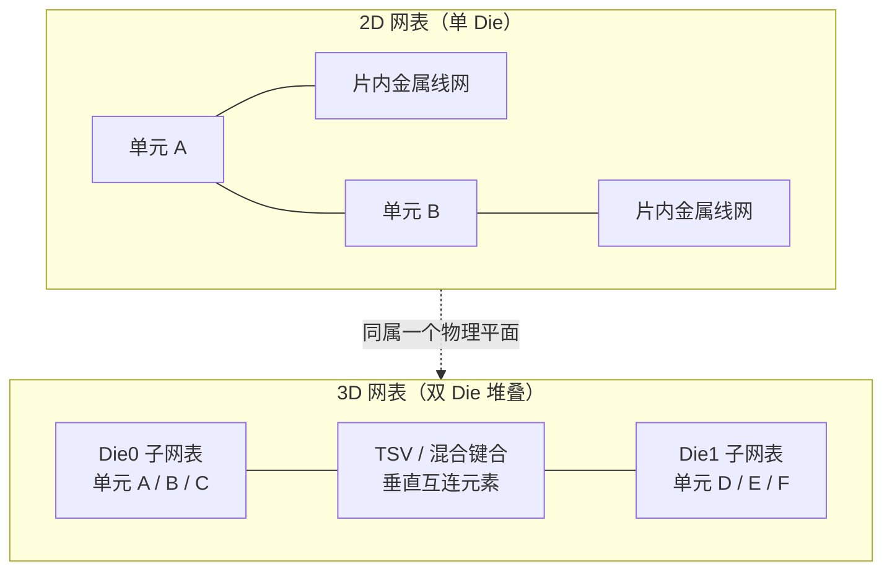

# 2D 网表与 3D 网表

网表（Netlist）是数字IC实现流程的核心数据载体——逻辑单元实例（标准单元、宏、IP）与信号网络（Net）连接关系的集合，从逻辑综合（Synthesis）输出开始，贯穿布局布线（P&R）、静态时序分析（STA）、功耗分析和签核（Signoff）全流程。**2D 网表与 3D 网表的本质区别在于"是否携带物理堆叠维度"**：2D 网表服务于传统单片芯片（所有单元位于同一块硅片平面的单一 Die），3D 网表服务于 3D 集成电路（3D-IC，多个 Die 垂直堆叠、通过硅通孔等垂直互连通信）。随着 Chiplet 与先进封装成为主流，3D 网表正从"研究概念"变为量产流程的常规数据形态。

## 2D 网表详解

2D 网表假设设计实现于**单一物理平面**：所有标准单元、宏模块和 IP 都放置在同一块 Die 的二维坐标上，信号连接全部通过片内金属布线（Interconnect）完成。网表本身只描述"谁连谁"——单元实例名、引脚连接、网络定义——不包含任何 Die/层归属信息；层次化网表（Hierarchical Netlist）中的"层次"只是逻辑嵌套（模块包含模块），不是物理维度。

2D 网表的标准数据流：综合工具（Design Compiler/Genus）输出门级网表（Verilog/DDC）→ P&R 工具（ICC2/Innovus）读入网表与 SDC/UPF 做物理实现（此时 DEF 记录物理坐标）→ 签核工具（PrimeTime/物理验证）基于网表 + 寄生参数做最终分析。整个链条的隐含假设是"一个 Die、一个物理平面、统一的供电与散热边界"——时序分析中的 RC 来自片内金属，功耗分析的热分布是单 Die 平面分布。

## 3D 网表详解

3D 网表服务于**多个 Die 垂直堆叠**的芯片：Die 之间通过垂直互连——硅通孔（Through-Silicon Via, TSV）、微凸点（Micro-Bump）或混合键合（Hybrid Bonding，超高密度面对面键合，可达 100 万连接/mm² 量级）——通信。3D 网表的本质结构是：**N 个 Die 子网表 + Die 间连接（Inter-Die Nets）+ 每个实例的 Die 归属属性**。

与 2D 网表相比，3D 网表新增了三类信息：

1. **Die 归属（Die Assignment）**：每个单元实例、端口、电源域都标注所属 Die——同一逻辑设计被切分到不同 Die 上，跨 Die 的信号路径在网表中清晰可见
2. **垂直互连元素**：TSV、微凸点、混合键合界面作为网表中的特殊元素存在——它们有独立的寄生模型（RLC）、面积约束、热影响和可靠性要求（如 TSV 应力、电迁移）
3. **Die 间网络（Inter-Die Nets）**：连接不同 Die 引脚的信号网络，其驱动/负载跨越物理堆叠边界

3D 网表的数据流：每个 Die 先独立实现（各自综合、DFT、P&R，产出自己的 2D 子网表）→ 3D 集成工具（Synopsys 3DIC Compiler、Cadence Integrity 3D-IC）合并子网表、规划 TSV/键合位置、生成统一 3D 网表 → 多 Die 联合 STA/功耗/物理签核。值得注意的是 **2.5D 与 3D 的区别**：2.5D（Die 并排放置在硅中介层 Silicon Interposer 上）中每个 Die 内部仍是纯 2D 网表，Die 间通过中介层走线或 UCIe 接口连接，无需 TSV 穿通 Die 体；3D 才产生真正跨层的 3D 网表。

## 作用与区别

| 维度 | 2D 网表 | 3D 网表 |
|:---|:---|:---|
| 物理归属 | 无——所有实例同属一个 Die | 每个实例/端口带 Die 归属（Die Assignment） |
| 互连元素 | 仅片内金属线网 | 额外包含 TSV/微凸点/混合键合等垂直互连 |
| 时序分析 | 单一物理平面 RC | 跨 Die 路径需建模 TSV 寄生（RLC）、Die 间工艺/温度差异 |
| 功耗/热 | 单 Die 平面热分布 | Die 间热耦合（堆叠自热叠加），需电热联合分析 |
| 实现流程 | 单 Die：综合→P&R→签核 | 每 Die 独立实现 + 3D 集成 + 多 Die 联合签核 |
| 测试 DFT | 单 Die 扫描链/ATPG | 跨 Die 测试（TSV 可测性）、Known Good Die 策略、IEEE 1838 |
| 供电网络 | 单 Die 电源网格 | Die 间供电（TSV 供电网络）、逐 Die IR 压降分析 |
| 工具链 | DC/ICC2/Innovus/PrimeTime | 3DIC Compiler、Integrity 3D-IC、多 Die 联合 STA |

**作用层面**：2D 网表是成熟单 Die 流程的基石，简单、工具链完备、签核方法论成熟；3D 网表使能 3D-IC 的三大核心收益——（1） 异构集成（不同工艺节点的 Die 堆叠，如逻辑 + DRAM/HBM）；（2） 突破掩模尺寸限制（把大 SoC 拆分为多个小 Die 堆叠）；（3） 高带宽低功耗互连（垂直互连的线长与电容远小于片间走线）。代价是分析复杂度的跃升：跨 Die 路径的时序收敛、堆叠热管理、多 Die 联合签核都是全新挑战。

**架构决策视角**：是否采用 3D 网表取决于产品需求与成本权衡。2.5D/3D 封装成本（TSV 工艺、键合良率、测试复杂度）在成熟节点下仍显著高于单 Die 流程，因此工程惯例是：能单片实现则单片（2D 网表），只有异构工艺需求（逻辑 + 存储/模拟异质集成）、带宽瓶颈（HBM 类应用）或掩模尺寸/良率限制（超大 SoC）时才引入 3D 网表。Chiplet 生态的成熟（UCIe 标准化、3DIC 工具链完善）正在持续降低这个决策门槛。

## 3D 网表的时序与功耗挑战

**跨 Die 时序**：跨 Die 路径的延迟由三部分组成——源 Die 内延迟 + TSV/键合互连延迟 + 目标 Die 内延迟。TSV 的寄生电阻电容（长宽比大的通孔电感效应不可忽略）使跨 Die 路径延迟建模比片内互连复杂；Die 间还可能存在工艺角不匹配（不同 Die 来自不同晶圆甚至不同工艺节点）和温度梯度（堆叠 Die 中心区域散热困难）。跨 Die 时钟分配是 3D 网表时序收敛的最大难点——时钟偏斜控制需要跨层拓扑设计（见 [[asic-flow/concepts/时钟树综合|时钟树综合]] 的跨 Die 挑战）。

**热与功耗**：垂直堆叠使 Die 的热路径变长——上层 Die 的功耗加热下层 Die，形成自热叠加效应，局部温度可能比 2D 芯片高 20-40°C；漏电功耗随温度指数增长，形成"功耗-温度正反馈"。功耗分析因此需要按 Die 分别计算 + 电热联合仿真（Electro-Thermal Co-Simulation），IR 压降分析需要考虑 TSV 供电网络的纵向电流路径。

## 3D 网表的测试与验证

3D 堆叠对可测试性设计（DFT）提出新要求。**已知好芯片（Known Good Die, KGD）策略**：Die 在堆叠前必须各自完成测试——堆叠后如果下层 Die 缺陷，上层 Die 随之报废，良率损失是乘数关系而非加性关系。**TSV 可测性**：硅通孔是 3D 堆叠的独特失效点（空洞、应力开裂、接触不良），需要专门的 TSV 测试结构（环形振荡器监测、漏电/阻抗测量）与测试向量。**跨 Die 测试访问**：IEEE 1838 标准定义 3D 测试访问架构（Die-Level Test Access Port, DTAP；并行测试访问端口），使测试激励能穿透堆叠从顶层 Die 访问下层 Die 的扫描链。

验证层面，3D 网表的门级仿真需要多 Die 联合环境：跨 Die 信号的延迟（TSV 寄生）进入 SDF 反标，Die 间 X 传播与亚稳态行为需要跨 Die 的断言检查；调试的难度在于信号可观察性——下层 Die 内部信号只能通过测试访问结构或跨 Die 探针观察。数据格式上，3D 网表通常以"每 Die 一个 2D 子网表（Verilog）+ 3D 集成描述（带 Die 属性的 LEF/DEF、Die 间连接与 TSV 位置描述）"组织，3D 集成工具负责合并与一致性检查（LEC 需扩展到 Die 边界）。

## 关键要点

- **本质区别是物理堆叠维度**：2D 网表无 Die 归属概念，3D 网表 = N 个 Die 子网表 + Die 间连接 + Die 归属属性
- **垂直互连是 3D 网表的新元素**：TSV/微凸点/混合键合有独立寄生模型与可靠性约束，不是普通线网
- **2.5D ≠ 3D**：2.5D（中介层并排）中每个 Die 内部仍是 2D 网表；3D（垂直堆叠）才产生跨层 3D 网表
- **流程是"先分后合"**：每个 Die 独立实现后由 3D 集成工具合并，跨 Die 时序/热/供电需联合分析
- **跨 Die 时钟与热耦合是两大难点**：TSV 寄生 + Die 间工艺温度差异使时序收敛复杂化；堆叠自热叠加需电热联合仿真
- **测试策略决定良率**：KGD 堆叠前测试避免良率乘数损失，TSV 可测性与 IEEE 1838 跨 Die 测试访问是 3D 网表 DFT 的独特要求
- **数据格式是"子网表 + 集成描述"**：3D 网表以每 Die 一个 2D 子网表（Verilog）+ 带 Die 属性的 LEF/DEF 与 TSV 位置描述组织，3D 集成工具负责合并与边界一致性检查

## 与其他概念的关系

- [[architecture/concepts/SoC架构|SoC 体系结构（SoC Architecture）]] — Die-to-Die 互连与 Chiplet 是 3D 网表的架构源头：UCIe/BoW 定义 Die 间接口，HBM 通过 TSV 3D 堆叠
- [[asic-flow/concepts/布局布线|布局布线（P&R）]] — 2D 网表是 P&R 的直接输入；3D 流程中每个 Die 独立 P&R 后再做 3D 集成
- [[asic-flow/concepts/时钟树综合|时钟树综合（CTS）]] — 跨 Die 时钟分配是 3D 网表时序收敛的新挑战，中介层 RC 远大于片内互连
- [[asic-flow/concepts/签核|签核（Signoff）]] — 3D 网表需要多 Die 联合签核：跨 Die STA、逐 Die IR/EM、堆叠热分析
- [[asic-flow/concepts/功耗分析|功耗分析（Power Analysis）]] — 堆叠 Die 的热耦合与 TSV 供电网络的纵向 IR 分析是 3D 功耗分析的新维度
- [[asic-flow/concepts/RTL与网表|RTL 与网表]] — 网表分类体系中的物理维度分类：2D（单 Die 平面）与 3D（垂直堆叠）是网表按物理维度划分的两个分支
