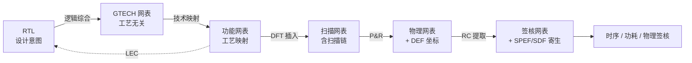

# RTL 与网表：作用、联系、区别与网表分类

寄存器传输级（Register Transfer Level, RTL）与网表（Netlist）是数字IC设计流程中两种核心的设计表示形式，分处设计抽象光谱的两端：RTL 是**设计意图**的载体——用硬件描述语言（HDL）描述"寄存器 + 寄存器间的数据传输与逻辑运算"，面向人、面向功能验证；网表是**实现结构**的载体——由逻辑单元实例与信号网络连接组成的结构级描述，面向机器、面向物理实现。二者由逻辑综合（Synthesis）衔接，由逻辑等价性检查（LEC）保证功能一致，是"从想法到硅片"链条上承上启下的两个关键数据形态。

## RTL 与网表的作用

**RTL 的作用**：（1） 表达设计意图——以 `always` 块、`assign` 语句、寄存器与运算符描述行为，脱离具体工艺；（2） 功能验证的对象——RTL 仿真（前仿）验证行为符合规范，UVM/SVA 验证平台全部作用于 RTL；（3） 架构探索的载体——流水线、FSM、算法结构在 RTL 层调整成本最低；（4） 综合的输入——RTL 编码风格（可综合子集、时钟门控风格）直接决定下游实现质量。

**网表的作用**：（1） 实现流程的数据载体——综合、DFT、P&R、STA、功耗分析、物理验证全流程围绕网表展开；（2） 功能继承的凭据——LEC 通过后，网表继承 RTL 的功能正确性，后端无需重复功能验证；（3） 物理实现的起点——P&R 把网表单元映射到版图坐标；（4） 签核的对象——时序（SDF/SPEF）、功耗（VCD/SAIF/FSDB）、物理（DRC/LVS）分析都以网表为基准。

## RTL 与网表的联系

**综合是桥梁**：综合三阶段（RTL 精化 → 工艺无关优化 → 技术映射）把 RTL 逐步转化为网表。精化阶段将 RTL 推断为工艺无关的通用技术网表（Generic Technology Network, GTECH），技术映射阶段将 GTECH 匹配到工艺库具体单元（如 `NAND2_X1`），期间执行资源共享、逻辑重构、时钟门控插入、多阈值电压（Multi-Vth）优化等变换。

**LEC 保证等价**：综合优化（重定时 Retiming、FSM 重编码、资源共享）可能改变网表结构，逻辑等价性检查（Logic Equivalence Checking, LEC）用形式化方法证明网表与 RTL 在所有输入组合下行为一致——这是"网表可以继承 RTL 验证结果"的前提。

**约束与数据贯穿**：SDC 时序约束在 RTL 阶段定义、在网表阶段执行；仿真激励（Testbench）从 RTL 仿真复用到门级仿真；活动数据（VCD/SAIF/FSDB）从 RTL 级统计到门级精确计算（见 [[asic-flow/concepts/功耗分析|功耗分析]]）；UPF 电源意图从 RTL 设计期定义贯穿到网表实现期。

## RTL 与网表的区别

| 维度 | RTL | 网表 |
|:---|:---|:---|
| 抽象层次 | 行为级/寄存器级 | 结构级/门级 |
| 内容形态 | `always`/`assign`、寄存器、运算符、FSM | 单元实例、引脚连接、网络定义 |
| 人可读性 | 高——表达设计意图 | 低——只反映实现结构 |
| 工艺相关性 | 无——工艺无关 | 有——绑定工艺库单元 |
| 仿真速度 | 快 | 慢 10-100 倍（门级事件驱动） |
| 主要用途 | 功能验证、架构探索 | 实现、时序/功耗/物理分析、签核 |
| 修改方式 | 修改代码重新综合 | 网表级 ECO（工程变更单） |
| 正确性保障 | 功能验证（仿真/形式） | LEC 等价性 + 门级仿真 |
| 毛刺可见性 | 不可见（零延迟） | 可见（SDF 反标后） |

## 网表分类

网表可以从多个维度分类，理解分类体系有助于定位"当前阶段用的是哪种网表"。

### 按抽象层次分类

设计表示的抽象谱系从高到低为：**门级 → 开关级 → 晶体管级**（再往上即 RTL/行为级）。

**门级网表（Gate-Level Netlist）**：由逻辑门与触发器（标准单元）及其连线组成——RTL 经过逻辑综合后的直接产物，数字流程中最常用的网表形态。门级内部又分两种：**工艺无关网表（GTECH）**——综合精化阶段的产物，由抽象门（AND/OR/NAND/DFF）组成，不绑定任何工艺库，用于综合内部优化，一般不外发；**工艺映射网表（Mapped Netlist）**——技术映射后的产物，单元全部来自工艺库（如 `NAND2_X1`、`DFFQ_X2`），是综合交付、下游流程使用的标准网表。

**开关级网表（Switch-Level Netlist）**：将晶体管视为理想开关（仅区分导通/截止两种状态）的抽象，介于门级与晶体管级之间——比门级更细（能看到传输门、锁存器内部结构），又比晶体管级更粗（忽略电压电流等电学细节）。历史用途：早期 MOS 逻辑仿真器（如 RSIM 类开关级仿真器）用开关级网表验证晶体管网络的逻辑行为，能发现门级抽象掩盖的电荷共享、弱驱动等问题；现代标准单元流程中几乎不再使用（被门级网表 + 时序仿真取代），但在传输门/动态逻辑等特殊结构的行为验证与教学语境中仍可见。

**晶体管级网表（Transistor-Level Netlist）**：MOS 管级描述（SPICE/CDL 格式），包含器件类型、宽长比、模型参数与完整电学连接，用于模拟电路仿真、混合信号设计和 LVS 物理验证的基准；数字流程中一般由 IP 供应商提供或从版图提取，仅在精度要求极高的关键模块（如 IO、锁存器时序核对）局部使用。

### 按层次结构分类

**扁平网表（Flat Netlist）**：所有单元平铺在同一层次，逻辑关系清晰但规模大、调试难，适用于中小规模设计。**层次化网表（Hierarchical Netlist）**：模块嵌套组织，与 RTL 层次对应；大规模 SoC 采用层次化综合，顶层常以**接口逻辑模型（Interface Logic Model, ILM）替代完整子网表——只保留端口时序弧和寄存器，减少约 80% 的顶层分析计算量。

### 按流程阶段/用途分类

### 按流程阶段/用途分类

**逻辑网表（Logical Netlist）**：即综合后的功能网表——只描述逻辑连接关系与功能，不包含任何物理位置和精确延时信息，用于 LEC、门级功能仿真、功耗估算。**扫描网表（Scan Netlist）**：DFT 插入后的网表——功能触发器被替换为扫描触发器，含扫描链结构，用于 ATPG 与扫描测试。**物理网表（Physical Netlist）/ 带反标网表（Back-annotated Netlist）**：P&R 后的网表——单元带物理坐标与放置信息（物理信息存于 DEF，网表本身不变）；布线后提取寄生参数（SPEF）并结合标准延迟格式（SDF）反标真实线网延迟，形成带反标网表，用于后仿真（Post-Simulation）与精确的时序签核（Timing Signoff）。**电源感知网表（Power-Aware Netlist）**：与 UPF 联合的网表——含电源域、隔离单元、保持寄存器、电平转换器信息，用于低功耗验证与功耗签核。

### 按物理维度分类

**2D 网表**与**3D 网表**：2D 网表所有单元同属一个 Die（单芯片平面实现）；3D 网表用于 3D-IC——多个 Die 垂直堆叠，网表携带 Die 归属与 TSV/键合等垂直互连元素（详见 [[asic-flow/concepts/2D与3D网表|2D 网表与 3D 网表]]）。

### 按数据格式分类

**文本网表**：Verilog/VHDL 格式——通用、可读、工具互通的标准形态，综合工具 `write -format verilog` 输出。**EDIF 网表（Electronic Design Interchange Format）**：EDA 工具间交换网表/版图的通用标准格式，20 世纪 90 年代曾广泛用于不同厂商工具间的数据交换，后被 Verilog 网表全面取代，如今主要存在于遗留流程与特定工具互操作场景。**二进制数据库**：Synopsys DDC（Design Data Container）——保留综合中间信息的数据库格式，传递到 P&R/STA 工具时无需重新编译。**物理格式**：DEF（Design Exchange Format）——物理网表载体（单元位置、布线、电源网格），与网表配合使用；SPEF（Standard Parasitic Exchange Format）——寄生参数载体，反标到网表供时序/功耗签核。**晶体管格式**：CDL（Circuit Description Language）/SPICE——晶体管级网表格式，用于 LVS 与模拟仿真。

## 网表的生命周期（流程中的形态演变）

同一个逻辑设计在流程中依次呈现为不同形态的网表——识别"当前手上是哪一种网表、它带了哪些附加信息（扫描链/坐标/寄生/UPF）"是后端工程的基本功。

## 关键要点

- **RTL 表达意图、网表表达结构**：RTL 面向人与功能验证，网表面向机器与物理实现，两者由综合衔接、由 LEC 保证等价
- **网表继承功能正确性是有前提的**：LEC 通过后网表才继承 RTL 验证结果——LEC 是网表交付的质量关卡
- **网表分类有五个维度**：抽象层次（门级/开关级/晶体管级 + GTECH）、层次结构（扁平/层次化）、流程阶段（逻辑/扫描/物理反标/电源感知）、物理维度（2D/3D）、数据格式（Verilog/EDIF/DDC/DEF/CDL）
- **抽象谱系是"门级 → 开关级 → 晶体管级"**：开关级把晶体管视为理想开关，介于门级与晶体管级之间，现代标准单元流程几乎不用，仅存于特殊结构验证与教学
- **逻辑网表 vs 带反标网表**：逻辑网表无物理位置与延时信息；布线后结合 SPEF/SDF 反标真实延时的网表用于后仿真与时序签核（反标机制详解见 [[cross-domain/concepts/反标|反标]]）
- **EDIF 是历史通用交换格式**：90 年代工具间交换标准，已被 Verilog 网表取代，遗留流程与互操作场景仍可见
- **同一逻辑多种网表形态**：网表随流程演进——识别当前形态及其附加信息是后端基本功
- **RTL 与网表的毛刺可见性差异**：RTL 零延迟仿真看不到毛刺，SDF 反标的门级仿真才能捕获毛刺活动——这直接影响功耗仿真精度（衔接 [[asic-flow/concepts/功耗分析|功耗分析]]）

## 与其他概念的关系

- [[asic-flow/concepts/逻辑综合|逻辑综合（Synthesis）]] — RTL 到网表的转换桥梁：精化生成 GTECH、技术映射生成工艺网表，SDC 约束贯穿
- [[asic-flow/concepts/2D与3D网表|2D 网表与 3D 网表]] — 网表按物理维度的分类：单 Die 平面 vs 3D-IC 垂直堆叠
- [[verification/concepts/形式验证|形式验证（Formal Verification）]] — LEC 证明 RTL 与网表等价，是网表继承功能正确性的前提
- [[asic-flow/concepts/后端支持BES|后端支持（BES）]] — BES 岗位是网表的生产者与交付者：综合生成、LEC 把关、网表交付给后端
- [[asic-flow/concepts/功耗分析|功耗分析（Power Analysis）]] — RTL 级功耗估算（SAIF）与门级功耗仿真（VCD/FSDB）分处网表生命周期的两端
