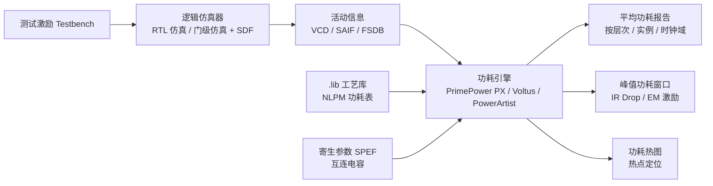
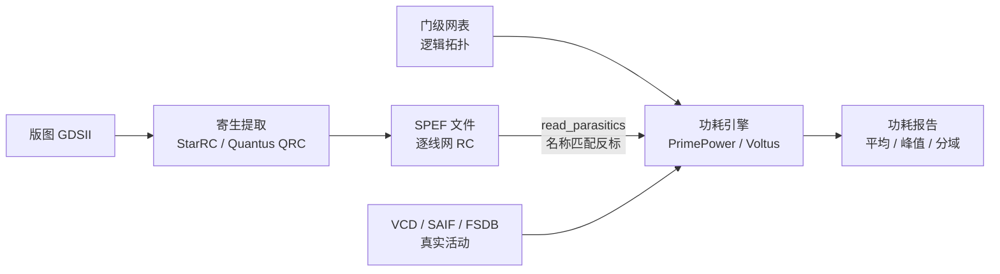
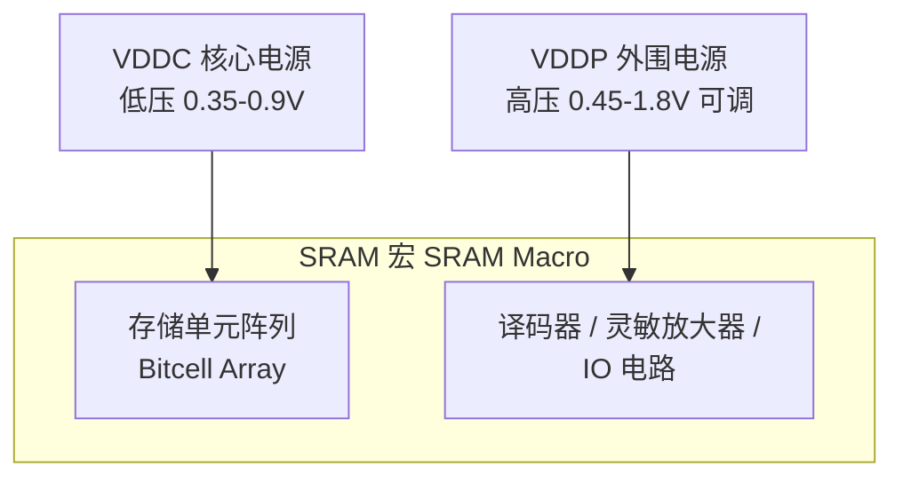
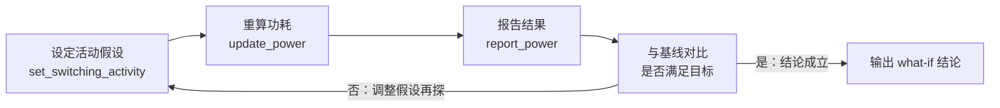

# 功耗分析

功耗分析（Power Analysis）贯穿 ASIC 设计全流程——从 RTL 级功耗估算（Early Power Estimation）到 Signoff 级精确功耗签核（Power Signoff）——其目标是在设计的每个阶段准确评估并优化芯片的能量消耗。功耗已成为先进工艺节点下与性能同等重要的第一级设计约束：FinFET 工艺中漏电功耗（Leakage Power）占比随阈值电压降低呈指数增长，7nm 以下工艺中静态功耗可达总功耗的 30%-50%。功耗分析的准确性直接影响芯片热设计（Thermal Design Power, TDP）、封装选型和供电网络（Power Delivery Network, PDN）设计。

## 原理

### 动态功耗分解

动态功耗（Dynamic Power）由两部分组成。**开关功耗**（Switching Power）是负载电容充放电所消耗的能量：$P_{switch} = \frac{1}{2} \alpha C_L V^2 f$，其中 $\alpha$ 为活动因子（每周期平均翻转概率，典型数据信号 $\alpha \approx 0.1-0.2$），$C_L$ 为负载电容（包括门输出电容和互连线电容），$V$ 为电源电压，$f$ 为时钟频率。电压项呈平方关系——将 VDD 从 1.0V 降至 0.9V 可减少约 19% 的开关功耗，这是架构层面最有效的功耗杠杆。

**内部功耗**（Internal Power / Cell Internal Power）是标准单元内部在输入跳变时从电源到地的短暂直流通路（Short-Circuit / Crowbar Current, PMOS 和 NMOS 同时导通形成的 VDD-GND 直通路径）以及内部节点充放电所消耗的能量。在 .lib 工艺库中，内部功耗建模为每次翻转的能量，依赖于输入过渡时间（Input Slew）和输出负载电容——输入过渡时间越长，PMOS 和 NMOS 同时导通的时间窗口越大，短路电流积分越大。功耗分析精度高度依赖于活动因子数据的准确性，可通过 VCD（Value Change Dump, 仿真波形记录每次信号翻转）或 SAIF（Switching Activity Interchange Format, 紧凑的翻转统计）反标获得。

### 静态功耗与漏电

静态功耗（Static Power / Leakage Power）是电路在无信号翻转状态下消耗的功耗，在先进工艺中占比越来越高。**亚阈值漏电**（Subthreshold Leakage）是最主要的漏电来源——当 $V_{GS} < V_{th}$ 时晶体管并未完全关断，仍有指数衰减的扩散电流流过沟道，$I_{sub} \propto e^{-V_{th} / nV_T}$，随温度升高呈指数增长。**栅极隧穿漏电（Gate Tunneling Leakage）**——栅氧化层极薄（<2nm）时载流子通过量子隧穿效应穿透栅介质，高 K 金属栅（HKMG）工艺通过物理增厚栅介质可将其降低多个数量级。**结漏电（Junction Leakage）**——反偏 PN 结的漂移-扩散电流和带间隧穿，在高温下显著增加。

### 三大功耗分量：来源、决定因素与影响

功耗工具的 `report_power` 输出按三大分量分类：Switching（开关功耗）、Internal（内部功耗）、Leakage（漏电功耗）。三者的物理来源、决定因素与优化手段完全不同——定位功耗热点前必须先读懂每个分量从何而来：

| 分量 | 物理来源 | 决定因素 | 影响与优化手段 |
|:---|:---|:---|:---|
| Switching 开关功耗 | 负载电容充放电：门输出电容加互连电容 $C_L$ 上消耗 $\frac{1}{2}\alpha C_L V^2 f$ | 活动因子 $\alpha$、负载电容 $C_L$、电压平方项、频率 | 时钟树与高扇出网络是大头；时钟门控、降 VDD 最有效 |
| Internal 内部功耗 | 短路电流（PMOS/NMOS 同时导通的 VDD-GND 直通）加单元内部节点充放电 | 输入过渡时间（slew）、输出负载、单元拓扑（NLPM 按时序弧查表） | slew 越差越大；先进工艺中可超过 switching 成为动态功耗主体 |
| Leakage 漏电功耗 | 亚阈值漏电（主导）+ 栅极隧穿 + 结漏电 + GIDL/穿通漏电 | Vth、温度（指数关系）、输入状态（状态相关漏电）、工艺角（FF 角可达 SS 角 5-10 倍） | 无翻转也耗电；待机场景主导；电源门控、Multi-Vth、RBB 压制 |

**静态与动态的判别标准**：以"是否依赖信号翻转"为界。Switching 与 Internal 同属动态功耗——两者都只在信号跳变期间消耗，因此工具报告中的动态功耗 = switching + internal；Leakage 单独构成静态功耗——晶体管加电后无论是否翻转都存在。Internal 的名字容易误导："内部"指"单元内部"，不指"静态"，短路电流恰恰是跳变事件。对应地：动态分量由活动数据（翻转率）驱动，静态分量由静态概率（$P_1$）做状态加权——同一单元不同输入状态的漏电不同，PTPX 按静态概率加权平均。

**各分量的影响不同**：漏电影响待机寿命与热设计——IoT 类器件绝大多数时间处于待机，电池寿命由漏电决定；开关功耗影响峰值电流与动态 IR——时钟沿处寄存器同步翻转产生 di/dt 尖峰（可达平均电流 5-10 倍）；内部功耗对 slew 敏感——签核必须反标真实 SDF/SPEF，用理想 slew 会系统性低估内部功耗。

### 功耗分析要分析哪些

功耗分析按三个正交维度组织分析对象，静态与动态是最基础的切分：

（1）**按功耗性质——静态与动态分开报告**：动态功耗（switching + internal）由活动数据驱动（VCD/SAIF 反标或默认翻转率），静态漏电由静态概率加权——两者必须分开，因为优化手段完全不同（时钟门控与降 VDD 治动态，电源门控与多 Vth 治漏电）。

（2）**按时间尺度**：平均功耗（热设计、电池寿命、mission profile 加权）、峰值功耗（滑动窗口统计，用于 PDN 与 IR 压降设计）、瞬态功耗波形（di/dt 分析，去耦电容选型）。

（3）**按分解维度**：按层次（定位热点模块）、按类型（组合逻辑/时序单元/时钟树/memory/IO）、按电源轨（VDDC/VDDP 分域）、按工作模式（功能/扫描/待机/唤醒）、按工艺角（漏电在 FF 角放大 5-10 倍）。

### 组合逻辑与时序逻辑的功耗特征

`report_power` 按单元类型分组——组合逻辑（Combinational Logic）、时序单元（Sequential Cell）、时钟网络（Clock Network）、memory、io_pad——"哪类电路耗电"由分组回答，与"哪条电源网络耗电"的分轨报告互补。组合逻辑与"非组合逻辑"（时序单元 + 时钟网络 + memory/IO）的功耗来源与分析方法有本质区别：

**组合逻辑功耗——数据活动驱动，毛刺放大**：组合门没有时钟输入，功耗完全由输入数据活动决定——输入翻转沿多级逻辑传播，每一级门的输出翻转都计一次功耗。组合逻辑的独特问题是毛刺（Glitch）：多级路径延迟不平衡使中间节点在稳态前多次翻转，毛刺功耗可占组合逻辑动态功耗的 20%-30%，逻辑深度越大越严重（产生机理与冗余项消除见 [[rtl-design/concepts/组合逻辑|组合逻辑]]）。因此组合逻辑功耗对测试向量极其敏感——向量是否"真的在算"直接决定翻转率；分析手段是活动因子传播（从输入向输出传播翻转率）或 VCD 反标逐门统计。优化手段：逻辑深度平衡、冗余项消毛刺、操作数隔离（Operand Isolation）、资源共享。

**时序逻辑功耗——时钟驱动，向量无关**：寄存器的时钟引脚每个时钟沿必翻转一次（活动因子 $\alpha = 1$）——即使数据不变、Q 端不翻转，时钟沿仍消耗内部功耗（时钟引脚翻转引发单元内部节点充放电）。更大的分量在时钟网络——时钟树缓冲器链功耗占芯片动态功耗 30%-40%，且**与数据活动无关**：无论处理什么数据，时钟树每周期都翻转，因此时钟功耗可精确预测、不受测试向量影响——这是时序功耗区别于组合功耗的根本特征（时钟树结构见 [[asic-flow/concepts/时钟树综合|时钟树综合]]）。优化手段：时钟门控（阻止无谓时钟翻转，节省 20%-40%）、门控分组、低功耗触发器。

**静态功耗的分布**：组合逻辑漏电由输入静态概率决定——同一门不同输入状态漏电不同，PTPX 按静态概率加权；时序单元的漏电在总漏电中占比大——寄存器数量以十万计，且多 Vth 替换收益恰集中在非关键路径的时序单元上。memory 与 IO 是另两个"非组合"大类：SRAM 位单元阵列在低压保持时漏电主导，IO 单元电平高、功耗按协议活动计算。

| 维度 | 组合逻辑 | 时序单元 + 时钟网络 |
|:---|:---|:---|
| 功耗驱动源 | 数据活动（输入翻转传播） | 时钟（每周期必翻转） |
| 与测试向量的关系 | 强相关（向量代表性决定精度） | 弱相关（时钟功耗向量无关） |
| 毛刺贡献 | 显著（20%-30% 动态功耗） | 可忽略（时钟路径不允许毛刺） |
| 静态功耗决定因素 | 输入静态概率 | 单元数量与 Vth 分配 |
| 主要优化手段 | 深度平衡/操作数隔离/资源共享 | 时钟门控/门控分组/低功耗触发器 |

### 低功耗技术体系

**时钟门控（Clock Gating）**：阻止时钟信号在寄存器不需要更新时翻转，是降低动态功耗最有效且最广泛使用的技术。AND 门控（简单与非门截断时钟）可能引入毛刺；插入式时钟门控单元（Integrated Clock Gating Cell, ICG）内部含锁存器以避免使能信号的毛刺传播到门控时钟输出，提供干净的时钟门控信号。综合工具可自动插入 RTL 级和模块级时钟门控，节省 20%-40% 动态功耗。

**电源门控（Power Gating）**：使用高阈值电压的电源开关晶体管（Header Switch 在 VDD 侧或 Footer Switch 在 VSS 侧）在模块空闲时完全切断其供电路径，消除亚阈值漏电。UPF（Unified Power Format, IEEE 1801）定义电源域（Power Domain）的电源开关、隔离单元（Isolation Cell, 断电域输出需钳位到已知逻辑值防止不定态传播）、状态保持寄存器（Retention Register, 断电前保存状态、上电后恢复）的插入规则。上电唤醒时的浪涌电流（Inrush Current）控制是电源门控的关键时序挑战。

**多阈值电压优化（Multi-Vth Optimization）**：工艺库提供多种 Vth 版本的标准单元——低 Vth 单元速度快但漏电大，高 Vth 单元漏电小但速度慢。综合和 P&R 工具自动在非关键路径使用高 Vth 单元，在关键路径使用低 Vth 单元，实现时序和功耗的联合优化——这是面积中性的优化方法。

**动态电压频率调节（DVFS）**：根据工作负载动态调整电源电压和时钟频率——轻负载时降低电压和频率以减少功耗，通过 $P \propto V^2 f$ 同时利用电压平方和频率线性的节能效果。自适应电压调节（Adaptive Voltage Scaling, AVS）利用片上工艺监测器（Process Monitor）实时感知芯片工艺偏差并调整电压，比开环 DVFS 更精确。

### 功耗估算流程

功耗估算精度随设计阶段递进提升。RTL 级：使用综合工具的快速功耗估算，基于活动因子传播和库的统计功耗模型，误差 20%-40%，用于早期架构决策。门级网表级：布局前的精确门级功耗分析，使用 .lib 库的详细功耗表查表法，误差 10%-15%。布局后：反标寄生参数（SPEF, Standard Parasitic Exchange Format）的精确互连线电容，误差 5%-10%。Signoff 级：完整的门级动态功耗仿真（使用 VCD/SAIF 驱动，对每个门查表计算每次翻转的能量并积分），工具如 PrimePower, Voltus。

### 功耗仿真方法与流程

功耗仿真（Power Simulation）是"基于仿真的功耗分析"的具体工程实现——先通过逻辑仿真（Logic Simulation）记录电路的真实开关活动，再以该活动数据驱动功耗引擎查表计算功耗。它与无向量分析（Vectorless）的本质区别在于活动数据的来源：Vectorless 使用统计传播的默认翻转率，功耗仿真使用仿真波形中真实发生的翻转。功耗仿真是功耗估算精度金字塔的最高层（仅次于硅后实测）：门级仿真驱动分析的误差可控制在 5% 以内，而 Vectorless 为 15%-25%。代价是仿真时间——门级仿真比 RTL 仿真慢 10-100 倍，仿真窗口通常只能覆盖几百微秒到几毫秒的应用片段，因此**窗口的代表性**成为准确性的决定性因素。

**活动信息载体**：仿真器输出的活动数据有三种主流格式，本质权衡是"时间信息 vs 文件大小"。

| 格式 | 全称 | 时间信息 | 文件大小 | 典型用途 |
|:---|:---|:---|:---|:---|
| VCD | 值变化转储（Value Change Dump, IEEE 1364） | 逐次翻转的时间戳 | 巨大（门级仿真 50-200GB 常见） | 峰值功耗、时序相关分析 |
| SAIF | 开关活动交换格式（Switching Activity Interchange Format） | 无（仅翻转次数/密度统计） | 很小（MB 级） | 平均功耗、早期估算 |
| FSDB | 快速信号数据库（Fast Signal Database, Synopsys 专有） | 逐次翻转时间戳 | 约为 VCD 的 1/10-1/100（增量压缩） | 门级功耗仿真的事实标准 |

VCD 保留完整时间信息、精度最高，但文件爆炸式增长；SAIF 只保留统计汇总、丢失时序相关性，只能算平均功耗；FSDB 通过信号压缩和层级选择（只转储目标模块）兼顾精度与体积，因此大型门级功耗仿真几乎都采用 FSDB。实际工程惯例：RTL 级功耗估算用 SAIF 足够（活动统计即满足需求），门级签核必须用带时间信息的 VCD/FSDB 才能捕获峰值窗口。

**分层仿真流程**：功耗仿真按设计阶段分为三层，精度与成本递增。**RTL 级功耗仿真**——RTL 仿真转储活动数据（SAIF 或 VCD）后，由综合工具或专用功耗引擎（PowerArtist、Spyglass Power、PrimeTime PX 的 RTL 模式）在预综合设计上估算，误差 20%-40%，用于架构探索、功耗预算划分、时钟门控收益评估。**门级功耗仿真**——对综合/布局后的门级网表仿真（可选反标 SDF 真实延迟），记录 VCD/FSDB，再由 PrimePower/Voltus 按 .lib 工艺库的 NLPM 表逐次查表计算每次翻转的能量并积分，误差 10%-15%（布局后带 SPEF 反标可到 5% 以内）。门级仿真的独特价值是能看到**毛刺活动**——RTL 仿真中零延迟事件使毛刺不可见，而毛刺功耗可占动态功耗的 20%-30%；反标 SDF 后毛刺产生更真实，但仿真时间进一步恶化。**晶体管级功耗仿真**——对抽取的晶体管网表做瞬态仿真（Voltus/RedHawk 动态分析），精度最高，仅用于 IR 压降热点区域的局部验证。



**UPF 低功耗仿真（UPF-Aware Simulation）**：与"算功耗"不同，低功耗仿真验证的是电源意图（Power Intent）是否正确实现——仿真器加载 UPF（IEEE 1801）文件与网表联合编译，模拟电源状态表（Power State Table, PST）驱动的关电/上电序列，检查隔离单元（Isolation Cell）在关电期间是否正确钳位输出、保持寄存器（Retention Register）是否保存并恢复状态、电平转换器（Level Shifter）是否按电压域关系正确行为。低功耗仿真的典型难点是 X 传播：断电域的输出如果没有隔离单元钳位，X 会大范围传播导致仿真失败或虚假比对错误——这要求验证平台按 UPF 定义的隔离行为建模，并与功能验证的电源序列测试协同。

**门级功耗仿真的工程要点**：仿真窗口的向量代表性决定签核结果可信度——需要覆盖功能典型场景（视频解码、CPU 基准测试）、功能最坏场景（最大吞吐量）、扫描移位模式（翻转率最高，功耗可达功能模式 3-5 倍）、待机/唤醒模式；选不到功耗峰值窗口可能导致签核功耗低估 20%-40%。多电压域设计中各域按实际 VDD 分别计算（动态功耗按 $V_{DD}^2$ 比例缩放）。X 问题在门级仿真中同样突出——复位前的未知态会污染活动统计，通常需要先完成复位再开始记录波形。

```systemverilog
// Testbench only（仅仿真）：门级功耗仿真的波形记录配置
initial begin
    $dumpfile("top_power.vcd"); // 指定 VCD 输出文件：IEEE 1364 标准格式，功耗引擎可直接读取
    $dumpvars(0, dut);          // 记录范围：0 表示 dut 以下全部层次；只记录目标模块可显著减小文件
    $dumpoff;                   // 初始暂停记录：避免复位期间的 X 态污染活动统计
end
// 复位完成后打开记录；$dumpon / $dumpoff 配对使用，可跳过非关注区间
initial begin
    wait(rst_n === 1'b1); // 等待复位释放（rst_n 从 0 变为 1）
    #100;                 // 再等 100ns，确保电路完全脱离 X 态后再开始记录
    $dumpon;              // 开始记录翻转活动（$dumpon 恢复 $dumpoff 暂停的记录）
end
```

### SPEF 与网表：功耗仿真的寄生参数输入

**SPEF**（Standard Parasitic Exchange Format, IEEE 1481 标准寄生参数交换格式）是寄生提取工具输出的文本文件，逐线网描述互连线的分布式电阻与电容（总电容、耦合电容、电阻）——是功耗仿真中"真实电容值"的来源。它与网表的关系可以概括为一句话：**网表定义"谁和谁相连"的逻辑拓扑，SPEF 描述这些连接的电气属性（电阻多大、电容多大）**。同一份网表配合不同布局版本提取出的不同 SPEF，逻辑功能完全相同，电气行为与功耗却不同。

SPEF 的生成链路：P&R 完成布线后，提取工具（Synopsys StarRC、Cadence Quantus QRC）从版图提取每根线网金属形状对应的寄生电阻电容，**按网表线网名称组织**写入 SPEF——名称匹配是 SPEF 与网表建立一一对应关系的唯一桥梁：SPEF 的层次路径必须与网表实例路径一致，工具（`read_parasitics`）才能把寄生挂到正确的线网上；综合改名或展平层次会破坏对应关系。名称对不上的线网静默回退到线负载模型估算——精度静默退化。反标机制与覆盖率检查的完整展开见 [[cross-domain/concepts/反标|反标]]。

SPEF 通过两条路径影响功耗结果：（1）**开关功耗的电容项**——$P_{switch} = \frac{1}{2} \alpha C_L V^2 f$ 中的 $C_L$ 由网表提供的单元负载与 SPEF 提供的互连电容共同构成；先进工艺下互连电容在负载电容中的占比显著，长距离线网可过半——没有 SPEF 的开关功耗分析会系统性低估；（2）**内部功耗的查表输入**——SPEF 使输出负载与过渡时间（Slew）真实化，NLPM 查表才能查到真实的单次翻转能量。加上 VCD/SAIF 真实活动数据，布局后带 SPEF 的门级功耗分析误差收敛到 5% 以内——功耗估算流程的精度阶梯正对应"网表 → 网表+SPEF → 网表+SPEF+VCD"的递进。

**SPEF 与 SDF 的分工**：SPEF 反标寄生（RC），STA 与功耗引擎用它计算延迟与电容；SDF 反标延迟（由 SPEF 计算出的延迟写成表格），门级仿真器用它推进事件。功耗仿真通常直接读 SPEF 而非 SDF——功耗引擎要的是电容与 slew，不是现成延迟。带反标网表（物理网表 + SPEF/SDF）在网表生命周期中的定位见 [[asic-flow/concepts/RTL与网表|RTL 与网表]]。



**反标缺失时的兜底**：布局前没有 SPEF，工具回退线负载模型（Wireload Model）按扇出统计估算互连电容（误差 15%-30%）——功耗估算流程中"门级网表级"与"布局后"两档精度差正源于此。功耗签核前必须检查 SPEF 反标覆盖率（未反标线网清单）并保证提取关联（PEX 与 P&R 用同一版图数据），见 [[asic-flow/concepts/布局布线|布局布线]]。

### VDDC 与 VDDP：核心电源与外设电源的分域统计

多电源域设计中最常见的两条供电网络命名是 VDDC（VDD Core，核心电源）与 VDDP（VDD Peripheral，外围电源）——典型见于嵌入式 SRAM（Static Random Access Memory，静态随机存储器）宏与带独立 IO 电源域的 SoC。VDDC 给存储单元阵列（Bitcell Array）或核心逻辑供电，电压低（先进工艺 0.7-0.9V，低功耗存储可低至 0.35V）；VDDP 给外围电路——译码器、灵敏放大器（Sense Amplifier）、IO 单元——供电，电压高且常可独立调节。

**为什么分开**：SRAM 位单元在低电压下保持数据稳定且漏电小，但外围电路延迟随电压下降急剧恶化——IEEE 论文《HDD-RAM》（40nm 工艺）实测外设电路延迟占 SRAM 总读延迟 95% 以上。分开供电后 VDDP 可独立抬高换取速度、VDDC 保持低压能效——这是速度-能效解耦的双 VDD（Dual-VDD）策略。同论文量化：VDDC 固定 0.35V 时，VDDP 从 0.4V 抬到 0.6V，读延迟 250ns 降至 35ns（7.1 倍）；最优能量点出现在 VDDP=0.45V（0.119 pJ/bit）——低于此点漏电主导、高于此点动态功耗主导。



**功耗仿真中的区别与处理**：（1）动态功耗按各域实际电压分开计算——开关功耗公式 $P_{switch} = \frac{1}{2} \alpha C_L V^2 f$ 中 $V^2$ 项按域取值，0.9V 域与 1.8V 域的单次翻转能量差 4 倍，混用一个电压会严重失真；（2）漏电分开统计——不同电压域漏电可差 5-10 倍，分域报告才能定位漏电热点；（3）IR/EM 分析分网络进行——VDDC 与 VDDP 的电源网格密度与去耦需求不同。PTPX 的多轨分析（Multi-Rail Analysis）为此设计：

```tcl
# PTPX 多轨功耗分析：按电源网络分域统计（PrimeTime 命令语言，TCL 语法）
set power_enable_multi_rail_analysis true   # 打开多轨分析开关：默认关闭
set_voltage 0.9  -object_list VDDC          # 为核心电源网络 VDDC 设定 0.9V
set_voltage 1.8  -object_list VDDP          # 为外围电源网络 VDDP 设定 1.8V
update_power                                # 按各轨电压重算功耗
report_power -rails all                     # 按电源轨报告：VDDC 与 VDDP 分列统计
# 也可单轨查询（report_power -rails VDDC）或 set_current_power_net VDDP 后再 update/report
```

`report_power` 默认分组中 SRAM 宏归入 memory 组、PAD/IO 归入 io_pad 组——分组回答"哪类电路耗电"，分轨回答"哪条电源网络耗电"，两者互补。

### VCD 文件详解与 FSDB→VCD 转换

VCD（Value Change Dump，值变化转储）是 IEEE 1364 标准定义的**纯文本波形格式**——只记录仿真过程中信号的值变化事件（时间戳 + 新值），未变化的时刻不产生任何记录。它由仿真器通过系统任务产生（`$dumpfile` 指定文件名、`$dumpvars` 指定记录层次，见上文示例），是唯一有 IEEE 标准的波形交换格式：任何厂商的波形查看器（Verdi nWave、VCS DVE、GTKWave）与功耗工具都能直接读取。

**文件结构**：头部声明段之后是值变化段——每行以 `#时间` 开头，随后是若干"值 + 标识符代码"事件；每个信号在头部被分配一个短标识符（如 `!`、`#`），值变化段只写标识符不写全名，以压缩体积。

```text
$date Tue Aug 26 12:00:00 2026  $end    ; 生成时间戳
$version VCS S-2021.09            $end  ; 生成工具名与版本号
$timescale 1ns                    $end  ; 时间刻度：值变化段的 #N 单位是 1ns
$scope module top                 $end  ; 层次声明开始：进入 top 模块
$var wire 1 ! clk                 $end  ; 信号声明：wire 类型、1 位宽、标识符 "!"、名字 clk
$var wire 8 # data [7:0]          $end  ; 8 位总线信号，标识符 "#"，值用 bxxxxxxxx 表示
$upscope $end                           ; 层次声明结束（与 $scope 配对）
$enddefinitions $end                    ; 头部结束标志：以下为值变化段
#0
$dumpvars                               ; 时刻 0：记录全部信号的初始值
0!                                      ; clk 初始值为 0
b00000000 #                             ; data 初始值为 8'b00000000
$end
#10
1!                                      ; 时刻 10ns：clk 跳变为 1
b10101010 #                             ; 时刻 10ns：data 跳变为 0xAA
#11
0!                                      ; 时刻 11ns：clk 回落（同一 #时间 下可列多个信号事件）
```

VCD 的文本事件流带来一个独特能力——**毛刺语义**：同一时间戳下同一信号连续出现两次翻转（如 `#20` 下紧跟 `1!`、`0!` 两行）表示一个零宽毛刺，功耗引擎据此精确统计毛刺翻转次数。

**VCD 的作用**：（1）功耗分析活动数据源——`read_vcd` 反标后 PTPX 计算平均功耗、峰值功耗与时序相关分析（SAIF 无时间信息做不到峰值窗口），是门级功耗签核的主力输入；（2）波形调试与离线比对——跨工具通用，验证平台的离线比对流程即以 VCD/FSDB 为数据载体；（3）前仿/后仿一致性检查——同一激励下 RTL 仿真与门级仿真波形逐时刻比对；（4）跨厂商交付与存档——文本格式无许可证门槛，可 grep/脚本后处理，常用于流片审计文档。

**FSDB 到 VCD 的转换**：现代 PTPX/PrimePower 用 `read_fsdb` 直接读 FSDB、无需转换；转换（Verdi 命令行工具 `fsdb2vcd`，或 nWave 图形界面 File→Export）主要用于三类场景——第三方功耗工具（Voltus 的活动输入以 VCD/TCF 为主）、老版本工具、跨公司交付与脚本后处理（接收方可能没有 Verdi 许可证，读不了专有 FSDB）。

```shell
# Verdi 工具链：将 FSDB 波形转换为 VCD（shell 命令）
fsdb2vcd top.fsdb -o top.vcd
# fsdb2vcd  Verdi 自带命令行转换工具：输入 FSDB（Synopsys 专有压缩波形）
# -o         指定输出 VCD 文件名（IEEE 1364 标准文本格式）
# 大波形建议先截取关注时间窗口再转换，避免产出与 VCD 同量级的 GB 级文本文件
```

注意 VCD 只表达 0/1/X/Z 四值与总线向量——FSDB 中的 SystemVerilog 复杂类型（real、结构体、动态数组）无法转换或退化为位向量，因此该转换仅适用于波形/功耗用途；同族工具 `fsdb2saif` 可转出 SAIF 用于平均功耗场景。

### SAIF 文件详解

开关活动交换格式（Switching Activity Interchange Format, SAIF）是功耗仿真生态中连接仿真器与功耗引擎的**活动信息交换载体**——一种纯文本格式文件，由 Synopsys 提出并成为业界事实标准。与 VCD 记录"每一时刻的波形"不同，SAIF 只记录每个信号在一个统计窗口内的**汇总统计量**：信号为 0/1/X 的总时间、翻转总次数。因此 SAIF 文件极小（MB 级），可覆盖很长的仿真窗口，但丢失了时间信息，只能支撑平均功耗计算。

SAIF 文件的结构如下（数值仅为示意，但字段关系自洽）：

```text
(SAIFILE                       ; 文件根节点，标志 SAIF 格式开始
  (SIAF_VERSION "1.0")         ; 格式版本号，工具据此选择解析规则
  (DIRECTION FORWARD)          ; 方向：FORWARD = 仿真→功耗工具；BACKWARD = 工具→仿真（见下文）
  (DESIGN "top")               ; 被统计的设计名
  (DATE "Tue Aug 26 12:00:00 2026")  ; 生成时间戳
  (VENDOR "Synopsys")          ; 生成工具厂商
  (PROGRAM "VCS")              ; 生成工具名（这里是仿真器）
  (VERSION "S-2021.09")        ; 生成工具版本
  (DIVIDER /)                  ; 层次路径分隔符（与网表层次命名对齐）
  (TIMESCALE 1 ns)             ; 文件中所有时间量的单位
  (DURATION 200000)            ; 统计窗口总时长（200000 × 1ns = 200us）
  (TIMING                      ; 时间信息块：记录窗口起点与时长
    (TIMEZERO 0)               ; 统计起点时刻
    (TIMESCALE 1 ns)           ; 时间单位
    (DURATION 200000))         ; 统计时长（与顶层 DURATION 一致）
  (INSTANCE top                ; 实例节点：开始记录 top 模块的活动
    (NET clk                   ; 信号 clk 的活动统计
      (T0 100000)              ; T0：信号保持 0 的总时间（100us）
      (T1 100000)              ; T1：信号保持 1 的总时间（50% 占空比时钟）
      (TX 0)                   ; TX：信号保持 X（不定态）的总时间
      (TC 200000)              ; TC：Toggle Count，翻转总次数（2ns 周期时钟每周期翻转 2 次）
      (IG 0)                   ; IG：Ignored，未计入统计的时间
      (TB 200000))             ; TB：Total，总时间（应等于 T0+T1+TX+IG）
    (NET data_valid
      (T0 150000) (T1 50000) (TX 0) (TC 25000) (IG 0) (TB 200000))
    (INSTANCE u_alu            ; 子实例节点：层次化嵌套，与网表层级一一对应
      (NET result[0]
        (T0 180000) (T1 20000) (TX 0) (TC 30000) (IG 0) (TB 200000)))))
```

由上述统计量可导出两个核心参数：**静态概率**（Static Probability，信号为 1 的时间占比）$P_1 = T_1 / (T_1 + T_0)$，用于漏电功耗和单元内部功耗的计算；**平均翻转率**（Toggle Rate）$f_{sw} = TC / DURATION$，结合负载电容即可按 $P_{switch} = \frac{1}{2} \alpha C_L V_{DD}^2 f$ 计算动态功耗——功耗引擎按层次遍历每个信号的 SAIF 条目，对每个标准单元查 .lib 的 NLPM 功耗表累加，这就是"SAIF 驱动的功耗计算"。

**前向与反向两个方向**：`DIRECTION FORWARD`（前向注释 SAIF）由仿真器生成——仿真器统计窗口内的活动后输出给功耗引擎计算功耗，这是最常见的用法。`DIRECTION BACKWARD`（反向注释 SAIF）由功耗工具生成、回注给仿真或综合流程——例如 PowerCompiler 在低功耗优化（时钟门控、操作数隔离）后产生目标活动率，反向注释回 RTL 仿真以评估优化效果；VCS 也支持读取反向 SAIF 校正统计。

生成与使用示例——VCS 仿真器中用系统任务统计活动并输出 SAIF：

```systemverilog
// Testbench only（仅仿真）：统计 DUT 开关活动并生成 SAIF 文件
initial begin
    $set_toggle_region(dut);            // 指定统计区域：dut 模块及其以下全部层次
    $toggle_start;                      // 开始统计（之后的信号翻转被计入）
    // …… 此处运行完整激励序列，统计窗口应覆盖代表性应用片段 ……
    $toggle_stop;                       // 停止统计
    // $toggle_report 输出 SAIF 文件：参数1 = 文件名，参数2 = 时间刻度（秒），参数3 = 设计名
    $toggle_report("top.saif", 1.0e-9, "top");
end
```

功耗引擎读取 SAIF（以 PrimeTime PX 为例）：

```tcl
# PrimeTime PX 读入 SAIF 活动信息，驱动功耗计算
read_saif -input top.saif -instance testbench/dut -strip_path "tb"
# -input    指定 SAIF 文件路径
# -instance 指定 SAIF 活动数据对应的设计层次（RTL 仿真中 DUT 所在路径）
# -strip_path 剥离仿真平台前缀（tb），把 RTL 层次名映射到门级网表层次名
report_power -hierarchy -levels 2      # 按层次结构报告功耗，供热点定位
```

**RTL SAIF 与门级 SAIF**：RTL 仿真产生的 SAIF 只有 RTL 层次的活动，用于 RTL 级功耗估算；门级仿真产生的 SAIF 直接对应门级网表实例，用于精确计算。两者混用时必须做层次映射——综合会改变层次命名（重命名、展平），`-strip_path` 和实例映射命令正是为此设计。工程上最常见的坑是拿 RTL SAIF 直接驱动门级网表而不做映射，导致大量信号"无活动可查"（fallback 到默认翻转率），静默降低精度。

**SAIF 的固有局限**：无时间信息，无法做峰值功耗、瞬态 IR 压降分析（那是 VCD/FSDB 的领地）；RTL 级 SAIF 由零延迟仿真产生，毛刺不可见，会系统性低估动态功耗。因此工程惯例是：RTL 估算与架构探索用 SAIF（快、覆盖长窗口），签核级动态功耗用 VCD/FSDB。

### IR 压降与功耗协同分析

功耗分析并非孤立——高功耗直接导致 IR 压降（IR Drop），而 IR 压降又反过来增加门延迟、降低电路速度，迫使 P&R 使用更大驱动能力的单元和更多缓冲器，进而增加功耗。**门延迟对电源电压的敏感度**（Delay Sensitivity to VDD）呈超线性关系：VDD 降低 10% 可能导致门延迟增加 15%-25%，具体取决于工艺库的延迟-电压曲线。IR 压降分析需要功耗分布数据作为电流源激励——两者形成紧密的迭代回路。先进节点中动态 IR 压降分析日益重要：寄存器在时钟沿处的同步翻转产生瞬时电流尖峰（di/dt 效应），其峰值可达平均电流的 5-10 倍，持续时间在 100ps-500ps 量级。片上解耦电容（DECAP）和封装级电容共同构成分级去耦网络以抑制电压波动。

### 先进工艺的功耗挑战

FinFET（鳍式场效应晶体管）和 GAA（Gate-All-Around, 全环绕栅极）工艺对功耗管理提出了新挑战。FinFET 的量化沟道宽度（每个 Fin 提供固定驱动电流）使门尺寸的粒度更粗——不能再像平面 CMOS 那样连续调整栅宽 W。**自热效应**（Self-Heating Effect, SHE）在 FinFET 和 SOI 工艺中尤为严重：低热导率的埋氧层或窄 Fin 结构限制了热扩散，局部结温可能比环境温度高 30-50C，导致载流子迁移率退化——电流下降、门延迟增加，形成正反馈恶化回路。功耗分析工具需要与热分析集成（Electro-Thermal Co-Simulation）来捕捉这一效应。7nm 以下节点中栅极隧穿漏电因 HKMG（高 K 金属栅）得到控制，但**栅极诱导漏极漏电**（Gate-Induced Drain Leakage, GIDL）和**穿通漏电**（Punch-Through Leakage）成为新的静态功耗分量。

### 功耗签核的向量选择与覆盖率

功耗签核的准确性高度依赖于激励向量的代表性。**无向量分析**（Vectorless Analysis）适用于早期设计阶段——基于统计活动因子传播和默认翻转概率估计功耗，速度快但误差大（15%-25%）。**基于仿真的分析**（Simulation-Based Analysis）使用门级仿真生成的 VCD/SAIF 驱动功耗计算——关键是如何选择覆盖功耗峰值的仿真窗口。典型的功耗签核需要覆盖多种场景向量：功能模式典型场景（如视频解码、CPU 基准测试）、功能模式最坏场景（最大吞吐量的连续运算）、扫描移位模式（翻转率最高）、待机模式（仅漏电）。选择不到功耗峰值窗口可能导致签核功耗低估 20%-40%。**基于时序窗口的功耗分析**（Timing Window-Based Power Analysis）将 STA 的时序路径分析结果用于约束每个门的翻转时间窗口——仅统计时序上合理的翻转，避免计算不可能同时翻转的重复计数，可在保持精度前提下减少计算量。

### EDA 功耗分析工具链

主流 EDA 功耗分析工具形成完整的签核级生态系统。Synopsys PrimePower 用于门级和晶体管级功耗签核——支持 RTL（基于 SAIF 的活动因子传播）和门级（基于 VCD 的精确仿真驱动）分析，与 PrimeTime STA 共享寄生参数数据库和时序窗口分析引擎。Cadence Voltus 提供统一的功耗签核、IR 压降和电迁移分析平台——与 Innovus P&R 和 Tempus STA 紧密集成，支持从早期原型到签核的全流程功耗分析。Ansys RedHawk（原 Apache RedHawk）专注于 IR 压降和 EM 签核，同时提供动态功耗分析——其热点识别和去耦电容优化功能广泛用于先进节点。这些工具的功耗分析引擎均基于 .lib 工艺库的详细功耗表格模型（NLPM, Non-Linear Power Model），查表法在时序弧的输入过渡时间和输出负载电容两个维度上插值计算每次翻转能量，精度优于 5%。

### PrimeTime PX（PTPX）详解

PrimeTime PX（PTPX，PrimeTime 的功耗扩展，Power eXtension）是 Synopsys 功耗分析的主线方案——**它不是独立工具，而是 PrimeTime 的集成模块**：与静态时序分析（STA）共享同一引擎、同一数据库（网表、.lib、SDC、SPEF）和同一命令语言。功耗与时序在同一工具中计算，从根本上避免了"功耗工具单独读取时序数据"带来的转换误差与一致性问题；STA 的时序窗口（Timing Window）信息直接约束翻转统计——这正是 [[asic-flow/concepts/功耗分析|功耗分析]] 中"基于时序窗口的功耗分析"的工程实现。历史上 PrimePower 的独立功耗引擎曾并入 PrimeTime 形成 PTPX；2020 年起 Synopsys 推出的新一代 PrimePower（RTL 到签核的统一平台）成为 PTPX 的后继者——PTPX 引擎至今仍是 Synopsys 生态功耗签核的事实标准。

**两种分析模式**：PTPX 用 `set power_analysis_mode` 在两种模式间切换，覆盖从架构探索到签核的全阶段。

| 模式 | 适用阶段 | 输入网表 | 活动数据 | 精度 | 典型用途 |
|:---|:---|:---|:---|:---|:---|
| RTL 模式（rtl） | RTL 完成/预综合 | RTL 或未优化网表 | SAIF / 默认活动传播 | 20%-40% | 架构探索、功耗预算划分 |
| 门级模式（gate_level） | 综合后/布局后 | 门级网表（可带 SPEF） | VCD / FSDB / SAIF / PT 内建仿真 | 5%-10% | 功耗签核、峰值功耗 |

RTL 模式不依赖门级网表与精确电容，活动用 SAIF 统计或工具默认翻转率传播，速度快、精度粗；门级模式按 .lib 的 NLPM 表精确查表，布局后读入 SPEF 把互连电容计入开关功耗，精度可达 5% 以内。

**活动数据四种来源**：（1） `read_saif`——平均功耗场景，RTL 模式的主力；（2） `read_vcd`——门级模式主力，含时间信息，支撑峰值功耗与时序相关分析（见 SAIF 文件详解章节的格式对比）；（3） `read_fsdb`——文件体积小，适合大设计长窗口；（4） **PT 内建时序仿真**——PrimeTime 自带仿真引擎（`simulate` 命令），用 STA 的延迟计算跑向量并输出 VCD（`write_vcd`），无需外部仿真器，延迟模型与 STA 完全一致；代价是容量与速度低于 VCS 等专业仿真器，只适合关键窗口的小规模分析。

**功耗计算原理**：动态功耗 = 开关功耗（$\frac{1}{2}\alpha C_L V_{DD}^2 f$，电容取自 SPEF/网表）+ 内部功耗（NLPM 查表：每条时序弧按输入过渡时间与输出负载插值得到单次翻转能量，再乘以翻转率）；静态功耗 = 漏电查表（State-Dependent Leakage：同一单元不同输入状态漏电不同，PTPX 结合静态概率加权平均）。峰值功耗通过滑动窗口统计（`report_peak_power`），窗口内所有单元翻转能量累加，用于 IR 压降分析的电流激励。

```tcl
# PTPX 门级功耗分析典型流程（PrimeTime 命令语言，TCL 语法）
set power_enable_analysis TRUE   # 打开功耗分析开关：默认关闭，打开后时序分析不受影响
set power_analysis_mode gate_level  # 选择门级模式；RTL 模式改为 set power_analysis_mode rtl
read_verilog top_netlist.v       # 读入门级网表（综合或布局后的网表文件）
read_db -lib stdcells.db         # 读入工艺库：必须包含 NLPM 功耗表（.db 格式）
read_sdc top.sdc                 # 读入时序约束：时钟定义直接影响活动统计与窗口过滤
read_vcd -input top.vcd -strip_path tb -time {0 100000}
# read_vcd 读入仿真波形：-strip_path 剥离仿真平台前缀（tb），-time 指定统计窗口
report_power -hierarchy -levels 2   # 报告功耗：按层次分解，含 switching/internal/leakage 分类
report_peak_power -time {0 100000}  # 报告峰值功耗：在指定窗口内滑动统计最大功耗
```

**输出与生态分工**：`write_power_data` 将功耗数据（平均/峰值、按实例）输出给下游工具——ICC2 做功耗感知实现（Power-Aware P&R），RedHawk/Voltus 做 IR 压降与电迁移（EM）签核。分工边界清晰：**PTPX 负责"算出多少功耗"，RedHawk/Voltus 负责"功耗流过供电网络后的电压/电流完整性"**；PTPX 与 STA 共享时序数据，功耗热点可与时序违例路径交叉定位——这是其他功耗工具难以替代的集成优势。

### What-If 分析（假设分析）与 PTPX 的关系

What-If 分析（假设分析，What-If Analysis）是 PTPX 及其后继者 PrimePower 提供的一类**无向量（Vectorless）假设分析功能**——它不是独立工具，而是运行在 PTPX 环境内、与功耗签核共用同一网表数据库、NLPM 功耗表和 STA 时序窗口的功能特性。Synopsys 的 PTPX 解决方案介绍将其列为标准特性，PrimePower 官方文档进一步明确：RTL 阶段（PrimePower RTL）与门级签核阶段均提供"向量无关的 What-If 分析"（Vector-less What-If Analysis），覆盖平均功耗与目标功耗（Target Power）评估。

**联系——同一引擎、同一数据**：what-if 与签核分析同处一个工具会话，共享已读入的网表、.lib、SDC、SPEF；what-if 的输出报告与仿真驱动分析同格式，可直接进入 RedHawk/Voltus 的 IR/EM 分析链路。**区别——活动数据来源与定位**：

| 维度 | PTPX 仿真驱动分析（签核） | What-If 假设分析 |
|:---|:---|:---|
| 活动数据 | 仿真波形反标（VCD/FSDB/SAIF） | 人工设定或工具默认的翻转率/静态概率 |
| 精度 | 门级 5%-10% | 15%-25%（与 Vectorless 同级） |
| 前置成本 | 必须先跑仿真（门级仿真慢 10-100 倍） | 无仿真开销，改假设即重算 |
| 典型用途 | 功耗签核、峰值功耗、IR 激励 | 早期探索："活动率翻倍功耗会怎样"、目标功耗可行性 |

工程实现是"改假设、重算、对比"的迭代循环——用 `set_switching_activity` 人工设定翻转率（Toggle Rate）与静态概率（Static Probability），`update_power` 重算，`report_power` 查看结果，与基线对比得出 what-if 结论：



```tcl
# PTPX What-If 分析：人工设定活动假设评估功耗（PrimeTime 命令语言，TCL 语法）
set power_enable_analysis TRUE            # 打开功耗分析开关
set power_analysis_mode gate_level        # 选择门级模式；RTL 模式同样支持 what-if
read_verilog top_netlist.v                # 读入门级网表
read_db -lib stdcells.db                  # 读入工艺库（含 NLPM 功耗表）
read_sdc top.sdc                          # 读入时序约束
# 假设一：所有寄存器的翻转率取 0.2（默认 0.1），静态概率保持 0.5
set_switching_activity [get_pins -of_object [all_registers]] \
    -toggle_rate 0.2 -static_probability 0.5 -base_clock *
# -toggle_rate          设定翻转率：单位时间内的翻转次数（次/ns）
# -static_probability   设定信号为 1 的时间占比（用于漏电与内部功耗的状态加权）
# -base_clock *         翻转率参照的基准时钟，* 表示覆盖全部时钟域
update_power                              # 按新活动假设重算功耗（改变活动后必须重算才生效）
report_power                              # 输出功耗报告：与基线对比即得 what-if 结论
# 假设二：翻转率提高到 0.4，观察功耗是否超出预算
set_switching_activity [get_pins -of_object [all_registers]] -toggle_rate 0.4
update_power
report_power
reset_switching_activity                  # 清除全部人工设定，恢复默认活动传播
```

活动数据的**反标优先级**（从高到低）：VCD/SAIF 文件反标 > `set_switching_activity` 人工设定 > `infer_switching_activity -apply` 推断 > `set_case_analysis` 常量设定 > `create_clock` 时钟默认。未反标信号按 `power_default_toggle_rate`（默认 0.1）与 `power_default_static_probability`（默认 0.5）参与计算——what-if 的工程价值正在于：波形反标（需要先跑仿真）到达之前，用人工假设先把"最坏情况"与"目标功耗"两个边界探明，为功耗预算划分和 DVFS 档位选择提供依据。

## 关键要点

- **动态功耗公式与电压影响**：$P_{switch} = \frac{1}{2} \alpha C_L V^2 f$，电压平方关系使降压成为最有效的节电手段，频率线性关系使降频也有直接收益
- **时钟门控是最优低功耗手段**：时钟门控（Clock Gating）是实现成本最低、效果最显著的动态功耗优化，ICG 单元优于简单 AND 门控，综合工具可自动插入，节省 20%-40% 动态功耗
- **电源门控消除待机漏电**：电源门控（Power Gating, UPF）消除待机漏电，但需要隔离单元和保持寄存器，引入唤醒延迟（通常 5-20 个时钟周期）和浪涌电流控制问题
- **多 Vth 优化面积中性**：多 Vth 优化在非关键路径使用高 Vth 低漏电单元、关键路径使用低 Vth 高速单元，是面积中性的优化，一般在综合和布局阶段各执行一次
- **FinFET 栅控抑制短沟道漏电**：亚阈值漏电随 Vth 降低呈指数增长，FinFET/GAA 栅控将亚阈值斜率从 ~100mV/dec 降至 ~65mV/dec，大幅抑制短沟道漏电
- **VCD 与 SAIF 精度权衡**：VCD 提供逐周期精确翻转信息但文件巨大（GB 级，典型仿真可能产生 50-200GB VCD），SAIF 提供统计汇总但丢失时序相关性，精度与文件大小存在本质权衡
- **DVFS 与 AVS 系统级策略**：DVFS 和 AVS 是系统级功耗管理策略，DVFS 依赖软件预测负载，AVS 依赖硬件工艺监测器反馈闭环调压
- **功率密度决定局部热点**：功率密度（W/mm²）决定局部热点（Hotspot），高功率密度区域需要局部散热设计和温度感知的 IR 分析；移动 SoC 功率密度通常 <0.5W/mm²，高性能计算芯片可达 1-2W/mm²
- **动态 IR 压降与 STA 协同**：动态 IR 压降分析考虑时钟沿同步翻转的电流尖峰，与 STA 的时序窗口分析（Timing Window）结合可以识别同时翻转的寄存器簇
- **内部功耗占比持续增大**：内部功耗（Internal Power）在先进工艺中占比增大，输入过渡时间越慢，短路电流积分越大，内部功耗可能超过开关功耗成为动态功耗的主要分量
- **动态功耗 = switching + internal**：internal 虽名"内部"却是动态分量——短路电流只在输入跳变时产生；工具报告中 switching 与 internal 构成动态功耗，leakage 单独构成静态功耗
- **漏电决定待机、开关决定峰值**：分析目标决定关注分量——漏电主导待机寿命与热设计（IoT 器件 99% 时间待机），switching 主导峰值电流与动态 IR（时钟沿同步翻转的 di/dt 尖峰）
- **组合逻辑功耗由数据活动驱动、毛刺放大**：毛刺占组合逻辑动态功耗 20%-30%，逻辑深度越大越严重——向量代表性直接决定组合逻辑功耗分析精度
- **时钟功耗与数据无关**：寄存器时钟引脚每周期翻转（$\alpha = 1$），时钟树功耗占动态功耗 30%-40% 且向量无关，可精确预测、不受测试向量影响
- **自热效应需电热联合仿真**：自热效应（SHE）在 7nm 以下 FinFET/GAA 工艺中不可忽略，需要电热联合仿真，局部热点可能使结温偏离环境温度 30-50C
- **多模式覆盖功耗分析**：功耗分析需要多模式覆盖：功能模式、扫描移位模式、待机模式、唤醒模式，每种模式的功耗分布和峰值差异显著
- **Vectorless 与仿真驱动精度差异**：无向量分析（Vectorless）误差 15%-25%，基于 VCD 的仿真驱动分析误差 <5%，选择不到功耗峰值窗口可能导致签核功耗低估 20%-40%
- **三大功耗签核工具分工**：PrimePower（Synopsys）用于门级和晶体管级功耗签核；Voltus（Cadence）提供统一功耗/IR/EM 平台；RedHawk（Ansys）专注 IR 压降和 EM 签核
- **DECAP 密度是关键设计参数**：片上解耦电容（DECAP）通常占芯片面积的 5%-15%，DECAP 密度不足是动态 IR 电压过大（>10% VDD）的主要原因
- **时钟门控覆盖率衡量设计质量**：时钟门控覆盖率（被门控寄存器比例）是衡量低功耗设计质量的关键指标，高效设计中可达 80%-95%
- **GIDL 与穿通漏电在 5nm 以下突出**：功耗分析中的 GIDL（栅极诱导漏极漏电）和穿通漏电在 5nm 以下节点占总漏电的比例超过 20%
- **时序窗口功耗过滤提升效率**：基于时序窗口的功耗过滤分析避免计算不可能同时翻转的重复计数，在精度损失 <3% 的前提下减少计算量 30%-50%
- **功耗不收敛信号电网瓶颈**：功耗不收敛的信号——连续几次迭代的功耗仍在上升而非稳定，通常表明电源网格设计存在根本性瓶颈
- **缓存和暂存器是功耗热点**：缓存和暂存器（Scratchpad/Register File）在全速运行时是主要功耗热点，其活动因子和数据宽度决定了局部功率密度
- **片上 LDO 效率损失不可忽略**：片上 LDO（低压差线性稳压器）的效率损失（通常 5%-15%）在总功耗中不可忽略，LDO 的 I*Vdrop 功耗是模拟电路功耗的主要分量
- **RBB 大幅减少待机漏电**：反向体偏置（Reverse Body Bias, RBB）在待机模式下可减少亚阈值漏电 5-20 倍，但需要在设计阶段规划独立的体偏置电压生成和分布网络
- **签核报告区分内外功耗**：功耗签核报告（Power Signoff Report）必须区分芯片内部（On-Chip）和芯片外部（Board-Level/VRM）功耗分布，热仿真仅关注内部功耗
- **工艺角对功耗影响远超时序**：工艺角（Process Corner）对功耗的影响远大于对时序的影响，FF（Fast-Fast）角的漏电功耗可以是 SS（Slow-Slow）角的 5-10 倍
- **Mission Profile 指导功耗加权**：功耗签核中的 Mission Profile（任务剖面）概念：根据芯片在实际应用中的模式时间占比加权计算平均功耗，视频解码芯片的 Mission Profile 与 IoT 传感器芯片完全不同
- **芯片老化效应影响长寿命产品**：芯片老化（Aging）效应在长寿命产品中不可忽略，NBTI（负偏压温度不稳定性）和 HCI（热载流子注入）导致晶体管阈值电压随时间漂移，漏电和门延迟逐年增加
- **功耗分析贯穿全流程**：功耗分析不是一次性活动，从 RTL 功耗估算到签核功耗分析到硅后功耗实测，功耗数据的精度和用途在不同阶段逐步演化
- **VCD/SAIF/FSDB 三格式分工**：VCD 保留时间信息精度最高但文件巨大（50-200GB 常见），SAIF 只有统计汇总只能算平均功耗，FSDB 压缩至 VCD 的 1/10-1/100 是门级功耗仿真的事实标准——RTL 估算用 SAIF、门级签核用 VCD/FSDB
- **VCD 是 IEEE 标准文本格式、FSDB 是专有压缩格式**：fsdb2vcd 转换服务于第三方工具/老版本工具/无 Verdi 许可证的跨厂商交付场景，现代 PTPX 用 read_fsdb 直读不必转换；VCD 无法表达 FSDB 的 SV 复杂类型，仅适用于波形与功耗用途
- **门级仿真才能看到毛刺功耗**：RTL 仿真零延迟事件使毛刺不可见，毛刺功耗占动态功耗 20%-30%，反标 SDF 的门级仿真才能捕获真实毛刺活动
- **UPF 低功耗仿真验证电源意图而非算功耗**：低功耗仿真检查隔离单元钳位、保持寄存器保存/恢复、电平转换器行为，断电域未隔离的 X 传播是最大难点
- **复位后再开始波形记录**：门级仿真中复位前的 X 态会污染活动统计，工程上必须等待复位释放并留出余量后再打开波形记录
- **SAIF 六字段语义**：SAIF 每条信号记录 T0/T1/TX（0/1/X 保持时间）、TC（翻转次数）、IG（忽略时间）、TB（总时间），静态概率 $P_1 = T_1/(T_1+T_0)$，翻转率 $= TC/DURATION$
- **SAIF 有前向与反向两方向**：FORWARD 是仿真器统计活动输出给功耗引擎（常见用法）；BACKWARD 是功耗工具生成目标活动率回注仿真/综合，用于低功耗优化效果评估
- **RTL SAIF 驱动门级网表必须做层次映射**：综合会重命名/展平层次，不映射会导致信号 fallback 到默认翻转率、静默降低精度；`-strip_path` 即为此设计
- **SPEF 与网表是电气属性与逻辑拓扑的分工**：网表定义连接关系、SPEF 提供每线网寄生 RC——名称匹配建立一一对应，名称对不上静默回退 WLM 降精度；开关功耗的 $C_L$ 由网表负载 + SPEF 互连电容共同构成
- **PTPX 与 STA 同引擎**：PrimeTime PX 是 PrimeTime 的集成模块而非独立工具，时序窗口直接约束翻转统计，功耗热点可与时序违例路径交叉定位
- **PTPX 两种模式**：RTL 模式（SAIF/默认活动，误差 20%-40%，架构探索）与门级模式（VCD/FSDB/SAIF/PT 内建仿真，误差 5%-10%，功耗签核）用 `set power_analysis_mode` 切换
- **PTPX 算功耗、RedHawk/Voltus 算 IR/EM**：分工边界是 PTPX 输出"多少功耗"（write_power_data），RedHawk/Voltus 分析"功耗流过供电网络后的电压/电流完整性"
- **What-If 分析是 PTPX 的功能而非独立工具**：与签核共用同一数据库与 NLPM 引擎，set_switching_activity 人工设定翻转率/静态概率 + update_power 重算，精度 15%-25%，用于波形反标前的目标功耗与最坏情况边界探索
- **VDDC 与 VDDP 是双 VDD 策略的典型命名**：核心低轨保能效（SRAM 位单元阵列）、外围高轨保速度（译码器/灵敏放大器/IO），VDDP 独立可调实现速度-能效解耦
- **功耗仿真必须分域分轨统计**：不同电压域动态功耗按各自 $V^2$ 缩放（0.9V 与 1.8V 差 4 倍）、漏电差 5-10 倍；PTPX 用 set_voltage + report_power -rails 分轨报告，与 memory/io_pad 分组报告互补

## 与其他概念的关系

- [[asic-flow/concepts/时钟树综合|时钟树综合（CTS）]] — 时钟树活动因子 $\alpha = 1$，时钟树功耗占芯片动态功耗 30%-40%，时钟门控是降低时钟树功耗的核心手段；CTS 阶段的反相器尺寸选择直接影响时钟树短路功耗
- [[asic-flow/concepts/逻辑综合|逻辑综合（Synthesis）]] — 综合阶段执行时钟门控插入（ICG 推断）和多 Vth 优化，RTL 编码风格直接影响门控使能信号的生成质量和覆盖率
- [[asic-flow/concepts/签核|签核（Signoff）]] — 功耗签核（Power Signoff）是 Signoff 的必要环节，使用反标寄生参数的门级动态功耗仿真；IR 压降签核和 EM 签核共用功耗分析数据
- [[cross-domain/concepts/低功耗设计|低功耗设计（Low Power Design）]] — UPF 电源意图的完整描述贯穿综合、P&R 和 Signoff 全流程；DVFS 和电源门控的低功耗架构决策需要在设计早期阶段通过功耗分析量化收益
- [[asic-flow/concepts/物理验证|物理验证（Physical Verification）]] — IR 压降分析依赖 LVS 确认的供电网络提取结果；功耗密度热点区域的 EM 风险需要结合物理验证数据评估
- [[asic-flow/concepts/静态时序分析|静态时序分析（STA）]] — 功耗-时序协同优化（Power-Timing Co-Optimization）在现代 P&R 中日益重要——STA 分析的非关键路径 Slack 用于指导多 Vth 分配减小漏电
- [[asic-flow/concepts/可测试性设计|可测试性设计（DFT）]] — 扫描移位模式的功耗分析是 DFT 签核的必要组成——移位功耗可达功能模式的 3-5 倍，需要分段移位控制将功耗限制在芯片热预算内
- [[asic-flow/concepts/布局布线|布局布线（P&R）]] — P&R 阶段的功耗感知优化（Power-Aware P&R）根据活动因子热图指导高翻转率区域的单元分布和 DECAP 放置；寄生提取（PEX）从 P&R 版图生成 SPEF
- [[cross-domain/concepts/反标|反标（Back-Annotation）]] — SPEF 反标的名称匹配、静默回退与覆盖率检查机制；SPEF/SDF/VCD 三类反标数据三条链路的完整框架
- [[asic-flow/concepts/RTL与网表|RTL 与网表]] — 带反标网表（SPEF+SDF）是网表五维分类之一；SPEF 按网表线网名称组织，网表生命周期决定反标时机
- [[verification/功能验证|功能验证（Verification）]] — 功耗仿真的活动数据来源于验证平台的波形转储；UPF 低功耗仿真与功能验证的电源序列测试（Power-Up/Down Sequence）协同，验证隔离与保持行为
- [[verification/concepts/仿真加速与CRDB|仿真加速与 CRDB（Siloti）]] — 加速仿真解决活动数据吞吐瓶颈（长窗口 VCD/FSDB），PTPX 解决功耗计算精度，CRDB 由 FSDB 提取生成——功耗仿真链路的上游与下游衔接
- [[concepts/CMOS基础|CMOS基础（CMOS Fundamentals）]] — 三分量的器件级物理源头：短路电流（PMOS/NMOS 同时导通）、亚阈值/栅极隧穿/结漏电路径与活动因子的晶体管级定义
- [[rtl-design/concepts/组合逻辑|组合逻辑（Combinational Logic）]] — 毛刺的产生机理（静态/动态冒险）与冗余项消除、寄存器输出隔离——组合逻辑功耗分析中毛刺贡献的 RTL 层源头

