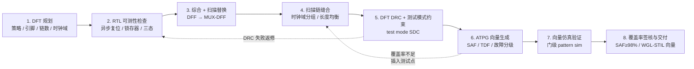
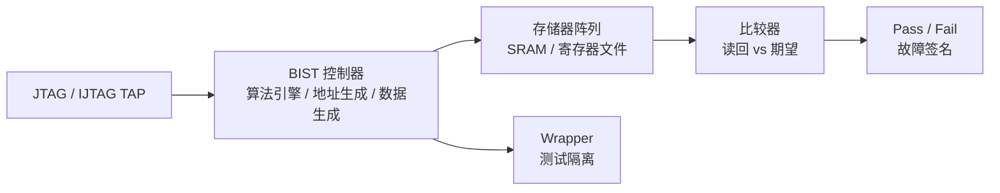

# 可测试性设计

可测试性设计（Design for Testability, DFT）是在芯片设计阶段主动嵌入测试结构的工程方法，其核心目标是在芯片制造完成后能够高效地检测出制造缺陷（Manufacturing Defect）。不可测的芯片是不可靠的——没有 DFT 结构的芯片依赖于外部 I/O 直接驱动内部节点做功能测试，这在现代深亚微米 SoC（系统级芯片）中包含数亿甚至数百亿晶体管的情况下已完全不可行。DFT 通过扫描链、内建自测试（BIST）和边界扫描等手段，系统性地解决了大规模数字 IC 的可控性（Controllability）和可观测性（Observability）问题。

## 原理

### 扫描链架构与插入流程

扫描链（Scan Chain）是 DFT 的核心技术，其基本思想是将设计中所有（或大部分）时序单元——即触发器（Flip-Flop, FF）——替换为可扫描的等效单元，并通过一条或多条串行链路将它们级联起来，使内部状态变为可控制和可观察。标准的扫描触发器是 MUX-DFF（多路选择器型 D 触发器）：在正常功能模式下（scan_enable = 0），数据输入端 D 连接到前一组合逻辑的输出；在扫描模式下（scan_enable = 1），扫描输入端 SI（Scan-In）被选中，来自前一级扫描触发器的 Q 输出串行送入。

扫描插入流程在综合之后进行，主要步骤包括：扫描替换（Scan Replacement）——将设计中的所有非扫描触发器替换为对应的扫描触发器（SDFF），通常由 DFT 工具（如 Synopsys DFT Compiler、Mentor Tessent）自动完成；扫描链连接（Scan Chain Stitching）——将扫描触发器按链串行连接，链的长度需要在测试时间（链越短越并行，测试时间越短）和测试引脚数量（链越多需要的 SI/SO 引脚越多）之间平衡；扫描链验证（Scan Chain Validation）——确认所有扫描链的连通性和移位功能正确，包括 DRC 检查（如复位信号是否与扫描模式冲突、三态总线是否有争用等）。

### DFT 实现流程（端到端八步）

"DFT 是如何做的"在工程上是一条从规划到交付的八步流水线，由 DFT 工程师执行（在华为系流程中属于 [[asic-flow/concepts/后端支持BES|后端支持（BES）]] 岗位的职责），时间窗口在综合之后、物理设计之前，但规划必须提前到架构阶段：

1. **DFT 规划（DFT Planning）**——架构阶段的策略决策：测试策略（全扫描/部分扫描、压缩方案选 EDT 还是 OPMISR+、MBIST 覆盖哪些存储器、JTAG 结构）、测试引脚预算（SI/SO 数量与测试时间的权衡：链越多越并行但引脚越多）、扫描链数量与每条链长度、时钟域分组（不同时钟域的触发器必须分链，禁止跨时钟域缝合）、测试模式定义（移位 Shift 与捕获 Capture 两种模式、at-speed 测试的捕获时钟方案——用 PLL 还是功能时钟分频）
2. **RTL 可测性检查（Pre-DFT DRC）**——在综合前后检查 RTL 的可测性问题：异步复位/置位（需扫描复位处理或 DFT 兼容单元）、锁存器、三态总线、门控时钟（ICG 在测试模式下必须旁路或透明化）、组合环路、多驱动。此阶段发现问题修复成本最低——拖到网表阶段修复代价成倍增加
3. **综合与扫描替换（Scan Replacement）**——DFT 工具（Synopsys DFT Compiler / Mentor Tessent / Cadence Genus dft）将功能触发器替换为扫描触发器（主流为 MUX-DFF：scan_enable 为 0 选功能数据 D，为 1 选扫描输入 SI），并自动推断与连接扫描端口（scan_in / scan_out / scan_enable）。铁律：**retiming 必须在扫描替换之前完成**——retiming 改变触发器的位置与数量会破坏扫描链的预期结构
4. **扫描链缝合（Scan Chain Stitching）**——把扫描单元按链串行连接：按时钟域分组、链长度均衡（最长链决定移位时间）、规避组合环路；工具自动完成，关键链可手动指定顺序。扫描链顺序会传导到 P&R 阶段影响布局走线，大设计可与物理实现协同规划
5. **DFT DRC 与测试模式约束（Test Mode Constraints）**——`dft_drc` 检查扫描结构在测试模式下的行为（时钟可控性、复位可控性、三态冲突、门控时钟透明化）；建立测试模式约束（Test Mode SDC：测试时钟定义、扫描使能 SE 的时序约束、at-speed 捕获时钟方案）——这是后续 ATPG 与向量时序验证的共同基础，约束质量直接决定测试可信度
6. **ATPG 向量生成（Pattern Generation）**——读入扫描网表与测试模式约束，按故障模型生成向量（固定型故障 SAF 与跳变故障 TDF 为主），执行故障分级（Detected / Undetectable / ATPG-Untestable / Not Detected）；覆盖率未达标时插入测试点（Test Point Insertion）或调整约束后重新生成，形成迭代回路
7. **向量仿真验证（Pattern Simulation）**——门级仿真执行 ATPG 向量确认其有效性（pattern sim：处理 X 传播、确认移位/捕获时序行为）；at-speed 向量还需做时序验证（与 STA 协同）。向量失效（X 污染、时序违例）需回溯修复测试结构或约束
8. **覆盖率签核与交付（Coverage Signoff & Delivery）**——覆盖率报告（消费电子典型目标 SAF ≥98%、TDF ≥85%-90%）、测试向量文件（WGL / STIL / VCD 格式）交付测试工程（ATE 部门）；扫描链 / BIST / JTAG 结构随网表交付后端（P&R 按扫描链顺序优化布局，CTS 满足测试时钟偏斜要求）



工具命令示例——Synopsys DFT Compiler 的扫描插入与 TetraMAX 的向量生成：

```tcl
# DFT Compiler：扫描插入与链缝合（TCL 语法，逐行说明）
set_dft_configuration -scan_style muxed_scan
# 设置扫描风格为 muxed_scan（MUX-DFF，业界主流）；另有 LSSD 等风格
set_dft_signal -view spec -type ScanClock -port clk -hookup_pin clk
# 声明测试时钟：扫描移位与捕获都基于该时钟运行
set_dft_signal -view spec -type ScanEnable -port scan_en -active_state 1
# 声明扫描使能：scan_en=1 进入移位模式，=0 进入功能/捕获模式
set_dft_signal -view spec -type ScanDataIn -port scan_in0
set_dft_signal -view spec -type ScanDataOut -port scan_out0
# 声明扫描数据输入/输出端口（SI / SO）
set_scan_configuration -chain_count 8 -clock_mixing mix_clocks
# 链配置：共 8 条扫描链；允许同域时钟混合，跨域时钟必须分链
insert_dft
# 执行扫描替换 + 链缝合 + 扫描端口连接（一条命令完成三件事）
dft_drc
# DFT 设计规则检查：验证时钟/复位/三态/门控时钟在测试模式下行为正确
```

```tcl
# TetraMAX：ATPG 向量生成（TCL 语法，逐行说明）
read_netlist scan_netlist.v      # 读入扫描网表（DFT 插入后的门级网表）
run_build_model top              # 构建故障模型：解析网表结构，建立内部电路表示
add_clocks 0 clk                 # 定义测试时钟（周期 0 表示由设计自行约束）
add_scan_enables 1 scan_en       # 定义扫描使能信号（高有效）
run_drc                          # ATPG 前 DRC：确认扫描结构可支持向量生成
add_faults -class stuck          # 加入故障集：固定型故障（stuck-at）
run_atpg -auto                   # 自动生成测试向量（含向量压缩与故障仿真）
report_summary                   # 报告覆盖率：检测故障数 / 总故障数 / 覆盖率百分比
write_patterns vectors.wgl -format wgl -replace
# 输出测试向量文件：WGL 格式（Waveform Generation Language，ATE 通用输入格式）
```

### ATPG 算法

自动测试向量生成（Automatic Test Pattern Generation, ATPG）的任务是为芯片的制造缺陷生成最小但最有效的测试向量集。ATPG 算法经过数十年的演进：

- D 算法（D-Algorithm, Roth 1966）：最早的系统化 ATPG 方法。引入复合逻辑值 D（表示正常电路中为 1、故障电路中为 0 的信号）和 D'（表示正常为 0 故障为 1），通过 D 驱动（D-Drive）将故障效应传播到可观测输出，再通过一致性操作（Consistency/J-Frontier）回推到输入端口确定需要的输入向量。D 算法在 XOR 树等扇出重汇聚结构上存在回溯爆炸的问题。
- PODEM（Path-Oriented Decision Making, Goel 1981）：将搜索空间从电路所有信号线缩小到仅主输入（Primary Inputs）。PODEM 每次决策只尝试设置某个主输入的值，然后通过逻辑仿真推演故障效应能否传播到输出。如果不能，则回溯并尝试其他主输入赋值。这种输入空间搜索策略大幅减少了回溯开销，使中等规模电路的 ATPG 变为实用。
- FAN 和 SOCRATES：在 PODEM 基础上引入蕴涵（Implication）引擎和启发式决策策略，进一步提升回溯效率。

### 测试压缩架构

随着设计规模指数增长，测试数据量和测试时间成为瓶颈。现代测试压缩技术通过片上解压缩硬件将少量顶层输入扩展为大量内部扫描链输入，同时通过片上压缩器将大量扫描链输出压缩为少量顶层输出。

- EDT（Embedded Deterministic Test, Mentor）：在片上嵌入一个环形解压缩器（Ring Generator），将少量外部扫描输入通过线性反馈移位寄存器（LFSR）网络解压为大量内部扫描通道。输出端使用掩码和压缩逻辑精选需要观测的响应位。
- OPMISR+（On-Product Multiple Input Signature Register, Synopsys）：输入端使用广播（Broadcast）和相移（Phase Shifting）网络扩展扫描带宽，输出端使用 MISR（多输入签名寄存器）将测试响应压缩为签名（Signature），仅需在测试结束时读出最终签名比对。

### 故障模型

ATPG 针对特定的故障模型生成测试向量：

- 固定型故障（Stuck-at Fault, SAF）：假设某根信号线永久固化为 0（SA0）或 1（SA1），是最基本的故障模型，覆盖率目标通常 98%+。SAF 能覆盖大多数静态制造缺陷，但无法捕获时序相关缺陷。
- 跳变故障（Transition Fault, TF）：假设某根信号线的 0 到 1 或 1 到 0 跳变太慢，导致目标寄存器无法在时钟周期内捕获正确值。跳变故障在深亚微米工艺中越来越重要，称为 at-speed test。
- 路径延迟故障（Path Delay Fault）：针对特定时序路径的累积延迟故障，需要两个向量对（vector pair）逐路径测试，覆盖率受限于物理路径数量。
- 桥接故障（Bridge Fault）：假设两根相邻信号线之间发生短路，需要物理相邻信息辅助 ATPG。

### ATPG 覆盖率与故障分级

ATPG 覆盖率（Test Coverage）是衡量 DFT 质量的核心指标，定义为已检测故障数占总可检测故障数的比例。ATPG 将故障分为几类：已检测（Detected, DT）、可能检测（Possibly Detected, PT）、不可检测（Undetectable, UD）、ATPG 不可测试（ATPG Untestable, AU）和未测试（Not Detected, ND）。消费电子通常要求固定型故障覆盖率大于等于 98%，汽车电子可能需要大于等于 99%；跳变故障覆盖率通常目标大于等于 85%-90%。提升覆盖率的关键手段包括增加测试点（Test Point）和优化扫描链架构。

### MBIST、LBIST 与边界扫描

- **MBIST（Memory Built-In Self-Test，存储器内建自测试）**：针对片上存储器（SRAM/DRAM/寄存器文件/缓存）的内建自测试结构。为什么需要它：存储器占据 SoC 面积的一半以上，单元密度极高、缺陷密度高，而存储阵列**无法用扫描链测试**——阵列的规则结构一旦插入扫描单元面积不可接受，且外部 ATE 直接测试需要海量向量与时间。MBIST 把测试控制器嵌入芯片内部，测试时无需外部设备全速驱动，还能支持 at-speed 全速测试捕获动态故障。

**MBIST 架构**：BIST 控制器（BIST Controller）由五部分组成——算法引擎（Algorithm Engine，按 March 算法生成地址序列与读写模式）、地址生成器（Address Generator）、数据生成器（Data Generator，生成背景数据模式如 0x00/0xFF/棋盘格）、比较器（Comparator，读出数据与期望值逐位比较）、故障寄存器（Fault Register，记录失败地址与签名）。控制器通过 JTAG（IEEE 1149.1）/IJTAG（IEEE 1687）接口触发与读出结果；测试模式下存储器与功能逻辑隔离（Wrapper），保证测试期间功能路径不干扰。



**March 算法**：March 测试由一系列"March 元素"组成——每个元素对阵列中每个地址按序执行一组读/写操作，元素之间地址走向可升序（↑）或降序（↓）。工业标准 **March C-**（10 个元素，复杂度 10N，N 为地址数）可检测全部常见存储器故障：

| 故障类型 | 说明 | March C- 覆盖 |
|:---|:---|:---|
| 固定型故障（SAF） | 单元恒为 0 或 1 | 覆盖 |
| 跳变故障（TF） | 单元 0→1 / 1→0 跳变失败 | 覆盖 |
| 耦合故障（CF） | 一单元翻转影响相邻单元 | 覆盖 |
| 地址解码故障（AF） | 地址译码器错误选择单元 | 覆盖 |
| 读破坏故障（RDF） | 读操作破坏存储值 | 覆盖 |

其他算法：March C+、March 17N（更高覆盖），棋盘格（Checkerboard，快速冒烟测试），GalPAT（复杂度 N²，仅用于失效分析诊断）。**March 测试必须 at-speed 全速运行**才能覆盖时序相关的动态故障——低速测试会漏掉读破坏与跳变类缺陷。

**MBIST 修复（BISR, Built-In Self-Repair）**：测试发现故障单元后，利用冗余行/列（Redundant Row/Column）替换故障单元——流程为：测试 → 故障单元地址记录（Repair Register）→ 熔丝/寄存器配置重映射 → 再测试验证。修复信息存于一次性可编程熔丝（eFuse/OTP）或可重配置寄存器（支持现场再修复）。BISR 直接提升存储器良率，是带大缓存/嵌入式存储产品的标准配置。

**MBIST 集成流程**：MBIST 与扫描测试分工互补——逻辑用扫描链 + ATPG，存储器用 MBIST。工具（Tessent MemoryBIST、DFT MAX、Cadence Modus）在综合阶段自动插入 Wrapper、生成 BIST 控制器并连接 JTAG/IJTAG 接口；测试执行由 ATE 通过 JTAG 触发，BIST 全速运行后读回 Pass/Fail 签名；控制器面积开销通常为存储器面积的 5%-10%。MBIST 支持**离线（Off-line）与在线**（On-line）两种模式——离线测试在功能暂停时执行，在线测试与功能运行并发，适用于汽车电子（ISO 26262）的周期性自检场景。
- LBIST（Logic Built-In Self-Test）：使用片上 PRPG（伪随机序列生成器）产生测试向量，通过扫描链加载，再用 MISR 压缩响应。LBIST 的优势在于上电自检（Power-On Self-Test），无需外部 ATE 设备。现代 LBIST 采用重新播种（Reseeding）策略：在一个测试序列结束后加载新种子值，重复多轮直到覆盖率饱和。MISR 压缩虽是有损的（存在别名概率），但使用 32 位或 64 位 MISR 可将别名概率降至 2^{-32} 以下，在实际工程中可忽略。测试点插入（Test Point Insertion）在 LBIST 流程中对随机困难故障节点插入控制点（Control Point, 强制为 1/0）和观测点（Observe Point, 引出到扫描输出）以提升覆盖率。
- JTAG/IEEE 1149.1 边界扫描（Boundary Scan）：在芯片的 I/O 焊盘和内部核心逻辑之间插入边界扫描单元（BSC），通过 TAP 控制器（Test Access Port）提供的 TDI、TDO、TCK、TMS 和可选的 TRST 五线接口实现对芯片间互连的测试。边界扫描主要用于 PCB 板级互连测试和芯片配置。TAP 控制器的 16 状态 FSM 支持 EXTEST（外部互连测试）、INTEST（内部逻辑测试）、SAMPLE/PRELOAD、BYPASS 和 IDCODE 等强制指令。
- IEEE 1687 IJTAG（Internal JTAG）：将 JTAG 的控制范型扩展到芯片内部，通过分段插入链路（Segment Insertion Bit, SIB）在网络化的仪器接口之间建立动态访问路径，实现对外设 IP 中嵌入的测试和调试仪器的按需访问。SIB 的层次化结构允许对深层嵌套 IP 的仪器进行选择性访问——关闭不需要访问的分支以节约扫描路径长度和测试时间。
- IEEE 1500 核心测试（Core Test）：为大尺寸 SoC 中的 IP 核心提供标准化的测试壳（Test Wrapper）和控制接口，使第三方 IP 的嵌入式测试能通过统一的 Wrapper 串行端口访问而不依赖外部 I/O。Wrapper Boundary Register（WBR）在核心的输入输出端口分别提供隔离和串行化能力。

### 低功耗 DFT 与测试模式管理

测试模式下的功耗管理是现代 DFT 设计的重要课题。**扫描移位功耗分析**表明移位模式下的平均翻转率可达功能模式的 3-5 倍——因为随机测试向量使所有扫描触发器在每个移位周期都翻转。**分段移位**（Segmented Shift）将长扫描链分为多个短段，每次仅激活一个段进行移位，其余段保持静止——可以将移位功耗降低 50%-70%，但增加总移位周期数。**低功耗 ATPG**（Low-Power ATPG）在生成测试向量时加入功耗约束——优化向量顺序使相邻向量的 Hamming 距离最小化，从而减少移位翻转次数。测试时钟控制（Test Clock Gating）在不需要测试的模块中关断测试时钟以减少不必要的翻转。

### DFT 签核与 ATE 接口

DFT 签核确认测试结构可被自动测试设备（Automatic Test Equipment, ATE）正确执行。**测试向量验证**（Test Pattern Validation）在 Signoff STA 环境中对所有 at-speed 测试向量执行时序验证——确保每个测试周期的 SI（Scan-In）和 SE（Scan Enable）信号在规定的时序窗口内到达目标寄存器。**ATE 资源规划**（ATE Resource Planning）考虑测试仪的通道数量、频率限制和向量存储深度——如果扫描压缩不充分，ATE 存储容量可能无法容纳完整测试向量集。**测试覆盖率签核报告**（Test Coverage Signoff Report）列出所有未检测故障的分类和理由——如 "AU"（ATPG Untestable）类别中的故障需要设计者逐一审查确认其"不可测"属性是真实的设计特征而非测试结构的缺陷。测试成本模型（Test Cost Model）预测从 ATE 测试时间换算的单芯片测试成本——在 98% 覆盖率之上每增加 1% 覆盖率可能使测试时间增加 20%-40%，测试成本优化是覆盖率目标设定的现实约束。


### JTAG 与边界扫描（IEEE 1149.1）

JTAG（Joint Test Action Group，联合测试行动组，IEEE 1149.1 标准）与内部扫描链解决**不同层次**的测试问题：内部扫描链（见上文扫描替换）测试芯片内部的组合/时序逻辑故障；JTAG 边界扫描测试**板级互连**——多颗芯片焊上 PCB 后，引脚间的焊接开路/短路、芯片间连线正确性，内部测试手段覆盖不到。

**TAP 状态机与四根信号线**：JTAG 的核心是测试访问端口（Test Access Port, TAP）——一个 16 状态的同步状态机，由 TCK（时钟）与 TMS（模式选择，逐拍驱动状态转移）控制，TDI/TDO 串行移入移出数据。16 状态中关键路径：Test-Logic-Reset（复位态，TMS 连续 5 拍 1 必达）→ Run-Test/Idle → Select-DR-Scan / Select-IR-Scan → Capture / Shift / Exit / Update。**指令寄存器（IR）与数据寄存器（DR）双通道**：先移入指令选择要访问的数据寄存器，再对该 DR 做数据移位——所有操作都是"指令选择 + 数据移位"两步曲。

**指令集**：BYPASS（旁路：1 位寄存器直通，链上多芯片时只对目标芯片操作）、IDCODE（读出芯片识别码）、SAMPLE/PRELOAD（采样引脚值/预装边界寄存器——不影响内核运行）、EXTEST（外测试：隔离内核、由边界寄存器驱动引脚——板级互连测试的主指令）、INTEST（内测试：隔离引脚、由内核驱动）。**边界扫描单元**：每个功能引脚与内核之间串入一个边界扫描单元（Boundary Scan Cell）——正常模式透明直通，测试模式切断内核、由移位链驱动或采样引脚电平。

**与内部扫描链的区别**：内部扫描链测试芯片内的逻辑故障（ATPG 生成向量、故障覆盖率指标）；JTAG 边界扫描测试芯片之间的互连（焊接质量、连线正确性）——两者串行协议相似（TCK/TMS 状态机）但被测对象完全不同。JTAG 的附加应用：片上调试（On-Chip Debugger 经 JTAG 访问内部寄存器与存储）、板级 Flash 编程、芯片 ID 识别——IEEE 1149.1 已成为芯片测试与调试的统一接口。

## 关键要点

- **扫描链用测试时间换覆盖率**：扫描链通过 MUX-DFF 将内部触发器串行化为可控可观察状态，本质是用测试时间换测试覆盖率，可观测性从接近零提升到接近 100%
- **JTAG 与内部扫描链层次不同**：内部扫描测芯片内逻辑故障（ATPG 覆盖率），JTAG 边界扫描测板级互连（EXTEST 隔离内核驱动引脚）——TAP 16 状态机 + 指令/数据双寄存器
- **PODEM 缩减搜索空间至主输入**：ATPG 从 D 算法到 PODEM 的关键突破是将搜索空间从全部信号线缩减到仅主输入，使测试向量生成从 NP 问题变为可实用
- **测试压缩降低数据量 50-100 倍**：测试压缩（EDT/OPMISR+）是现代 DFT 的必备技术，不压缩时测试数据量可达数百 Gbits，压缩后通常降低 50-100 倍，覆盖率损失通常 <0.5%
- **跳变故障 at-speed 测试不可忽略**：跳变故障（Transition Fault）的 at-speed 测试在深亚微米工艺中不可忽略，固定型故障覆盖率再高也无法保证芯片在目标频率下正常工作
- **March C- 算法覆盖存储器故障**：MBIST 的 March C- 算法（10 次全阵列遍历）覆盖了存储器单元间的耦合故障和寻址故障，是现代 SoC 中所有片上存储器的标准测试手段；BIST 控制器面积约为存储器面积的 5%-10%
- **MBIST 与扫描测试分工互补**：逻辑用扫描链 + ATPG，存储器用 MBIST（阵列无法扫描）；MBIST 支持 at-speed 全速测试与在线/离线双模式（汽车 ISO 26262 周期性自检）
- **BISR 用冗余行/列换良率**：MBIST 修复（Built-In Self-Repair）把故障单元地址记录到 Repair Register，通过冗余行/列重映射替换，修复信息存于 eFuse/OTP 或可重配置寄存器
- **JTAG TAP 控制器 16 状态 FSM**：JTAG 边界扫描的 TAP 控制器使用 16 状态 FSM，EXTEST 指令驱动互连测试，INTEST 可辅助内部逻辑测试，IDCODE 读取芯片标识
- **DFT 增加面积 2%-5% 和延迟 10-30ps**：DFT 对功能设计的影响包括增加面积（通常 2%-5%）、增加延迟（扫描 MUX 在功能路径上增加约 10-30ps）、需要额外的测试时钟和复位控制
- **DFT DRC 检查易被忽视但致命**：扫描链的 DFT DRC 检查是易被忽视但致命的环节，未处理的异步复位、三态总线冲突、门控时钟非透明化都会导致测试向量失效
- **IJTAG SIB 实现分级仪器访问**：IEEE 1687 IJTAG 通过 SIB 实现分级仪器访问，克服了传统 JTAG 扁平化访问在大型 SoC 中的可扩展性问题
- **LBIST 需测试点插入解决随机困难**：LBIST 的伪随机向量覆盖率受随机困难（Random Resistant）故障制约，重新播种和测试点插入（Control/Observe Point）是标准解决方案
- **扫描移位翻转率 3-5 倍于功能模式**：扫描测试的功耗管理（Low-Power DFT）日益重要，扫描移位模式的翻转率可达功能模式的 3-5 倍，需要专用的分段移位（Segmented Shift）和低功耗 ATPG 向量生成
- **扫描链诊断联合定位缺陷**：基于结构测试（Structural Test）的故障诊断日益依赖芯片内嵌的故障定位能力，扫描链诊断（Scan Chain Diagnosis）通过逻辑分析和物理失效分析联合定位缺陷
- **分段移位降低功耗 50%-70%**：分段移位（Segmented Shift）将长链分为多段逐段激活，移位功耗降低 50%-70%，但增加移位周期数和测试时间
- **低功耗 ATPG 最小化 Hamming 距离**：低功耗 ATPG 优化向量顺序使相邻向量的 Hamming 距离最小化，直接减少移位翻转次数
- **覆盖率边际提升成本高昂**：测试成本模型预测从 ATE 测试时间换算的单芯测试成本，覆盖率从 98% 提升至 99% 可能使测试时间增加 20%-40%
- **ATE 通道与存储深度规划**：ATE 资源规划考虑测试仪通道数量（通常 256-1024 个数字通道）和向量存储深度（128M-512M 向量/通道）
- **IEEE 1500 Wrapper 标准化 IP 测试**：IEEE 1500 Core Test Wrapper 使第三方 IP 的嵌入式测试可通过标准化 WBR 接口访问，是大规模 SoC 混合 DFT 策略的基础
- **DFT 端到端八步流程**：规划 → RTL 可测性检查 → 扫描替换 → 链缝合 → DFT DRC/测试模式约束 → ATPG → 向量仿真 → 覆盖率签核交付；DFT DRC 失败返修到 RTL 检查、覆盖率不足回退到链缝合/测试点插入，形成迭代回路
- **测试模式约束是 at-speed 测试的基石**：Test Mode SDC 定义测试时钟、SE 时序与捕获时钟方案（PLL 或功能时钟），其质量决定 ATPG 与时序验证的可信度
- **retiming 必须在扫描替换前完成**：retiming 改变触发器的位置与数量会破坏扫描链预期结构，综合与 DFT 的命令顺序是硬性工程约束

## 与其他概念的关系

- [[asic-flow/concepts/逻辑综合|逻辑综合（Synthesis）]] — DFT 插入通常在综合之后、物理设计之前进行，综合工具可以执行扫描替换；综合阶段必须为扫描 MUX 预留功能路径的时序裕度
- [[asic-flow/concepts/时钟树综合|时钟树综合（CTS）]] — 扫描模式下时钟树必须满足严格的偏斜要求，否则 at-speed 测试的大量同时翻转会导致 IR 压降失效；扫描时钟树和功能时钟树共享物理走线但负载条件不同
- [[asic-flow/concepts/签核|签核（Signoff）]] — DFT 覆盖率签核（如 98% SAF + 85% TDF）是流片前的硬性指标，测试向量也需要签核级验证；ATPG 向量需要经过时序签核验证确保 at-speed 测试在芯片频率下可执行
- [[asic-flow/concepts/功耗分析|功耗分析（Power Analysis）]] — 扫描移位期间的功耗远高于功能模式（翻转率 3-5 倍），需要专门的测试功耗分析和降低策略；低功耗 ATPG 在 IR 压降约束下优化向量序列
- [[cross-domain/concepts/低功耗设计|跨领域 — 低功耗设计]] — 电源门控模块在测试模式下需要特殊处理，保持寄存器和隔离单元影响 DFT 策略；UPF 电源意图描述中的电源域定义决定 DFT 控制信号的插入位置
- [[asic-flow/concepts/物理验证|物理验证（Physical Verification）]] — DFT 结构（如扫描链、JTAG TAP 控制器、BIST 控制器）在版图中必须通过 DRC/LVS 验证——测试 IO 焊盘的 ESD 保护结构是物理验证的关键检查项
- [[asic-flow/concepts/静态时序分析|静态时序分析（STA）]] — at-speed 测试向量的时序签核需要 STA 确认所有测试周期的信号满足建立/保持时间——测试时序违例导致测试向量在 ATE 上失败

