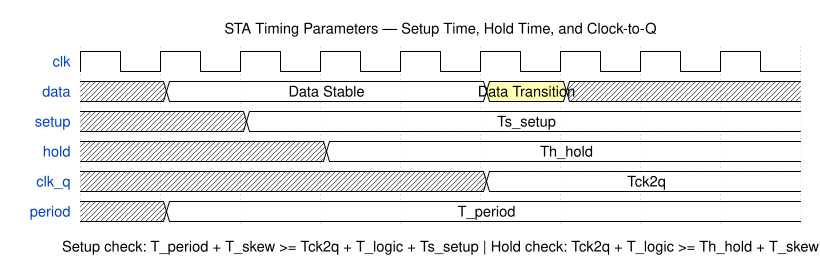

# 静态时序分析

静态时序分析（Static Timing Analysis, STA）是数字 IC 设计签署（Signoff）的核心方法。与动态仿真不同，STA 不需要输入测试向量（Test Vector），而是穷举式地分析芯片中所有可能的时序路径，在 PVT（Process-Voltage-Temperature）最坏条件下验证整个设计的时序是否满足要求。STA 的速度比门级仿真快数个数量级，并且提供 100% 的路径覆盖率，是现代 ASIC 流程中不可或缺的时序验证手段。

## 原理

### 建立时间与保持时间检查

时序检查的核心是建立时间（Setup Time）和保持时间（Hold Time）验证。建立时间要求数据信号必须在时钟有效沿（Capture Edge）之前的一段最小时间内稳定——这段时间就是寄存器的建立时间要求（T_setup）。如果数据到达太晚，寄存器可能采样到错误的值或进入亚稳态。保持时间要求数据信号在时钟有效沿之后的一段最小时间内必须保持稳定——这段时间就是寄存器的保持时间要求（T_hold）。如果数据变化太早（在上一个值被可靠锁存之前就翻转），寄存器同样可能采样失败。

STA 工具（如 Synopsys PrimeTime、Cadence Tempus）通过计算以下不等式来验证每条路径。建立时间检查：T_launch + T_clk2q_max + T_comb_max + T_setup < T_capture + T_period - T_uncertainty_setup，即从发射时钟沿经发射寄存器时钟到输出延迟（T_clk2q）、组合逻辑最大延迟（T_comb_max）、再加建立时间要求，必须小于捕获时钟沿的时间。保持时间检查：T_launch + T_clk2q_min + T_comb_min > T_capture + T_hold + T_uncertainty_hold，即从发射时钟沿经最小延迟的数据路径，必须晚于捕获寄存器的保持时间要求。

建立违例（Setup Violation）表示路径太慢，通常通过降低频率、减少组合逻辑级数或增大驱动能力来修复。保持违例（Hold Violation）表示路径太快（数据在新值被锁存前就冲到了），通常通过插入延迟单元或增加 buffer 来修复。建立和保持的修复手段存在矛盾——增加延迟能修保持但可能恶化建立，需要在二者之间平衡。

#### 建立时间与保持时间的物理根源

建立时间和保持时间的存在并非人为定义的设计规则，而是 D 触发器（D Flip-Flop）内部主从锁存器结构的物理必然。时钟信号在到达主锁存器和从锁存器的传输门（Transmission Gate）栅极时存在一个有限的过渡时间（Transition Time），在这段时间内传输门的导通电阻从关断态的高阻逐渐过渡到导通态的低阻——D 输入信号必须在此期间维持稳定，使采样节点有充分的充放电时间建立到正确的电压电平。建立时间本质上对应主锁存器采样节点对 D 输入变化的充电/放电响应时间，保持时间对应时钟传输门在关断过程中 D 输入仍需保持的时间窗口（防止新数据"穿透"尚未完全关断的传输门而覆盖已采样的旧值）。

#### 恢复时间和移除时间

恢复时间（Recovery Time, $t_{recovery}$）和移除时间（Removal Time, $t_{removal}$）是异步复位/置位引脚相对于时钟沿的时序约束，与数据引脚的建立/保持时间在概念上完全对偶。恢复时间：在时钟有效沿到达之前，异步复位/置位信号必须从有效状态释放（Deassert）的最短时间——类似于建立时间。移除时间：在时钟有效沿到达之后，异步复位/置位信号必须继续保持释放状态的最短时间——类似于保持时间。Recovery/Removal 违例与 Setup/Hold 违例一样会导致触发器进入亚稳态——这正是异步复位释放需要复位同步器的物理原因。

#### 保持违例比建立违例更难修复的原因

保持违例的修复难度本质上源于它与频率无关的物理性质。建立违例可以通过降低时钟频率（增大周期）来直接解决——周期越大，建立时间约束越宽松。但保持违例方程 $t_{clk2q} + t_{comb\_min} \geq t_{hold}$ 中没有任何频率相关项——无论时钟频率多低，最短路径延迟必须大于保持时间要求。修复保持违例的唯一方法是增加数据通路的最小延迟（插入缓冲器/延迟单元），但缓冲器的延迟随 PVT 变化而波动——在最慢工艺角（SS）下插入的缓冲器在最快角（FF）下可能延迟不足，导致同一路径在不同工艺角下交替出现建立和保持违例，形成"跷跷板"困境。

#### 时钟偏斜对建立和保持检查的影响

时钟偏斜（Clock Skew）对不同时序检查产生截然相反的影响。对建立时间检查：捕获时钟路径的偏斜（迟到）等效于收紧约束——接收时钟晚到意味着接收寄存器"看到"的捕获沿推迟，数据必须更早到达以满足建立时间要求。发射时钟路径的偏斜（迟到）等效于放松约束——发射时钟晚到意味着数据出发更晚，对建立有利。总结：建立时间检查受益于正偏斜（发射时钟迟于捕获时钟），受害于负偏斜（捕获时钟迟于发射时钟）。对保持时间检查：正偏斜使发射时钟晚到，导致新数据更晚才出发，旧数据在接收端保持更久——有利于满足保持时间。负偏斜使捕获时钟晚到，旧数据消失更早——不利于保持。建立和保持对偏斜的需求恰好相反——这使时钟树设计成为时序收敛中最精妙的权衡艺术。

### 建立时间余量与保持时间余量公式（Slack Calculation）

时序余量（Timing Slack）是 STA 中最核心的量化指标，表示路径实际延迟与约束要求之间的裕量。Slack 为正表示时序满足，Slack 为负表示时序违例。建立时间余量（Setup Slack）和保持时间余量（Hold Slack）使用不同的计算路径和约束条件。

#### 建立时间余量

**Setup Slack** 衡量数据是否能及时到达捕获寄存器以满足其建立时间要求。建立时间检查在最慢路径条件（SS Corner / Slow Corner）下进行：

$$\text{Setup Slack} = T_{\text{required\_time}} - T_{\text{arrival\_time}}$$

其中：

- **要求时间（Required Time）**：$T_{\text{required}} = T_{\text{capture}} + T_{\text{period}} - T_{\text{setup}} - T_{\text{uncertainty\_setup}}$
- **到达时间（Arrival Time）**：$T_{\text{arrival}} = T_{\text{launch}} + T_{\text{clk2q\_max}} + T_{\text{comb\_max}}$

各参数含义：
- $T_{\text{launch}}$：发射时钟沿到达发射寄存器时钟端的时间
- $T_{\text{capture}}$：捕获时钟沿到达捕获寄存器时钟端的时间
- $T_{\text{clk2q\_max}}$：发射寄存器从时钟沿到数据输出（Q端）的最大延迟
- $T_{\text{comb\_max}}$：发射寄存器和捕获寄存器之间所有组合逻辑和互连线的最大延迟
- $T_{\text{period}}$：时钟周期
- $T_{\text{setup}}$：捕获寄存器的建立时间要求（来自 .lib 库文件）
- $T_{\text{uncertainty\_setup}}$：建立时间检查的时钟不确定性余量（覆盖抖动、偏斜和额外设计余量）

展开公式：

$$\text{Setup Slack} = (T_{\text{capture}} + T_{\text{period}} - T_{\text{setup}} - T_{\text{uncertainty\_setup}}) - (T_{\text{launch}} + T_{\text{clk2q\_max}} + T_{\text{comb\_max}})$$

对于理想时钟（$T_{\text{launch}} = T_{\text{capture}} = 0$），简化为：

$$\text{Setup Slack} = T_{\text{period}} - T_{\text{setup}} - T_{\text{uncertainty\_setup}} - T_{\text{clk2q\_max}} - T_{\text{comb\_max}}$$

**Setup Slack 为负的修复手段**（数据到达太晚）：降低时钟频率（增大 $T_{\text{period}}$）、减少组合逻辑级数（减小 $T_{\text{comb\_max}}$）、增大驱动能力（up-size 门，减小门延迟）、调整寄存器位置以缩短线延迟、使用 Useful Skew（延迟捕获时钟）。

#### 保持时间余量

**Hold Slack** 衡量数据在捕获时钟沿之后是否保持足够长的时间。保持时间检查在最快速路径条件（FF Corner / Fast Corner）下进行：

$$\text{Hold Slack} = T_{\text{arrival\_time}} - T_{\text{required\_time}}$$

其中：

- **到达时间（Arrival Time）**：$T_{\text{arrival}} = T_{\text{launch}} + T_{\text{clk2q\_min}} + T_{\text{comb\_min}}$
- **要求时间（Required Time）**：$T_{\text{required}} = T_{\text{capture}} + T_{\text{hold}} + T_{\text{uncertainty\_hold}}$

各参数含义：
- $T_{\text{clk2q\_min}}$：发射寄存器从时钟沿到 Q 端的最小延迟（最快情况）
- $T_{\text{comb\_min}}$：发射和捕获寄存器间组合逻辑和互连线的最小延迟
- $T_{\text{hold}}$：捕获寄存器的保持时间要求
- $T_{\text{uncertainty\_hold}}$：保持时间检查的时钟不确定性

展开公式：

$$\text{Hold Slack} = (T_{\text{launch}} + T_{\text{clk2q\_min}} + T_{\text{comb\_min}}) - (T_{\text{capture}} + T_{\text{hold}} + T_{\text{uncertainty\_hold}})$$

对于理想时钟（$T_{\text{launch}} = T_{\text{capture}} = 0$），简化为：

$$\text{Hold Slack} = T_{\text{clk2q\_min}} + T_{\text{comb\_min}} - T_{\text{hold}} - T_{\text{uncertainty\_hold}}$$

**Hold Slack 为负的修复手段**（数据到达太快/消失太早）：增加组合逻辑延迟（插入 buffer/delay cell）、增加互连线长度、使用 Useful Skew（延迟捕获时钟或提前发射时钟）。

#### Setup 与 Hold 的关键区别

| 特性 | Setup Slack | Hold Slack |
|:---|:---|:---|
| 检查条件 | 最慢路径（SS Corner） | 最快速路径（FF Corner） |
| 与时钟频率的关系 | 直接相关——频率越高 Setup Slack 越小 | **与频率无关**——只取决于最小延迟路径 |
| 违例修复方向 | 减小数据路径延迟 | **增加**数据路径延迟 |
| 修复矛盾 | 减少逻辑 = 恶化 Hold | 增加延迟 = 恶化 Setup |

Setup 和 Hold 修复手段相互矛盾这一事实，是 STA 收敛中最核心的困难——在修 Setup 的同时可能引入 Hold 违例，反之亦然。这要求 STA 工程师在两种约束之间寻找平衡点。

### 时序路径分类

STA 按路径的起点和终点分为四种类型：

1. 输入到寄存器（in2reg, Input-to-Register）：起点是芯片的输入端口，终点是内部寄存器的数据输入端。这类路径的时序约束来自 `set_input_delay`，代表了芯片外部上游电路的时序预算。
2. 寄存器到寄存器（reg2reg, Register-to-Register）：起点是发射寄存器的时钟端（经 clk2q 延迟），终点是捕获寄存器的数据输入端。这是占比最大的路径类型，时序受时钟周期和组合逻辑延迟的限制。
3. 寄存器到输出（reg2out, Register-to-Output）：起点是内部寄存器的时钟端，终点是芯片的输出端口。时序约束来自 `set_output_delay`，代表了芯片外部下游电路的建立时间要求。
4. 输入到输出（in2out, Input-to-Output）：起点是输入端口，终点是输出端口，路径中不经过任何寄存器。纯组合逻辑路径需要在设定的输入输出延迟约束下完成传输。

### 时钟定义与约束

准确的时钟定义是 STA 的基础。`create_clock` 定义一个主时钟（Master Clock），指定其名称、周期和波形。`create_generated_clock` 定义由主时钟派生的时钟（如经过分频器产生的二分频时钟），需要指定其源时钟（`-source`）、分频/倍频比例和生成路径上的主触发器。生成时钟的定义至关重要——定义错误会导致整片逻辑的时序计算偏移了实际的锁存触发沿。

时钟延迟（Clock Latency）分为源延迟（Source Latency，芯片外部的时钟网络延迟）和网络延迟（Network Latency，芯片内部的时钟树延迟）。在综合阶段，时钟树尚未实现，网络延迟以模型的估算值代入；在 CTS 之后，可反标（Back-annotate）真实的时钟树延迟。时钟不确定性（Clock Uncertainty）是 STA 中人为施加的余量，用于覆盖抖动（Jitter）、偏斜（Skew）和额外设计余量。建立时间检查使用较大的不确定性，保持时间检查使用较小的不确定性。

#### 时钟抖动与时钟偏斜的深入分析

时钟抖动（Clock Jitter）和时钟偏斜（Clock Skew）虽然常被并列提及，但它们是本质上不同的两个概念，分别对应时序不确定性的时间维度和空间维度。

**时钟抖动（Clock Jitter）**是时钟周期的逐周期时间不确定性——理想时钟的每个周期应为恒定值 $T$，但实际时钟的第 $n$ 个周期 $T_n$ 在 $T$ 附近随机波动。抖动的物理来源包括：锁相环（Phase-Locked Loop, PLL）的相位噪声（Phase Noise）——振荡器内部器件的热噪声和闪烁噪声导致输出相位随机漂移；电源噪声耦合（Power Supply Noise）——电源轨上的波动通过 PLL 的压控振荡器（Voltage-Controlled Oscillator, VCO）或时钟缓冲器的延迟-电压敏感性转化为时钟沿的时序抖动；以及时钟缓冲器链中各级缓冲器的随机噪声累积。周期抖动（Cycle-to-Cycle Jitter）定义为相邻周期的周期差 $\Delta T_n = T_{n+1} - T_n$——这是与建立/保持检查最相关的抖动度量。长期抖动（Long-Term Jitter / N-Period Jitter）定义为 $N$ 个周期累计时间与理想值 $N \cdot T$ 的偏差，在源同步接口（如 DDR）的时序分析中占主导地位。

**时钟偏斜（Clock Skew）**是同一时钟信号到达芯片上不同寄存器引脚的时间差——本质上是空间分布的延迟不均匀。偏斜的来源是时钟树中各级缓冲器的延迟差异、互连线长度和负载电容的空间差异、以及 OCV 导致的同一缓冲器在不同位置的制造偏差。全局偏斜（Global Skew）是整个芯片上时钟到达时间的最大差值——CTS 的首要优化目标。局部偏斜（Local Skew）是物理上相邻的寄存器之间的时钟到达差——对 reg2reg 时序路径影响最大，因为发射和捕获寄存器通常物理相邻。有用偏斜（Useful Skew）是有意的时钟偏斜控制策略：使发射寄存器时钟略早或捕获寄存器时钟略晚，将时序预算从松弛路径"借"给紧张路径。

抖动和偏斜的交互效应：偏斜是确定性的空间差异（可被 STA 提取和分析），抖动是随机的时间不确定性（需以 Clock Uncertainty 余量的形式覆盖）。在高频设计（>1 GHz）中，抖动的占比超过偏斜成为时序不确定性的主要分量——因为周期本身变短，抖动绝对值虽然不变但相对比例增大。多周期路径中抖动对建立检查的影响需要特殊处理：默认的建立检查使用单周期不确定性，而多周期路径中抖动在 $N$ 个周期内会累积（$N$ 周期抖动 > 单周期抖动），需要在多周期约束中使用适当的 UNCERTAINTY 值。

### 时序降额与 MCMM 分析

随着工艺缩小，工艺偏差（Process Variation）导致芯片上不同位置的晶体管延迟不完全相同。片上偏差（On-Chip Variation, OCV）通过设置统一的降额因子（Derating Factor）来处理——例如对建立时间的发射路径增加 10% 延迟、捕获路径减少 10% 延迟。然而统一降额过于悲观，先进片上偏差（Advanced OCV, AOCV）根据路径深度和物理距离使用可变的降额因子，更为精确。

多角多模（Multi-Corner Multi-Mode, MCMM）分析是现代 STA 的基本要求。不同的工作模式（Function Mode、Test Mode、Sleep Mode）和不同的 PVT 工艺角（如 SS/0.9V/125C 最慢角、FF/1.1V/-40C 最快角）需要分别进行 STA。建立时间在最慢角和最快时钟下检查，保持时间在最快角和最慢时钟下检查。一个典型设计可能有数十个角（Corner），每个角都有独立的时序报告需要分析。

### 路径组与异常路径约束

STA 工具默认将所有与同一时钟相关的 reg2reg 路径归类为一个路径组（Path Group）。路径组的划分对于时序优化至关重要——工具在每个路径组内独立地对最差路径进行排序和优化。除了默认的时钟分组外，用户还可以通过 `group_path` 命令创建自定义路径组（如 DDR 接口路径组），使关键接口的时序分析独立于普通逻辑。

异常路径约束（Timing Exceptions）用于标注不适用默认单周期时序检查的路径。伪路径（False Path, `set_false_path`）标注从逻辑上不可能被同时激活的路径，如跨异步时钟域的路径（在未同步化的前提下）和静态配置信号的路径。多周期路径（Multi-Cycle Path, `set_multicycle_path`）标注数据需要多个时钟周期才能到达的路径——例如乘法器输出可能允许 2 个周期到达，则其建立时间检查在 2 个周期后进行，保持时间检查的位置也需要通过 `-hold` 选项相应调整。

### STA 分析流程与报告解读

典型的 STA 分析分为三个阶段：首先执行 `read_parasitics` 读入 SPEF（Standard Parasitic Exchange Format）反标寄生参数；然后执行 `update_timing` 计算整个设计的时序；最后通过 `report_timing` 生成指定路径的详细时序报告。

理解时序报告的每一行是 STA 工程师的基本功。一条典型的建立路径报告中包含：起点（Startpoint）和终点（Endpoint）信息、路径类型（Path Group）、路径延迟分解（从发射时钟沿到数据到达的逐级门延迟和线延迟明细）、时钟网络的延迟（包括源延迟和网络延迟）、库建立时间要求、以及最终的 Slack 值。`report_constraint` 可以看到所有违例的分布，`report_analysis_coverage` 可以检查时序分析的覆盖率——未覆盖的检查点（如未约束的端口、三态使能信号等）是潜在的时序风险。

### 串扰延迟分析与 SI 时序

在深亚微米工艺中，信号完整性（Signal Integrity, SI）对时序的影响不可忽略。**串扰延迟（Crosstalk Delay）**是由于相邻线网之间的耦合电容引起的——当攻击线网（Aggressor）和受害线网（Victim）同时翻转时，根据翻转方向同向或反向，受害线的有效延迟减小（Speed-Up）或增大（Slow-Down）。STA 的 SI 分析需要：从 SPEF 中提取耦合电容；通过时序窗口分析（Timing Window Analysis）确定攻击和受害的翻转时间是否重叠——只有重叠时间窗口内的翻转才计入串扰；在此基础上对受影响路径的延迟进行增量调整。最悲观的 SI 分析假设所有相邻线网同时反方向翻转（最大 Slow-Down），而基于时序窗口的过滤分析通常能将假串扰违例减少 70%-90%。PrimeTime SI 和 Tempus SI 均内置了时序窗口感知的串扰分析引擎，是先进节点（28nm 及以下）签核的标准要求。

### CRPR 与时钟路径悲观去除

**时钟路径悲观去除（Clock Reconvergence Pessimism Removal, CRPR）**是 STA 中的一项关键技术，用于消除对公共时钟路径的过度悲观建模。在 OCV 分析中，发射时钟和捕获时钟共享一部分公共路径（如从 PLL 到最后一个时钟分支点的路径），OCV 将发射路径和捕获路径分别施加独立的降额因子——这意味着公共路径上被施加了两次互反的降额（发射侧 +10%，捕获侧 -10%），在公共路径部分产生了实际上不可能的 20% 偏差。CRPR 识别发射时钟和捕获时钟的公共部分，在 Slack 计算中扣除这部分过度悲观——通常可回收 20-50ps 的时序预算，在时序紧张的高频设计中至关重要。PrimeTime 的 `set timing_remove_clock_reconvergence_pessimism` 自动执行 CRPR 计算。CRPR 的精度取决于时钟路径上每个节点的精确延迟计算和公共路径划分的正确性——对复杂时钟结构（如多级门控、时钟 MUX 切换）需要仔细验证公共路径的定义。

### 门控时钟与生成时钟的 STA 考量

门控时钟（Gated Clock）和生成时钟（Generated Clock）给 STA 带来不同于主时钟的分析复杂度。**时钟门控使能路径（Clock Gating Enable Path）**是门控时钟结构中的关键时序检查——门控使能信号必须在时钟有效沿前到达 ICG 的使能输入端，其到达时间约束为 $T_{period} - T_{setup\_en}$，这里的 $T_{setup\_en}$ 是 ICG 的使能建立时间（通常比触发器数据建立时间要求更严格，约 1.2-1.5 倍）。门控使能违例导致时钟毛刺（Glitch）或时钟脉冲截断——STA 必须对每条门控使能路径做独立的 Setup/Hold 检查。**生成时钟的传播延迟（Generated Clock Latency）**——STA 从源触发器的输出到生成逻辑再到目标触发器的路径计算完整传播延迟，这涉及源触发器 CLK-to-Q、组合逻辑延迟和生成时钟定义中的分频/倍频比例。**多级时钟门控的路径追踪**需要 STA 工具能够穿透 ICG 单元——在功能模式下将门控时钟视为透明的波形传播节点，而非独立的时钟域边界。

## 关键要点

- **STA 无需测试向量且覆盖率 100%**：STA 无需测试向量，穷举分析所有时序路径，覆盖率 100%，速度比门级仿真快数个数量级——这是它成为签核标准的根本原因
- **Setup 与 Hold 修复手段相互矛盾**：建立时间要求数据在时钟沿前稳定（路径太慢则违例），保持时间要求数据在时钟沿后保持（路径太快则违例），两者的修复手段相互矛盾
- **四种时序路径各有约束来源**：四种时序路径类型（in2reg、reg2reg、reg2out、in2out）每一种的约束来源和优化方法都不同，reg2reg 占比最大（通常 >70%）
- **生成时钟定义错误全域时序偏移**：`create_generated_clock` 的定义必须准确指向源时钟和生成路径上的主节点，定义错误会导致整个时钟域的时序计算全部偏移
- **MCMM 可能覆盖 50-100+ 分析角**：MCMM（Multi-Corner Multi-Mode）要求在不同 PVT 角和不同工作模式下分别分析，一个现代 SoC 设计可能有 50-100+ 个分析角
- **OCV 到 POCV 是精度持续提升路线**：OCV（统一降额）到 AOCV（路径深度相关降额）到 POCV/LVF（统计性降额）是时序签核精度持续提升的演进路线
- **Setup 和 Hold 违例修复手段汇总**：建立违例修复手段包括降频、减少逻辑级数、up-size 门、调整寄存器位置；保持违例修复手段包括插入 buffer/delay cell、增加线长
- **时序报告是 STA 分析基本功**：时序报告是 STA 分析的核心输出，理解到达时间、要求时间、Slack 和数据路径的每级延迟是时序分析的基本功
- **异常路径约束防止无效优化**：伪路径（False Path）和多周期路径（Multi-Cycle Path）如果不正确标注，会导致 STA 工具对不存在的违例进行无效优化
- **DMSA 分布式并行缩短签核时间**：PrimeTime 和 Tempus 均支持分布式多角并行分析（DMSA），可以大幅缩短全角签核时间
- **时序窗口过滤减少假串扰违例**：串扰延迟（Crosstalk Delay）在深亚微米工艺中不可忽略，基于时序窗口的过滤可将假违例减少 70%-90%，基于最坏情况的全耦合分析已不现实
- **CRPR 回收 20-50ps 时序预算**：CRPR（时钟路径悲观去除）回收 OCV 在公共时钟路径上的过度悲观，典型回收量为 20-50ps，在高频设计中保持时序收敛至关重要
- **门控使能路径约束容易被遗漏**：时钟门控使能路径（Clock Gating Enable Path）的时序约束在 STA 中容易被遗漏，门控使能信号必须在时钟沿前到达，其违例会导致门控时钟毛刺
- **门控使能 Setup 约束更严格**：门控使能建立时间 $T_{setup\_en}$ 通常比触发器数据建立时间要求严格 1.2-1.5 倍，错误使用普通触发器的 Setup 约束值会导致时序分析过度乐观
- **Setup Slack 正值为余量、负值为违例**：Setup Slack = Required_Time - Arrival_Time，为负时数据到达太晚、无法满足建立时间要求——最直接的修复是降低频率
- **Hold Slack 与时钟频率无关**：Hold Slack = Arrival_Time - Required_Time，仅取决于数据最小延迟路径和保持时间要求，降频不能修复 Hold 违例——这是设计者到 Signoff 阶段才意识到的关键认知
- **Setup 和 Hold 修复方向互斥**：修 Setup 需要减少数据路径延迟（减少逻辑、up-size），修 Hold 需要增加数据路径延迟（插入 buffer）——两者在同一路径上存在矛盾，需平衡处理
- **Setup 使用 max 延迟、Hold 使用 min 延迟**：建立检查在最慢工艺角（SS——Slow NMOS + Slow PMOS，高Vth、高温度、低电压），保持检查在最快速工艺角（FF——Fast NMOS + Fast PMOS，低Vth、低温度、高电压）

### 关键路径（Critical Path）优化

关键路径（Critical Path）是指在同步电路中，从发射寄存器（Launch Flip-Flop）时钟端到捕获寄存器（Capture Flip-Flop）数据输入端之间，**具有最大总延迟的组合逻辑路径**。该路径的延迟直接决定电路的最高工作频率（Fmax）：$F_{max} = 1 / (T_{clk2q} + T_{comb\_max} + T_{setup} + T_{skew\_setup})$。一个设计通常有数百到数万条路径，关键路径是 Slack（时序余量）最小（最负）的那一条或几条。

**关键路径的优化手段**分为以下几个层次：**(1) 逻辑优化**——重组布尔表达式减少逻辑级数，使用更快的运算架构（如超前进位加法器替代行波进位加法器）。**(2) 物理优化**——对关键路径上的单元使用低阈值电压（LVT）或超低阈值电压（SLVT）版本（以漏电换速度），增大驱动能力（Upsize），缩短物理布局距离。**(3) 架构优化**——插入流水线寄存器（Pipelining）将长组合逻辑切分为多个短段，以延迟换频率。**(4) 时钟优化**——利用有用偏斜（Useful Skew）有意延迟捕获时钟沿，为关键路径"借"时间。

**拓展：WNS 和 TNS**。最差负余量（Worst Negative Slack, WNS）是所有路径中 Slack 的最差值，它决定了时钟周期需要放松多少才能让最差路径满足 Setup 要求。总负余量（Total Negative Slack, TNS）是所有负 Slack 绝对值之和，反映违例的"总量"——WNS 很小但 TNS 很大，说明只有极少数路径严重违例，修复集中在局部区域。

**关键路径一定是 Setup 路径吗？** 不一定。在 FF（Fast-Fast）工艺角下，数据路径延迟最小而时钟可能因偏斜而相对"慢"——时钟偏斜（Skew）可能导致 Hold 违例。Hold 违例无法通过降频修复，同样致命。此外，在时钟树设计不理想时，某些路径可能因大偏斜而同时面临 Setup 和 Hold 的双重压力。

**流水线和并行的区别**：流水线在组合逻辑中插入寄存器将长路径切分为多级——每级延迟降低、时钟频率提升，但延迟（Latency）累加（N 级 = N 周期）；并行是复制多套硬件同时处理不同数据——提升吞吐量但不降低单路径延迟，面积代价大。

**时序预算（Timing Budget）**：在层次化设计中，将时钟周期按比例分配给顶层互联和各子模块。例如 1GHz（1000ps）设计中，顶层走线预算 200ps，模块 A 预算 400ps，模块 B 预算 400ps。各模块在分配的预算内独立收敛，顶层拼合后全芯片验证。

**真关键路径的判断方法**： STA 工具报告的"最差路径"可能因约束错误（如未标注 multicycle 的乘法器）或逻辑上不可激活（需冲突控制信号同时为真）而是"假"关键路径。验证方法：(1) 检查 sensitization 条件——路径上的所有侧向输入是否能被设置为非控制值（与门侧输入为 1、或门侧输入为 0）；(2) 使用形式验证（Formal Verification）工具穷举证明路径的可达性；(3) 门级仿真反标 SDF 后检查该路径是否确实被激励。

### 时钟偏斜与时钟抖动的区别

时钟偏斜（Clock Skew）和时钟抖动（Clock Jitter）虽然都描述时钟信号的非理想性，但本质不同：**Skew 是空间上的差异，Jitter 是时间上的差异**。

**时钟偏斜（Clock Skew）** 指同一时钟源的同一个时钟沿到达芯片上不同寄存器时钟输入端的时间差。其根源是时钟树各分支的物理走线长度、负载电容和缓冲器延迟不完全相同。Skew 是确定性的——对于给定的物理设计，每对寄存器之间的偏斜是一个固定值（在特定 PVT 条件下）。正的局部偏斜（捕获时钟晚于发射时钟）增大建立时间预算但对保持时间不利；负偏斜则相反。全局偏斜（Global Skew）是芯片上任意两寄存器间的最大偏斜——28nm 节点典型目标为 50-100ps，7nm 节点缩至 10-30ps。

**时钟抖动（Clock Jitter）** 指同一个时钟信号在同一个测量点的周期或相位随时间发生的随机波动。抖动分为：**随机抖动（Random Jitter, RJ）**——源于热噪声等物理随机过程，服从高斯分布，不可预测；**确定性抖动（Deterministic Jitter, DJ）**——源于电源噪声耦合、串扰、PLL 参考时钟杂散等系统性来源，可预测。Jitter 在每个时钟周期都不同，在 STA 中以时钟不确定性（Clock Uncertainty）的组成部分覆盖。

**拓展：有用偏斜（Useful Skew）** 是主动利用偏斜优化时序的策略——有意延迟捕获时钟的到达时间（增大正偏斜），为关键 Setup 路径"借"时间。例如，某路径组合逻辑延迟为 900ps 而时钟周期只有 800ps——如果该路径的捕获时钟被有意延迟 120ps，则有效时间窗口变为 800+120=920ps > 900ps，路径满足 Setup。但 Useful Skew 是零和博弈——延迟了捕获时钟意味着前一级的 Setup 时间预算被压缩，必须确保不引发新的违例。Useful Skew 典型值为 20-80ps，是 CTS 与 STA 联合优化的核心技术。

**时钟不确定性包含哪些？** 时钟不确定性（Clock Uncertainty） = 时钟偏斜（Skew）+ 时钟抖动（Jitter）+ 额外设计裕量（Margin）。Setup 检查使用较大的不确定性（包含所有不利因素），Hold 检查使用较小的不确定性（偏斜和抖动在最快条件下较小）。

**Hold 检查对时钟偏斜的敏感性**： Setup 方程中有时钟周期 T_period 作为"缓冲"：$T_{launch} + T_{clk2q} + T_{comb} + T_{setup} < T_{capture} + T_{period}$。即使有几十 ps 的偏斜，周期的大额余量可以吸收。但 Hold 方程中没有周期项：$T_{launch} + T_{clk2q} + T_{comb} > T_{capture} + T_{hold}$——发射和捕获沿是同一个时钟沿（或相邻沿），几十 ps 的偏斜就可能直接导致 Hold 违例。因此 Hold 对偏斜极其敏感。

**时钟延迟（Latency）和 Skew 的关系**：延迟是时钟信号从 PLL 输出到寄存器时钟引脚的绝对传播时间（Source Latency + Network Latency），Skew 是任意两寄存器延迟之差。延迟和偏斜是两个维度——CTS 追求的是"最小偏斜"而非"最小延迟"。事实上，增加延迟（插入更多缓冲级）通常是减小偏斜的必要手段——更多的缓冲级数允许更精细的延迟均衡。

### 多周期路径（Multi-Cycle Path）

多周期路径（Multi-Cycle Path, MCP）是指数据从发射寄存器到捕获寄存器需要**超过一个时钟周期才能稳定到达**的时序路径。通过 `set_multicycle_path` 约束告知 STA 工具：该路径的 Setup 检查不在下一个捕获沿进行，而是在第 N 个（N≥2）捕获沿进行。多周期路径的典型应用场景包括：(1) 乘法器/除法器等多周期运算单元——单周期完成则组合延迟过大，允许 2-3 个周期后采样结果；(2) 跨时钟域慢到快的数据传输——慢时钟域的数据可以在快时钟域的第 N 个沿采样；(3) 使能信号控制的寄存器组——由低频使能信号控制的逻辑天然允许多周期传输。

**Setup 检查**：默认单周期在发射沿后的第 1 个捕获沿检查 Setup。设为 N 周期后，Setup 检查移到第 N 个捕获沿——$T_{launch} + T_{clk2q} + T_{comb\_max} + T_{setup} < T_{capture} + N \times T_{period}$。**Hold 检查的移动**：多周期路径的 Hold 检查需要配合移动。默认单周期路径 Hold 检查在发射沿本身（同沿或前一沿，取决于工具）。Setup 为 N 周期后，Hold 检查应移至第 N-1 个沿（而非保持在 0 沿）——使用 `set_multicycle_path -hold N-1`。如果忘记设置 `-hold` 选项，Hold 检查仍保持在发射沿，而此时数据设计为在第 N 个沿才到达——保持时间要求第 N-1 个沿数据不变，这在 N≥3 时极端苛刻，几乎必然违例。

**Startpoint/Endpoint**：STA 中的 Startpoint 是路径的起点（发射寄存器时钟端），Endpoint 是路径的终点（捕获寄存器数据输入端或输出端口）。多周期路径约束指定 `-from` 和 `-to` 来界定路径范围。

**与伪路径（False Path）的区别**：多周期路径仍需在某个时钟沿满足时序——只是不是下一个沿。伪路径则是逻辑上完全不可能被激活的路径，永远不需要满足时序。错误地将多周期路径设为伪路径会导致时序漏洞——工具不再检查，但如果路径实际上有可能被激活，则功能错误风险极大。

**多周期路径约束的验证方法**： (1) 形式验证（Formal Verification）——使用属性检查工具（如 JasperGold）穷举验证路径是否确实最多需要 N 个周期；(2) 门级仿真——在对应场景下注入激励，观察数据在多周期后的采样结果是否正确；(3) 约束审查——人工检查路径的 sensitization 条件和架构设计文档是否一致。

**影响 max_transition 吗？** 不影响。Max Transition 和 Max Capacitance 是设计规则约束（Design Rule Constraints, DRC），与路径的时序例外无关——即使设置了多周期路径，DRC 检查依然对所有线网和引脚执行。

### 最高工作频率 Fmax 计算

电路的最高工作频率（Fmax）由**最长的寄存器到寄存器（reg2reg）组合逻辑路径的总延迟**决定。基本公式（忽略偏斜时）为：

$$F_{max} = \frac{1}{T_{clk2q} + T_{comb\_max} + T_{setup}}$$

完整公式（考虑偏斜和不确定性）为：

$$F_{max} = \frac{1}{T_{clk2q\_max} + T_{comb\_max} + T_{setup} + T_{skew\_setup} + T_{uncertainty\_setup}}$$

其中：$T_{clk2q\_max}$ 是发射寄存器时钟到输出的最大延迟（Clock-to-Q），$T_{comb\_max}$ 是两寄存器间组合逻辑的最大延迟，$T_{setup}$ 是捕获寄存器的建立时间要求，$T_{skew}$ 是时钟偏斜的 Setup 不利分量，$T_{uncertainty}$ 是时钟不确定性。

**拓展：温度反转效应（Temperature Inversion）**。传统认知中温度越高延迟越大——高温下晶格散射增强、载流子迁移率降低，驱动电流减小。但在低电压（Near-Threshold 或 Sub-Threshold）操作下，**温度越高反而延迟越小**——这是因为阈值电压 $V_{th}$ 随温度升高而降低（约 -1mV/°C），在低 VDD 下，$V_{th}$ 降低带来的过驱动电压增大效应超过了迁移率降低的负面效应。因此 Signoff STA 不能简单认为高温角（125°C）就是最慢角——需要在多个温度点（-40°C, 25°C, 125°C）实际分析来确认真正的 Setup 最差角。

**Fmax 和吞吐量（Throughput）的关系**：Fmax 是时钟频率的理论上限，吞吐量 = Fmax × 每周期处理的数据量（IPC, Instructions Per Cycle 或 Data Per Cycle）。流水线提升 Fmax（每级延迟降低），并行提升 IPC——两者结合实现最高吞吐量。单纯看 Fmax 是不够的——一个 Fmax 高但 IPC 低的设计吞吐量可能不如 Fmax 较低但宽发射的架构。

**速度等级（Speed Grade）**：芯片制造后，根据实测的 Fmax 将同一晶圆上的芯片分为不同速度等级（Speed Bin）。例如 FPGA 的 -1/-2/-3 等级或 ASIC 的频率分档。速度等级的分布取决于工艺偏差——SS 角芯片归入较低等级，FF 角芯片归入较高等级。

**实际芯片 Fmax 的硅后测试方法**： 硅后测试（Silicon Validation）使用自动测试设备（Automatic Test Equipment, ATE）执行 Shmoo 图测试——扫描时钟频率（x 轴）和电压（y 轴），在每个 (F, V) 点上运行功能测试或内建自测试（BIST），绘制出 Pass/Fail 边界。Fmax 定义为给定电压下所有测试 Pass 的最高频率。片上时钟控制器（如 PLL 的可编程分频器）使频率扫描测试成为可能。

### 伪路径（False Path）

伪路径（False Path）是指在数字电路中**逻辑上不可能被同时激活的时序路径**——无论输入激励如何变化，该路径上的信号传播条件永远无法同时满足。使用 `set_false_path` 告知 STA 工具不对该路径进行 Setup/Hold 检查。

**典型例子**：
1. **跨异步时钟域的路径（未同步化前）**：两个异步时钟域之间的数据路径——发射和捕获时钟没有固定相位关系，在未插入同步器之前，这条路径的时序检查没有意义（该用 CDC 同步方案处理而非 STA 检查）。
2. **静态配置信号路径**：芯片工作期间固定不变的配置寄存器输出（如 strap pin 或上电后写入一次的控制寄存器）——其值在整个工作期间不变化，不存在时序问题。
3. **测试模式专属路径**：仅在 DFT 测试模式下激活的扫描链路径——功能模式下这些路径永远不翻转。需要配合 `set_case_analysis` 指定模式选择信号的值。
4. **互斥选择路径**：由互斥的控制信号选择的 MUX 路径——例如 MUX 的 sel=0 时走 A 通道，sel=1 时走 B 通道，A 和 B 不会同时传输。

**与多周期路径的区别**：伪路径**永远不需要满足时序**，多周期路径**仍需要在某个时钟沿满足时序**。将本应是多周期路径的路径错误设为伪路径是危险的——工具不再检查其任何时序约束，如果路径实际上可激活，将导致硅后功能错误。

**伪路径设置的验证方法**： (1) 形式验证工具（如 JasperGold）的 CDC 验证应用——自动识别异步时钟域边界并确认是否已同步；(2) 逻辑锥分析——检查路径的 sensitization 条件是否可满足（输入组合是否存在）；(3) 功能仿真复现——在仿真中注入对应激励验证路径是否确实不翻转。

**半路径（Half-Path）**：`set_false_path -from` 或 `set_false_path -to` 仅指定起点或终点——匹配到的所有路径都不检查。半路径约束比完整约束更宽泛，需要更谨慎地审查其影响范围。典型的谨慎使用场景：`-from` 时钟域 A 的所有寄存器、`-to` 异步时钟域 B 中未同步的直接路径。

**设置伪路径后还检查 max_transition 吗？** 是的，仍然检查。Max Transition 和 Max Capacitance 是设计规则约束（Design Rule Constraints, DRC）——它们是基于物理可靠性的约束（长过渡时间导致短路功耗增大、信号完整性退化），与路径的时序例外无关。伪路径豁免的是 Setup/Hold 时序检查，不豁免 DRC 检查。

**伪路径使用中的注意事项**： (1) 伪路径的覆盖范围通常被设置得过宽，可能意外掩盖真实的时序违例；(2) 伪路径无法在 STA 中验证其正确性——工具不能判断约束是否合理，只能执行约束；(3) 过度的伪路径约束降低了 STA 的覆盖率，背离了"穷举分析"的初衷；(4) 更好的替代方案是在架构层面解决——如使用同步器处理 CDC、使用使能信号替代静态配置的直接路径。

### Setup/Hold 违例修复方法

**Setup Time Violation（建立时间违例）**表示数据到达得太晚——组合逻辑路径太慢，数据在捕获时钟沿之前未能稳定。核心修复思路是**加快数据路径或减慢捕获时钟**。

修复手段：**(1) 逻辑优化**——重组布尔表达式减少门级数，使用快速架构（如超前进位加法器替代行波进位）。**(2) 单元替换**——将关键路径上的标准单元替换为低阈值电压（LVT/SLVT）版本，速度更快但漏电增大；对驱动能力不足的单元进行 Size-Up（使用更大驱动能力的版本）。**(3) 插入流水线寄存器**——在组合逻辑中插入额外的寄存器级，将长路径切分为多个短路径。这是最有效的修复手段，但增加延迟。(4) **有用偏斜（Useful Skew）**——有意延迟捕获时钟的到达，为数据路径"借"时间。(5) **降低时钟频率**——最简单的方案，但影响整体性能，通常是最后手段。(6) **重组布局**——将相关寄存器放得更近以缩短走线延迟。

**Hold Time Violation（保持时间违例）**表示数据到达得太早——组合逻辑路径太快，新数据在旧数据被可靠锁存之前就冲到了捕获寄存器。核心修复思路是**减慢数据路径或加快捕获时钟**。

修复手段：**(1) 插入延迟单元（Delay Cell）或缓冲器对**——在数据路径中串联 buffer 增加延迟，是最常用的 Hold 修复手段。**(2) 增加走线长度**——通过绕行（Detour）增加金属线延迟。**(3) 调整时钟偏斜**——减小捕获时钟的延迟（让捕获沿更早到来），或增大发射时钟的延迟（让发射沿更晚触发）。(4) **替换为更慢的单元**——将数据路径上的单元替换为高阈值电压（HVT）版本或更小驱动能力的版本。

**修复矛盾**：Setup 修复需要减小延迟，Hold 修复需要增大延迟——两者在手段上是矛盾的。插入 buffer 修 Hold 可能恶化 Setup，Size-Up 修 Setup 可能恶化 Hold。ECO 修复必须同时验证 Setup 和 Hold 在所有工艺角下均不违例。通常的修复顺序是：**先修 Hold（在所有角都修干净），再修 Setup**——因为 Hold 在 FF 角最差且一旦插 buffer 到位就不易被后续 Setup 修复所破坏。

### STA 与动态仿真的区别

静态时序分析（Static Timing Analysis, STA）是一种**穷举式**的时序验证方法——它不施加任何输入测试向量，而是通过分析电路中所有可能的逻辑路径的延迟，在给定的 PVT（Process-Voltage-Temperature）条件下验证每一条路径的 Setup 和 Hold 是否满足约束。STA 基于以下数学模型：将电路建模为有向图（Timing Graph），节点为引脚，边为时序弧（Timing Arc），通过拓扑排序计算每个节点的最早/最晚到达时间和要求时间。

**STA 与动态仿真（Dynamic Simulation）的核心区别**：

| 维度 | STA | 动态仿真 |
|:---|:---|:---|
| **是否需要测试向量** | 不需要——穷举所有路径 | 需要——靠测试激励驱动信号翻转 |
| **路径覆盖率** | 100%（所有可能路径） | 依赖激励质量，通常 <90% |
| **运行速度** | 数分钟到数小时（全芯片） | 数小时到数天（门级仿真） |
| **结果确定性** | 确定性——同输入同输出 | 依赖激励——不同激励不同结果 |
| **可发现的问题** | 时序违例（Setup/Hold/DRV） | 功能错误 + 部分时序问题 |
| **悲观程度** | 较为悲观——基于最坏条件 | 取决于激励——可能漏掉最坏情况 |
| **典型工具** | PrimeTime, Tempus | VCS, Xcelium, ModelSim |

**互补关系**：STA 和动态仿真在现代设计流程中是互补的——STA 是时序验证的主力（签核标准），动态仿真（特别是门级仿真加 SDF 反标）用于验证 STA 无法覆盖的场景：(1) 异步路径的真实行为；(2) 复位序列和初始化过程的时序；(3) 多周期路径和伪路径约束正确性的功能确认；(4) DFT 测试模式下的时序行为。

### 时钟不确定性（Clock Uncertainty）

时钟不确定性（Clock Uncertainty）是 STA 中**人为施加在时钟到达时间上的余量（Margin）**，用于覆盖实际时钟信号的各种非理想性。它不是芯片中实际存在的一个物理量，而是 STA 约束中的一个"安全缓冲"——通过将 Setup 检查的要求时间提前（或 Hold 检查的要求时间推迟）来预留余量。

**时钟不确定性的三个组成部分**：

**(1) 时钟偏斜（Clock Skew）**：同源时钟到达不同寄存器的空间时间差。在 CTS 完成前，偏斜以预估形式计入不确定性；CTS 完成后可反标真实偏斜值，不确定性中的偏斜分量相应缩减。Setup 检查考虑偏斜的最坏不利情况——发射时钟最快、捕获时钟最慢时对 Setup 最不利。

**(2) 时钟抖动（Clock Jitter）**：时钟信号自身的周期-周期（Cycle-to-Cycle）相位波动。PLL 的随机抖动（RJ）典型值 1-5ps RMS，确定性抖动（DJ）5-15ps peak-to-peak。高频设计（>1GHz）中抖动占比增大，因为周期本身缩小而抖动绝对值不随频率等比例缩小。

**(3) 额外设计裕量（Additional Margin）**：设计团队基于经验添加的额外安全余量，用于覆盖建模误差——如时序库（.lib）的建模精度、RC 提取误差、电压降（IR-drop）的预估值等。随着设计成熟度提升，这部分裕量逐渐缩减。

**Setup 和 Hold 使用不同的不确定性值**：`set_clock_uncertainty -setup 0.1 [get_clocks CLK]` 和 `set_clock_uncertainty -hold 0.05 [get_clocks CLK]`。Setup 不确定性通常较大（如 100ps），因为需要覆盖最坏情况下的偏斜 + 抖动 + 裕量；Hold 不确定性通常较小（如 30ps），因为 Hold 检查在最快条件下（时钟延迟最小、偏斜最小）进行。

### OCV（On-Chip Variation）

片上偏差（On-Chip Variation, OCV）是指**同一芯片上不同位置的标准单元和互连线由于制造工艺的随机波动而表现出不同的延迟特性**。同一块晶圆上、同一芯片上不同位置的晶体管，其沟道长度、掺杂浓度、氧化层厚度、阈值电压 $V_{th}$ 都存在随机偏差——这些偏差导致同一类型的标准单元在不同位置的延迟不同。

**OCV 对 STA 的建模影响**：在无 OCV 的"单值延迟"模型中，所有同类单元的延迟相同。OCV 引入后，发射路径和捕获路径上的单元延迟可能分别偏向最快和最慢——STA 必须在建立时间分析中假设"发射路径最慢 + 捕获路径最快"的最坏组合。这通过在延迟计算中对不同路径施加降额因子（Derating Factor）来实现——例如对 Setup 分析，发射时钟路径延迟乘以 1.1（+10%），捕获时钟路径延迟乘以 0.9（-10%），这就是所谓的"OCV 降额"。

**OCV 方法论演进**：
- **Flat OCV**：使用统一的固定降额因子（如 ±10%）应用于所有单元——极度悲观，因为短路径和长路径使用相同的变异百分比，且忽略了空间相关性。
- **AOCV（Advanced OCV）**：降额因子随路径深度（级数）和物理距离变化——路径越深（包含更多单元），统计平均效应越显著，单级变异被部分抵消，降额因子越小；物理距离越近，工艺相关性越强，降额越小。AOCV 将降额从固定值变为查表值（Depth × Distance → Derate）。
- **POCV/SOCV（Parametric/Statistical OCV）**：将每个单元的延迟建模为独立随机变量（均值 $\mu$ + 标准差 $\sigma$），路径延迟方差通过 RSS（Root-Sum-Square）计算：$\sigma_{path} = \sqrt{\sum \sigma_i^2}$。相比 Flat OCV 的线性叠加（$\Delta_{path} = \sum \Delta_i$），RSS 大幅降低了悲观性。
- **LVF（Liberty Variation Format）**：将 POCV 的 $\mu$ 和 $\sigma$ 直接嵌入标准单元库的 Liberty（.lib）文件中，每个时序弧（Timing Arc）都有独立的统计矩——STA 工具可以执行真正的统计时序分析（Statistical STA, SSTA）。

**OCV 对时序的量化影响**：OCV 导致的 Slack 悲观在先进节点中可达 50-200ps，对于周期为 500ps 的 2GHz 设计来说占比 10-40%——去除不必要的 OCV 悲观是时序收敛的关键。CRPR（时钟路径悲观去除）通过识别公共时钟路径并将 OCV 降额差从 Slack 中扣除——典型回收量为 20-50ps。

### Max Transition 与 Max Capacitance 违例

Max Transition（最大过渡时间，也称 Max Slew）和 Max Capacitance（最大电容）是数字IC物理设计中的两类**设计规则约束（Design Rule Constraints, DRC）**——它们定义在标准单元库的 Liberty（.lib）文件中，规定了每个单元引脚在可靠工作范围内允许的输入过渡时间和输出负载电容的上限。

**Max Transition（最大过渡时间）违例**：信号从低电平翻转到高电平（或反向）的过渡时间超过了工艺库规定的上限。这会导致：(1) 短路功耗（Crowbar Current）显著增大——PMOS 和 NMOS 同时导通的时间窗口被拉长；(2) 信号完整性退化——缓坡更易受噪声耦合影响；(3) .lib 中的时序模型精度下降——标准单元库的 NLDM（Non-Linear Delay Model）或 CCS（Composite Current Source）模型在超出特性化范围的过渡时间下精度无法保证。

**Max Capacitance（最大电容）违例**：单元输出端驱动的总负载电容超过了该单元驱动能力的设计上限。这会导致：(1) 输出过渡时间超出规范；(2) 延迟急剧增加——驱动能力不足以在规定时间内对负载充放电；(3) 长期可靠性问题——过大的电流应力加速电迁移（Electromigration, EM）。

**修复手段**：
- **Max Transition 修复**：(1) 增大驱动单元的尺寸（Upsize Driver）——更强的驱动能力可更快地对负载充放电；(2) 在长走线中插入缓冲器（Buffer Insertion）——将一段长线拆成多段短线，每段的过渡时间更短；(3) 减少扇出（Fanout Reduction）——拆分高扇出网络，使用缓冲树（Buffer Tree）分级驱动；(4) 更换为低阈值电压单元（LVT）——LVT 单元在相同尺寸下驱动更强。
- **Max Capacitance 修复**：(1) 增大驱动单元尺寸（Upsize）；(2) 插入缓冲器分担负载；(3) 减少扇出；(4) 优化布局——缩短高扇出网络的走线长度以降低线电容；(5) 更换金属层——使用更宽或更高层的金属（单位长度电容更小）。

**与 Setup/Hold 违例的关系**：DRC 违例和时序违例常常相互交织——修复 Max Transition 的缓冲器插入可能改善 Setup（缓冲器增强了驱动能力），但也可能引入额外的单元延迟。DRC 违例的最大问题是它们使得时序计算不可信——在过渡时间超出库特性化范围时，NLDM/CCS 延迟模型的误差无法控制，Setup/Hold 报告中的 Slack 值可能不准确。

### Setup 与 Hold 检查的时钟沿

**Setup 检查**：在**捕获时钟沿（Capture Edge）**进行。具体来说，Setup 检查验证数据信号是否在捕获时钟的有效沿之前足够长的时间（即 $T_{setup}$）已经稳定。检查时刻 = 捕获沿时间点。对于单周期 reg2reg 路径——发射时钟沿在时间 0 触发 Launch FF，数据经过 T_clk2q + T_comb 到达 Capture FF 的数据端。Setup 检查在下一个捕获沿（时间 T_period）进行——要求数据在 T_period 之前至少 $T_{setup}$ 到达：$T_{arrival} = T_{launch} + T_{clk2q} + T_{comb} < T_{capture} - T_{setup} = T_{period} - T_{setup}$。

**Hold 检查**：在**发射时钟沿（Launch Edge）**进行。具体来说，Hold 检查验证数据信号在发射时钟沿（Launch Edge）之后是否至少保持了 $T_{hold}$ 时间才变化——即"旧数据"不会在新数据到来之前就被冲掉。对于单周期 reg2reg 路径——同一个时钟沿既是 Launch FF 的触发沿也是 Capture FF 在前一周期锁存数据的"参考沿"。Hold 检查的方程是：$T_{arrival\_new} = T_{launch} + T_{clk2q} + T_{comb\_min} > T_{capture} + T_{hold}$。注意这里用最小延迟（$T_{clk2q\_min}$, $T_{comb\_min}$）——因为 Hold 违例发生在数据"太快"的情况下。

**图解理解**：Setup 检查用的是 Launch Edge（T=0）→ 下一个 Capture Edge（T=T_period），是一个完整的时钟周期跨度。Hold 检查用的是 Launch Edge（T=0）→ 同一个 Capture Edge（T=0），是零周期跨度——这就是为什么 Hold 方程中没有 $T_{period}$ 项，也是 Hold 对偏斜极其敏感的原因。

**多周期路径的特殊情况**：Setup 为 N 周期时（`set_multicycle_path N -setup`），Setup 检查移到第 N 个捕获沿（T = N × T_period）。Hold 检查必须配合移到第 N-1 个发射沿（`set_multicycle_path N-1 -hold`）——否则 Hold 仍检查发射沿本身（T=0），而数据设计为在第 N-1 个周期才到达，这将导致极其苛刻的 Hold 约束。

## 与其他概念的关系

- [[asic-flow/concepts/逻辑综合|逻辑综合（Synthesis）]] — 综合使用 SDC 约束进行时序驱动优化，综合后的 STA 结果决定是否需要重新综合迭代；综合阶段的 WLM 估算误差在 15%-30%，需要 STA 反标真实延迟来验证
- [[asic-flow/concepts/时钟树综合|时钟树综合（CTS）]] — CTS 引入真实的时钟延迟和偏斜，STA 使用反标的时钟树延迟替代综合阶段的理想时钟模型；CTS 偏斜违约是 STA 发现的最常见违例类型之一
- [[asic-flow/concepts/签核|签核（Signoff）]] — STA 是时序签核的核心，从 OCV 到 AOCV 到 POCV 到 LVF 的演进是签核精度持续提升的体现；签核 STA 需要覆盖全模式全角全芯片；信号完整性签核需要对所有受影响路径重新进行 SI 感知的 STA
- [[asic-flow/concepts/布局布线|布局布线（P&R）]] — P&R 中的时钟树实现和互连延迟直接影响 STA 结果，ECO 以 STA 违例为驱动；P&R 内部的 RC 估算引擎与 Signoff STA 的相关性误差通常为 10%-15%
- [[cross-domain/concepts/时序收敛|时序收敛（Timing Closure）]] — 从综合到签核的跨阶段时序优化方法论，STA 是度量时序收敛的唯一标准；Slack 的从负到正是时序收敛的里程碑
- [[rtl-design/concepts/流水线设计|流水线设计（Pipelining）]] — 流水线是优化关键路径、提升 Fmax 的最有效架构手段——以延迟换频率
- [[concepts/亚稳态|亚稳态（Metastability）]] — Setup/Hold 违例导致亚稳态——STA 检查的目的就是防止亚稳态的发生
- [[rtl-design/concepts/时序逻辑|时序逻辑]] — 同步时序路径模型（$t_{clk2q} + t_{comb} + t_{setup}$）是 STA 的数学模型基础；D-FF 的建立/保持时间参数直接来自时序逻辑的物理分析，同时定义了 STA 检查的约束边界
