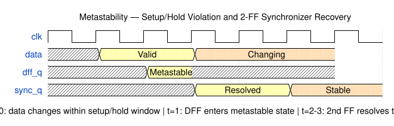
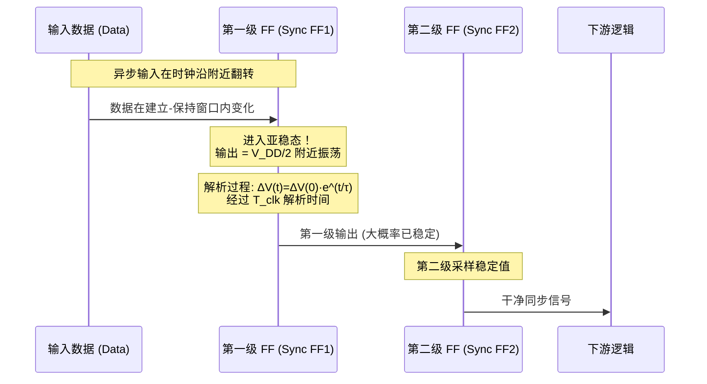

# 亚稳态

亚稳态（Metastability）是数字电路中所有同步器设计的根本物理依据，也是跨时钟域设计（CDC）、异步复位以及任何异步信号采样场景必须面对的基础问题。亚稳态的本质是双稳态存储元件（交叉耦合反相器构成的触发器）在输入信号于采样窗口内变化时，输出进入一个不稳定的中间状态，需要一段随机的解析时间（Resolution Time）才能衰减到确定的逻辑电平。

## 原理

### 双稳态元件的亚稳态物理机制

数字电路的基本存储单元基于双稳态（Bistable）电路：由两个交叉耦合反相器构成的正反馈系统。一个双稳态系统有两个稳定平衡点（分别对应逻辑 0 和逻辑 1）和一个不稳定的亚稳态平衡点（Metastable Equilibrium Point，通常位于 $V_{DD}/2$ 附近）。在亚稳态点 $V_{in} = V_{out} = V_{mid} \approx V_{DD}/2$ 处，两个反相器均处于线性增益区，正反馈净增益为零——系统无法自主驱动到稳定状态。任何微小噪声扰动最终推动输出走向 0 或 1，但这个过程可能需要任意长的时间。

解析过程可用一阶小信号模型描述：$\Delta V(t) = \Delta V(0) \cdot e^{t/\tau}$，其中 $\tau$ 是再生时间常数（Regeneration Time Constant），由晶体管跨导（$g_m$）和节点电容决定，先进工艺中典型值约 1-5 ps。FinFET 因更高 $g_m$ 而 $\tau$ 更小——从平面 CMOS 到 FinFET，$\tau$ 的降低提升了同步器可靠性。

### MTBF 公式与同步器设计

同步器的可靠性由平均故障间隔时间（Mean Time Between Failures, MTBF）量化：

$$MTBF = \frac{e^{t_{res}/\tau}}{f_{clk} \cdot f_{data} \cdot T_0}$$

参数含义：$t_{res}$（解析时间）——允许亚稳态解析的最大时间窗口（时钟周期减去第二级 FF 的建立时间和偏斜），在指数项中，对 MTBF 影响最为剧烈；$\tau$（再生时间常数）——工艺决定，FinFET 约 1-3 ps；$f_{clk}$（目标时钟频率）；$f_{data}$（源数据变化频率）；$T_0$（采样窗口参数）——与建立-保持窗口成正比，现代工艺典型值 10-50 ps。

以典型 28nm 参数为例：$f_{clk} = 1\text{ GHz}$，$f_{data} = 100\text{ MHz}$，$\tau = 3\text{ ps}$，$T_0 = 50\text{ ps}$。2-FF 链提供约 $t_{res} \approx 950\text{ ps} \approx 317\tau$ 的解析时间，MTBF $\approx e^{317} / (10^9 \times 10^8 \times 5 \times 10^{-11}) \approx 10^{131}$ 秒 $\approx 10^{123}$ 年——远超芯片寿命（定性结论不变）。但若频率升至 10 GHz（$t_{res} \approx 80\text{ ps} \approx 27\tau$），MTBF 急剧下降至数百毫秒——需额外增加同步器级数。

### 同步器级数确定与工程实践

增加同步器级数是碾压性（指数级）的改善——每增加一级延长一个周期 $t_{res}$，MTBF 指数增长。对于 GHz 级 SoC，2 级通常足够；对于 >5-10 GHz 高频或汽车 ASIL-D（目标 MTBF > $10^9$ 小时）、航空航天等极高可靠性应用，需 3+ 级。同步器级间严格禁止组合逻辑——任何组合逻辑都可能产生毛刺破坏功能。各级触发器需紧密物理放置，使用完全相同的单元类型（同一 VT 类别、同一驱动强度），走线尽量短直。关键 CDC 路径中，同步器 FF 常使用定制单元或手工布局而非让 P&R 自由放置。设计方法论：先通过 MTBF 公式计算最少级数，再加一级作为安全裕量。

### 适用范围

亚稳态影响贯穿数字设计：异步复位释放命中恢复/移除时间窗口——复位同步器的根本动因；跨时钟域边沿检测——"valid before data"错误的物理根源；异步握手协议——REQ/ACK 本质是单比特 CDC；芯片间互联——片外信号边沿速率通常慢于片内，更宽过渡时间使亚稳态触发概率更高，I/O 输入同步器比内部 CDC 更保守。

此外，亚稳态在测试与验证中是一个容易被忽视的盲区。扫描链（Scan Chain）移位模式下，异步接口和跨域路径的亚稳态风险被旁路（测试时钟统一），但功能模式下的 CDC 行为无法通过传统的 stuck-at/at-speed 测试覆盖——需要专门的 CDC 功能测试向量或仿真覆盖率点。

### 多比特 CDC 与数据总线同步

单比特 CDC 通过 2-FF 同步器即可安全解决，但多比特数据总线的跨域传输面临额外的相干性问题（Coherency）：当多个比特同时跨越时钟域时，不同比特可能解析到不同时钟周期，导致接收端采集到新-旧数据混合的无效码字（例如 4'b0111 变化为 4'b1000 时，可能采集到 4'b1111 或 4'b0000——任何一个都是错误的）。解决策略分为两类：

**编码变换**——格雷码（Gray Code）确保相邻值仅一位翻转，配合 2-FF 同步器即可安全传输计数器和 FIFO 指针。这是异步 FIFO 的指针同步基础：写指针以格雷码跨到读时钟域，反之亦然。

**握手/指示**——数据总线跨域时，采用 valid-ready 握手（或 REQ-ACK 协议）：源域先将数据稳定在总线上，再发送单比特 valid/req 指示信号经由 2-FF 同步器跨域；目标域接收到 valid 后确认数据已稳定，方可采样。这一模式的本质是将多比特同步问题降级为单比特指示信号同步问题——代价是增加一个时钟周期的延迟（源→目标空→可推下一拍）。

### 测量与表征

亚稳态的工艺级表征通过片上测量电路实现：构建一个故意频繁触发的同步器阵列，用高速计数器统计输出解析时间超过阈值的事件数，拟合出 $\tau$ 和 $T_0$。这些参数在工艺开发和标准单元库表征阶段确定，提供给 SoC 集成工程师用于 MTBF 计算和同步器级数决策。硅验证中，使用"亚稳态注入电路"（故意在采样窗口边沿附近切换输入）来覆盖极端工况。

### 故障率量化：FIT 与系统级可靠性

MTBF 的倒数即为故障率（Failure Rate），工程中常用 **FIT（Failure In Time）** 单位：1 FIT = 每 $10^9$ 器件运行小时发生 1 次故障。MTBF 与 FIT 的关系：$\text{FIT} = 10^9 / \text{MTBF（小时）}$。单片 SoC 可能包含数百条独立的 CDC 路径，系统总故障率为各路径 FIT 之和。这引出一个重要设计约束：即使单条路径 MTBF 足够安全，大量并行 CDC 路径的累积故障率也可能超出系统可靠性预算。例如，1000 条路径各 MTBF = $10^9$ 年折合 FIT $\approx 0.1$，累计 FIT = 100——对于一个可靠性敏感的系统（如汽车 ISO 26262），这是不可接受的。因此，对于拥有大量异步接口的复杂 SoC（如网络交换机、AI 加速器），单条 CDC 路径的 MTBF 目标需要设定得比直观判断高 2-3 个数量级。

### 建立-保持时间与采样窗口

亚稳态触发概率与采样窗口（Aperture Window）宽度密切相关。采样窗口定义为输入变化时间 $\Delta t_{in}$ 使得触发器输出解析时间超过某个阈值的输入时间区间。采样窗口宽度$~T_w \approx T_{su} + T_{hold}$ 的数十皮秒量级，但实际窗口宽度因噪声、工艺变异和温度漂移而展宽。同步器的 $T_0$ 参数是采样窗口的积分量度：$T_0 = \int_{-\infty}^{\infty} P(\text{metastability} | \Delta t_{in}) \, d(\Delta t_{in})$。现代触发器的 $T_0$ 典型值在 10-50 ps 之间。低功耗设计（低 $V_{DD}$）会增加 $T_0$——因为再生增益 $g_m R_{out}$ 降低、$\tau$ 增大——这是功耗优化与可靠性之间的一个直接权衡点。

### CDC 验证与亚稳态仿真

传统的 RTL 仿真（Verilog/VHDL 事件驱动仿真器）无法复现亚稳态——仿真器在建立-保持违例时输出 `X`（未知），但 `X` 会以确定性的方式传播，无法模拟亚稳态随机解析时间的物理行为。因此 CDC 正确性的验证依赖三个层次的互补方法：

1. **静态 CDC 检查工具**（如 SpyGlass CDC、Questa CDC）：通过结构分析识别所有跨域路径，检查同步器存在、协议正确性和重收敛风险——这是最基础也是最成熟的自动化方法。
2. **CDC 协议的形式验证**：对握手协议、FIFO 控制逻辑使用形式工具（如 JasperGold）证明数据完整性和无死锁——能对状态空间的全部路径进行穷举检查。
3. **亚稳态注入仿真**：在门级仿真（带 SDF 时序反标）中，工具故意在同步器第一级触发器的输出注入随机延迟——模拟亚稳态解析时间的不确定性——然后观察第二级是否仍有不确定值传播。这是与物理行为最接近的验证层级，但仿真时间开销极大，通常仅用于关键 CDC 路径的 Signoff。

### 高级同步器结构

除了经典的多级 FF 同步器，特殊场景中还有两种优化结构值得关注。**脉冲同步器（Pulse Synchronizer）**——将源域的短脉冲转换为一个电平翻转（Toggle），经 2-FF 同步后在目标域还原为脉冲——用于跨域传递单周期脉冲信号（如中断请求）。**多相位同步器**——利用多相位时钟（如 0°/90°/180°/270°）采样异步输入，取最早稳定者为同步输出——在 SERDES 和高速 I/O 中通过降低同步延迟来提高接口带宽，但代价是更高的面积和功耗。

## 关键要点

- **亚稳态是双稳态元件的物理特性**：输入在采样窗口内变化时，输出进入缓慢指数衰减的中间状态，解析时间无界
- **$t_{res}$ 是指数项中的关键设计参数**：$MTBF = e^{t_{res}/\tau} / (f_{clk} \cdot f_{data} \cdot T_0)$，增加一级同步器可指数级提升可靠性
- **再生时间常数 $\tau$**：约 1-5 ps，由 $g_m$ 和节点电容决定——FinFET 因更高 $g_m$ 使 $\tau$ 更小，可靠性更好
- **采样窗口参数 $T_0$**：与建立-保持时间窗口宽度相关，典型 10-50 ps
- **同步器级数的工程决策**：典型 GHz 级设计中 2-FF 同步器的 MTBF 远超芯片寿命，足够安全；>5-10 GHz 或汽车 ASIL-D 需 3+ 级；大量并行 CDC 路径的累计故障率需在系统级 FIT 预算中合计评估
- **同步器布局约束严格**：同步器级间禁止任何组合逻辑，各级触发器需物理紧密放置、同一 VT 类别和驱动强度
- **亚稳态不是 Bug 而是物理规律**：设计者的任务是确保其发生概率低到可接受的程度
- **多比特跨域需降级为单比特同步**：多比特总线跨域需使用编码变换（格雷码）或握手协议（valid-ready），将多比特同步降级为单比特指示同步——格雷码的"相邻仅一位翻转"特性是异步 FIFO 指针传递依赖的核心数学性质
- **脉冲同步器的三阶段传递**：脉冲同步器（Pulse Synchronizer）通过 toggle-同步-detect 三阶段将跨域脉冲可靠传递，是中断和事件信号的标准方案
- **复位同步器消除异步复位风险**：异步复位释放的亚稳态风险通过复位同步器消除——在复位释放时刻（de-assertion edge）将其同步到目标时钟域
- **低 $V_{DD}$ 恶化亚稳态**：低 $V_{DD}$ 工作（如 DVFS 低性能模式）会恶化亚稳态：再生增益 $g_m R_{out}$ 随 $V_{DD}$ 下降而衰减，$\tau$ 增大——MTBF 可能在低压下下降数个数量级，需要在 DVFS 所有电压档位分别验证同步器裕量
- **CDC 验证需三层次互补覆盖**：CDC 验证需要静态结构检查（SpyGlass/Questa CDC）+ 协议形式验证（JasperGold）+ 门级亚稳态注入仿真三层次的互补覆盖——RTL 仿真无法复现亚稳态的随机解析行为

## 与其他概念的关系

- [[cross-domain/concepts/跨时钟域设计|跨时钟域设计（CDC）]] — CDC 全部同步器方案（2-FF、Gray FIFO、Handshake）以亚稳态理论和 MTBF 公式为物理基础。单比特 2-FF 同步器、异步 FIFO 的格雷码指针传递、valid-ready 握手中的数据稳定性窗口——每一类 CDC 结构的可靠性都由 MTBF 公式量化验证
- [[cross-domain/concepts/复位策略|复位策略（Reset Methodology）]] — 异步复位释放（de-assertion）时刻若命中目标时钟域触发器的采样窗口，将直接触发亚稳态——复位同步器的设计（将异步复位在目标时钟域打两拍后释放）是对这一风险的工程对策
- [[concepts/CMOS基础|CMOS 基础]] — 双稳态电路的晶体管级实现（交叉耦合反相器的正反馈结构）和再生过程的 $g_m/C$ 小信号模型直接导出 $\tau = C/g_m$ 的关系，解释了为何工艺升级（$g_m$ 增大）缩短了再生时间常数
- [[concepts/半导体基础|半导体基础]] — $\tau$ 的物理来源：晶体管跨导（载流子迁移率和沟道长度）和节点电容（$t_{ox}$ 和扩散区面积）的工艺依赖性，解释了从平面 CMOS 到 FinFET 工艺迁移中 $\tau$ 从 5-10 ps 改善到 1-3 ps 的器件级原因
- [[rtl-design/concepts/时序逻辑|时序逻辑]] — 建立/保持时间（$t_{setup}$/$t_{hold}$）违例是亚稳态的触发条件——D-FF 的 $t_{setup}$ 和 $t_{hold}$ 共同定义采样窗口（Aperture Window），输入在该窗口内变化时触发亚稳态；$T_0$ 参数是对采样窗口的积分量度
- [[asic-flow/concepts/静态时序分析|静态时序分析（STA）]] — STA 通过建立/保持时间检查确保同步时序域内不发生亚稳态；Recovery/Removal 检查是异步复位释放时序的 STA 对偶约束；同步器的 false_path 约束将 CDC 路径排除在 STA 的同步时序分析之外

### 亚稳态与 MTBF 

**亚稳态（Metastability）** 是数字电路中双稳态存储元件（触发器、锁存器）在输入信号于采样窗口内变化时，输出进入一个介于逻辑 0 和逻辑 1 之间的不稳定中间电平的物理现象。这个中间电平无法被下游逻辑正确识别为确定的 0 或 1，需要一段随机的解析时间（Resolution Time）才能衰减到合法逻辑电平。

亚稳态的物理根源在于触发器的内部结构：两个交叉耦合反相器构成的正反馈双稳态系统。在稳态平衡点（0 和 1），正反馈强化当前状态；但在 $V_{DD}/2$ 附近的亚稳态平衡点，两个反相器均处于高增益线性区，正反馈净增益为零——系统无法自主驱动到稳定状态。输入信号在时钟沿的建立-保持窗口（Setup-Hold Window）内翻转时，采样得到的电压恰好落在这个亚稳态平衡点附近，触发器的再生过程从近乎零的初始电压差开始，按指数规律 $\Delta V(t) = \Delta V(0) \cdot e^{t/\tau}$ 缓慢增长，其中 $\tau$ 为再生时间常数（Regeneration Time Constant）。

**MTBF（Mean Time Between Failures，平均故障间隔时间）** 是量化同步器可靠性的核心指标，表示在给定的时钟频率和数据翻转率条件下，亚稳态导致系统功能故障的平均间隔时间。MTBF 由以下公式给出：

$$MTBF = \frac{e^{t_{res}/\tau}}{f_{clk} \cdot f_{data} \cdot T_0}$$

各参数含义：$t_{res}$（解析时间）——允许亚稳态解析的最大时间窗口，即目标时钟周期减去第二级触发器的建立时间和时钟偏斜，位于指数的分子中对 MTBF 影响最为剧烈；$\tau$（再生时间常数）——由晶体管跨导 $g_m$ 和节点电容决定，先进工艺约 1-5 ps；$f_{clk}$（采样时钟频率）；$f_{data}$（输入数据变化频率）；$T_0$（采样窗口参数）——与建立-保持窗口宽度成正比，现代工艺典型值 10-50 ps。

工程中 MTBF 的计算实例：以 28nm 工艺为例，$f_{clk}=1\text{ GHz}$，$f_{data}=100\text{ MHz}$，$\tau=3\text{ ps}$，$T_0=50\text{ ps}$。两级同步器提供约 $t_{res} \approx 950\text{ ps} \approx 317\tau$ 的解析时间，代入公式得 MTBF $\approx 10^{123}$ 年——远超芯片寿命（定性结论不变）。但若频率升至 10 GHz（$t_{res} \approx 80\text{ ps} \approx 27\tau$），MTBF 急剧下降至数百毫秒。**亚稳态无法完全消除，工程目标是将 MTBF 提高到远超芯片预期寿命的水平**（通常要求 >1000 年）。

**MTBF 与 FIT 的关系**：MTBF 的倒数为故障率，常用 **FIT（Failure In Time）** 表示——1 FIT = 每 $10^9$ 器件运行小时发生 1 次故障，即 $\text{FIT} = 10^9 / \text{MTBF（小时）}$。单片 SoC 可能包含数百条独立 CDC 路径，系统总 FIT 为各路径 FIT 之和——**即使单条路径 MTBF 足够安全，大量并行 CDC 路径的累积故障率也可能超出系统可靠性预算**。

### 准稳态与亚稳态的区别

**准稳态（Quasi-Stable State）** 和亚稳态（Metastable State）在数字电路中有本质区别，但常被混淆。

**亚稳态（Metastable）** 是双稳态电路（如触发器）输出处于 $V_{DD}/2$ 附近的不稳定平衡状态——系统在此处净增益为零，只能被热噪声或外部扰动推出，经过随机时间后才解析为确定的 0 或 1。亚稳态的解析过程是**无界的**——理论上可能持续任意长的时间（虽然概率随指数衰减）。

**准稳态（Quasi-Stable）** 则完全不同：它指的是一个**单稳态电路**（如单稳态多谐振荡器，Monostable Multivibrator）在触发后被暂时驱离稳态、进入一个**有限的、可预测的**不稳定状态，经过**确定的**时间常数后自动返回稳态。准稳态的持续时间由 RC 时间常数决定，是**确定性**的而非概率性的。典型例子包括：脉冲展宽器（Pulse Stretcher）中 RC 放电维持的暂态高电平、边沿检测器中延迟链产生的脉冲宽度、以及某些异步电路中的时序假设（Timing Assumption）所依赖的准稳态过渡期。

在跨时钟域设计的语境中，严格来说同步器第一级触发器的输出是**亚稳态**（概率性、无界解析时间），而不是准稳态。但有时工程师口语中会混淆两者——将"信号还没稳定"笼统称为"quasi-stable"。精确区分如下：

| 特性 | 亚稳态（Metastable） | 准稳态（Quasi-Stable） |
|:---|:---|:---|
| **所属电路类型** | 双稳态（Bistable）——交叉耦合正反馈 | 单稳态（Monostable）——RC 定时 + 比较器 |
| **触发方式** | 输入在建立-保持窗口内翻转 | 外部触发脉冲将电路驱离稳态 |
| **状态持续时间** | 概率性、无界（指数分布） | 确定性、有界（RC 时间常数） |
| **解析/恢复机制** | 正反馈再生（$\Delta V \cdot e^{t/\tau}$） | RC 充放电到阈值后自动翻转 |
| **工程关注点** | MTBF 计算、同步器级数 | 时序假设验证、PVT 裕量 |
| **典型场景** | 2-FF 同步器第一级 | 脉冲展宽器、边沿检测器、延时链 |

**工程意义**：亚稳态需要概率模型（MTBF 公式）来管理，而准稳态需要**时序约束**（set_max_delay / set_min_delay）来管理。混淆两者可能导致错误的设计决策——例如，对准稳态使用 MTBF 公式（无意义），或对亚稳态仅依赖时序约束（不足以保证安全）。
