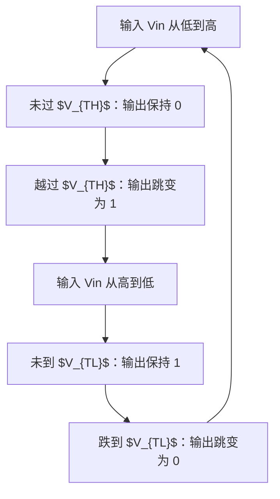

# 斯密特触发器（Schmitt Trigger）

斯密特触发器（Schmitt Trigger，又称施密特触发器）是一种具有**迟滞特性**（Hysteresis）的阈值比较电路。它的根本特点是：**上升沿和下降沿的触发阈值不同**，因而对输入噪声有天然的免疫力，能把缓慢变化的模拟波形"整形"成边沿陡峭的数字信号。它广泛应用于波形整形、去毛刺、复位信号输入缓冲和振荡器等场景。

## 原理

### 为什么需要两个阈值

普通反相器或比较器只有**一个**阈值 $V_{th}$：输入从低到高跨过 $V_{th}$ 时输出翻转，从高到低跨过 $V_{th}$ 时输出翻转。问题在于：当输入信号恰好停留在 $V_{th}$ 附近（或带噪声的缓慢信号在阈值附近反复抖动）时，输出会在两个电平之间来回振荡，产生不可控的毛刺。

斯密特触发器用两个阈值 $V_{TH}$（上升阈值 / Upper Threshold）和 $V_{TL}$（下降阈值 / Lower Threshold），且满足 $V_{TH} > V_{TL}$。两者之差称为**迟滞宽度**（Hysteresis Width, $V_H = V_{TH} - V_{TL}$）。关键点是：**当前用哪个阈值，取决于输入正在往哪个方向运动**——

- 输入从低往高走，输出翻转的触发点是 $V_{TH}$（更高）；
- 输入从高往低走，输出翻转的触发点是 $V_{TL}$（更低）。

只要噪声幅度小于迟滞宽度 $V_H$，输入在阈值附近抖动时输出就**不会**翻转，因为此时电路"记住"了上一次的状态，判定阈值已被拉开。这正是迟滞特性赋予的去噪能力。

### 迟滞的实现机制

CMOS 斯密特触发器通常用**带正反馈**的交叉耦合结构实现。一个经典的 CMOS 实现由 6 只晶体管构成：PMOS 堆叠的分压网络负责设定高阈值，NMOS 堆叠网络负责设定低阈值，通过调节晶体管尺寸比（宽长比 $W/L$）可调整迟滞宽度。核心思想是：**输出反馈到输入级的阈值构造网络，使得输入阈值随输出状态而偏移**——输出为高时把阈值抬到 $V_{TH}$，输出为低时把阈值降到 $V_{TL}$。

从数学上看，迟滞特性等价于一个**双稳态**系统：在 $V_{TH}$ 与 $V_{TL}$ 之间的输入区带上，电路存在两个稳定的输出状态（0 或 1），具体落在哪个状态取决于"从哪边过来的"。这解释了为何它能存储状态而不仅仅是比较。

### 与非门级实现（逻辑符号）

在逻辑/数字应用层面，斯密特触发器常被当作一个**黑盒单元**使用，其行为可用带迟滞的传输特性描述，库中提供标准单元（如 `SCHMITT_BUF` / `SCHMITT_INV`）。EDA 流程中，设计者通常直接例化标准单元而非手工搭晶体管——复位管脚、I/O 焊盘的输入缓冲（Input Buffer）就是典型用例。

## 传输特性

斯密特触发器的电压传输特性（Voltage Transfer Characteristic, VTC）是一条**顺时针回滞环**，区别于普通反相器的单调反转特性：上升与下降走两条不同的路径，环路水平跨度即为迟滞宽度 $V_H$。

上图中，输出由 0 变 1 的触发点是 $V_{TH}$（更高的阈值），由 1 变 0 的触发点是 $V_{TL}$（更低的阈值）。两条翻转线之间的水平距离就是迟滞宽度 $V_H = V_{TH} - V_{TL}$——噪声幅度小于它时输出稳定不翻转。

## 关键要点

- **核心特征**：双阈值 $V_{TH} > V_{TL}$，阈值选择依赖输入方向，构成迟滞环。
- **去噪原理**：输入噪声幅度小于迟滞宽度 $V_H$ 时输出不翻转，从而屏蔽阈值附近的抖动与毛刺。
- **整形作用**：能把缓慢变化的边沿（慢 Slew Rate）转换为陡峭的数字边沿，修复波形质量。
- **判定阈值**：迟滞宽度可通过晶体管尺寸比（$W/L$）或参考电压设定，属可设计的电路参数。
- **应用场景**：输入缓冲器（I/O Pad 整形）、复位去毛刺链、振荡器（如 RC 施密特振荡器）、噪声敏感的传感器信号调理。
- **与比较器的区别**：普通比较器单阈值易受噪声抖振，斯密特触发器以迟滞换取噪声容限。

## 与其他概念的关系

- [[concepts/CMOS基础|CMOS 基础]] — 斯密特触发器的晶体管级实现建立在 CMOS 反相器与交叉耦合结构之上，且常作为库单元（Standard Cell）被例化。
- [[cross-domain/concepts/复位策略|复位策略]] — 外部复位管脚（NRST）的输入缓冲与去毛刺链中，斯密特触发器用于将缓变复位边沿还原为陡峭数字边沿。
- [[cross-domain/concepts/低功耗设计|低功耗设计]] — ICG 门控单元通过时间窗整形抑制毛刺，而非依赖施密特触发器这一滤波手段——这是两者（噪声滤除 vs 机制上禁止毛刺）的重要区分。
- [[concepts/亚稳态|亚稳态（Metastability）]] — 迟滞状态与亚稳态同属双稳态系统行为，但斯密特触发器靠迟滞区间规避中间态，亚稳态则因采样窗口问题进入中间态。
- [[rtl-design/concepts/组合逻辑|组合逻辑（毛刺/竞争冒险）]] — 组合逻辑毛刺的清除可在信号链路中加入施密特触发器等整形手段。

## 参考来源

- Rabaey, Jan M. *Digital Integrated Circuits: A Design Perspective*, Chapter 6 (比例/迟滞门设计)
- Weste & Harris, *CMOS VLSI Design: A Circuits and Systems Perspective*, Chapter 13 (施密特触发器 CMOS 实现)
- Sedra & Smith, *Microelectronic Circuits*（迟滞比较器与施密特触发器振荡器）
