# Timing Closure — 时序收敛

时序收敛（Timing Closure）是数字IC物理实现流程中最核心、最耗时的迭代环节，其目标是在所有工艺角（Corner）和工作模式（Mode）下，芯片内的每一条时序路径——寄存器到寄存器（Register-to-Register）、输入到寄存器（Input-to-Register）、寄存器到输出（Register-to-Output）、输入到输出（Input-to-Output）——都满足建立时间（Setup Time）和保持时间（Hold Time）约束。一个未能收敛的设计无法完成 Tape-Out。

## 原理

### 时序收敛的基本流程

时序收敛并非一次性任务，而是一个跨越逻辑综合（Synthesis）、布局（Placement）、时钟树综合（Clock Tree Synthesis, CTS）和布线（Routing）的闭环迭代过程。典型流程从综合开始——综合工具在时序约束（SDC, Synopsys Design Constraints）的驱动下将 RTL 映射到标准单元网表，此时只考虑线负载模型（Wire Load Model, WLM）估算的互联延迟。进入物理设计后，布局阶段获得真实单元位置，CTS 插入时钟缓冲器以平衡时钟偏斜（Clock Skew），布线阶段确定金属层走线并提取精确的寄生参数（RC Extraction），每一个阶段都需要运行静态时序分析（Static Timing Analysis, STA），识别违例路径，根据违例的严重程度和类型决定进入下一个阶段还是回到前一个阶段修复。

### 多工艺角多模式分析

先进工艺下，时序收敛必须在多工艺角多模式（Multi-Corner Multi-Mode, MCMM）框架下进行。不同的 PVT（Process/Voltage/Temperature）条件组合构成工艺角：例如 SS（Slow-Slow, 慢 NMOS 慢 PMOS）角对应最高温度、最低电压，决定了最慢路径（Setup 最差）；FF（Fast-Fast, 快 NMOS 快 PMOS）角对应最低温度、最高电压，决定了最快路径（Hold 最差）。此外还有 TT（Typical-Typical）、SF（Slow-Fast）、FS（Fast-Slow）等角。模式方面包括功能模式（Func Mode）、测试模式（Test/DFT Mode, Scan Shift/Capture）、休眠模式（Sleep Mode）等。MCMM 意味着每个场景都要独立 STA，违例报告和修复需要在所有场景中同时满足。

### 片上变异与裕量缩减

工艺偏差（On-Chip Variation, OCV）是指同一芯片上不同位置的晶体管因光刻、掺杂、刻蚀等制造步骤的随机差异而表现出不同的延迟特性。早期的 OCV 模型使用统一的全局降额因子（Derating Factor）乘以延迟，过于悲观。AOCV（Advanced OCV）引入了基于单元深度和距离的降额表——路径越深、距离越近，变异相关性越强，降额越小。POCV（Parametric OCV / SOCV）进一步使用统计模型，将每个单元的延迟建模为独立的随机变量，通过统计求和（RSS, Root-Sum-Square）而非线性叠加来计算路径延迟的方差。最先进的 LVF（Liberty Variation Format）将变异信息直接嵌入标准单元库的 Liberty（.lib）文件中，提供每个单元每种时序弧（Timing Arc）的均值（μ）和标准差（σ），使 STA 工具能够进行真正的统计时序分析（Statistical STA, SSTA）。

### 串扰与IR-drop对时序的影响

串扰（Crosstalk）由相邻金属线之间的耦合电容引起。当一根线（Aggressor，攻击线）发生跳变时，通过耦合电容对相邻线（Victim，受害线）注入电荷，导致受害者信号的到达时间提前或推迟——这被称为串扰引起的延迟变化（Crosstalk-Induced Delay Change）。在深亚微米工艺中，金属线间距缩小、纵横比增大，耦合电容占总电容的比例显著上升，串扰效应已不可忽略。

IR-drop（电压降）是电源分配网络（Power Delivery Network, PDN）中不可避免的现象。当大量标准单元同时开关时，电流流过 PDN 的寄生电阻和电感，导致实际到达单元电源端子的电压低于理想 VDD（IR-drop 中的 "I" 即电流，"R" 即电阻）——这称为静态 IR-drop；瞬态电流尖峰引起的瞬时电压跌落则称为动态 IR-drop（di/dt 效应）。晶体管在较低的 VDD 下驱动能力减弱、延迟增加，因此严重 IR-drop 区域的时序路径会出现意料之外的 Setup 违例，是 Signoff 阶段最隐蔽的时序问题来源之一。

### ECO修复策略

时序违例的修复由轻到重分为多个层级。最轻量的是工程变更指令（Engineering Change Order, ECO）：不改变布局的大结构，仅通过替换驱动能力更强的单元（Size Up）、插入缓冲器（Buffer Insertion）、调整单元位置（Cell Relocation）等局部操作修复违例。更重的修复需要重新 CTS 或重新 Placement。Setup 违例的修复手段包括：使用更低 Vth 的单元（HVT → SVT → LVT，以漏电换速度）、分解大扇出网络（High Fanout Net Synthesis）、利用有用偏斜（Useful Skew）——故意将时钟做偏以平衡前后级的延迟差。Hold 违例通常通过插入延迟单元（Delay Cell）或缓冲器对来修复。Margin Reduction（裕量缩减）是时序收敛后期的重要策略：去除过度悲观的设计裕量（如过大的时钟不确定性、过保守的 OCV 降额），使工具在真实约束下工作。

### 时钟偏差、抖动与CTS

时钟树综合（CTS）的质量直接决定时序收敛的成败。时钟偏斜（Clock Skew）是同一时钟到达不同寄存器引脚的时间差，传统 STA 将 Launch 和 Capture 时钟的到达时间差加入建立/保持时间方程。Useful Skew 策略有意利用偏斜作为设计自由度——延迟 Capture 触发器时钟来"借"时间修复 Setup 违例，但须确保不破坏该路径的 Hold 和相邻路径的 Setup。时钟抖动（Clock Jitter）来自 PLL 相位噪声、电源噪声耦合和缓冲器随机噪声，在 STA 约束中以时钟不确定性（Clock Uncertainty）体现——高频设计（>1 GHz）中 Jitter 占比增大，成为时序收敛的主要障碍。

### 时钟重收敛悲观移除（CRPR）

当 Launch 和 Capture 时钟路径共享一段公共时钟树（Common Clock Path, CCP）时，OCV/POCV 分析会对 CCP 上单元应用独立的随机变异降额——这在物理上不合理，同一段物理路径不可能同时"慢"（用于 Launch）又"快"（用于 Capture）。CRPR 在 Setup 路径上从时钟悲观量中减去 CCP 的 OCV 降额差，去除的悲观量可高达几十皮秒——对 GHz 级设计是关键的收敛裕量。短 CCP、长分支树的时钟结构对时序收敛不利，这正是 CTS 中平衡公共路径比例（Common Path Ratio）的动机。

### 信号完整性（SI）分析

串扰效应的完整 STA 处理包括延迟变化（Crosstalk Delta Delay）和噪声毛刺（Glitch）两个维度。Delta Delay 基于耦合电容网络、攻击者和受害者的时序窗口重叠分析——仅当攻击者在受害者敏感时间窗口内跳变时才计入。增量串扰（Incremental Crosstalk）流程迭代更新延迟直到收敛。噪声分析（SI Noise Analysis）关注强大攻击者跳变在静态受害线上感应超出噪声容限的电压毛刺——这是与 STA 并列的独立 Signoff 验证步骤。

### 时序预算与层次化收敛

大规模 SoC 的扁平 STA 因运行时间过长不可行。层次化时序收敛将设计分解为子模块（Block），为每个模块分配时序预算：顶层互联延迟 + 模块内延迟 + 裕量 = 时钟周期。子模块在预算约束下独立收敛，最后在顶层拼合后全芯片 STA 验证。时序预算分配需在顶层规划阶段基于初始布局的信息确定，分配不当会导致模块反复迭代——这是层次化设计管理中的核心挑战。

### 路径组分类与时序驱动的物理综合

STA 中时序路径按起点终点分为四类：Input-to-Register（in2reg，受输入延迟约束）、Register-to-Register（reg2reg，主要类型，受时钟周期约束）、Register-to-Output（reg2out，受输出延迟约束）、Input-to-Output（in2out，纯组合逻辑，应尽量避免）。现代流程已演进为时序驱动的物理综合（Physically-Aware Synthesis）——综合阶段利用初步布局信息计算更真实的线长和 RC 延迟，反复迭代"综合 + 快速布局 + 时序分析"逼近最终结果。设计规则违例（DRV）与时序违例常常相互制约：修复 Setup 的缓冲器可能引入 Max Transition/Max Fanout 违例，缓解拥塞的绕行可能使关键路径线长超出预期。

### 时钟门控与时序的交互

时钟门控对时序收敛有显著影响。门控单元（Clock Gating Cell, CGC）插入在时钟树上，引入额外的时钟延迟和偏斜。基于锁存器的门控单元（Latch-Based CGC）因其对时钟使能信号的时序宽容度（使能只需在锁存器透明窗口内稳定）而被广泛使用。门控单元的放置位置直接改变时钟树拓扑——CGC 离根越近，门控的时钟树分支越长，节省的功耗越多，但偏斜控制越难。综合和 CTS 工具需要联合优化门控层级和物理位置：将门控插入层级尽可能高（靠近时钟根），同时确保关键路径的时钟偏斜不受显著影响。多级时钟门控的级联需要逐级时序验证——每一级门控单元的使能信号必须满足其下一级门控输出的时钟域约束。

### 时序ECO与签核收敛检查清单

时序签核（Timing Signoff）的最终检查清单包括：所有 MCMM 场景下的 Setup/Hold 违例清零；所有 DRV（Max Transition, Max Capacitance, Max Fanout）违例清零；时钟树上的 SI Noise 注入无功能风险；跨异步时钟域的 CDC 路径已正确设置时序例外；所有时序例外（包括多周期路径 multi-cycle path 和假路径 false path）均已经过人工审查和确认。关键 Signoff 角落的选取策略取决于代工厂推荐和芯片的具体应用场景（消费电子 vs 汽车 vs 航空航天），温度反转效应的存在使高温不一定是最慢角——需要实际的多温度点 STA 确认。

## 关键要点

- 时序收敛是横跨综合、布局、CTS、布线的迭代闭环，每步都需 STA 验证，Setup 违例需回到前序阶段修复
- MCMM 要求在 SS/FF/TT/SF/FS 等多个 PVT 角和 Func/Test/Sleep 等多个模式下同时满足时序
- OCV → AOCV → POCV → LVF 的演进反映了从保守降额到统计建模的方法论转变，减少了过度设计
- 串扰延迟变化使得同一路径在不同邻居活动组合下的延迟不同，需要基于耦合电容和开关窗口（Timing Window）的 STA 分析
- IR-drop 导致局部 VDD 降低、单元延迟增加，可能引起 Signoff 后布局布线已完工时才发现的新时序违例
- Useful Skew 策略通过主动制造时钟偏移来平衡相邻寄存器级的延迟差，是 Setup 收敛的利器
- Setup/Hold 违例修复手段不同：Setup 侧重加速数据路径（低 Vth、减小负载），Hold 侧重延迟数据路径（插入缓冲器/延迟单元）
- ECO 是时序收敛后期的主要修复手段，强调局部修改、最小化对已完成布线的影响
- 时序收敛的核心矛盾始终是 PPA（Performance/Power/Area）的三角权衡：加速路径意味着更大的单元面积和更高的漏电流

## 与其他概念的关系

- [[asic-flow/concepts/Synthesis_逻辑综合|逻辑综合（Synthesis）]] — 综合阶段的 WLM 时序估算决定网表质量，好的起始点大幅降低物理阶段的时序收敛难度
- [[asic-flow/concepts/Place and Route_布局布线|布局布线（P&R）]] — 宏单元和标准单元的物理位置决定了关键路径的线长和延迟上限
- [[asic-flow/concepts/Clock Tree Synthesis_时钟树综合|时钟树综合（CTS）]] — CTS 直接决定时钟偏斜和不确定性，是 Setup/Hold 违例分析的核心变量
- [[asic-flow/concepts/Signoff_签核|物理签核（Signoff）]] — Timing Signoff 是 Tape-Out 前的最终 STA 检查，包括 Setup、Hold、DRV、Noise 等多维度验证
- [[cross-domain/concepts/Low Power Design_低功耗设计|低功耗设计]] — 多电压域设计引入 Level Shifter 和多个电压轨，增加了 MCMM 场景数量和时序收敛复杂度
- [[concepts/Semiconductor Basics_半导体基础|半导体基础]] — PVT 变异的物理根源：掺杂浓度偏差、氧化层厚度波动、温度对载流子迁移率的影响

### 时序Signoff与签核流程

时序签核（Timing Signoff）是 Tape-Out 前的最终 STA 检查，是项目进度中不可压缩的关键里程碑。签核检查清单包括：所有 MCMM 场景下 Setup/Hold 违例清零；所有 DRV（Max Transition、Max Capacitance、Max Fanout）违例清零；时钟树上的 SI Noise 注入经分析无功能风险；跨异步时钟域的 CDC 路径已正确设置时序例外（set_clock_groups、set_false_path）；所有时序例外（多周期路径 multi-cycle path、假路径 false path）均已经过人工审查和确认；关键 Signoff 工艺角选择经过温度反转效应验证——高温不一定是最慢角，需实际多温度点 STA 确认。签核流程通常要求多个 Signoff 工具交叉验证（如 PrimeTime 为主、Tempus 确认），以减少单一工具的计算偏差风险。

<!-- 时序签核还涉及对时序约束自身的质量检查——约束覆盖率（Constraint Coverage），确保所有时钟、所有路径和所有模式都已被 SDC 覆盖。约束质量评审（SDC Review）是时序签核流程中的关键人工审查步骤。-->
<!-- 低功耗设计的功耗-性能联合优化前沿还包括机器学习驱动的功耗预测（ML-Based Power Prediction），利用已知设计的功耗数据训练模型预测新设计的功耗热点区域。-->
<!-- CDC设计还需关注时钟门控引入的新CDC风险——门控时钟（Gated Clock）产生的时钟脉冲宽度变化可能使目标域同步器的有效t_res缩短。-->
<!-- 复位设计的终极验证手段是形式属性检查（Formal Property Checking）——用SVA描述复位后的预期状态，由形式工具穷举证明所有可能轨迹下该属性成立。-->
<!-- 亚稳态的研究前沿包括使用贝叶斯推断从少量芯片的同步器失效统计数据中反推tau和T0的后验分布，为MTBF计算提供更精确的输入。-->
