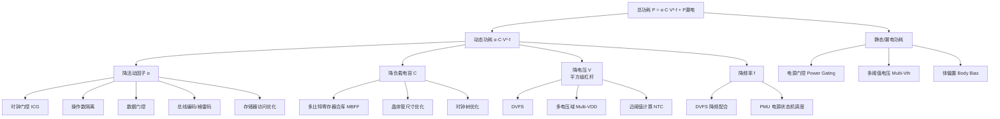
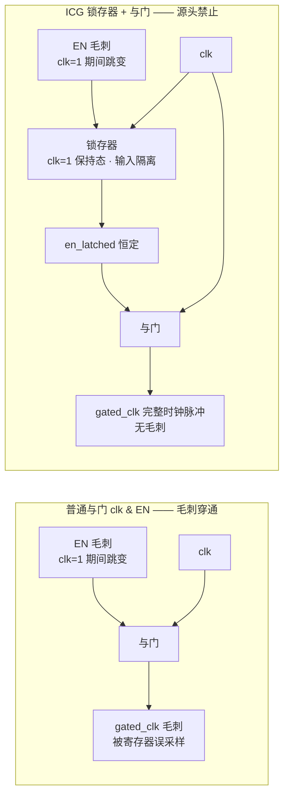

# 低功耗设计

低功耗设计（Low-Power Design）是现代数字IC设计中最关键的横切关注点之一，它横跨架构设计、RTL 编码、逻辑综合、物理实现直至 Signoff 的全流程。功耗不仅是移动和物联网设备中电池寿命的决定因素，在数据中心和高性能计算领域也直接制约着散热能力（Thermal Design Power, TDP）和封装成本。低功耗设计的核心是在性能（Performance）、面积（Area）和功耗（Power）——即 PPA 三角——之间找到最优平衡点。

## 原理

### 功耗的分类与根源

数字IC的功耗分为静态功耗和动态功耗两大类。动态功耗（Dynamic Power）由信号跳变引起：P_dynamic = α · C · V² · f，其中 α 为活动因子，C 为负载电容，V 为电源电压，f 为时钟频率。静态功耗（Leakage Power / Static Power）在先进工艺（28nm 以下）中占比不断上升，主要来源包括：亚阈值漏电（Subthreshold Leakage）——晶体管在 Vgs < Vth 时仍有微弱电流；栅极隧道漏电（Gate Tunneling Leakage）——栅氧化层减薄到原子尺度后量子隧穿效应显著；以及反向偏置结漏电（Reverse-Biased Junction Leakage）。先进工艺中静态功耗已可与动态功耗匹敌，甚至在某些低活动率场景下成为主导——这也是 Power Gating 和 Multi-Vth 等技术变得如此重要的原因。

### UPF与功耗意图

统一功耗格式（Unified Power Format, UPF, IEEE 1801）是描述芯片功耗意图（Power Intent）的行业标准。UPF 定义的关键概念包括：**功耗域（Power Domain）**——可以独立开关或调节电压的逻辑区域；**供电网络（Supply Net / Supply Set）**——包含主电源（Primary Power）、保持电源（Retention Power）等；**供电端口（Supply Port）**——功耗域的电源连接点；**隔离单元（Isolation Cell）**——在关闭的功耗域输出端插入，防止未知值（X）传播到常开域；**电平转换器（Level Shifter）**——在不同电压的功耗域之间转换信号电平；**保持寄存器（Retention Register）**——在掉电前保存状态、上电后恢复的专用寄存器；**电源开关（Power Switch）**——控制功耗域通断的晶体管网络（Header Switch 用 PMOS 接 VDD，Footer Switch 用 NMOS 接 GND）。UPF 文件贯穿综合、仿真、形式验证、物理实现全流程，确保功耗意图的一致性和正确性。

### 架构与RTL级功耗优化

**时钟门控（Clock Gating）** 是 RTL 级最有效、应用最广泛的低功耗技术。通过在寄存器组的时钟路径上插入与门（AND Gate）或锁存器+与门（Latch-Based Clock Gating Cell），当时钟使能信号（Clock Enable）为低时阻止时钟翻转，消除寄存器组内无谓的时钟树功耗和数据路径翻转功耗。RTL 风格直接影响时钟门控插入效率：条件赋值导致寄存器保持原值（`if (en) q <= d`）会被综合工具自动插入时钟门控；而 `q <= en ? d : 0` 这种风格则无法门控。操作数隔离（Operand Isolation）是算术数据路径的低功耗技术——当计算单元的输出在当前周期不被使用时，通过门控阻止其输入翻转来抑制动态功耗。

### 物理级功耗优化

**多阈值电压（Multi-Vth）** 技术利用不同阈值电压晶体管的特性差异：高阈值电压（HVT, High Vth）单元漏电低但速度慢，低阈值电压（LVT, Low Vth）单元速度快但漏电高，标准阈值电压（SVT, Standard Vth）居中。综合工具以时序为约束，优先使用 HVT，仅在关键路径上使用 LVT，实现速度与漏电的平衡。**电源门控（Power Gating）** 通过电源开关晶体管在休眠期间彻底切断某个功耗域的供电，可将该域的静态功耗降至近乎为零——代价是唤醒延迟和浪涌电流（Inrush Current）管理。**动态电压频率调节（Dynamic Voltage and Frequency Scaling, DVFS）** 根据当前工作负载实时调整电压和频率——由于动态功耗与 V²f 成正比，即使适度的电压降低也能带来显著的功耗节省。**自适应电压调节（Adaptive Voltage Scaling, AVS）** 通过片上性能监控器（Performance Monitor）构成闭环：根据硅片的实际速度反馈调整电压，消除设计裕量。**体偏置（Body Bias）** 通过调节衬底电压改变 Vth：正向体偏置（FBB, Forward Body Bias）降低 Vth 提速，反向体偏置（RBB, Reverse Body Bias）提高 Vth 降漏电——在 FDSOI 工艺中尤为有效。

### 动态功耗与漏电功耗的权衡

动态功耗优化和漏电功耗优化常常相互冲突：例如，使用 LVT 单元加速关键路径会增加漏电；过度使用电源门控虽然降低漏电，但唤醒过程消耗额外的动态能量。低功耗设计的艺术在于理解应用场景的活动率分布（Activity Profile）——是持续高活动率（如视频解码、HPC 计算）还是大部分时间空闲（如 IoT 传感器、可穿戴设备）——从而选择合适的优化策略组合。现代 EDA 工具支持多目标优化（Multi-Objective Optimization），以 PPA 加权评分函数指导自动单元替换和 P&R 优化。

### 功耗估算方法论

功耗估算贯穿 RTL 到 GDSII 全流程，各阶段精度与速度权衡不同。RTL 级功耗估算使用概率传播——综合工具推断各节点活动因子（Toggle Rate）和静态概率（Static Probability），结合 Liberty 库功耗查找表估算，精度在实际功耗 15-30% 以内，适合早期架构探索。门级功耗分析需配合 VCD（Value Change Dump）或 SAIF（Switching Activity Interchange Format）文件记录真实翻转行为。Signoff 功耗分析在最终布局布线后运行，使用 SPEF 寄生参数和仿真翻转数据，精度可达硅片的 5-10%。功耗分析覆盖平均功耗（热分析/电池寿命）、峰值功耗（PDN 尺寸设计）和瞬态功耗波形（di/dt 分析）三个场景。

### 低功耗RTL编码规范

RTL 编码风格对功耗的影响是第一位且最持久的。关键规范：（1）使用条件赋值 `if (en) q <= d` 以触发自动时钟门控插入，避免 `q <= en ? d : 0` 或多路选择器参与数据路径的写法；（2）操作数隔离（Operand Isolation）——算术单元输入在不需要计算结果时通过门控切断；（3）总线编码优化——状态机用格雷码或独热码以降低长线跳变次数；（4）存储器访问优化——减少不必要的 SRAM 读写、利用 Light Sleep/Deep Sleep 模式、大数据流采用 Tiling 策略最大化数据复用；（5）避免无谓的寄存器更新——默认值保持而非频繁写零。

### 低功耗验证与功耗感知综合

低功耗设计显著增加验证复杂度。功耗感知仿真（Power-Aware Simulation）基于 UPF 注入功耗域行为模型：掉电域信号驱动力 X，隔离单元在边界阻止 X 传播，电平转换器正确转换电压域，保持寄存器恢复上电后返回保存值。验证目标包括上电/掉电序列正确性、隔离控制时序、保持/恢复正确性。功耗感知综合（Power-Aware Synthesis）将功耗加入代价函数——自动 Multi-Vth 分配、活动率驱动的单元替换、自动时钟门控插入和优化（合并多门控使能、提升门控层级）。

### 低功耗标准单元与前沿技术

现代标准单元库嵌入了全套低功耗专用单元：隔离单元分上拉/下拉/锁存三种；电平转换器分低到高和高到低两个方向；保持寄存器在标准触发器上增加影子锁存器——掉电前将主锁存器内容保存到常开保持电源供电的影子锁存器，上电后恢复；常开缓冲器（Always-On Buffer）在域掉电时仍工作以缓冲关键控制线。前沿方向包括暗硅（Dark Silicon）的时分复用调度、近似计算（Approximate Computing）以精度换功耗、存内计算（Compute-in-Memory, CIM）消除数据搬运功耗——推动低功耗设计从"省电"向"能量最优计算范式"转变。

### 电源开关设计与浪涌电流管理

电源门控的物理实现涉及电源开关（Power Switch）的布局、尺寸和驱动策略。电源开关布局有环形（Ring，围绕功耗域）、网格（Grid，规则的二维阵列）和条带（Stripe，沿垂直或水平方向排列）三种拓扑——需在电压降（IR-drop）、面积开销和唤醒速度之间权衡。开关晶体管通常使用高 Vth 厚氧化层器件以最小化关断漏电。唤醒时的浪涌电流（Inrush Current）管理是电源门控设计中最关键的挑战——大片域唤醒时，所有被关断的标准单元同时充电、瞬态电流可达数十安培，足以引起严重的 di/dt 压降和 L*di/dt 感应电压跌落（Ground Bounce），甚至引发邻近活跃域的功能错误。解决方案包括：分段唤醒（Daisy-Chain Wakeup）——将电源开关分为多组逐段开启，每组之间插入延迟；可编程唤醒斜率控制——通过调节开关晶体管的栅极驱动电压的上升斜率来控制电流变化率。

### 多比特寄存器合库与物理级优化

多比特寄存器合库（Multi-Bit Flip-Flop Banking / MBFF）是物理实现级的有效低功耗技术。将多个单比特触发器合成为一个多比特寄存器单元，共享时钟树缓冲器（Clock Pin）和内部互连——减少总时钟树缓冲器数量、降低时钟树功耗（通常占芯片总功耗的 20-40%）。MBFF 还能减少总面积（共享阱、共享电源轨）、降低时钟偏斜（共享时钟引脚意味着时钟到达多个比特的时刻完全相同）。代价是布局灵活性降低——多比特单元比单比特单元大，可能增加布线拥塞。现代 P&R 工具自动执行 MBFF 合库——基于时序约束、拥塞地图和时钟偏斜目标进行选择性合并，通常在 CTS 阶段执行以获得最佳结果。

### 低功耗设计技术全景——从架构到物理实现

数字IC低功耗设计技术覆盖从系统架构到物理版图的完整层次，可按层次系统回答：

**系统/架构级**（影响最大，可达 50%-70% 功耗降低）：
- **动态电压频率调节（Dynamic Voltage and Frequency Scaling, DVFS）**：根据负载动态调节电压和频率——电压降低 10%，动态功耗降低约 19%（$P \propto V^2$）。
- **电源门控（Power Gating）**：休眠期间彻底切断某模块供电，将静态功耗降至近乎为零。
- **时钟门控（Clock Gating）**：阻止空闲寄存器的时钟翻转，是 RTL 级最有效的低功耗技术（20%-40% 动态功耗节省）。
- **多电压域（Multi-Voltage / Multi-VDD）**：不同模块运行在不同电压——高性能 CPU 用高 VDD，低速外设用低 VDD。
- **自适应电压调节（Adaptive Voltage Scaling, AVS）**：片上性能监控器闭环反馈，消除 PVT 裕量。

**RTL/微架构级**：
- **操作数隔离（Operand Isolation）**：算术单元空闲时门控其输入，阻止无用翻转传播（详见下文专门章节）。
- **数据门控（Data Gating）**：操作数隔离的寄存器侧镜像——当寄存器本拍不需更新时，用隔离门阻止其数据输入翻转，而非仅靠时钟门控。两者常配合使用。
- **预计算（Precomputation）**：根据上一拍状态预计算本拍可能用到的部分结果，提前冻结空闲的输入组合逻辑——适用于有分支/使能模式的有限状态机（FSM）数据路径。
- **存储器访问优化**：减少 SRAM 读写次数、利用 Light Sleep/Deep Sleep、数据 Tiling 增大复用。
- **总线编码（Bus Encoding）**：FSM 状态用格雷码（相邻状态仅 1 位翻转）或独热码（免译码）；频繁翻转的宽总线用总线反转编码（Bus-Invert Coding）——数据与反码中翻转比特数少者发送，同时用 INV 信号标示极性，平均可减少约 50% 的跳变。
- **门控时钟友好的 RTL 风格**：条件赋值 `if (en) q <= d` 触发自动 ICG 插入。

**电路/物理实现级**：
- **多阈值电压（Multi-Vth）**：HVT 低漏电低速，LVT 高漏电高速——非关键路径用 HVT，关键路径用 LVT。
- **多比特寄存器合库（MBFF）**：共享时钟引脚，降低时钟树功耗。
- **体偏置（Body Bias）**：FDSOI 工艺中通过调节衬底电压改变 Vth。
- **晶体管尺寸优化（Transistor Sizing）**：非关键路径使用最小尺寸器件以减小开关电容 C。
- **时钟树优化**：减少时钟缓冲器级数、平衡偏斜以降低不必要的时序裕量驱动的功耗。

**系统级补充**：
- **电源管理单元（Power Management Unit, PMU）**：片上电源状态机（如 Active/Idle/Sleep/Deep Sleep 状态）集中调度各功耗域的 Power Gating 与 DVFS——低功耗不仅靠单个技术，更靠 PMU 对"何时进入何种状态"的运行时策略。

### 低功耗方法的分类视角——以功耗公式为杠杆

面对"低功耗方法有哪些"这类全景问题，比背诵技术清单更有效的组织方式是：**以功耗公式为杠杆分类**——每种技术本质上都是对功耗公式中某一项的定向优化，抓住"公式参数 → 对应技术"的映射，整套方法体系就能推导出来而不必死记。

$$P_{total} = P_{dynamic} + P_{leakage} = \alpha \cdot C \cdot V^2 \cdot f + P_{leakage}$$



**按公式参数的对应关系**：
- **降活动因子 α（RTL 级主战场）**：时钟门控、操作数隔离、数据门控、总线编码、存储器访问优化——共同思想是"不做无用的翻转"。α 的可优化空间最大（许多模块有效活动率不足 10%），是 RTL 工程师最容易上手的切入点。
- **降负载电容 C（物理级）**：MBFF 共享时钟缓冲器、晶体管尺寸优化、时钟树优化——把充放电的电容做小。
- **降电压 V（平方级杠杆，收益最大）**：DVFS、多电压域、近阈值计算（Near-Threshold Computing, NTC——将 VDD 降至接近阈值电压附近，动态功耗按平方率骤降，代价是时序裕量紧张和漏电占比上升）。
- **降频率 f**：DVFS 低频档、PMU 在低负载时降频。
- **降漏电（先进工艺主导项）**：电源门控（结构性清零）、Multi-Vth（工艺选型）、体偏置（衬底电压调节 Vth）。

**工程判断要点**：一张表看清"哪层用什么杠杆"——架构层做电压/频率/断电决策（影响最大），RTL 层做活动因子优化（性价比最高），物理层做电容与漏电的精细化打磨（收益递减但必要）。选择技术组合时需先回答"应用的活动率画像是什么"：持续高负载场景（视频/计算）优先 DVFS + 时钟门控；间歇性待机场景（IoT 传感器）优先电源门控 + 保持寄存器。

### 时钟门控（Clock Gating）与 ICG 结构

时钟门控是 RTL 级应用最广泛、最有效的低功耗技术。其基本原理：当寄存器组的使能信号（EN）为低时，阻止时钟信号到达寄存器组的时钟引脚，消除寄存器内部的无谓翻转。

**时钟门控降低功耗的机制**：
1. **时钟树功耗**：时钟网络是芯片中翻转率最高的信号（每周期翻转一次），时钟缓冲器链的功耗占总动态功耗的 20%-40%。门控将时钟树的末级缓冲器也停止翻转，节省了时钟树本身的动态功耗。
2. **寄存器内部功耗**：即使 DFF 的数据输入不变，时钟引脚的每次翻转都会导致内部传输门和反相器的充放电。门控消除了这些无谓翻转。
3. **下游组合逻辑功耗**：寄存器输出不变意味着下游组合逻辑的输入也不变——消除了数据路径上的全部无谓翻转。这通常是时钟门控节省功耗的最大来源。

**基于锁存器的 ICG（Integrated Clock Gating Cell）结构**：

ICG 的标准实现由一个**低电平有效的锁存器**（Negative-Level-Sensitive Latch）和一个**与门**（AND Gate）组成：

```systemverilog
// ICG 行为级描述（实际由标准单元库提供，不可手写）
// EN 在 clk 为低时通过锁存器，在 clk 为高时被锁存
// 输出 gated_clk = clk & en_latched
always_latch begin
    if (!clk) en_latched = EN;  // 低电平时透明
    // clk=1 时锁存，保持 en_latched 不变
end
assign gated_clk = clk & en_latched;
```

**锁存器+与门结构的必要性**：如果仅用 `clk & EN` 门控，EN 在 `clk=1` 期间的任何变化（毛刺）都会直接传递到门控时钟输出，导致门控时钟上出现**毛刺**（Glitch）——这些毛刺可能被下游寄存器误采样为有效时钟沿，引发功能错误。锁存器 + 与门的结构保证：EN 仅在 `clk=0` 时被锁存器采样（透明期），在 `clk=1` 期间锁存器保持 EN 不变——因此 `gated_clk` 的上升沿始终完整、无毛刺。

**ICG 消除毛刺的微观机制：时间窗整形，而非硅基滤波**：

"ICG 为什么能消除毛刺"的准确答案是：**它不是在硅片上"滤除"毛刺，而是从产生机制上禁止毛刺成立**——电路结构中不存在任何毛刺滤波器（无 RC 低通、无施密特触发器整形），消除靠的是锁存器对使能信号的**时间窗整形（Temporal Windowing）**：把"使能信号允许变化的窗口"压缩到 `clk=0` 半周期，使毛刺的**产生条件**在 `clk=1` 期间根本不成立。分三层看：

1. **毛刺产生的充要条件**：组合与门的输出跟随输入的任意跳变。`gated_clk = clk & EN` 出现毛刺，当且仅当 EN 在 `clk=1` 期间跳变（此时与门"开门"，EN 的任何毛刺直接穿通到输出）。所以消除毛刺的关键不是"滤掉跳变"，而是**让 EN 在 `clk=1` 期间不可能跳变**。
2. **锁存器如何封锁产生条件**：锁存器是电平敏感存储元件——`clk=0` 时透明（EN 传入），`clk=1` 时保持（EN 被"冻结"为上升沿前采到的值）。因此 `clk=1` 期间与门的两个输入恒为"时钟 + 恒定值"，输出 `clk & 常数` 只可能完整跟随时钟、不可能出现额外脉冲。这是**数字开关行为**（保持态的电气隔离），不是模拟滤波——不消耗静态功耗、不改变时钟边沿的摆率（Slew），这正是时钟路径可以接受的原因。
3. **晶体管层面**：标准 CMOS 锁存器由传输门（Transmission Gate, TG）+ 交叉耦合反相器 + 反馈三态门构成。`clk=1` 时传输门关断，输入引脚与内部存储节点**物理隔离**——EN 线上的任何毛刺在电气上到达不了 `en_latched` 节点；保持态由交叉耦合反相器的正反馈维持，与输入完全无关。这就是"硅基"的准确含义：隔离确实发生在硅片上的晶体管结构里，但机制是"开关隔离 + 保持"，而非"滤波整形"。



**残余风险（ICG 并非 100% 免疫）**：上述"无毛刺"结论的前提是 **EN 满足相对 clk 上升沿的 Setup/Hold 时间**。若 EN 在时钟上升沿附近的建立/保持窗口内变化，锁存器输出 `en_latched` 可能进入**亚稳态**（Metastability）——此时 `gated_clk` 的脉冲宽度可能被压缩或畸变（这不是毛刺"穿通"，而是采样亚稳态问题），下游寄存器可能漏采有效沿。这正是 ICG 的 EN 必须做时序约束（Setup 预算链见下文"门控时钟使能信号提前量"）的原因——ICG 消除的是"使能毛刺穿通"，防不住"使能采样违例"。

**ICG 的 Setup/Hold 时间相对于哪个时钟沿**：

ICG 的建立/保持时间约束是相对于**时钟的上升沿**（posedge clk）——这是常见考察点。原因：锁存器在 `clk=0` 时透明，EN 必须在 `clk` 上升沿到来**之前**稳定（Setup），因为 `clk` 上升到高电平后锁存器关闭——如果 EN 在 `clk=1` 期间变化，虽然锁存器输出不变（无毛刺），但 EN 的变化被"忽略"了——本周期该门控的时钟没有被门控到（漏门控），这不是功能错误但会损失本可以节省的功耗。所以 ICG 的 timing arc 检查的是：EN 相对于 clk 上升沿的 setup time（EN 在 clk 上升沿前稳定）和 hold time（EN 在 clk 上升沿后维持）。

**ICG 会增加时钟偏斜（Skew）吗？**

是的，ICG 引入额外的时钟延迟，会增加时钟树中的**局部偏斜**（Local Skew）。ICG 内部的锁存器和与门在时钟路径上贡献约 50-150ps 的额外延迟（28nm 工艺，取决于驱动强度和负载）。这有两个后果：(a) ICG 驱动的寄存器组的时钟到达时间晚于无 ICG 路径上的寄存器——如果这两组寄存器之间存在时序路径，ICG 延迟造成的有益偏斜（Useful Skew）或有害偏斜需要仔细分析；(b) 在 CTS 过程中，ICG 被视为时钟树的一个中间节点——CTS 引擎将 ICG 的延迟计入时钟树平衡计算，自动补偿 ICG 引入的额外延迟。

**门控覆盖率怎么算**：

门控覆盖率（Gating Efficiency / Gating Coverage）是衡量时钟门控效果的指标。定义：

$$\text{Gating Efficiency} = \frac{\text{被门控的寄存器时钟引脚数}}{\text{总寄存器时钟引脚数}} \times 100\%$$

更精确的衡量应包含**时间维度**：某个寄存器 90% 的时间被门控（EN=0），其有效覆盖率应高于仅 10% 时间被门控的寄存器。因此功耗分析工具使用**加权门控覆盖率**（基于活动因子的门控时间加权平均）。实际项目目标通常为：功能模式门控覆盖率 >90%，DFT 模式（移位期间）0%（因为扫描移位需要时钟连续翻转）。

**DFT 如何处理 ICG**：

在扫描测试（Scan Test）的移位阶段，所有扫描 DFF 需要**连续时钟**来将测试向量逐位移入扫描链——ICG 必须被旁路（Bypass），让时钟自由通过。标准做法：在 ICG 的使能端增加一个 DFT 控制信号 `scan_enable`（或 `test_mode`），当 `scan_enable=1` 时强制 `en_latched=1`，使 ICG 的与门永久打开——时钟自由通过。综合工具在插入 ICG 时自动为每个 ICG 添加此 DFT 旁路逻辑，并在 ATPG 工具中自动处理。DFT 模式下门控覆盖率目标为 0%（所有时钟必须自由运行）。

### ICG 的强制使用策略（工程实践）

工程规范中的铁律是：**所有时钟门控必须强制使用工艺库提供的 ICG 专用单元（ICG Cell / 门控时钟宏）**，禁止任何形式的"手搭门控"——包括 RTL 手写 `clk & en`、用标准锁存器 + 与门自行搭建、或让综合工具自由选择门控实现。原因：(a) ICG 是经工艺库签核（Library Qualification）的专用单元，锁存器结构、驱动能力、时序特性（Setup/Hold/CLK-to-GCLK 延迟）均已建模，STA 可直接分析；(b) 门控时钟树必须**统一可预测**——所有 ICG 使用同一组单元，CTS 才能把它当作时钟树节点精确平衡；(c) ICG 内部集成 DFT 旁路（`test_se` 引脚），扫描模式下强制旁路，ATPG 流程开箱即用——手搭门控没有这些保证。

强制策略在流程中的两个落点：

**1. 综合约束层（主流做法）**：RTL 只写时钟使能（CE）风格（`if (en) q <= d`），综合阶段用 `set_clock_gating_style` 强制指定库 ICG 单元并执行 `insert_clock_gating`：

```tcl
# Synopsys Design Compiler 流程：强制使用工艺库 ICG 单元
set_clock_gating_style \
    -sequential_cell latch \        # 门控锁存器类型：低电平透明锁存器（防毛刺关键）
    -positive_edge_logic {and} \    # 正沿时钟：使能锁存值 与 时钟 → 门控时钟
    -negative_edge_logic {or} \     # 负沿时钟：用或门（与正沿镜像，保持使能语义）
    -minimum_bitwidth 4 \           # 位宽 <4 的寄存器组不插 ICG（面积/功耗收益为负）
    -control_point before \         # DFT 旁路控制点：在锁存器前插入 test_se 使能
    -max_fanout 8                   # 单个 ICG 最大扇出限制，超出自动补时钟缓冲树
insert_clock_gating                 # 按上述风格自动插入 ICG 单元（可加 -include_scope 指定层级）
```

（选项名称与取值范围以所用工具版本为准，此处为典型配置。）

**2. RTL 实例化层（更强制）**：在 RTL 中直接实例化库 ICG 单元（如 `CKLNQD12`）。代价是代码工艺相关（Library-Dependent），通常需用宏/包装模块隔离，且部分公司规范禁止直接实例化以保持工艺可移植性——因此主流仍是综合约束层强制。

**工程检查清单**：门控覆盖率（功能模式 >90%，DFT 模式 0%）；所有门控时钟必须经过 ICG（Lint 检查 `clk & en` 模式与标准单元搭门控）；ICG 驱动负载不超库规格；CTS 将 ICG 输出识别为时钟节点（门控时钟树平衡）；UPF/低功耗签核中 ICG 位于正确功耗域。

### 操作数隔离（Operand Isolation）

操作数隔离（Operand Isolation）是算术数据路径的低功耗技术，其原理是：当组合逻辑单元（如乘法器、加法器、ALU）的输出**在当前周期不被使用时**，通过在其输入端插入门控单元（与门或锁存器+与门），阻止输入信号的翻转穿透组合逻辑产生无谓的动态功耗。

**操作数隔离的必要性**：以 32 位乘法器为例——即使计算结果不被使用（输出 MUX 选择了另一路数据），乘法器内部的 Booth 编码器、Wallace 树压缩器和最终加法器的所有门仍在翻转。32 位乘法器包含约 2000-5000 个等效门，不使用时仍消耗可观的动态功耗。操作数隔离在乘法器输入端插入与门——当隔离使能有效时，乘法器的所有输入被强制为 0，内部所有节点停止翻转，动态功耗降为零。

**实现方式**：在 RTL 中显式编码操作数隔离——综合工具通常无法自动推断隔离时机（因为工具不知道"输出是否被使用"的设计意图）。

```systemverilog
// 操作数隔离：当 mult_result 不被选择时，隔离乘法器输入
// isolate = !sel_mult → 禁止乘法器输入翻转
assign mult_op_a_iso = sel_mult ? mult_op_a : '0;
assign mult_op_b_iso = sel_mult ? mult_op_b : '0;
assign mult_result = mult_op_a_iso * mult_op_b_iso;
```

关键设计约束：隔离使能信号的时序必须保证——在乘法器输入翻转之前（组合路径中数据到达之前），隔离门已经稳定。即隔离使能信号的到达时间 < 数据信号的到达时间。如果使能信号来迟了，数据翻转已经传入乘法器，白隔离了。

操作数隔离与时钟门控的互补关系：(a) 时钟门控阻止**寄存器的时钟翻转**，消除整个寄存器组和数据路径的翻转——范围大、效果强，但需要时钟门控使能提前到达；(b) 操作数隔离阻止**组合逻辑的输入翻转**传播——精细控制，作用于不在寄存器输出端的纯组合路径（如 MUX 后的算术单元）。两者配合使用，覆盖寄存器路径和组合路径的完整功耗优化面。

### 门控时钟使能信号提前量（Setup Requirement）

门控时钟使能信号（Clock Gating Enable）的关键时序约束是其**相对于门控时钟上升沿的建立时间（Setup Time）要求**——这是 ICG 时序分析的核心，常见考察点。

**物理本质**：ICG 内部的低电平有效锁存器在 `clk=0` 时透明，`clk=1` 时关闭。EN 必须在 `clk` 上升沿**之前**通过锁存器（透明期）并稳定，否则：
- 场景 A（EN 来晚了, clk 上升沿时刻 EN 仍在变化）：锁存器输出可能采样到亚稳态值，导致门控时钟脉冲宽度畸变——下游 DFF 可能漏采有效时钟沿或误采毛刺。**这是功能错误**。
- 场景 B（EN 在 clk=1 期间才到达）：锁存器已关闭，EN 被忽略——该门控的时钟本周没有被门控。**功耗效率损失**，但无功能错误。

**Setup 时间的预算链**：ICG EN 的 setup 时间要求与普通 DFF 不同——普通 DFF 的 setup 仅要求数据在时钟上升沿前稳定 $T_{setup}$ 时间；ICG EN 需要在时钟上升沿前额外留出锁存器的透明传输延迟——因为 EN 必须先穿透锁存器到达与门。总要求时间 = $T_{latch\_d2q} + T_{and\_delay} + T_{setup\_margin}$。EN 的到达时间取决于生成 EN 的组合逻辑深度——通常 EN 是译码器或状态机的输出，如果 EN 生成路径过长，需要流水线化：将 EN 的生成逻辑提前一个周期——在上一拍就计算出本拍是否需要门控，将 EN 寄存后直接送入 ICG。

**多级门控的使能时序级联**：当多级 ICG 级联时（顶部门控 -> 子模块门控 -> 叶门控），EN 的时序从顶层向底层逐级趋紧——顶层 EN 有整周期可用（从上一拍寄存输出），底层 EN 的可用时间被顶部门控的时钟延迟吃掉一部分（因为底层门控的时钟是顶层门控的输出，时钟到达时间已经落后于根时钟）。在物理设计中，紧耦合的 ICG 链需要满足使能信号的级联 setup 时序——这是时钟门控设计中最容易被忽视的时序违例来源。

## 关键要点

- **动态功耗公式与电压的平方关系**：P_dynamic = α · C · V² · f，电压（V）对动态功耗的影响是平方关系，是最有力的功耗优化杠杆
- **UPF 是全流程功耗意图描述标准**：IEEE 1801 定义了功耗域、隔离、电平转换、保持和电源开关五大要素
- **时钟门控需编码风格配合才能生效**：条件赋值（保持原值）才能被综合工具自动插入门控
- **Multi-Vth 按需分配 HVT 与 LVT**：在 HVT（低速低漏电）和 LVT（高速高漏电）之间按需分配，是物理级 PPA 优化的核心技术
- **电源门控以唤醒延迟换取静态功耗清零**：需仔细设计电源开关（Ring/Grid/Stripe 布局）和唤醒序列，管理浪涌电流
- **DVFS 与 AVS 协同优化功耗**：DVFS 要求电压调节器和时钟生成器协同工作，AVS 通过闭环反馈消除硅片间差异的裕量
- **保持寄存器是电源门控落地的关键**：掉电前保存关键状态，否则醒来就是一片空白
- **FDSOI 体偏置动态调节 Vth**：可在运行时动态调节 Vth，提供额外的功耗优化维度

## 与其他概念的关系

- [[concepts/CMOS基础|CMOS 基础]] — Vth、漏电机制（亚阈值/栅隧穿/结漏电）和电压-频率关系的物理基础
- [[concepts/半导体基础|半导体基础]] — 掺杂浓度和沟道长度对 Vth 的影响，PVT 变异对功耗特征的作用
- [[cross-domain/concepts/时序收敛|时序收敛]] — 多电压域引入多 Corner/Mode 场景，Level Shifter 和 Isolation Cell 增加时序路径复杂度
- [[cross-domain/concepts/跨时钟域设计|跨时钟域设计]] — DVFS 产生多时钟域，CDC 和低功耗设计在多频场景下高度耦合
- [[asic-flow/concepts/功耗分析|功耗分析（Power Analysis）]] — RTL 级（无矢量/有矢量）和门级功耗分析的方法论，Signoff 功耗验证

### 电源开关设计与浪涌电流管理

电源门控的物理实现涉及电源开关（Power Switch）的布局、尺寸和驱动策略。开关布局有环形（Ring，围绕功耗域）、网格（Grid，规则二维阵列）和条带（Stripe，沿垂直/水平方向排列）三种拓扑——在电压降（IR-drop）、面积开销和唤醒速度之间权衡。开关晶体管通常使用高 Vth 厚氧化层器件以最小化关断漏电。唤醒时浪涌电流（Inrush Current）管理是最大挑战——大片域唤醒时所有被关断标准单元同时充电、瞬态电流可达数十安培，足以引起严重 di/dt 压降和 L*di/dt 感应电压跌落（Ground Bounce），甚至引发邻近活跃域的功能错误。解决方案包括分段唤醒（Daisy-Chain Wakeup，将电源开关分为多组逐段开启）和可编程唤醒斜率控制（调节开关管栅极驱动电压上升斜率控制电流变化率）。

### 多比特寄存器合库（MBFF）

多比特寄存器合库（Multi-Bit Flip-Flop Banking, MBFF）是物理实现级的有效低功耗技术。将多个单比特触发器合成为一个多比特寄存器单元，共享时钟树缓冲器和内部互连——减少总时钟树缓冲器数量、降低时钟树功耗（通常占芯片总功耗 20-40%）。MBFF 还能减少总面积（共享阱、共享电源轨）、降低时钟偏斜（共享时钟引脚意味着时钟到达多个比特时刻完全相同）。代价是布局灵活性降低——多比特单元比单比特单元大，可能增加布线拥塞。现代 P&R 工具自动执行 MBFF 合库——基于时序约束、拥塞地图和时钟偏斜目标选择性合并，通常在 CTS 阶段执行以获得最佳结果。

<!-- 时序签核还涉及对时序约束自身的质量检查——约束覆盖率（Constraint Coverage），确保所有时钟、所有路径和所有模式都已被 SDC 覆盖。约束质量评审（SDC Review）是时序签核流程中的关键人工审查步骤。-->
<!-- 低功耗设计的功耗-性能联合优化前沿还包括机器学习驱动的功耗预测（ML-Based Power Prediction），利用已知设计的功耗数据训练模型预测新设计的功耗热点区域。-->
<!-- CDC设计还需关注时钟门控引入的新CDC风险——门控时钟（Gated Clock）产生的时钟脉冲宽度变化可能使目标域同步器的有效t_res缩短。-->
<!-- 复位设计的终极验证手段是形式属性检查（Formal Property Checking）——用SVA描述复位后的预期状态，由形式工具穷举证明所有可能轨迹下该属性成立。-->
<!-- 亚稳态的研究前沿包括使用贝叶斯推断从少量芯片的同步器失效统计数据中反推tau和T0的后验分布，为MTBF计算提供更精确的输入。-->
