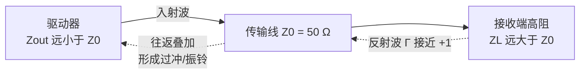
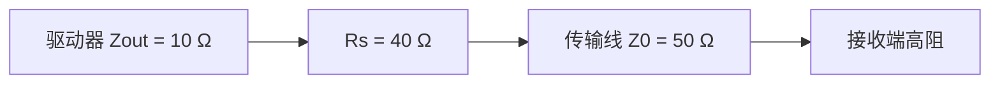
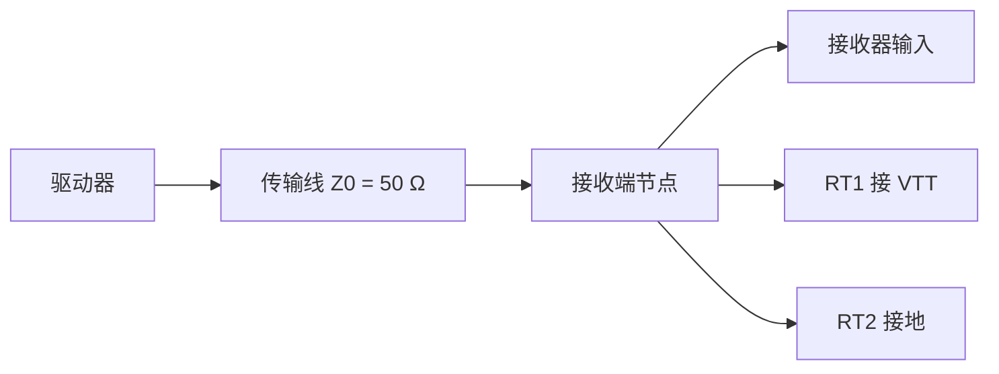

# 信号完整性

**信号完整性**（Signal Integrity, SI）指信号从驱动端传播到接收端的过程中，保持波形形状与定时信息正确的能力。当互连线的电气行为从"理想导线"退化为分布参数网络时，信号波形会出现三类经典畸变：**过冲**（Overshoot）——上升沿第一个峰值超过稳态高电平的幅度；**下冲**（Undershoot）——下降沿第一个谷值低于稳态低电平的幅度；**振铃**（Ringing）——信号在稳态电平附近反复衰减振荡的现象。三者同源：阻抗不连续引起的反射（Reflection），属于同一个问题的不同表象。

## 过冲产生的判据：上升时间决定"高速"

判断一个数字系统是否需要按传输线对待，依据的是**上升时间**而不是时钟频率：

$$t_r \le 2 \cdot t_{pd}$$

其中 $t_r$ 为信号上升时间（10% 至 90%），$t_{pd}$ 为信号在互连线上从驱动端到接收端的单向传播延迟。当上升时间小于 2 倍传播延迟（更保守的经验判据是小于往返延迟的 1/4 至 1/6）时，反射波会在边沿翻转完成之前回到驱动端叠加在信号上，传输线效应不可忽略。例如上升时间 3 ns、传播延迟 5 ns/m 时，走线超过 30 cm 即产生显著反射。

工艺演进让上升时间越来越快：信号的有效带宽（Knee Frequency）约为 $f_{BW} \approx \frac{0.35}{t_r}$——上升时间 500 ps 对应约 1 GHz 带宽。同样的走线长度在旧工艺下是"集总导线"、在新工艺下成为"传输线"——这是沿用旧板级设计在新芯片上突然出现信号质量问题的常见原因。

## 反射机理

传输线具有**特性阻抗**（Characteristic Impedance）$Z_0$（PCB 走线常见 50 Ω 单端/100 Ω 差分）。信号传播到阻抗不连续处时，部分能量被反射回源端，反射系数（Reflection Coefficient）：

$$\Gamma = \frac{Z_L - Z_0}{Z_L + Z_0}$$

| 负载情形 | 反射系数 | 后果 |
|:---|:---|:---|
| $Z_L = Z_0$（匹配） | $\Gamma = 0$ | 无反射，波形干净 |
| $Z_L = \infty$（开路，CMOS 高阻输入） | $\Gamma = +1$ | 全幅正向反射，叠加出过冲 |
| $Z_L = 0$（短路） | $\Gamma = -1$ | 全幅负向反射，产生下冲 |

数字系统的典型过冲场景：驱动端输出阻抗 $Z_{out}$ 通常只有 10-35 Ω（低于 $Z_0$），接收端 CMOS 输入近似开路——反射波在两个失配端之间来回反弹，每次边沿翻转后在稳态电平上叠加出衰减振荡，即过冲与振铃。反射波往返过程：

## 过冲与振铃的危害

过冲不是"波形难看"的审美问题，它有五类实际后果：

（1）**器件损伤**：过冲电压叠加在电源轨上可能超过器件**绝对最大额定值**（Absolute Maximum Rating, AMR）——输入保护二极管被正向导通注入大电流、栅氧化层承受过压应力，器件提前老化失效；（2）**噪声裕量损失**：过冲与振铃幅度直接侵蚀 $V_{IH}$/$V_{IL}$ 之外的噪声裕量，系统抗干扰能力下降；（3）**误触发与假时钟**：振铃幅度落入不确定区时，一个边沿可能被接收端计为多次翻转，产生假时钟或重复采样；（4）**时序裕量收缩**：振铃使信号越过阈值电压的时刻发生抖动，眼图（Eye Diagram）闭合，高速接口的误码率（Bit Error Rate, BER）上升；（5）**电磁干扰**（Electromagnetic Interference, EMI）：振铃的高频分量是辐射发射的主要来源。

## 端接匹配策略

**端接**（Termination）是在阻抗失配处并联或串联匹配阻抗、吸收反射能量的设计手段。三种主流方案：

### 源端串联端接

在驱动器输出与传输线之间串联电阻 $R_S$，使 $Z_{out} + R_S = Z_0$：

驱动端匹配后入射波幅值减半，接收端（开路）的首次全反射回到源端时被串联电阻吸收，此后反射终止。**优点**：无直流功耗（串联电阻上只有翻转期间的瞬态电流）、布线简单；**局限**：只对源端吸收有效、接收端必须保持高阻，且匹配效果依赖驱动器输出阻抗的准确度（PVT 漂移）。适用于单向点对点/菊花链拓扑与中等速率（约 100 MHz 级）的控制/地址总线。

### 终端并联端接（戴维南端接）

在传输线末端跨接匹配电阻，使负载阻抗等于 $Z_0$，反射在产生前就被消除。常见形式是**戴维南端接**（Thevenin Termination）：上拉 $R_{T1}$ 接 $V_{TT}$、下拉 $R_{T2}$ 接地，满足 $R_{T1} \parallel R_{T2} = Z_0$ 且 $V_{TT} = \frac{V_{DD}}{2}$：

**优点**：彻底消除反射、信号质量最佳；**代价**：持续直流功耗——以 DDR4 1.2 V 系统为例（$V_{TT} = 0.6$ V、$Z_0 = 50$ Ω），每路端接功耗约 7.2 mW，64 位数据总线的端接总功耗不可忽略。多用于对功耗不敏感、要求最高信号质量的场合（如高速 ADC 接口、DDR 数据线的 VTT 端接）。

### 片上终结（ODT）

**片上终结**（On-Die Termination, ODT）将端接电阻集成进接收芯片内部，由寄存器编程档位，配合 ZQ 校准逐档逼近外部精密电阻（240 Ω）基准——阻抗匹配精度直接决定反射与眼图质量，工艺/温度/电压漂移由周期性重校准补偿。DDR4/DDR5 的 ODT 档位选择与训练流程详见 [[architecture/concepts/DDR接口与PHY训练|DDR 接口与 PHY 训练]]。

**何时可以不用端接**：走线足够短（传播延迟远小于上升时间，反射波在边沿翻转完成前就被边沿自身"淹没"）时，波形失真轻微，可省去端接以节省功耗与器件——这正是低速短距板级走线普遍无端接的原因。

## 抑制手段总览

除端接外，过冲与振铃的抑制贯穿板级与芯片级设计：

| 手段 | 作用机理 | 代价/注意 |
|:---|:---|:---|
| 降低驱动强度/压摆率控制 | 拉缓边沿，$t_r$ 增大使走线回归集总行为 | 牺牲速度，高速接口不可用 |
| 连续参考平面 | 保持 $Z_0$ 恒定，避免跨分割 | 层叠与电源平面规划成本 |
| 点对点/Fly-by 拓扑 | 避免 T 型分支的多反射叠加 | 布局走线约束变严 |
| 过孔残桩反钻 | 消除过孔残桩的容性失配 | 增加制板工序 |
| 去耦电容 | 压制**电源完整性**（Power Integrity, PI）相关的同步开关噪声（Simultaneous Switching Noise, SSN） | 面积与成本 |
| SI 仿真验证 | 时域反射（Time-Domain Reflectometry, TDR）与眼图仿真提前量化反射 | 需要 IBIS/SPICE 模型与仿真流程 |

## 芯片级与签核视角

过冲问题在芯片设计流程中有三个落点：

（1）**输出缓冲器设计**：片内 I/O 缓冲器通过驱动级分档并联、输出级晶体管缓冲结构控制过冲——在不引入反馈的前提下同时压低开关噪声；（2）**与串扰的边界**：过冲是同一线网自身的反射效应，**串扰**（Crosstalk）是线网之间的耦合效应——片内互连的串扰噪声与串扰延迟在 SI 签核与 STA 中处理，见 [[asic-flow/concepts/签核|签核]] 与 [[asic-flow/concepts/静态时序分析|静态时序分析]]；（3）**时钟信号的完整性约束**：时钟树综合以过渡时间（Slew/Transition）上限约束时钟沿质量，过缓或过差的时钟沿扩大寄存器的有效建立-保持窗口并增加短路功耗，见 [[asic-flow/concepts/时钟树综合|时钟树综合]]。

## 关键要点

- **过冲/下冲/振铃同源于反射**：阻抗不连续处的反射系数 $\Gamma = \frac{Z_L - Z_0}{Z_L + Z_0}$ 决定反射幅度与极性——开路正反射叠加出过冲，短路负反射产生下冲
- **上升时间决定高速性**：$t_r \le 2 \cdot t_{pd}$ 时传输线效应显著——判断依据是边沿速率而非时钟频率，有效带宽 $f_{BW} \approx \frac{0.35}{t_r}$
- **过冲的直接危害是器件损伤**：叠加后的电压可能超过 AMR，保护二极管导通、栅氧过压应力——这是可靠性问题而非单纯的功能问题
- **源端串联端接零直流功耗**：入射波减半、首次反射回源端被吸收——适合单向点对点、接收端高阻的中低速总线
- **终端并联端接彻底消除反射**：戴维南结构 $R_{T1} \parallel R_{T2} = Z_0$、$V_{TT} = \frac{V_{DD}}{2}$——以持续直流功耗换取最优信号质量，DDR 的 VTT 是典型应用
- **ODT 把端接做进芯片**：可编程档位 + ZQ 校准对抗 PVT 漂移——反射与眼图质量直接依赖阻抗匹配精度
- **短走线可以无端接**：传播延迟远小于上升时间时反射波被边沿自身淹没——低速短距板级走线普遍省去端接的原因
- **过冲与串扰是两类问题**：前者是线网自身的反射效应，后者是线网间的耦合效应——串扰在 SI 签核与 STA 中以时序窗口过滤处理
- **振铃落入不确定区产生假时钟**：一个边沿被计为多次翻转，是系统误读/写与逻辑紊乱的经典来源

## 与其他概念的关系

- [[asic-flow/concepts/签核|签核（Signoff）]] — SI 签核分析串扰噪声与串扰延迟，与过冲同属信号完整性问题域，但处理的是片内线网间的耦合
- [[asic-flow/concepts/静态时序分析|静态时序分析（STA）]] — 串扰延迟的时序窗口过滤、时钟抖动的建模——SI 感知的 STA 是先进节点签核标配
- [[architecture/concepts/DDR接口与PHY训练|DDR 接口与 PHY 训练]] — ODT 与 ZQ 校准、读写训练把采样点放在眼图中心——高速接口信号完整性的工程落地
- [[asic-flow/concepts/时钟树综合|时钟树综合（CTS）]] — 时钟信号的过渡时间与信号完整性约束，时钟网络功耗与质量权衡
- [[concepts/CMOS基础|CMOS 基础]] — 输出驱动阻抗、输入栅电容等端接参数背后的器件物理
