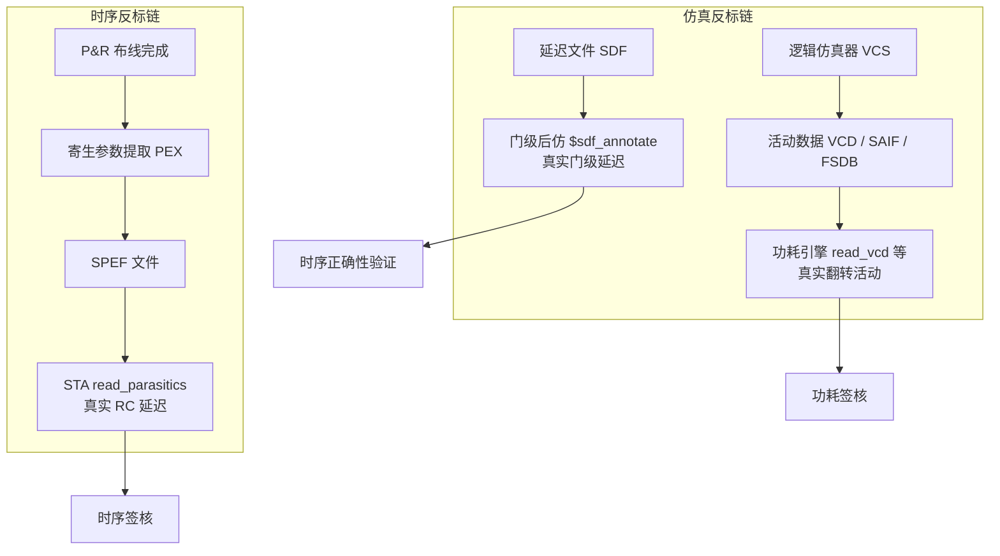

# 反标

反标（Back-Annotation，又称回标或反向标注）是 ASIC 实现流程中跨阶段的信息回填机制——把设计流程下游产生的真实物理数据（寄生参数、时序延迟、开关活动）回填到上游分析工具所用的抽象模型中，用"真实值"替换"估算值"。反标是理解全流程精度递进的钥匙：签核的每一步精度提升，几乎都对应一次反标。

## 原理

### 跨阶段信息缺口与反标的必要性

ASIC 流程分层推进，每一阶段的分析工具都缺失下游阶段的物理信息：综合（Synthesis）阶段没有物理布局，互连延迟只能用线负载模型（Wire Load Model, WLM）按扇出估算（误差 15%-30%）；布局布线（Place & Route, P&R）完成之前时钟树尚不存在，静态时序分析（Static Timing Analysis, STA）只能以理想时钟（Ideal Clock，偏斜为零）分析；RTL 仿真是零延迟事件驱动，看不到真实毛刺。反标就是填补这些缺口的机制：下游工具把真实数据写成标准交换格式文件（SPEF/SDF/VCD 等），上游分析工具按名称匹配回填到对应对象上，分析精度随反标逐级收敛。

### 三类反标数据与三条链路

反标数据按"反标什么"分为三类，分别服务时序、仿真与功耗三条链路——三者标准不同、目标工具不同，不可互换：

| 数据类型 | 标准 | 内容 | 反标目标 | 典型命令/机制 | 反标后效果 |
|:---|:---|:---|:---|:---|:---|
| SPEF（Standard Parasitic Exchange Format, 标准寄生参数交换格式） | IEEE 1481 | 每线网分布式 RC 参数（$\pi$ 模型、耦合电容） | STA / 功耗引擎 | `read_parasitics` | WLM 估算切换为真实互连延迟，误差降至 5% 以内 |
| SDF（Standard Delay Format, 标准延迟格式） | IEEE 1497 | 单元与互连延迟（min:typ:max）、setup/hold 检查值 | 门级仿真器 | `$sdf_annotate` | 零延迟切换为真实门级时序，毛刺可见 |
| VCD/SAIF/FSDB | IEEE 1364 / 业界标准 | 仿真波形或翻转统计 | 功耗引擎 | `read_vcd` / `read_saif` / `read_fsdb` | 默认翻转率切换为真实活动，功耗精度 5% 以内 |

VCD（Value Change Dump, 值变化转储）、SAIF（Switching Activity Interchange Format, 开关活动交换格式）与 FSDB（Fast Signal Database, 快速信号数据库）三者的格式差异见 [[asic-flow/concepts/功耗分析|功耗分析]]。时钟树的"理想时钟 → 传播时钟（Propagated Clock）"切换本质上也属于 SPEF 反标——CTS 后的时钟树延迟经提取写入 SPEF，再反标回 STA。

### 反标机制：名称匹配与映射

反标按名称匹配执行：反标文件中的层次路径必须与网表实例路径一一对应，工具才能把数据挂到正确对象上。综合会重命名、展平层次，破坏 RTL 与门级网表的对应关系——`read_saif` 的 `-strip_path` 选项与映射文件正是为此设计。**反标缺失时工具静默回退（Fallback）到默认值**（WLM、默认翻转率 0.1、库标称延迟）——不报错、不提示，精度静默退化，这是反标工程实践中最隐蔽的坑。因此反标覆盖率检查是签核前必修：STA 用 `check_timing` 检查寄生反标完整性，PTPX 用 `report_switching_activity -list_not_annotated` 列出未反标线网。

### 理想模型 → 真实模型切换总表

反标贯穿流程的四个关键切换点，每个切换点都是一次精度质变：

| 抽象维度 | 反标前（理想/估算） | 反标后（真实） | 数据载体 | 切换时机 |
|:---|:---|:---|:---|:---|
| 时钟延迟 | 理想时钟（偏斜为 0） | 传播时钟（时钟树真实延迟） | SPEF | CTS 之后 |
| 互连延迟 | WLM 估算（误差 15%-30%） | 提取的分布式 RC | SPEF | 布线之后 |
| 门延迟 | 库标称延迟 | 工艺角真实延迟（min:typ:max） | SDF | 门级后仿 |
| 翻转活动 | 默认翻转率（0.1） | 仿真波形真实统计 | VCD/SAIF/FSDB | 仿真之后 |



### SDF 反标代码示例

```systemverilog
// 仅仿真（Testbench only）：门级后仿反标 SDF 延迟
initial begin
    $sdf_annotate("top.sdf", dut);
    // $sdf_annotate  系统任务：把 SDF 文件中的延迟值反标到指定网表实例
    // 参数1         SDF 文件路径：P&R 后由延迟计算工具生成的标准延迟格式文件
    // 参数2         反标目标实例：dut 的层次路径须与 SDF 内 INSTANCE 路径一致
    // 反标完成后仿真器按 SDF 延迟推进事件，毛刺与竞态行为变得可见
end
```

STA 与功耗的反标命令已分别在 [[asic-flow/concepts/静态时序分析|静态时序分析]]（`read_parasitics`）与 [[asic-flow/concepts/功耗分析|功耗分析]]（`read_vcd`/`read_saif`/`read_fsdb` 及反标优先级）中给出完整示例，此处不重复。

## 关键要点

- **反标的本质是跨阶段信息回填**：下游物理数据替换上游抽象估算——WLM 换 SPEF、零延迟换 SDF、默认活动换 VCD/SAIF，每切换一次精度上一个台阶
- **三类数据三条链路**：SPEF（寄生 RC）反标到 STA/功耗引擎；SDF（延迟）反标到门级仿真器；VCD/SAIF/FSDB（活动）反标到功耗引擎——标准不同、目标工具不同，不可互换
- **名称匹配是反标前提**：反标文件层次路径须与网表实例一致；综合改名/展平破坏对应关系，`-strip_path` 与映射文件为此设计
- **反标缺失静默降精度**：工具不报错而是回退默认值（WLM、默认翻转率 0.1、库标称延迟）——`check_timing` 与 `report_switching_activity -list_not_annotated` 的反标覆盖率检查是签核前必修
- **理想到真实的四个切换点**：CTS 后理想时钟换传播时钟、布线后 WLM 换 SPEF、门级后仿 SDF 反标、仿真后活动反标——每个切换点都是精度质变点
- **SDF 反标使毛刺可见**：RTL 零延迟仿真看不到毛刺，SDF 反标的门级仿真才能捕获毛刺活动（毛刺功耗占动态功耗 20%-30%）
- **反标数据决定签核可信度**：SPEF 反标后 STA/功耗误差 5%-10%，无寄生反标停留在 10%-15% 以上——签核必然建立在反标数据之上
- **反标覆盖 3D 设计的跨 Die 路径**：TSV 寄生进入 SDF/SPEF 反标，跨 Die 路径的反标完整性是 3D 签核的特殊难点

## 与其他概念的关系

- [[asic-flow/concepts/静态时序分析|静态时序分析（STA）]] — `read_parasitics` 反标 SPEF 是签核 STA 的前提；理想时钟到传播时钟的切换点是时序分析质变点
- [[asic-flow/concepts/功耗分析|功耗分析（Power Analysis）]] — VCD/SAIF/FSDB 活动反标与反标优先级；未反标线网回退默认翻转率
- [[asic-flow/concepts/RTL与网表|RTL 与网表]] — 带反标网表（SPEF+SDF 反标后的物理网表）是网表五维分类之一
- [[asic-flow/concepts/布局布线|布局布线（P&R）]] — 寄生参数提取（PEX）是 SPEF 的源头；提取关联保证 P&R 与签核提取的一致性
- [[asic-flow/concepts/物理验证|物理验证（Physical Verification）]] — LVS 通过后的 PEX 输出 SPEF 供 STA 反标，PEX 精度直接决定反标质量
- [[asic-flow/concepts/时钟树综合|时钟树综合（CTS）]] — CTS 后时钟树延迟经 SPEF 反标，理想时钟切换为传播时钟
- [[asic-flow/concepts/签核|签核（Signoff）]] — 时序、功耗、IR 压降签核全部建立在反标数据之上
- [[verification/concepts/仿真加速与CRDB|仿真加速与 CRDB（Siloti）]] — CRDB 提供门级与 RTL 的信号映射，是 SDF 反标到加速模型（Replay Simulation）的桥梁
