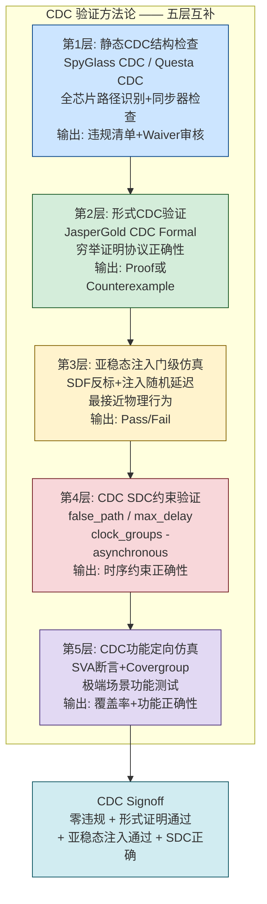
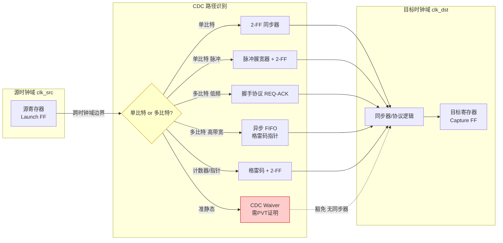

# 跨时钟域

跨时钟域（Clock Domain Crossing, CDC）是数字 IC 设计中连接不同时钟频率或不同相位域的关键技术。当信号从一个时钟域驱动而在另一个时钟域采样时，如果两个时钟之间没有固定的相位关系（异步时钟），采样时钟上升沿可能恰好落在数据信号的翻转窗口内，触发亚稳态（Metastability）——锁存器输出在不可预测的时间内振荡或停留在中间电平，导致下游逻辑出现非确定性行为。

## 原理

### 亚稳态的根源与 MTBF

亚稳态的根源在于时序电路的基本物理约束：当 DFF 的输入信号在建立时间（Setup Time, Tsu）之前和保持时间（Hold Time, Th）之后必须保持稳定，否则触发器内部的正反馈环路（交叉耦合反相器对）无法在合理时间内解析出确定的 0 或 1。当输入违反建立保持窗口时，DFF 输出进入亚稳态——电压值停留在 VDD/2 附近，经过一段解析时间（Resolution Time, Tres）后随机翻转到 0 或 1。解析时间是概率性的：MTBF = e^(Tres/τ) / (fd * fc * T0)，其中 τ 是 DFF 的解析时间常数（与工艺相关，40nm 工艺约 20-50ps，7nm 工艺约 5-10ps），fc 是采样时钟频率，fd 是数据翻转频率，T0 是工艺常数。MTBF（Mean Time Between Failures）是评估同步器可靠性的核心指标——目标值通常为 1000 年（约 3.15 * 10^10 秒）以确保量产芯片的鲁棒性。

### 同步器分类

同步器（Synchronizer）通过在跨时钟域边界插入等待时间来解决亚稳态。两级 DFF 同步器（2-FF Synchronizer）是最基本、最广泛使用的单比特同步方案：信号在发送域产生后通过两级串联的 DFF（采样时钟为目标域时钟），第一级 DFF 承担亚稳态风险（允许解析时间 Tsync），第二级 DFF 采样第一级已稳定（或大概率已稳定）的输出。两级同步器的 MTBF 与第一级的 Tres 指数相关——增大 Tres（即第一级和第二级之间的组合逻辑延迟，或使用专用同步器单元）可指数提升 MTBF。关键设计约束：两级 DFF 之间不得有任何组合逻辑（Cloud），因为任何组合延迟都会消耗 Tres 预算从而降低 MTBF。

多级同步器在极高频率（GHz 级）或极高可靠性要求（汽车/航空 ASIL）时使用三级甚至四级 DFF 进一步降低亚稳态传播概率。但每增加一级 DFF 就增加一个目标时钟周期的延迟。同步器单元在标准库中通常特殊标注（如 `SYNC_DFF`），其内部反相器对被设计为更快解析（小 τ），版图上被靠近放置以最小化走线延迟。同步器还需防止综合工具对两级 DFF 做"冗余寄存器优化"——如果综合工具认为两级串联 DFF 是冗余的而合并为一级，同步器就完全失效了。使用 `(* DONT_TOUCH = "TRUE" *)` 属性或 `set_dont_touch` 约束来保护。在物理设计中，同步器的两级 DFF 还需放置在同一标准单元行内、间距控制在 50-100um 以内，且禁止在两个 DFF 之间的信号路径上插入缓冲器——任何插入的缓冲器都会消耗解析时间 Tres 的预算。部分工艺库专门提供"同步器单元"（Sync Cell），内置双 DFF 硬连接、优化物理布局、标注 `dont_touch` 属性，将同步器设计的物理风险降到最低。

### Gray-coded 异步 FIFO

异步 FIFO 是跨时钟域传输多比特数据总线的最常见方案。写端口在一个时钟域将数据压入 FIFO，读端口在另一个时钟域取出数据——两者完全异步，FIFO 通过满/空标志来管理流控。满和空的判断依赖于对读写指针的比较，但两个指针运行在不同时钟域——直接跨域传递二进制指针会出现"多位同时翻转"的 CDC 违反。例如指针从 `0111` 翻转到 `1000`（加 1），所有四位同时翻转，目标域可能采样到任意中间值（如 `1111` 或 `0000`），导致空/满判断严重错误。

Gray 码（Gray Code）每步仅一位改变，彻底解决了多比特指针同步问题。二进制到 Gray 码转换公式：`g = b ^ (b >> 1)`；Gray 码到二进制转换通过异或累加实现。实现流程：（1）将写指针（二进制）转换为 Gray 码；（2）Gray 码通过 2-FF 同步器跨到读时钟域；（3）读域将同步后的 Gray 码转换回二进制并与读指针比较生产空标志（empty）。写域以对称方式将读指针同步过来生产满标志（full）。关键约束：FIFO 深度必须是 2 的幂（如 2、4、8、16...）以保证 Gray 码环绕时每位也仅一位改变。不满足 2 的幂条件时需使用多比特扩展 Gray 码方案（如 n-bit FIFO depth < 2^k，使用 k 位 Gray 码+额外转换逻辑）。

完全（Full）产生：当写指针 + FIFO 深度 == 读指针的同步版本时，写端无法写入。空（Empty）产生：当读指针 == 写指针的同步版本时，读端无数据可读。由于跨域同步有 2-3 个目标时钟周期的延迟，空/满标志是保守的——保守满（稍早置位）和保守空（稍早置位）确保了 FIFO 绝对不会溢出或下溢。这种保守策略保证了功能正确性，代价是 FIFO 的可用深度略小于物理深度（实际可用 = physical_depth - 2 * sync_stage_count）。

### 握手同步

握手同步使用请求-应答协议在跨时钟域间可靠传递数据。四相握手（4-Phase / Level-Handshake）：发送端置位 REQ 和数据，等待 ACK；接收端检测 REQ 采样数据后置位 ACK；发送端检测 ACK 后取消 REQ；接收端检测 REQ 取消后取消 ACK——整个四相传输至少需 2 * (T_tx + T_sync + T_rx)。每次数据传输经过四个阶段（REQ 断言、ACK 断言、REQ 消亡、ACK 消亡）各需一次同步延迟，给出一个周期时间 4 * sync_delay 的完整传输周期。

两相握手（2-Phase / Transition-Triggered / Toggle）使用跳变而非电平表示：REQ 每完成一次传输就翻转（Toggle）极性；接收端检测 REQ 跳变后采样数据然后翻转 ACK。两相握手将四相周期减少一半（约 2 * sync_delay 每传输），适合高频交互场景。两相的代价是每端需一个额外的 DFF 保持上一周期的 REQ/ACK 状态以检测边沿。选择准则：短数据帧优先四相（逻辑简单），高频大块传输优先两相（延迟小）；当数据传输间隔远大于同步延迟时两者的吞吐差异不明显。

### 多比特 CDC 策略

多比特跨时钟域传输面临的根本挑战：不可用 N 个独立的 2-FF 同步器分别处理 N 位信号——虽然每比特都有 2-FF 保障，但不同比特的 2-FF 独立经历亚稳态可能导致数据在不同目标时钟沿被采样（其聚合值在某一周期可能是"未到达"的旧值和"已到达"的新值的混合）。三种标准方案：（1）DMUX 方案——发送域先稳定数据总线，再产生同步使能（Enable）脉冲使能通过 2-FF 同步到目标域后采样已稳定的数据。要求数据在使能同步期间保持不变（发送域不提前改变数据）；（2）握手方案——数据与 REQ/ACK 配对传输，REQ 断言后数据不改变直到 ACK 返回；（3）异步 FIFO——Gray 指针同步 + 双端口 RAM，最高带宽和数据深度。选择取决于带宽需求：DMUX 延迟最小但带宽最低，握手适合中低带宽，异步 FIFO 提供最高吞吐。

### 复位域跨越

复位域跨越是 CDC 的一个特殊子问题。当复位域的输出信号在目标域复位释放时被采样，如果目标域释放复位的时序恰好发生在该信号的不稳定期间，可能导致亚稳态。解决方案是将复位顺序与同步器串联：在目标域释放复位之前确保源域已完成复位释放并进入稳定工作状态——这由系统级的复位排序状态机管理。隔离单元（Isolation Clamp）可强制在扫描/低功耗模式下将跨复位域信号上拉到安全逻辑值。

### CDC 验证工具

CDC 验证是数字 IC Signoff 流程中的关键步骤。主流商用工具：SpyGlass CDC（Synopsys）、Questa CDC（Siemens EDA）、Jasper CDC（Cadence）。CDC 工具通过静态分析设计网表识别所有跨时钟域路径，检查每条路径是否有正确类型的同步器，标记未同步的路径（Unsynchronized CDC Violation）。关键检查项：（1）跨时钟域信号的同步器存在性与类型正确性（单比特 2-FF、多比特 FIFO/Handshake）；（2）异步 FIFO 的 Gray 码指针同步和满空逻辑是否正确；（3）总线聚合一致性——多比特信号是否由同一同步器机制保障，不存在部分同步部分 not 的情况；（4）亚稳态扇出路径——第一级同步器的输出去向不扇出到多个非相关的同步逻辑路径；（5）Reconvergence——两个独立同步的同一源信号在后续逻辑中重新汇聚（CDC 再收敛），可能因不同延迟而导致汇聚前后功能不一致。

CDC 工具通常生成 waiver 机制——设计者通过手动验证确认某些 CDC 信号是安全的（如准静态信号、互斥使能的数据总线等），工具将合理标注为"已审核"（Reviewed/Waived）逐步收敛到零违规状态。这一审核过程是 CDC Signoff 中最依赖人工工程判断的环节。除静态结构检查外，形式 CDC 验证（Formal CDC Verification）——如 Jasper CDC 的形式引擎——通过 SAT/SMT 求解器穷举证明跨域路径在所有可达状态下不存在亚稳态传播，消除了静态分析中因 waiver 审核引入的主观误判风险。形式验证与静态分析互补使用是零缺陷 CDC Signoff 的推荐流程。

### CDC 路径的 SDC 约束

CDC 同步器路径在 STA 中需要特殊约束处理。对于 2-FF 同步器的第一级 DFF 输出到第二级 DFF 输入路径（即同步器的内部路径），使用 `set_false_path` 将第一级设置为时序例外——因为在第一级 DFF 输出可能处于亚稳态的时间段内（解析时间窗口内），第二级 DFF 的建立/保持检查本身没有意义。如果该路径存在且未约束为 false path，STA 工具将报告大量虚假建立时间违规。

对于多比特 CDC 路径（如握手方案的 REQ/ACK 路径），使用 `set_max_delay` 约束替代 false path：要求跨域信号的延迟不超过一个数据稳定窗口（通常为一个目标时钟周期减去同步 DFF 的建立时间），以确保数据到达时仍在接收端的有效采样窗口内。DMUX 方案的使能信号通过 2-FF 同步后，其输出到数据采样 DFF 的延迟也需 `set_max_delay` 约束。CDC 约束的质量直接决定 STA Signoff 的准确性——误标 false path 可能掩盖真正的时序违规，漏标则导致虚假违规淹没真实问题。此外，所有异步时钟域之间必须通过 `set_clock_groups -asynchronous` 声明为异步时钟组——该命令告知 STA 工具不同时钟域之间无确定相位关系、不应在内部分析跨域路径，否则 STA 将在每一对异步时钟上产生巨量虚假违规，使时序报告完全不可读。正确的 `set_clock_groups` 声明与每一条 CDC 路径的 false_path/max_delay 约束配合，共同构成完整的 CDC STA 约束集。

### 准静态信号与 CDC 豁免

并非所有跨时钟域信号都需要完整的同步器链路。准静态信号（Quasi-Static Signal）——在目标时钟域采样时已稳定且至少在多个目标时钟周期内不变——可通过设计保证（而非硬件同步器）安全跨越。典型场景包括：上电后仅写入一次的配置寄存器、由复位控制器在复位期间更新的模式选择信号、由 JTAG 接口在系统空闲时写入的控制字段。申请 CDC waiver 的准静态信号需附带约束证明：使用 `set_data_check` 或等效文档证明信号在 PVT（工艺-电压-温度）变异下不与时钟沿重合——这是 SpyGlass CDC 和 Questa CDC 中最常见的 waiver 类别，正确分类可大幅减少需人工审核的 CDC 违规数量。

准静态信号的 CDC 安全并非绝对——设计必须证明信号在所有系统状态下的稳定时间窗口长于目标域的检测窗口，且该约束在最高工作温度和最低工作电压条件下依然成立（因 PVT 变异会影响信号传播延迟和建立保持窗口）。违反此约束的典型反例：通过 APB 总线写入的配置寄存器——如果 CPU 在配置写入后立即通过中断通知外设读取，中断信号可能先于数据到达稳定状态，导致外设采样到脏数据。此类场景必须在设计规格中明确定义等待周期数。

### 复杂芯片中的时钟域分类

现代复杂 SoC 中包含数十乃至上百个独立时钟域，时钟域的来源和用途可以归纳为以下主要类别：

**1. 处理器核心时钟域（CPU Core Clock Domain）**：CPU 集群的主时钟，通常频率最高（2-4 GHz），由片内 PLL 生成。现代多核处理器中每个核心或每个集群可能有独立的时钟域（per-core DVFS），以支持细粒度的功耗管理。例如，大核（Performance Core）跑 3.0 GHz 执行重负载任务，小核（Efficiency Core）跑 1.5 GHz 处理后台任务——大核集群和小核集群属于不同的独立时钟域。

**2. 总线/互联时钟域（Interconnect/Bus Clock Domain）**：芯片内部总线（AXI/AHB/NoC）通常运行在与 CPU 异步或同步整数比关系的时钟频率。例如，CPU 跑 2.0 GHz，AXI 总线跑 400 MHz（5:1 比率）——即使频率是整数倍关系，如果来自不同的 PLL，这两个域仍是异步关系（因为 PLL 的相位噪声互不相关）。NoC（Network-on-Chip）路由器之间的链路可能各自运行在不同的时钟频率上。

**3. 存储器接口时钟域（Memory Interface Clock Domain）**：DDR SDRAM 的 PHY（物理层）接口运行在极高的频率——DDR5 PHY 可能在 3.2-4.8 GHz（每个数据引脚的等效频率）。DRAM 控制器逻辑通常运行在 PHY 频率的 1/2 或 1/4（因为 DDR 的指令总线位宽是数据总线的 2x 或 4x）。例如，DDR4-3200 的数据选通（DQS）频率 1.6 GHz，控制器命令总线频率 800 MHz——这两个时钟之间的关系由 DLL（Delay-Locked Loop）精确控制相位，属于同步整数比域。

**4. 高速串行接口时钟域（SerDes Clock Domain）**：PCIe、USB 3.x、SATA、Ethernet（25G/100G）等串行接口通过 SerDes（Serializer/Deserializer）将并行数据与串行比特流互转。SerDes 使用从接收数据流中恢复的时钟（CDR, Clock and Data Recovery），与片内系统时钟完全异步。例如，PCIe Gen5 的 SerDes 线速率 32 GT/s，恢复出的并行时钟（如 500 MHz/64-bit 或 250 MHz/128-bit）需要跨域与内部总线域（如 400 MHz AXI）进行 CDC。

**5. 外设接口时钟域（Peripheral Interface Clock Domain）**：低速外设接口——I2C（100 kHz-1 MHz）、SPI（1-50 MHz）、UART（由波特率决定，115200 bps-数 Mbps）——通常由独立的低速晶振或 RC 振荡器提供时钟。这些外设时钟通常频率低、相位与系统主时钟完全无关。

**6. 电源管理时钟域（Power Management Clock Domain）**：芯片的电源管理单元（PMU）通常运行在一个独立的常开时钟域（Always-On Domain）——使用 32 kHz 低速晶振作为时钟源（因为 32 kHz 晶振功耗极低，适合常开运行）。PMU 负责管理其他所有时钟域的开关、电压调节和唤醒序列——它本身必须永远在线，即使芯片其余部分已完全掉电。

**7. 调试/测试时钟域（Debug & Test Clock Domain）**：JTAG 接口使用 TCK 时钟（通常 10-50 MHz），与片内系统时钟完全异步。JTAG 链跨多个时钟域时，需要专门的 JTAG CDC 同步逻辑确保调试命令正确传递。扫描测试（Scan Test）中使用专用扫描时钟（Scan Clock），由 ATE（自动测试设备）外部提供。

**8. 多媒体/GPU 时钟域**：GPU 着色器核心、视频编解码器（H.264/H.265/AV1）、ISP（图像信号处理器）、显示控制器（Display Controller）各自有独立的时钟域——因为这些模块的频率需求随分辨率和帧率动态变化（4K@60fps vs 1080p@30fps 的频率差一倍），且它们之间的数据通路是宽并行总线（32-128 位像素数据），CDC 必须通过异步 FIFO 保证数据完整性。

**典型 SoC 中的时钟域数量**：智能手机应用处理器（如高通骁龙、苹果 A 系列）和服务器 CPU 通常包含 30-100+ 个独立时钟域。每增加一个时钟域，CDC 验证的复杂度呈超线性增长——因为任意两个异步时钟域之间都可能存在跨域信号路径（$N$ 个时钟域意味着 $O(N^2)$ 个潜在的时钟域对需要逐一验证）。

**时钟域识别的设计阶段**：在架构设计阶段应绘制**时钟域地图**（Clock Domain Map）——一张标注了所有时钟域、时钟频率、时钟源（哪个 PLL/OSC）、域间电压关系的框图。时钟域地图是 CDC 验证的起点：所有跨时钟域边界标记为 CDC 路径，逐条设计同步策略。时钟域地图还服务于 UPF 功耗意图——功耗域边界与时钟域边界高度相关（同一功耗域内的模块通常共享同一时钟域，或至少是同步整数比域间关系）。

## 关键要点

- **亚稳态无法完全消除，目标是提高 MTBF**：设计目标是将 MTBF 提高到可接受水平（>1000 年）
- **两级 DFF 同步器是单比特 CDC 基础**：关键约束是两级之间无组合逻辑、综合工具不优化掉第一级
- **Gray 码要求 FIFO 深度为 2 的幂**：非 2 幂需扩展 Gray 编码方案
- **异步 FIFO 空/满标志是保守的**：同步延迟导致略早置位但保证绝不溢出/下溢
- **多比特 CDC 不可用 N 个独立 2-FF**：必须用 DMUX/Handshake/异步 FIFO 保证聚合一致性
- **CDC 验证是 Signoff 必要步骤**：SpyGlass CDC / Questa CDC 通过静态分析标记所有未同步路径
- **第一级同步器输出不应扇出**：不应直接驱动多条非相关同步逻辑路径
- **高可靠性应用需 3-4 级同步器**：车规 ISO 26262 / 航空 DO-254 通常要求更高 MTBF 目标
- **CDC 再收敛是隐性错误的主要来源**：两个独立同步的同源信号汇聚时可能失配
- **SDC 约束策略因同步器类型而异**：2-FF 内部用 `set_false_path`，多比特握手路径用 `set_max_delay` 约束
- **快域到慢域信号可能因重采样丢失**：需电平拉伸器（Pulse Stretcher）或握手协议保证至少 2 个目标时钟周期的数据有效窗口
- **复位跨越必须经复位同步器处理**：未经同步的复位跨越是 CDC 违规的最高危场景之一
- **准静态信号可通过设计保证安全跨越**：需附带 PVT 证明方可申请 CDC waiver，是 CDC Signoff 中最常见的豁免类型
- **CDC 综合陷阱：跨模块放置与忘设 DONT_TOUCH**：同步器两级 DFF 应约束在同一模块内相邻放置、不忘设 DONT_TOUCH
- **形式 CDC 验证与静态验证互补**：形式上穷举证明可消除静态 waiver 审核的主观误判，是车规/航空零缺陷 Signoff 的标准流程
- **格雷码指针位宽由 FIFO 深度决定**：深度为 2^k 时需 k+1 位，额外最高位用于区分满和空状态
- **总线频闪方案通过 Data Valid 同步保证一致性**：通过单独 Data Valid 信号同步保证多比特数据一致性，是 DMUX 方案变体
- **设计规范明确定义 CDC 要求**：如 ARM IHI 0033（GIC 规范），违规路径必须在架构评估阶段识别修正
- **CDC 验证应在 RTL 冻结时启动**：以未同步路径数归零为门限，确保回修改的成本可控

## 与其他概念的关系

- [[concepts/亚稳态|亚稳态（Metastability）]] — CDC 的物理根源，亚稳态的 MTBF 公式和解析时间理论是同步器设计的基础；τ（解析时间常数）在 7nm 工艺约 5-10ps，40nm 约 20-50ps，工艺越先进同步器所需级数越少
- [[cross-domain/concepts/复位策略|复位方法学（Reset Methodology）]] — 复位域跨越是 CDC 的特殊子问题，复位同步器遵循与 CDC 同步器相同的两级 DFF 设计原则；复位释放时序的恢复/移除检查与 CDC 的 MTBF 分析在数学上对偶
- [[rtl-design/concepts/跨时钟域设计|RTL CDC 跨时钟域设计]] — RTL 编码层面的 CDC 实施指南，涵盖同步器实例化、FIFO 封装、综合属性（DONT_TOUCH）等编码规范；SpyGlass CDC 等的结构检查规则直接对应 RTL 编码模式
- [[asic-flow/concepts/静态时序分析|静态时序分析（STA）]] — CDC 同步器的时序例外（False Path / set_max_delay / set_min_delay）在 STA 中需要特殊的 SDC 约束；CDC 路径的错误约束是 STA Signoff 中最常见的设计者引入的误导性违规来源
- [[cross-domain/concepts/低功耗设计|低功耗设计（Low-Power Design）]] — 多电压域（Multi-Voltage Domain）和电源关断（Power Gating）引入了额外的 CDC 边界：不同电压域之间的信号跨越需要电平转换器（Level Shifter）和隔离单元（Isolation Cell），其同步策略需与电压域状态机协同设计

### CDC 验证方法

CDC 验证（CDC Verification）是 ASIC Signoff 流程中的关键步骤——CDC 错误在 RTL 仿真中几乎不可能复现（仿真器用确定性调度处理时序），但在硅片上以极低但非零的概率出现，是最难调试的功能性缺陷。CDC 验证通过**多层次互补方法**系统性地检测和消除跨时钟域风险。

**第一层：静态 CDC 结构检查（Structural CDC Analysis）**

主流工具：Synopsys SpyGlass CDC、Siemens Questa CDC、Cadence Jasper CDC。通过分析设计网表（RTL 或门级），识别所有跨时钟域路径，逐条检查同步器是否以正确方式存在。关键检查项：

- **未同步路径（Unsynchronized Crossing）**：单比特或多比特信号直接跨越异步时钟边界，没有任何同步器——这是最高严重度的违规，必须修复
- **同步器结构正确性**：2-FF 级间距/布局是否正确、`ASYNC_REG` 属性是否标记、级间是否有禁止的组合逻辑
- **多比特 CDC 聚合同步**：多比特数据总线是否使用了格雷码/握手/FIFO/DMUX 等正确的同步方案——检测各比特独立 2-FF 的违规
- **格雷码正确性**：异步 FIFO 的指针编码/解码逻辑是否正确，空满判断逻辑是否满足保守约束
- **亚稳态扇出（Metastability Fanout）**：第一级同步器输出是否扇出到多个不相关的逻辑路径——可能因扇出路径的时序差异导致再收敛问题
- **CDC 再收敛（Reconvergence）**：两个独立同步的同源信号在目标域重新汇聚——因同步延迟差异可能导致功能错误
- **复位域交叉**：复位信号在不同时钟域间的传播路径是否存在亚稳态风险

静态检查工具生成违规报告，设计者逐条审核并确认修复或申请 **Waiver（豁免）**。Waiver 审核是 CDC Signoff 中最依赖人工工程判断的环节。

**第二层：形式 CDC 验证（Formal CDC Verification）**

使用形式验证引擎（如 JasperGold CDC Formal）通过 SAT/SMT 求解器穷举证明跨域路径在**所有可达状态**下不存在亚稳态传播。与静态检查的关键区别：

- 静态检查是**结构驱动**（检查同步器是否存在）——但同步器的存在不保证其正确性
- 形式验证是**功能驱动**（证明同步后数据在所有状态下的一致性）——消除人工 waiver 审核的主观误判

形式验证特别适用于：a) 握手协议的正确性证明（无死锁、数据不丢失）；b) 异步 FIFO 空满逻辑的形式化验证；c) 复杂 CDC 协议的穷举验证。形式验证与静态检查互补使用——静态检查覆盖全芯片 CDC 结构，形式验证聚焦高风险关键路径。

**第三层：亚稳态注入门级仿真（Metastability Injection Gate-Level Simulation）**

在门级网表 + SDF 时序反标的仿真中，工具故意在同步器第一级触发器的输出注入**随机延迟**——模拟亚稳态解析时间的不确定性——然后观测：a) 第二级同步器是否仍有不确定值（X）传播到下游逻辑；b) 多比特 CDC 协议（如握手/FIFO）在亚稳态发生时是否正确处理。

亚稳态注入仿真是与物理行为最接近的验证层级，但仿真时间开销极大——通常仅用于关键 CDC 路径的 Signoff（如处理器到外设的总线接口、DDR 控制器 CDC 桥）。

**第四层：CDC 时序约束验证（CDC SDC Verification）**

STA 中 CDC 路径需要特殊约束：a) 2-FF 同步器的第一级到第二级路径 → `set_false_path`（时序例外）；b) 多比特 CDC 握手/FIFO 的数据路径 → `set_max_delay`（确保数据在接收域采样窗口内稳定）；c) 所有异步时钟域之间 → `set_clock_groups -asynchronous`（告知 STA 不同域无确定相位关系）。CDC SDC 验证确保约束的完整性和正确性——误标 false_path 可能掩盖真正的时序违规，漏标则导致虚假违规淹没真实问题。

**第五层：CDC 覆盖率驱动的定向仿真**

虽然 RTL 仿真无法复现亚稳态，但定向仿真仍可验证 CDC 协议的**功能正确性**：a) FIFO 写满后再写的背压行为；b) FIFO 读空后再读的阻塞行为；c) 同时读写时数据完整性；d) 复位后 CDC 电路的初始化状态是否正确。这些功能场景可以通过 SystemVerilog 断言（SVA）和功能覆盖率（Covergroup）来量化覆盖。

### CDC 路径识别与处理

**CDC 路径（CDC Path）** 是指信号从源时钟域（Launch Clock Domain）的寄存器输出，跨越异步时钟边界，被目标时钟域（Capture Clock Domain）的寄存器采样的**完整传输通路**。一条 CDC 路径包含：源时钟域的驱动寄存器（Source FF）、跨时钟域信号（可能经过组合逻辑）、以及目标时钟域的采样寄存器（Destination FF）——其中源时钟和目标时钟之间没有固定的相位和频率关系（异步时钟）。

**CDC 路径的识别方法**：

1. **时钟分析**：首先通过 SDC 中的 `create_clock` 命令识别所有时钟及其关系。两个时钟域之间如果没有通过 `set_clock_groups -asynchronous` 声明为同步或互斥关系，且没有共同的生成源（如来自同一 PLL 的分频时钟可以是同步的），则信号在这两个域之间传输构成 CDC 路径。

2. **静态 CDC 工具自动识别**：SpyGlass CDC / Questa CDC 通过以下步骤自动识别：a) 解析 RTL 网表获取所有寄存器的时钟连接；b) 基于 SDC 时钟定义和时钟组约束确定时钟域归属；c) 对所有寄存器的输入/输出做扇入/扇出分析——找到驱动时钟域与负载时钟域不同的路径。工具输出完备的 CDC 路径清单，包括源、目标、数据类型（单比特/多比特）、同步器状态等。

3. **设计审查（Design Review）中的手动识别**：a) 检查模块接口——任何跨越不同时钟域模块边界的信号都是候选 CDC 路径；b) 检查顶层时钟域规划图——识别设计的异步接口；c) 检查 IP 集成手册——第三方 IP 的时钟域边界通常有文档说明。

**CDC 路径的处理策略**：

| CDC 路径类型 | 处理方案 | 同步器类型 |
|:---|:---|:---|
| **单比特控制信号**（使能、中断、标志） | 2-FF 同步器（Mark `ASYNC_REG`，禁止级间组合逻辑） | 2-FF / 3-FF |
| **单比特脉冲**（快域→慢域） | 脉冲展宽器 + 2-FF 同步器（或脉冲同步器 Toggle→同步→边沿检测） | Pulse Sync |
| **多比特数据总线**（低频控制/配置） | 握手协议（REQ-ACK，数据稳定后发送 REQ） | Handshake |
| **多比特数据流**（高带宽） | 异步 FIFO（双端口 RAM + 格雷码指针） | Async FIFO |
| **计数器/指针**（性能监控、FIFO 指针） | 格雷码编码 + 2-FF 同步器 | Gray + 2-FF |
| **准静态信号**（上电配置、模式选择） | 设计保证信号在目标域采样时已稳定——可申请 CDC Waiver（需附带 PVT 时序证明） | 无（Waiver） |
| **复位信号**（跨域复位释放） | 复位同步器（Reset Synchronizer）——在目标域打 2 拍后释放 | Reset Sync |

**处理后的验证闭环**：每一条 CDC 路径必须在 CDC 验证流程中有明确的处理结果——a) 有正确类型同步器：静态检查 ✓；b) 已形式验证通过：形式工具 ✓；c) 已亚稳态注入仿真通过：门级仿真 ✓；d) 已审核 Waiver 有充分理由：人工审查 ✓。CDC Signoff 要求 **零未处理违规**（Zero Unresolved Violations）。

**RTL 设计清单**：
1. 在每个模块接口文档中明确标注时钟域归属
2. 所有同步器实例化使用统一的命名约定（如 `u_sync_*`, `u_fifo_async_*`）
3. `ASYNC_REG` 属性在同步器实例化时即标注——不要在综合脚本中后补
4. 同步器所在模块单独做 CDC 检查，确保模块级零违规后再集成
5. 顶层集成后重新运行全芯片 CDC 检查——跨模块 CDC 路径只有在全芯片视角下才能被完整识别

