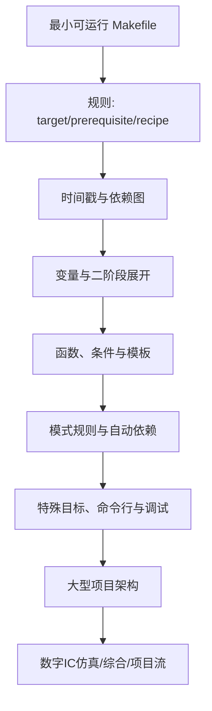

# Makefile 系统学习讲义 v3 — Design Spec

> **背景：** 项目中已有 7 个 Makefile 概念文件（4 通用 + 3 IC 实战），用户认为内容太肤浅、覆盖太不全。v3 的目标不是把 GNU Make 手册搬进知识库，而是构建一套科学、全面、由浅入深、面向初学者且可验证的 Makefile 讲义。

## 总体目标

构建一份从零基础到工程级 Makefile 的完整学习体系，总计 25 个文件，分 10 个 Part。保留全面性，但写作重心从“知识点罗列”调整为“学习闭环 + 可运行实验 + 工程迁移”。

- **面向读者：** 数字IC初学者 + 任何想系统掌握 Makefile 的工程师
- **默认环境：** GNU Make 4.3；所有主线示例必须能在该版本验证
- **版本策略：** GNU Make 4.4+、BSD Make、NMAKE、POSIX Make 差异统一标注为“版本/方言兼容性”
- **内容规模：** 主线教程文件 100-300 行，高级手册/附录文件 200-450 行；不硬性追求总字节数
- **代码规范：** 所有 Makefile / shell / C / TCL 代码块逐行中文注释，解释关键字、符号、变量展开时机和执行阶段
- **验证标准：** 每篇至少包含一个可复制的最小例子，并给出 `make -n`、`make --trace`、`make -p`、`make --warn-undefined-variables` 等可验证命令中的至少一种

## 教学设计原则

### 学习主线

讲义必须优先解决初学者最容易混淆的认知障碍：

1. Make 语法和 Shell 语法不是同一层语言。
2. Make 的读阶段（Read Phase）和目标更新阶段（Target Update Phase）决定了变量、函数和配方的行为。
3. Make 不是脚本顺序执行器，而是基于目标、依赖、时间戳和有向无环图（Directed Acyclic Graph, DAG）的增量构建器。
4. 大型项目中的 Makefile 价值不在“少敲命令”，而在可复现、可诊断、可并行、可移植的构建入口。

### 每篇固定结构

每个概念文件应采用以下结构，避免写成手册条目堆砌：

1. **学习目标**：读完本篇能独立完成什么。
2. **前置知识**：依赖哪些已创建文件；未创建文件先用普通文本或标签，不写 wikilink。
3. **最小可运行例子**：给出完整目录、文件内容、执行命令和预期输出。
4. **语法拆解**：逐行解释关键字、符号、变量和展开时机。
5. **执行轨迹**：用 `make -n`、`make --trace`、`make -p` 或 `make -d` 展示 Make 如何理解该例子。
6. **工程化写法**：把最小例子演进成更接近项目的写法。
7. **常见错误**：至少 3 个本篇相关错误，说明现象、根因、修复。
8. **关键要点**：至少 5 条。
9. **与其他概念的关系**：至少 2 个真实存在文件的 wikilink；批量创建未完成前允许先留为纯文本，最终统一回填。
10. **小练习**：1-3 个可手动验证的练习题。

### 去重规则

- 首次出现某概念时，只讲动机、最小用法和最常见错误。
- 高级篇讲边界条件、诊断方法、版本兼容和复杂工程模式。
- 附录只做速查表和错误索引，不重复长篇原理。
- `.PHONY`、`$(eval)`、自动变量、`$(MAKE_RESTARTS)` 等跨篇内容必须在正文中明确“本篇讲什么、不讲什么”。

## 文件结构

### Part 0 — 导论与第一个闭环（2 文件）

| # | 文件名 | 核心内容 |
|:---|:---|:---|
| 1 | `Makefile解决的问题与第一个例子.md` | 从“为什么不直接写 shell 脚本”开始，构建一个最小 Makefile；解释目标、依赖、配方、默认目标、时间戳、增量构建；用 `make -n` 和 `make --trace` 展示执行轨迹 |
| 2 | `Makefile心智模型与历史.md` | DAG 有向无环图心智模型，二阶段执行模型（Read Phase vs Target Update Phase），Make 历史简述，GNU Make vs BSD Make vs NMAKE vs POSIX Make 方言差异，Make vs CMake/Ninja/Bazel 的定位对比 |

### Part 1 — 规则与配方（2 文件）

| # | 文件名 | 核心内容 |
|:---|:---|:---|
| 3 | `Makefile规则详解.md` | Target/Prerequisite/Recipe 三要素，显式规则，多目标规则，默认目标选择，目标文件与伪目标冲突，`.PHONY` 的最小用法和典型错误 |
| 4 | `Makefile配方与Shell.md` | TAB vs `.RECIPEPREFIX`，`@`/`-`/`+` 前缀，`SHELL` 与 `$(.SHELLFLAGS)`，每行独立 shell 的原因，`.ONESHELL`，行延续 `\`，配方中 `cd` 的陷阱，错误处理（`-` 前缀、`.IGNORE`、`.DELETE_ON_ERROR`、`-k`） |

### Part 2 — 变量系统（2 文件）

| # | 文件名 | 核心内容 |
|:---|:---|:---|
| 5 | `Makefile变量赋值与展开.md` | `=`/`:=`/`?=`/`+=`/`!=` 五种赋值；递归展开变量（recursively expanded variable）与简单展开变量（simply expanded variable）；读阶段展开 vs 目标更新阶段展开；递归展开死循环；`+=` 在不同 flavor 下的展开时机差异 |
| 6 | `Makefile高级变量.md` | 自动变量 `$@`/`$<`/`$^`/`$?`/`$*`/`$%`/`$+`/`$|`，target-specific / pattern-specific 变量，`override`，`export`/`unexport`，环境变量继承与 `-e`，`$(origin)`/`$(flavor)`/`$(value)`，`$(.VARIABLES)` |

### Part 3 — 函数库（3 文件）

| # | 文件名 | 核心内容 |
|:---|:---|:---|
| 7 | `Makefile文本变换函数.md` | `subst`/`patsubst`/`strip`/`findstring`/`filter`/`filter-out`/`sort`/`word`/`wordlist`/`words`/`firstword`/`lastword`/`join`；每个函数给出一个构建系统场景；重点解释空格分隔词表模型 |
| 8 | `Makefile路径与文件函数.md` | `dir`/`notdir`/`suffix`/`basename`/`addprefix`/`addsuffix`/`wildcard`/`realpath`/`abspath`/`file`；区分 Make 级 `$(wildcard ...)` 和 Shell 级 `*`；`$(file ...)` 的读/写/追加模式 |
| 9 | `Makefile控制函数与诊断函数.md` | `$(if)`/`$(or)`/`$(and)`，`$(foreach)`，`$(shell)` 的正确使用与性能陷阱，`$(error)`/`$(warning)`/`$(info)`；GNU Make 4.4+ 的 `$(let)`/`$(intcmp)` 只作为版本特性附录，不进入主线示例 |

### Part 4 — 条件、宏与元编程（2 文件）

| # | 文件名 | 核心内容 |
|:---|:---|:---|
| 10 | `Makefile条件判断.md` | `ifeq`/`ifneq`/`ifdef`/`ifndef`/`else`/`endif`，条件中变量的展开时机，Make 条件和 Shell `if` 的根本区别，平台检测、调试开关、特性门控模板 |
| 11 | `Makefile宏与元编程.md` | `define`/`endef` 多行变量，`$(call)` 参数化模板，`$(eval)` 元编程，`$$` 双重展开，`foreach + eval` 生成规则；强调调试方法和使用边界，避免把新手带入过早抽象 |

### Part 5 — 模式与隐含规则（2 文件）

| # | 文件名 | 核心内容 |
|:---|:---|:---|
| 12 | `Makefile模式规则.md` | `%` 通配符语义，模式规则 vs 显式规则，静态模式规则，stem 概念，`VPATH`/`vpath` 搜索机制，Grouped Targets `&:` 作为 GNU Make 4.3+ 特性讲解 |
| 13 | `Makefile隐含规则.md` | `make -p` 解读隐含规则数据库，后缀规则 `.SUFFIXES`，隐含变量 `CC`/`CFLAGS`/`CXX`/`LDFLAGS`，规则链，`make -r`/`make -R`，`.SUFFIXES:` 清除后缀规则 |

### Part 6 — 依赖管理（2 文件）

| # | 文件名 | 核心内容 |
|:---|:---|:---|
| 14 | `Makefile依赖与自动生成.md` | `include`、`-include`、`sinclude`，`MAKEFILE_LIST`，自动依赖 `.d` 文件三步法，GCC/Clang 依赖选项 `-M`/`-MM`/`-MF`/`-MT`/`-MP`/`-MD`/`-MQ`，依赖文件 remake 触发与 `$(MAKE_RESTARTS)` |
| 15 | `Makefile高级依赖.md` | Order-only prerequisites `|`，目录创建的正确写法，双冒号规则 `::`，二次展开 `.SECONDEXPANSION`，在依赖列表中引用自动变量，remake 循环检测 |

### Part 7 — 特殊目标、内置变量与命令行（2 文件）

| # | 文件名 | 核心内容 |
|:---|:---|:---|
| 16 | `Makefile特殊目标手册.md` | `.PHONY`/`.DEFAULT`/`.IGNORE`/`.SILENT`/`.PRECIOUS`/`.INTERMEDIATE`/`.SECONDARY`/`.DELETE_ON_ERROR`/`.NOTPARALLEL`/`.ONESHELL`/`.POSIX`/`.RECIPEPREFIX`/`.SUFFIXES`；作为手册篇讲触发条件、正确用法、常见误用，不重复基础篇原理 |
| 17 | `Makefile内置变量与命令行.md` | 内置变量：`$(MAKE)`、`$(MAKECMDGOALS)`、`$(MAKEFLAGS)`、`$(MAKELEVEL)`、`$(MAKEFILE_LIST)`、`$(MAKE_RESTARTS)`、`$(CURDIR)`、`$(PWD)`、`$(.FEATURES)`、`$(.VARIABLES)`、`$(.RECIPEPREFIX)`、`$(MAKEOVERRIDES)`、`$(SHELL)`、`$(.SHELLFLAGS)`；命令行选项分组：构建控制、调试信息、目录文件、隐含规则、环境变量、兼容性、版本帮助。注意 `-e` 是环境覆盖，`-E STRING` 是 `--eval=STRING` |

### Part 8 — 架构、调试与性能（2 文件）

| # | 文件名 | 核心内容 |
|:---|:---|:---|
| 18 | `Makefile递归与大型项目.md` | `$(MAKE) -C`，递归 Make 的变量和参数传播，`MAKEFLAGS`，`$(MAKELEVEL)`，构建产物隔离，out-of-source build，include 式 vs recursive 式架构对比，子目录 Makefile 模板 |
| 19 | `Makefile调试与性能.md` | `--debug` 模式，`--trace`，`--warn-undefined-variables`，`$(warning)`/`$(info)`，`$(shell)` 性能开销与 `:=` 缓存，`$(file)` 替代部分 shell 写文件场景，`-j` 并行度，`--output-sync`，跨平台命令差异；`--shuffle` 仅作为 GNU Make 4.4+ 版本特性 |

### Part 9 — 实战（4 文件）

| # | 文件名 | 核心内容 |
|:---|:---|:---|
| 20 | `Makefile小型工程实战.md` | 以小型 C/golden model 工程为载体，演示多级目录、静态库、可执行文件、自动头文件依赖、Debug/Release、ASAN、测试、安装/卸载、打包、覆盖率入口。案例必须足够小，读者关注点保持在 Makefile 而非业务代码 |
| 21 | `Makefile仿真回归实战.md` | EDA 仿真回归流：Questa/VCS/Xcelium 命令封装，seed 管理，test list，filelist，mock dry-run，`-j` 并行仿真调度，覆盖率合并，失败重跑，日志聚合与失败分类 |
| 22 | `Makefile综合流程实战.md` | ASIC 综合流：DC/Genus 命令封装，多 corner 并行，层次化编译，报告自动化，QoR/面积/功耗报告目录，ECO 回注，checkpoint 管理；必须提供无商业 EDA 工具也能 dry-run 的 mock 目标 |
| 23 | `MakefileIC项目构建实战.md` | 层次化 IC 项目 Makefile 框架：IP 库管理，跨 IP 依赖，版本发布，仿真/综合/STA/DFT 统一入口，可复用模板，`.config.mk` 配置模式，CI 退出码和产物目录规范 |

### Part 10 — 附录（2 文件）

| # | 文件名 | 核心内容 |
|:---|:---|:---|
| 24 | `Makefile常见错误50例.md` | 50 个高频错误，分类逐一剖析：错误现象、根因、修复、预防、关联章节。修正已知错误表述：`+=` 不会丢失原值，核心差异是展开时机；`$(eval ...)` 在配方中出现时发生在配方展开阶段，问题是时机混乱和难调试 |
| 25 | `Makefile快速参考与版本兼容.md` | 速查表：变量类型、自动变量、内建函数、特殊目标、命令行选项、模板片段；版本兼容表：GNU Make 4.3 主线、GNU Make 4.4+ 扩展、BSD Make/NMAKE/POSIX Make 差异 |

## 实施约束

1. **替换现有文件**：现有 7 个 Makefile 文件全部重写；不得保留旧的浅层内容作为正文。
2. **新文件命名规范**：`Makefile<主题>.md`，中文简洁标题。
3. **frontmatter**：每个概念文件必须包含 `type`、`tags`、`source_spec`、`queries`；`source_spec` 必须填写真实来源，例如 GNU Make Manual、POSIX make specification、EDA 工具官方手册等。
4. **wikilink 网络**：正文使用 `[[tools/concepts/文件名|显示名]]`；只链接真实存在的 `.md` 文件。批量创建未完成前，引用后续文件用普通文本或 `#标签`，最后统一回填。
5. **MOC 更新**：`tools/工具与脚本.md` 的概念索引、学习路线图、易忘知识点排名需更新。
6. **入口更新**：`数字IC入口.md` 中 tools 领域的新增文件链接需更新。
7. **代码注释标准**：所有代码块逐行中文注释，不能有裸代码；给代码添加注释前必须理解代码实际行为，禁止批量正则生成注释。
8. **图表标准**：依赖图、执行阶段、递归 Make、自动依赖 remake、IC flow 等流程图默认使用 Mermaid，并包含 `%%{init: {'theme': 'default'}}%%`。
9. **验证标准**：主线示例必须在 GNU Make 4.3 下可验证；4.4+ 示例必须明确标注不可在默认环境直接运行。
10. **自指性审计**：新增、删除、重命名文件后必须审计 `tools/工具与脚本.md`、`数字IC入口.md` 和所有 wikilink，避免目录统计和链接失真。

## 实施顺序

### 阶段 A：骨架与引用安全

1. 创建或替换 25 个目标文件的 frontmatter、标题、学习目标和章节结构；不得生成只有标题和一句话的空壳文件。
2. 更新 `tools/工具与脚本.md` 和 `数字IC入口.md` 的目录骨架。
3. 暂不添加指向未创建文件的 wikilink；所有文件存在后再回填。

### 阶段 B：主线教程

按 Part 0 → Part 6 顺序编写，确保每一篇引用的前置知识已经建立。每完成一个 Part，运行一次基本审计：

- `rg "TODO|TBD|占位" tools/concepts`
- `rg "\[\[" tools/concepts tools/工具与脚本.md 数字IC入口.md`
- 本 Part 涉及的最小 Makefile 示例手动执行一次

### 阶段 C：高级工程与实战

按 Part 7 → Part 10 顺序编写。IC 实战必须先写 mock/dry-run 路径，再补真实 EDA 工具接口，保证没有商业工具的环境也能理解流程和验证 Makefile 逻辑。

### 阶段 D：全局收尾

1. 回填所有 wikilink。
2. 审计空心节点风险。
3. 审计 GNU Make 4.3 兼容性。
4. 审计 MOC、入口页、文件数量和学习路线图。
5. 抽查至少 5 篇代表性文章的代码块，确认逐行注释不是模板化空话。

## 质量门槛

最终交付不能只满足“文件数量”。每篇必须能回答三个问题：

1. 初学者读完是否知道这个概念解决什么问题？
2. 是否能复制例子并亲眼看到 Make 的行为？
3. 是否知道这个概念在数字IC工程流中如何迁移使用？
