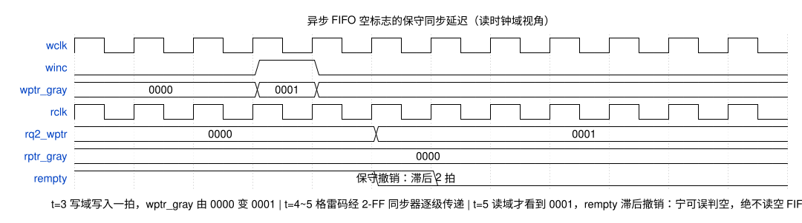

# FIFO 设计

FIFO（First-In First-Out，先进先出队列）是数字IC设计中使用最广泛的数据缓冲结构之一，用于在数据生产者（Producer）和消费者（Consumer）之间提供速率解耦和弹性缓冲。FIFO 的核心设计挑战是空满标志（Empty/Full Flag）的生成——指针比较逻辑需要在写满后阻止写入、读空后阻止读出，同时保证标志的及时性以避免数据丢失或重复读出。FIFO 分为两大类：**同步 FIFO（Synchronous FIFO）** 读写共用同一时钟，设计相对简单；**异步 FIFO（Asynchronous FIFO）** 读写时钟不同——需要引入格雷码指针同步和跨时钟域（CDC）处理，是设计验证的难点之一。

## 同步 FIFO 设计

### 空满判断方法

同步 FIFO 的空满判断核心是读写指针的比较。基本方法有几种：

**1. 额外高位法（MSB 圈数标记）**：读写指针位宽为 `$clog2(DEPTH)+1`，多出的最高位（MSB）用于标记指针绕回的"圈数"。当低地址位相等时：MSB 相同表示读写指针完全一致（FIFO 空），MSB 不同表示写指针比读指针多绕了一圈（FIFO 满）。这是最常用的方法，已在 Verilog-HDL.md 中给出完整实现。

**2. 计数器法**：维护一个 `data_count` 寄存器，每次写操作递增、读操作递减。`data_count == 0` 为空，`data_count == DEPTH` 为满。优点是可以直接获得当前 FIFO 中的数据数量（Occupancy），缺点是需要额外的加减法器和寄存器，且计数器值与指针在仿真中可能出现不一致。

**3. 寄存器标志位法**：在读写指针相等时额外维护一个 `direction` 标志——记录最后一次使指针相等的是读操作还是写操作。如果是读操作（追上了写指针）→ 空；如果是写操作（追上了读指针）→ 满。

下面是基本同步 FIFO 的完整代码实现（已在 Verilog-HDL.md 中给出核心版本，此处补充带数据计数器的完整版本）：

```systemverilog
// ============================================================
// 带数据计数器（Data Count）的深度16、位宽8同步FIFO
// ============================================================
module sync_fifo #(
    parameter DEPTH = 16,                         // FIFO 深度（可参数化）
    parameter WIDTH = 8                           // 数据位宽（可参数化）
) (
    input  logic             clk,                 // 时钟信号（上升沿采样）
    input  logic             rst_n,               // 异步复位（低电平有效，_n 后缀）
    input  logic             wr_en,               // 写使能（1=写入有效，0=无操作）
    input  logic             rd_en,               // 读使能（1=读出有效，0=无操作）
    input  logic [WIDTH-1:0] wr_data,             // 写入数据（WIDTH 位宽）
    output logic [WIDTH-1:0] rd_data,             // 读出数据（WIDTH 位宽）
    output logic             empty,               // 空标志（1=FIFO 为空，禁止读）
    output logic             full,                // 满标志（1=FIFO 为满，禁止写）
    output logic [$clog2(DEPTH):0] data_count     // 数据计数器（当前存储量，0~DEPTH）
);
    // ===== 存储器阵列 =====
    // logic [WIDTH-1:0]：每个存储单元 WIDTH 位宽
    // [0:DEPTH-1]：DEPTH 个存储单元（unpacked 维度）
    logic [WIDTH-1:0] mem [0:DEPTH-1];

    // ===== 读写指针 =====
    // 位宽 $clog2(DEPTH)+1：高1位用于圈数标记，低 $clog2(DEPTH) 位用于SRAM寻址
    logic [$clog2(DEPTH):0] wr_ptr, rd_ptr;

    // ===== 时序逻辑：指针更新与数据存取 =====
    always_ff @(posedge clk or negedge rst_n) begin
        if (!rst_n) begin
            wr_ptr     <= '0;                     // 写指针复位
            rd_ptr     <= '0;                     // 读指针复位
            data_count <= '0;                     // 数据计数清零
        end else begin
            // ----- 写操作：FIFO 未满且写使能有效 -----
            if (wr_en && !full) begin
                // 低 $clog2(DEPTH) 位作为 SRAM 写入地址
                mem[wr_ptr[$clog2(DEPTH)-1:0]] <= wr_data;
                wr_ptr <= wr_ptr + 1'b1;          // 写指针自增（位宽自动回绕）
            end

            // ----- 读操作：FIFO 非空且读使能有效 -----
            if (rd_en && !empty) begin
                // 低 $clog2(DEPTH) 位作为 SRAM 读出地址
                rd_data <= mem[rd_ptr[$clog2(DEPTH)-1:0]];
                rd_ptr <= rd_ptr + 1'b1;          // 读指针自增（位宽自动回绕）
            end

            // ----- 数据计数更新（组合逻辑也可，此处用时序保证同步）-----
            // case 优先级：同时读写时 data_count 不变（一进一出）
            unique case ({(wr_en && !full), (rd_en && !empty)})
                2'b10: data_count <= data_count + 1'b1;  // 只写不读：计数+1
                2'b01: data_count <= data_count - 1'b1;  // 只读不写：计数-1
                default: ;                                 // 同时或都不：计数不变
            endcase
        end
    end

    // ===== 组合逻辑：空满标志生成 =====
    // empty：读写指针完全相等 → 所有数据已被读出
    assign empty = (wr_ptr == rd_ptr);

    // full：低地址位相等 且 最高位（圈数标记）不同
    // 写指针比读指针多绕一整圈 → FIFO 被写满
    assign full  = (wr_ptr[$clog2(DEPTH)-1:0] == rd_ptr[$clog2(DEPTH)-1:0])
                 && (wr_ptr[$clog2(DEPTH)]       != rd_ptr[$clog2(DEPTH)]);

endmodule
```

### Almost Full / Almost Empty

在实际系统中，FIFO 消费者或生产者可能需要**提前预警**以响应背压（Backpressure）。**Almost Full**（几乎满）和 **Almost Empty**（几乎空）标志在 Full 或 Empty 发生前的 N 个周期提前置位：

```systemverilog
// ===== Almost Full / Almost Empty 标志 =====
// 定义阈值：剩余空间 ≤ ALMOST_FULL_THRESH 时触发 almost_full
//          数据量 ≤ ALMOST_EMPTY_THRESH 时触发 almost_empty
localparam ALMOST_FULL_THRESH  = 2;              // 剩余 2 个空位时触发（提前 2 个周期预警）
localparam ALMOST_EMPTY_THRESH = 2;              // 仅剩 2 个数据时触发

// almost_full：DEPTH - data_count ≤ ALMOST_FULL_THRESH
// 即：剩余空间不足
assign almost_full  = (DEPTH - data_count <= ALMOST_FULL_THRESH);

// almost_empty：data_count ≤ ALMOST_EMPTY_THRESH
// 即：可用数据不足
assign almost_empty = (data_count <= ALMOST_EMPTY_THRESH);
```

这些标志广泛用于 AXI Stream 总线背压管理、DMA 控制器的描述符预取，以及视频处理流水线的帧缓冲管理。

### 反压的有限性：水线、在途数据与反压策略

FIFO 深度是有限的，因而它对反压（Backpressure）的容忍能力也是有限的：下游拉低 ready 之后，已"在途"的数据仍会继续到达，FIFO 必须保证在反压生效前的这段时间内不溢出。反压设计要回答的核心问题是：**从反压信号发出到上游真正停住，最多还有多少拍数据会到达，缓冲能否全部接住。**

按反压生效时机与缓冲要求，工程上有三种反压策略：

| 策略 | 反压时机 | 缓冲要求 | 适用场景 |
|:---|:---|:---|:---|
| 立即反压 | 下游无缓存，valid/ready 组合直连，ready 拉低当拍停流 | 无（数据不会多进一拍） | AXI-Stream 直连、无缓存的下游模块 |
| 将满反压 | 水位到达**水线**（水位阈值）时拉低 ready | 预留 ≥ 8 拍（经验值） | 模块间接口、DMA 缓冲 |
| 整包反压 | 反压后允许上游发完当前报文（直到 EOP） | 预留 ≥ MAX_LEN，建议 2×MAX_LEN | 报文/包处理通路 |

将满反压的水线取值不能拍脑袋：反压点与数据源之间存在流水级数 $N$ 时，ready 拉低要经过 $N$ 拍才传导到源头——这 $N$ 拍内源头仍在发送，加上反压信号自身打拍引入的延迟，都是必须被预留空间吸收的**在途数据**（In-Flight Data）。长流水线 ready 传播延迟的寄存化解法（Skid Buffer）见 [[rtl-design/concepts/流水线设计|流水线设计]]。异步 FIFO 满标志 1~2 拍的同步滞后也属于在途效应，只是保守语义已将其自动吸收。因此水线必须满足：水位阈值 + 在途数据量 ≤ 深度。例如深度 128 的缓冲在写满 100 时反压，预留的 28 个空位用于吸收在途数据。


**过度反压是常见设计错误**：多个数据流共用同一 FIFO 读出时（如一类报文读出后分发到两类下游），若"任一类型下游反压就阻塞全部读出"，无关数据流会被无辜阻塞——正确的做法是反压按数据类型/通道**有限地**精确生效：读出的数据属于哪个通道，只受哪个通道的反压约束。反压作用范围越大，性能损失越不成比例。

**无反压能力的源头**是反压设计的边界情形：ADC 采样、传感器/摄像头接口的数据产生节奏由物理过程决定，无法暂停也无法丢弃——这类接口没有 ready 可用，只能（1）保证下游带宽永远大于源速率，或（2）缓冲耗尽时主动丢数据（丢帧）并上报状态。

FIFO 深度为 2 的幂次（16, 32, 64...）时，指针加法器的溢出自动产生自然回绕（rollover），无需额外的取模逻辑。当深度为**非 2 幂**（如 DEPTH=12）时，指针不能依赖自然溢出回绕——需要显式的取模逻辑：

```systemverilog
// ===== 非2幂深度的指针更新 =====
// 方法1：带比较的回绕——当指针达到 DEPTH-1 时归零
always_ff @(posedge clk or negedge rst_n) begin
    if (!rst_n) begin
        wr_ptr <= '0;
    end else if (wr_en && !full) begin
        mem[wr_ptr] <= wr_data;                   // 直接用 wr_ptr 寻址（不需要截低位）
        if (wr_ptr == DEPTH - 1)
            wr_ptr <= '0;                         // 到达末尾：回绕到 0
        else
            wr_ptr <= wr_ptr + 1'b1;              // 未到末尾：正常自增
    end
end

// 方法2：使用取模运算符（综合工具通常能优化，但需要确认）
// wr_ptr <= (wr_en && !full) ? (wr_ptr + 1'b1) % DEPTH : wr_ptr;

// 空满判断也随之改变——不能用 MSB 圈数法
logic [$clog2(DEPTH+1)-1:0] wr_cnt;               // 单独的写计数（追踪写入次数）
logic [$clog2(DEPTH+1)-1:0] rd_cnt;               // 单独的读计数（追踪读出次数）
assign empty = (wr_cnt == rd_cnt);                 // 写入总数 = 读出总数 → 空
assign full  = (wr_cnt - rd_cnt == DEPTH);         // 差值 = 深度 → 满
```

非 2 幂深度的代价是空满判断需要维护独立的读写计数器（而非仅依赖地址指针），增加了面积和关键路径延迟。**在 ASIC/FPGA 设计中通常建议将 FIFO 深度向上调整为最近的 2 的幂**（如 12→16），除非面积约束极为严格。

### FWFT FIFO（First Word Fall Through）

标准 FIFO 在读使能（rd_en）置位后的下一个时钟周期才将数据输出到 rd_data 端口——数据需要"穿过"输出寄存器。**FWFT FIFO**（First Word Fall Through，首字直通）在读使能置位的**同一周期**即将首个数据呈现在输出端口——数据直接从 SRAM 读出并驱动到输出，不经过输出寄存器：

```systemverilog
// ===== FWFT FIFO 关键差异 =====
// 标准 FIFO：rd_en 置位 → next cycle rd_data 有效（寄存输出）
//   always_ff @(posedge clk) begin
//       if (rd_en && !empty) rd_data <= mem[rd_ptr];
//   end

// FWFT FIFO：rd_data 持续输出当前读指针指向的数据（组合输出）
//   当 rd_en=1 时，rd_ptr 更新的同时，下一个数据立即出现在输出
assign rd_data = mem[rd_ptr[$clog2(DEPTH)-1:0]];
// 注意：empty 信号在 FWFT 模式下需要特殊处理——
// 当数据被读出后，下一个数据"直通"到输出端口，
// empty 判断应基于"读指针追上写指针"而非"是否刚读了最后一个"
```

| 特性 | 标准 FIFO | FWFT FIFO |
|:---|:---|:---|
| 读延迟 | 1 周期（寄存器输出） | 0 周期（组合输出） |
| 输出时序路径 | 短（寄存器→寄存器） | 长（SRAM→组合→下游逻辑） |
| 适用场景 | 通用缓冲、跨时钟域 | 低延迟数据通路、AXI 读通道 |
| 空标志语义 | 无可用数据 | 同上，但 rd_data 在 empty 期间无效 |

## 异步 FIFO 设计

异步 FIFO 的读写两端由相互独立的时钟驱动——写侧在 wclk 域、读侧在 rclk 域，两个时钟的频率与相位完全无关。与同步 FIFO 相比，它引入两个全新的难题：

1. **指针跨域**：空满判断必须同时参考读写两个指针，而它们分处两个时钟域——对侧指针是异步信号，直接采样必然遭遇亚稳态（Metastability）。
2. **空满一致性**：任何一侧看到的对侧指针都只是"过时快照"，空满标志必然带同步延迟——设计必须保证延迟落在**保守方向**：宁可误判空/满，绝不读空/写溢。

业界标准解法是**格雷码（Gray Code）指针 + 双触发器同步器（Two Flip-Flop Synchronizer, 2-FF 同步器）**，即 Cummings 在 SNUG 2002 中提出的经典结构，本节完整展开其原理与实现。

### 总体架构



架构遵循三条关键规则：

- **指针只在本域更新**：写指针只在 wclk 域自增、读指针只在 rclk 域自增——任何指针都不存在多驱动。
- **跨域只传格雷码**：两个指针各维护一份格雷码副本，跨域传递的只有格雷码，经 2-FF 同步器稳定后供对侧使用。
- **空满分域计算**：**满在写域算**——`wptr_gray` 与同步来的读指针 `wq2_rptr` 比较；**空在读域算**——`rptr_gray` 与同步来的写指针 `rq2_wptr` 比较。比较对象永远是"本域实时指针 + 对域过时快照"，这正是保守语义的根源。

### 格雷码指针编码

**格雷码**（Gray Code）是一种相邻两个数值恰好只差 1 位的编码。二进制指针自增时可能多位同时翻转（如 `0111→1000` 四位全翻），跨域采样若发生在翻转中途，同步器可能捕获任意非法组合（如 `0101`）——空满判断将给出完全错误的结论。格雷码把跨域采样结果限制为"旧值或新值"二选一：即便亚稳态让同步器多保持一拍旧值，结果也只是"指针少前进一步"，恰好落在保守方向。

转换公式与实现：

$$gray = bin \oplus (bin \gg 1)$$

```systemverilog
// 二进制 → 格雷码：右移 1 位后与原值异或
// bin=0111 → gray=0100；bin=1000 → gray=1100——自增只翻转 1 位（最高位）
assign gray = bin ^ (bin >> 1);
```

### 指针同步与空满判断

对侧格雷码指针进入本域前必须经过 **2-FF 同步器**：两级触发器串联，第一级可能进入亚稳态，第二级以极高概率输出稳定值（两级结构使平均无故障时间 MTBF 达到工程可接受水平）。同步值相对真实指针滞后 1~2 个本域时钟周期——这是所有保守行为的根源。

写域对读指针的同步链：

```systemverilog
// ===== 读指针 → 写域：2-FF 同步器 =====
// 两级触发器串联：第一级可能进入亚稳态，第二级收敛为稳定值
always_ff @(posedge wclk or negedge wrst_n) begin
    if (!wrst_n) begin
        wq1_rptr <= '0;              // 复位清零：复位后同步链需 1~2 拍稳定
        wq2_rptr <= '0;
    end else begin
        wq1_rptr <= rptr_gray;       // 第一级：直接采样跨域信号（可能亚稳态）
        wq2_rptr <= wq1_rptr;        // 第二级：输出稳定值
    end
end
```

满标志在写域生成，采用**格雷码比较规则**——最高两位互补（圈数相差 1）、其余各位相同（同一位置）：

```systemverilog
// ===== 满标志（wclk 域，组合逻辑）=====
// 例（ASIZE=4）：写满 16 个数据后 wptr_gray=11000、wq2_rptr=00000
// → 最高两位 11 与 00 互补、低 3 位相同 → 满
assign wfull = (wptr_gray[ASIZE:ASIZE-1] == ~wq2_rptr[ASIZE:ASIZE-1]) &&
               (wptr_gray[ASIZE-2:0]     ==  wq2_rptr[ASIZE-2:0]);
```

空标志在读域生成，条件简单得多——全等即空：

```systemverilog
// ===== 空标志（rclk 域，组合逻辑）=====
// 读写指针完全相等 → FIFO 无数据
assign rempty = (rptr_gray == rq2_wptr);
```

两个标志的延迟都落在**保守方向**：

- **满标志"提前置位、滞后撤销"**：读侧刚释放的空间要 1~2 拍后才反映到写域，写侧可能"误判满"少写几拍——但绝不会写溢出。
- **空标志"滞后撤销"**：新写入的数据要 1~2 拍后才反映到读域，读侧可能"误判空"多空转几拍——但绝不会从空 FIFO 读出假数据。

保守的代价是深度利用率损失（最多约 2 个深度的水位误差），换来的是跨时钟域数据缓冲的绝对安全。读域空标志的同步延迟如下图所示：



图中写域在 t=3 写入一拍，写指针格雷码 0000→0001；经 2-FF 同步器逐级传递，读域直到 t=5 才"看到"0001，rempty 随之撤销——滞后约 2 拍。这 2 拍内读侧宁可空转，也绝不冒险读空。

### 完整 RTL 实现

```systemverilog
// ============================================================
// 经典异步 FIFO：格雷码指针 + 2-FF 同步器（Cummings SNUG 2002 结构）
// 深度 = 2^ASIZE，读写时钟完全异步、频率相位互不相关
// ============================================================
module async_fifo #(
    parameter ASIZE = 4,                            // 地址位宽：深度 = 2^ASIZE = 16
    parameter DSIZE = 8                             // 数据位宽
) (
    // ===== 写时钟域接口 =====
    input  logic             wclk,                  // 写时钟：与 rclk 异步
    input  logic             wrst_n,                // 写域异步复位（低有效）
    input  logic             winc,                  // 写使能：1 = 写入一拍数据
    input  logic [DSIZE-1:0] wdata,                 // 写入数据
    output logic             wfull,                 // 满标志（写域使用，1 = 禁止写入）

    // ===== 读时钟域接口 =====
    input  logic             rclk,                  // 读时钟：与 wclk 异步
    input  logic             rrst_n,                // 读域异步复位（低有效）
    input  logic             rinc,                  // 读使能：1 = 读出一拍数据
    output logic [DSIZE-1:0] rdata,                 // 读出数据（寄存输出，1 拍读延迟）
    output logic             rempty                 // 空标志（读域使用，1 = 禁止读出）
);

    // ===== 指针（二进制 + 格雷码双副本，ASIZE+1 位含圈数标记）=====
    logic [ASIZE:0] wptr_bin, wptr_gray;            // 写指针：二进制寻址 + 格雷码跨域
    logic [ASIZE:0] rptr_bin, rptr_gray;            // 读指针：二进制寻址 + 格雷码跨域

    // ===== 跨域同步链（每侧两级触发器）=====
    logic [ASIZE:0] wq1_rptr, wq2_rptr;             // 写域对读指针格雷码的同步值
    logic [ASIZE:0] rq1_wptr, rq2_wptr;             // 读域对写指针格雷码的同步值

    // ===== 双端口存储器阵列 =====
    // 写口在 wclk 域、读口在 rclk 域，综合工具推断为双时钟 Block RAM
    logic [DSIZE-1:0] mem [0:(1<<ASIZE)-1];

    /**
     * @brief 二进制码转格雷码：gray = bin ^ (bin >> 1)
     *
     * 格雷码相邻两个数值恰好只有 1 位不同。指针跨时钟域传输时，
     * 即便同步触发器发生亚稳态并稳定到"旧值"，采样结果也只偏差
     * 一个指针步进（保守方向），绝不会出现多位乱码的非法组合。
     *
     * @param bin ASIZE+1 位二进制指针值
     * @return 对应的格雷码指针值
     * @note 纯组合逻辑（右移 1 位 + 异或），零时序开销，可综合
     */
    function logic [ASIZE:0] bin2gray (input logic [ASIZE:0] bin);
        return bin ^ (bin >> 1);
    endfunction

    // ===== 写指针更新（wclk 域）=====
    // 仅在 winc 有效且未满时自增；二进制与格雷码副本同步更新
    always_ff @(posedge wclk or negedge wrst_n) begin
        if (!wrst_n) begin
            wptr_bin  <= '0;                           // 复位：指针回 0
            wptr_gray <= '0;                           // 格雷码同样回 0（全 0 合法）
        end else begin
            wptr_bin  <= wptr_bin  + (winc & ~wfull);            // 有效写则 +1，否则保持
            wptr_gray <= bin2gray(wptr_bin + (winc & ~wfull));   // 格雷码副本同步更新
        end
    end

    // ===== 存储器写入（wclk 域）=====
    // 只用低 ASIZE 位寻址；最高位是圈数标记，不参与地址译码
    always_ff @(posedge wclk) begin
        if (winc & ~wfull)
            mem[wptr_bin[ASIZE-1:0]] <= wdata;
    end

    // ===== 读指针 → 写域：2-FF 同步器 =====
    // 两级触发器串联：第一级可能进入亚稳态，第二级以极高概率输出
    // 稳定值。wq2_rptr 相对真实读指针滞后 1~2 个 wclk 周期——
    // 这是满标志"提前置位、滞后撤销"（保守）的根源
    always_ff @(posedge wclk or negedge wrst_n) begin
        if (!wrst_n) begin
            wq1_rptr <= '0;                          // 复位：同步链清零
            wq2_rptr <= '0;
        end else begin
            wq1_rptr <= rptr_gray;                   // 第一级：直接采样跨域信号
            wq2_rptr <= wq1_rptr;                    // 第二级：亚稳态在此收敛为稳定值
        end
    end

    // ===== 满标志（wclk 域，组合逻辑）=====
    // 格雷码满条件：最高两位互补（圈数相差 1），其余各位相同（同一位置）。
    // 读侧刚释放的空间要滞后 1~2 拍才反映到这里，所以满标志"撤销偏晚"：
    // 宁可误判满（少写几拍），绝不写溢出
    assign wfull = (wptr_gray[ASIZE:ASIZE-1] == ~wq2_rptr[ASIZE:ASIZE-1]) &&
                   (wptr_gray[ASIZE-2:0]     ==  wq2_rptr[ASIZE-2:0]);

    // ===== 读指针更新与数据读出（rclk 域）=====
    always_ff @(posedge rclk or negedge rrst_n) begin
        if (!rrst_n) begin
            rptr_bin  <= '0;
            rptr_gray <= '0;
            rdata     <= '0;                         // 复位：输出清零
        end else begin
            rptr_bin  <= rptr_bin  + (rinc & ~rempty);          // 有效读则 +1
            rptr_gray <= bin2gray(rptr_bin + (rinc & ~rempty)); // 格雷码副本同步更新
            if (rinc & ~rempty)
                rdata <= mem[rptr_bin[ASIZE-1:0]];   // 寄存输出：标准 FIFO 1 拍读延迟
        end
    end

    // ===== 写指针 → 读域：2-FF 同步器 =====
    always_ff @(posedge rclk or negedge rrst_n) begin
        if (!rrst_n) begin
            rq1_wptr <= '0;
            rq2_wptr <= '0;
        end else begin
            rq1_wptr <= wptr_gray;                   // 第一级：直接采样跨域信号
            rq2_wptr <= rq1_wptr;                    // 第二级：输出稳定值
        end
    end

    // ===== 空标志（rclk 域，组合逻辑）=====
    // 格雷码空条件：读写指针完全相等。rq2_wptr 滞后真实写指针 1~2 拍，
    // 新写入的数据要滞后才反映到读域，空标志"撤销偏晚"：
    // 宁可误判空（少读一拍），绝不从空 FIFO 读出假数据
    assign rempty = (rptr_gray == rq2_wptr);

endmodule
```

### 深度约束：必须为 2 的幂

格雷码"相邻单比特翻转"性质在指针绕回点是否保持，取决于 FIFO 深度：

- **深度为 2 的幂**（$2^{ASIZE}$）：绕回时指针从 $2^{ASIZE}-1$ 跳到 $2^{ASIZE}$（圈数位翻转），格雷码恰好只翻 1 位——例如 ASIZE=4：15 的格雷码 `01000` → 16 的格雷码 `11000`，仅最高位翻转。单比特性质全程保持。
- **非 2 幂深度**（如 12）：绕回点 11→0 的格雷码为 `01110`→`00000`，同时翻转 3 位——跨域同步器可能捕获翻转中途的任意组合（如 `01000`，恰好是 15 的格雷码），空满判断会以为指针"跳到 15"，彻底失效。

因此格雷码指针方案**要求深度必须为 2 的幂**。非 2 幂深度的跨域缓冲必须改用握手协议（Handshake）逐拍传输，或拆分为多级 2 幂深度 FIFO 级联。

## 同步 FIFO vs 异步 FIFO

| 维度 | 同步 FIFO | 异步 FIFO |
|:---|:---|:---|
| 读写时钟 | 同一时钟 | 不同时钟（频率/相位独立） |
| 指针同步 | 无需同步（同时钟域） | 需要格雷码 + 2-FF 同步器跨时钟域 |
| 空满判断 | 直接比较指针 | 同步后的格雷码比较（有延迟） |
| 空满精度 | 精确（零周期延迟） | 保守（满提前置位、空滞后撤销） |
| CDC 风险 | 无 | 亚稳态窗口 → 需要 2-FF + 格雷码保护 |
| 深度约束 | 任意（非 2 幂用计数器法） | 必须为 2 的幂（格雷码绕回性质要求） |
| 面积开销 | 最小 | 增加格雷码转换逻辑与两条 2-FF 同步链 |
| 典型场景 | 流水线级间缓冲 | 跨时钟域数据接口（AXI4-Stream CDC） |

异步 FIFO 的核心技术：格雷码（Gray Code）编码保证了指针跨时钟域传输时，相邻值只有 1 位翻转——即使同步器因亚稳态捕获了旧值，结果也只是"少计一圈"，不会出现多位同时翻转导致的非法中间状态。这使得满标志可能提前（full asserted early，保守设计保证不溢出）、空标志可能延迟（empty deasserted late，不会读到假数据）。

## 关键要点

- **空满判断三种方法各有取舍**：MSB 圈数法面积最小且最常用；计数器法提供 Occupancy 信息但增加加法器开销；寄存器标志法适用于深度非 2 幂场景
- **Almost Full/Empty 用于提前背压**：在满/空前 N 个周期预警，使生产者/消费者有时间响应——广泛用于 AXI Stream 背压、DMA 预取等场景
- **反压能力受缓冲深度约束**：深度有限意味着反压容忍有限——立即/将满/整包三种反压策略对应不同的水线预留（经验值 8 拍或 MAX_LEN）；反压还须按通道精确生效，过度反压会无辜阻塞无关数据流
- **非 2 幂深度增加设计复杂度**：指针回绕需显式比较逻辑（不能依赖自然溢出），空满判断需独立计数器——除非面积受限，建议向上调整到最近的 2 的幂
- **FWFT FIFO 降低读延迟到 0 周期**：数据从 SRAM 直接驱动到输出（组合输出），代价是输出时序路径变长——适合低延迟数据通路
- **异步 FIFO 的核心是格雷码同步**：格雷码确保相邻值仅 1 位翻转，即使同步器亚稳态也只导致"少计一圈"的保守结果——不会产生非法指针值
- **FIFO 是流水线吞吐匹配的核心工具**：生产者和消费者速率不匹配时，FIFO 提供弹性缓冲——深度选择取决于突发长度和速率比（Burst Length / Rate Ratio）
- **综合工具可推断 Block RAM**：当 DEPTH 和 WIDTH 超过阈值时，综合工具自动将 `logic [W-1:0] mem [0:D-1]` 映射为 Block RAM 宏单元——使用 `(* ram_style = "block" *)` 属性显式控制
- **异步 FIFO 的空满分域计算**：满在写域（`wptr_gray` vs 同步读指针）、空在读域（`rptr_gray` vs 同步写指针）——绝不在一侧同时比较两个"活"指针
- **保守语义是异步 FIFO 正确性的基石**：满提前置位、空滞后撤销，宁可误判空/满也绝不读空/写溢——代价是最多损失约 2 个深度的水位精度
- **格雷码 + 2 的幂深度是硬约束**：非 2 幂深度在绕回点破坏单比特翻转性质（深度 12 的 11→0 同时翻转 3 位），同步器可能捕获非法中间值导致空满判断失效

## 与其他概念的关系

- [[rtl-design/concepts/Verilog-HDL|Verilog HDL]] — 同步 FIFO 的可综合 Verilog 实现，参数化设计方法，always_ff 模板和阻塞/非阻塞赋值规则
- [[rtl-design/concepts/跨时钟域设计|跨时钟域设计（CDC）]] — 异步 FIFO 中的格雷码指针同步、2-FF 同步器和亚稳态处理
- [[cross-domain/concepts/跨时钟域设计|跨时钟域设计（跨领域概览）]] — 异步 FIFO 是 CDC 数据传输的四大方案之一，与握手协议、多比特同步策略互为补充
- [[rtl-design/concepts/SystemVerilog|SystemVerilog]] — SV 的 interface、parameter、enum 等特性简化了复杂 FIFO 控制器的设计和验证
- [[rtl-design/concepts/流水线设计|流水线设计（Pipelining）]] — FIFO 是流水线级间缓冲的标准实现方式，FWFT 模式实现了零周期穿透延迟；Skid Buffer 解决长流水线的反压传播延迟
- [[architecture/concepts/片上总线|片上总线]] — VALID/READY 握手是立即反压的协议实现，READY 拉低即停流；PCIe 的 Credit 机制则是预公告式的端到端反压
- [[concepts/亚稳态|亚稳态（Metastability）]] — 异步 FIFO 的指针同步（格雷码+2-FF）依赖亚稳态理论和 MTBF 公式保证可靠性——格雷码的单比特翻转特性将多比特同步降级为单比特亚稳态问题
