# FSM Design — 有限状态机设计

有限状态机（Finite State Machine, FSM）是数字控制逻辑最核心的建模和实现范式。FSM 将系统的行为抽象为有限个状态（State），每个状态定义特定的输出行为，状态之间的转换（Transition）由输入条件触发。FSM 广泛应用于总线协议控制器（AXI、PCIe 的读写状态序列）、存储器控制器（刷新/激活/读写序列）、中断控制器、流水线控制、网络协议解析和加密引擎等几乎所有数字控制模块。FSM 的设计质量直接影响系统的功能正确性、面积、功耗和时序收敛——一个精心设计的 FSM 时钟频率可以高于 1GHz，而一个粗糙编写的 FSM 可能成为整个芯片的时序瓶颈。

## 原理

### Moore 与 Mealy 两种模型



FSM 依据输出函数与当前状态和输入的关系，分为两种基本模型：

**Moore 状态机**：输出**仅**取决于当前状态，与输入无直接关系。输出在状态转换的时钟沿之后改变——输出与状态同步变化。典型用例包括：定时器（状态对应剩余时间）、仲裁器（状态对应当前授权方）、ALU 控制（状态对应操作类型）。Moore 机的输出相对于输入存在天然的过滤效果——输入毛刺仅影响次态，不直接传播到输出，输出毛刺少、时序收敛简单。代价是可能用更多的状态来编码同一行为。

**Mealy 状态机**：输出取决于当前状态**和**当前输入。输入改变可以立即反映到输出（组合逻辑路径穿透），不等待时钟沿。典型用例包括：串行协议解析器（需要响应输入字符立即产生控制信号）、流水线握手（valid/ready 与数据同步变化）、高速接口（输出需要在同一周期响应输入）。Mealy 机状态数更少，响应更快（输入到输出的组合延迟更短），但输出可能携带输入毛刺，且输出时序路径更复杂。

实际设计中，Moore 和 Mealy 的边界是模糊的——同一个 FSM 可以从 Moore 的角度设计状态，但将某些输出通过组合逻辑提前产生，从而在状态数不增加的前提下实现 Mealy 级响应速度。

### 三进程（Three-Process）编码风格

现代 SystemVerilog FSM 编码推荐使用**三进程模板**，将状态寄存器的更新、次态逻辑和输出逻辑严格分离为三个独立的 always 块，这是 FSM 编码的"黄金模板"。

1. **状态寄存器进程**：`always_ff @(posedge clk or negedge rst_n)`——唯一的时序逻辑块，负责在时钟沿将 next_state 赋给 current_state。除复位赋值外此块中不出现任何其他逻辑。时序块的纯粹性保证 STA 工具可精确抽取状态寄存器的建立/保持时间路径。

2. **次态逻辑进程**：`always_comb`——纯组合逻辑，根据 current_state 和所有输入信号计算 next_state。使用 case 语句枚举所有状态，每个 case 项包含 if-else 或嵌套 case 描述转换条件。**必须包含 default 分支**以避免锁存器推断，且 default 通常指向错误恢复逻辑或安全状态（IDLE）而非保持当前状态。

3. **输出逻辑进程**：`always_comb`——纯组合逻辑，根据 current_state 和输入（Mealy 模式下）计算所有输出信号。Moore 模式的输出仅依赖 current_state；Mealy 模式的输出同时依赖 current_state 和输入。输出逻辑块的 case 结构必须与次态逻辑块一一对应，确保可维护性。

三进程分离的核心优势：a) 状态寄存器和组合逻辑边界清晰，STA 可精确分析每条路径；b) 综合工具对独立组合块优化效果更好；c) 代码审查可独立验证次态逻辑和输出逻辑；d) Lint 工具可在每个块内实施针对性检查。

### 可综合三进程 FSM 的标准模板

以下展示一个完整的 AXI-Lite 写地址通道控制器的三进程 FSM 实现，涵盖 IDLE -> ADDR -> DATA -> RESP 四个状态的完整转换逻辑：

```systemverilog
typedef enum logic [1:0] {
    IDLE  = 2'b00,
    ADDR  = 2'b01,
    DATA  = 2'b10,
    RESP  = 2'b11
} state_t;

state_t current_state, next_state;

// 进程 1：状态寄存器
always_ff @(posedge clk or negedge rst_n)
    if (!rst_n) current_state <= IDLE;
    else        current_state <= next_state;

// 进程 2：次态逻辑
always_comb begin
    next_state = current_state;
    unique case (current_state)
        IDLE: if (awvalid && awready) next_state = ADDR;
        ADDR: if (wvalid  && wready)  next_state = DATA;
        DATA: if (wlast)              next_state = RESP;
        RESP: if (bvalid && bready)   next_state = IDLE;
        default: next_state = IDLE;
    endcase
end

// 进程 3：输出逻辑（Moore 型）
always_comb begin
    {awready_o, wready_o, bvalid_o} = '0;
    unique case (current_state)
        IDLE:  awready_o = 1'b1;
        ADDR:  wready_o  = 1'b1;
        DATA:  wready_o  = 1'b1;
        RESP:  bvalid_o  = 1'b1;
        default: /* 安全默认全零 */ ;
    endcase
end
```

### 状态编码策略

状态编码的选择对 FSM 的面积、速度和功耗有直接且显著的影响：

- **二进制编码（Binary Encoding）**：N 个状态用 $\lceil \log_2 N \rceil$ 比特表示。状态寄存器最少，但次态逻辑需要译码器，组合逻辑面积随状态数和输入数乘积增长。适用于状态数少的小型 FSM（<16 状态）。

- **格雷码编码（Gray Code Encoding）**：相邻状态的编码仅一位不同。功耗低（状态变化时平均翻转比特少），但多分支 FSM 通常无法保证所有相邻状态都是格雷相邻，效果有限。

- **独热编码（One-Hot Encoding）**：N 个状态用 N 个触发器表示，任意时刻仅一个触发器为 1。次态逻辑极简单——每个状态的次态仅取决于前驱状态的独热信号与转换条件的与门聚合。独热码是 FPGA 和现代 ASIC 中 FSM 的默认选择，在 16-128 状态范围内综合结果往往优于二进制编码。

- **自动编码（Enum Encoding）**：使用 SystemVerilog 的 `enum` 定义状态，由综合工具的编码约束自动选择最优编码——这是推荐的设计实践，编码策略由约束文件控制。

### 未使用状态的安全处理

N 个状态寄存器可表示 $2^N$ 种状态但有效状态通常远少于 $2^N$。未定义的编码构成非法状态（Illegal States）。如果电路因单粒子翻转（Single Event Upset, SEU）、电源干扰或复位不完整进入非法状态，FSM 必须确保安全恢复。处理策略：**安全状态恢复**——在次态逻辑 case 的 default 分支中将 next_state 指向 IDLE 或 SAFE 状态，确保任意非法状态在一个周期后恢复。**综合工具的 safe_fsm 指令**——Synopsys 的 `syn_encoding = "safe"` 指示工具自动插入非法状态检测和恢复逻辑。

### FSM + Datapath 架构分离

在大型数字模块中，推荐将控制逻辑（FSM）与数据通路（Datapath）严格分离。FSM（控制器）负责决策——输出控制信号（MUX 选择、寄存器使能、ALU 操作码、存储器读写使能）。Datapath（数据通路）负责计算——包含功能单元（加法器、乘法器、移位器、MUX）、寄存器和数据总线，根据 FSM 的控制信号选择数据流向。FSM 接收 Datapath 的状态信号（如比较器输出、计数器归零、FIFO 空满）作为输入条件，形成控制反馈闭环。这一分离将复杂时序收敛问题简化为两个子域：FSM 控制信号时序（浅组合逻辑）和 Datapath 数据路径时序（可流水线化）。

### 状态编码对面积和延迟的量化影响

不同状态编码策略对综合结果的定量影响可以通过一个 16 状态的 FSM 来展示。**二进制编码**：4 个状态寄存器，次态逻辑需完全的 4 位译码（4-LUT 深度约 3-4 级），状态转换逻辑随输入分支数增长迅速。**独热编码**：16 个状态寄存器，每个状态的次态逻辑仅需前驱状态的独热位 AND 转换条件——次态逻辑为一级 AND-OR（2 级门延迟），在 FPGA 中仅占 1 个 LUT 深度。对于 16-32 状态范围的 FSM，独热编码的速度优势约为 20%-40%（次态逻辑延迟更短），面积开销约为 2x-3x 触发器数量。对于超小型 FSM（<8 状态），二进制编码的面积优势显著（触发器少 50%），速度差异不显著。对于超大型 FSM（>128 状态），独热编码的触发器开销过大，二进制编码回归为更合理的选择。

当代综合工具（Synopsys DC、Genus、Vivado）的自动编码优化通常为 16-128 状态选择独热，<16 状态选择二进制——通过 `syn_encoding` 属性可显式控制编码策略。对于安全关键型 FSM，综合工具的 `safe_fsm` 选项自动插入非法状态检测逻辑（将无效独热向量或未使用二进制编码映射到复位状态），面积开销约为 5%-10%。

## 关键要点

- Moore FSM 输出仅依赖状态（输出与时钟同步、无毛刺），Mealy FSM 输出依赖状态+输入（响应快、状态少但可能传播输入毛刺），选择取决于输出毛刺容忍度和响应延迟要求
- 三进程编码风格严格分离状态寄存器（always_ff）、次态逻辑（always_comb）和输出逻辑（always_comb），是 FSM 编码的黄金模板
- 独热编码在中等规模 FSM（16-128 状态）中次态逻辑简单、面积/速度权衡最优，是现代 ASIC 和 FPGA 的默认选择
- SystemVerilog `enum` 是 FSM 状态定义的推荐方式——类型安全、符号调试友好，综合工具可据此进行最优编码选择
- 次态逻辑的 default 分支必须将非法状态导向 IDLE（而非保持当前状态），确保单粒子翻转后可恢复
- FSM + Datapath 架构分离是控制器/数据通路经典设计模式的核心，将复杂时序收敛分解为控制路径和数据路径两个子域
- 输出寄存（Output Registering）——将组合输出经过额外 D-FF 拍出——是消除输出毛刺和改善输出端口时序的常用优化手段
- Verilog/SV 中避免在次态逻辑 case 中嵌套过深的 if-else（三层以上），深嵌套严重增加次态逻辑延迟且难以代码审查
- 状态机输出寄存（Output Registering）将组合输出经过一级 D-FF 打出——消除输出毛刺、隔离状态寄存器与输出端口的长组合路径，改善输出时序和模块间时序接口的质量
- 两进程 FSM 风格（次态逻辑 + 输出逻辑合并为同一个 always_comb）减少了代码行数但增加了输出毛刺风险——当同一个信号在输出逻辑块的不同 case 分支中被多次赋值时，合并式编码可能导致意外的优先级行为

## 与其他概念的关系

- [[rtl-design/concepts/sequential-logic|时序逻辑]] — FSM 的状态存储在 D 触发器中，always_ff 描述状态寄存器的时钟和复位行为，时序约束决定了 FSM 的最大时钟频率。次态逻辑的延迟（从 current_state 到 next_state 的组合路径）是 FSM 时钟频率的最主要限制因素——独热编码通过减少次态逻辑层数来缓解这一约束
- [[rtl-design/concepts/coding-style|RTL 编码风格]] — 三进程 FSM 模板、enum 命名约定、次态逻辑 case 结构的规范化要求和 lint 规则。FSM 编码风格是编码规范中最严格的一类——非法状态恢复策略（default 分支）和输出完整赋值是综合和 Lint 检查的重点
- [[rtl-design/concepts/pipeline-design|流水线设计]] — FSM 控制流水线的 stall/flush 和数据冒险处理，流水线控制器本质是 FSM + Datapath 的典型实例。流水线控制器的 FSM 状态（IDLE、ACTIVE、STALLed、FLUSHing）严格对应流水线寄存器使能和清零的控制信号
- [[rtl-design/concepts/systemverilog|SystemVerilog]] — enum 类型的状态定义、always_ff/always_comb 的意图显式编码、unique case 的互斥性声明。SystemVerilog 的 `enum` 在仿真波形中显示状态名称而非比特值，是调试效率和团队沟通的质变
