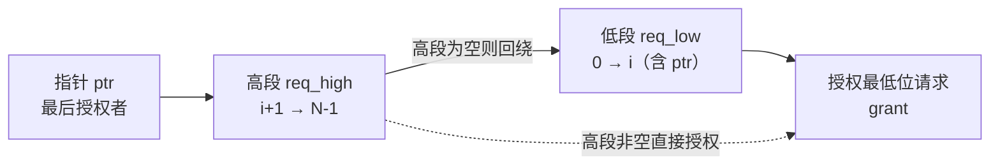

# 仲裁器设计

**仲裁器**（Arbiter）是多个请求方竞争单一共享资源（总线、存储端口、运算单元）时的授权决策单元：每周期观察各请求方的请求信号，选择至多一个授予访问权。设计空间在**公平性、最坏情况延迟、面积**构成的三角中展开——不存在三者兼得的方案。

## 形式化基础

设计仲裁器前先定义"正确"的含义，三条性质按强度递增：

1. **互斥性（Mutual Exclusion）**：任意时刻 grant 至多一位为 1——这是最低要求，违反它意味着两个请求方同时获得共享资源，直接功能错误；
2. **无饥饿（Starvation-Freedom）**：任何**持续**请求的请求方最终必然获得授权——固定优先级仲裁不满足此性质；
3. **公平性（Fairness）三级**：弱公平（偶尔服务即可）、强公平（有界等待，如 RR 的 $N-1$ 拍上界）、比例公平（带宽按权重分配，WRR 的目标）。

评价指标：**最坏服务间隔**（两次授权之间的最大周期数）、**仲裁延迟**（请求到授权拍数）、**吞吐**（连续请求下的授权率）。PPA 的量化对比见文末汇总表。

## 仲裁器类型全景与选型

| 类型 | 公平性 | 最坏服务间隔 | 面积 | 关键路径 | 优点 | 缺点 | 典型场景 |
|:---|:---|:---|:---|:---|:---|:---|:---|
| 固定优先级 | 无（饥饿） | 无界 | 最小，$\sim 3N$ 门 | 进位链 $O(N)$ | 实现最简单、延迟最低 | 低优先级饿死 | 中断控制器、实时通道 |
| 轮询 RR | 强公平 | $N-1$ 拍 | 小，$N$ FF + $\sim 6N$ 门 | 双进位链 $O(N)$ | 无饥饿、状态简单 | 牺牲确定性低延迟 | 对等主设备共享资源 |
| 加权轮询 WRR | 比例公平 | 按权重配置 | 中，RR + $N \times W$ FF | RR + 比较/减法 | QoS 可编程 | 权重管理、补足气泡拍 | 总线 interconnect QoS |
| 矩阵仲裁 | 强公平 + 到达顺序 | $N-1$ 拍 | 大，$N^2$ FF + $N^2$ 门 | 编码 $O(\log N)$，更新环瓶颈 | 最坏延迟有界、最老优先 | 面积 $O(N^2)$ | Cache/LSU 端口 |
| 链式（Daisy Chain） | 无（越靠近仲裁器越优先） | 无界 | 小，$O(N)$ | 链式传播 $O(N)$ | 布线简单 | 延迟随 N 线性、单点故障 | 板级共享总线 |
| 令牌环 | 强公平（环序） | $N-1$ 拍 | 中（分布式） | 令牌传递 $O(1)$/拍 | 完全分布式、可扩展 | 令牌丢失恢复、环延迟 | 板级总线（VME）、NoC |
| FIFO 顺序 | 公平且保序 | $N-1$ 拍 | 大（队列） | 队列控制 | 请求顺序不变 | 队列面积与溢出 | 存储控制器保序通道 |
| 彩票/随机 | 统计公平 | 无界（期望 $N/p$） | 小（LFSR） | 短 | 无状态、抗同步攻击 | 最坏延迟无界 | NoC 路由器随机化 |

**选型口诀**：要实时选固定优先级，要对等选 RR，要带宽保障选 WRR，要最坏延迟有界且保到达序选矩阵，要保序选 FIFO 顺序，要分布式扩展选令牌环。

## 固定优先级仲裁

结构即一个**优先级编码器**：编号低者优先，grant 是"请求向量中最低位 1"。完整实现只有一行：

```systemverilog
// ============================================================
// 固定优先级仲裁器：req 中最低位 1 获胜（方 0 优先级最高）
// ============================================================
module fixed_priority_arbiter #(
    parameter N = 4                            // 请求方数量（可参数化）
) (
    input  logic [N-1:0] req,                  // 请求向量：req[i]=1 表示方 i 申请授权
    output logic [N-1:0] grant                 // 授权输出（one-hot，最低位 1 获胜）
);
    // x & (~x+1)：二补数性质——只保留 x 的最低一位 1
    //   例：req=1010 → ~req+1=0110 → 1010 & 0110 = 0010（方 1 胜）
    assign grant = req & (~req + 1'b1);
endmodule
```

**PPA 与陷阱**：（1）**时序**——关键路径是 `~x+1` 的进位链，深度 $O(N)$（N=32 时约 4-5 级门）；追求更低延迟可改用树形编码器（$O(\log N)$）；（2）**面积**——约 $3N$ 门，是所有仲裁器中最小；（3）**饥饿**——方 0 持续请求时其余各方永远得不到授权，这是它与 RR 的本质差距；实时通道（中断、显示刷新）正需要这种"保证最高优先级的确定性低延迟"。

## 轮询仲裁（Round-Robin Arbitration）

**轮询仲裁**（RR，又称**轮换仲裁控制器**）的机制一句话：**维护指针指向"最后授权者"，每轮搜索从指针下一位开始环形回绕——刚授权的请求方优先级自动降到最低。** 强公平性：任何持续请求方最多等待 $N-1$ 次其他授权，每轮完整循环中每个活跃请求方恰好授权一次。

### 原理：指针轮转与两段掩码法

搜索顺序由 one-hot 指针 `ptr` 定义：若 `ptr[i]=1`，本轮优先级从高到低为 $i{+}1, i{+}2, \ldots, N{-}1, 0, 1, \ldots, i$。拆两段处理：



- **高段掩码** `mask_low = (ptr << 1) - 1`：ptr 及其以下位全 1；取反得"严格高于 ptr"区间
- **低段区间**就是 `mask_low`：ptr 及其以下——ptr 位于低段最高位（低段内优先级最低）
- **固定优先级函数** `x & (~x + 1)`：二补数只保留最低位 1
- **指针更新**：授权谁谁成新指针；无请求时保持——指针即状态，仲裁器是 Moore FSM（见 [[rtl-design/concepts/有限状态机|有限状态机设计]]）

### 参数化可综合实现

```systemverilog
// ============================================================
// 参数化轮询仲裁器（Round-Robin Arbiter, N 个请求方）
// ============================================================
module rr_arbiter #(
    parameter N = 4                            // 请求方数量（可参数化，默认 4）
) (
    input  logic             clk,              // 时钟：指针更新的时序基准
    input  logic             rst_n,            // 异步复位（低电平有效）
    input  logic [N-1:0]     req,              // 请求向量：req[i]=1 表示方 i 申请授权
    output logic [N-1:0]     grant             // 授权向量：one-hot，至多一位为 1
);

    // ===== 内部信号 =====
    logic [N-1:0] ptr, ptr_nxt;               // 轮询指针（one-hot）：指向"最后授权者"
    logic [N-1:0] mask_low;                   // 低段掩码：ptr 及其以下位全 1
    logic [N-1:0] req_high, req_low;          // 掩码后的高段/低段请求
    logic [N-1:0] grant_high, grant_low;      // 两段各自的固定优先级结果
    logic [N-1:0] grant_comb;                 // 组合授权结果（同时是次态指针）
    logic         any_req;                    // 任一请求有效标志（控制指针保持/更新）

    /**
     * @brief 固定优先级函数：返回 x 中最低位 1 的 one-hot
     *
     * 利用二补数性质：~x + 1 等于 -x，x & (-x) 恰好只保留
     * 最低位的 1。例如 x=1010 → ~x+1=0110 → 1010 & 0110 = 0010。
     * 该函数是组合逻辑，综合为逐位门电路，无时序开销。
     *
     * @param x N 位请求向量（可多位同时为 1）
     * @return 只保留 x 最低位 1 的 one-hot 向量
     * @note 输入全 0 时返回 0——调用方需保证该语义
     */
    function automatic logic [N-1:0] fixed_priority(input logic [N-1:0] x);
        return x & (~x + 1'b1);
    endfunction

    // ===== 掩码生成：环形搜索拆两段 =====
    // mask_low = (ptr << 1) - 1：one-hot 指针左移一位再减一，
    // 恰好生成"ptr 位及其以下全 1"的掩码
    //   例：ptr=0100（方 2）→ (1000) - 1 = 0111（位 0/1/2 为 1）
    assign mask_low  = (ptr << 1) - 1'b1;

    // 高段：位编号严格高于 ptr 的请求——本轮优先搜索的区间
    assign req_high  = req & ~mask_low;

    // 低段：ptr 及其以下的请求——高段为空时回绕搜索的区间。
    // ptr 位于低段最高位（固定优先级中最低），即"最后授权者最后搜索"；
    // 必须包含 ptr 自身，否则"只有 ptr 请求"时 grant 会错误地为零
    assign req_low   = req & mask_low;

    // ===== 两段各自的固定优先级 =====
    // 高段中最低位 1 获胜——搜索顺序恰好从 ptr+1 方向开始
    assign grant_high = fixed_priority(req_high);
    // 低段中最低位 1 获胜——ptr 位于低段最高位（优先级最低）
    assign grant_low  = fixed_priority(req_low);

    // ===== 组合授权与指针次态 =====
    // 高段优先、低段回绕：两段拼接出完整轮询环
    assign grant_comb = (grant_high != '0) ? grant_high : grant_low;
    assign grant      = grant_comb;            // grant 组合输出：请求到达当拍生效
    assign any_req    = |req;                  // 归约或：任一请求位为 1

    // 授权谁、谁就是新的"最后授权者"；无请求时指针保持原位
    assign ptr_nxt    = any_req ? grant_comb : ptr;

    // ===== 指针时序更新 =====
    always_ff @(posedge clk or negedge rst_n) begin
        if (!rst_n) begin
            ptr <= 1'b1;                       // 复位：指针指向方 0（约定）
        end else begin
            ptr <= ptr_nxt;                    // 每个授权拍更新一次指针
        end
    end

endmodule
```

**RR 的 PPA 细化**：（1）**时序**——关键路径 = 掩码（常数）+ 两个进位链（`~x+1`）+ 高段优先 MUX，约 $2N$ 半加器深度；比固定优先级多一级掩码逻辑；（2）**面积**——指针 $N$ FF + 两个编码器 + 掩码 ≈ $6N$ 门 + $N$ FF；（3）**行为**——req=1111 连续请求时授权序列 0010→0100→1000→0001 循环（每轮各一次）；请求撤销后 grant 当拍归零、指针保持，轮询状态在空闲期不丢失。实测验证（iverilog）：全请求轮转、唯一请求者自授权、断点恢复、无请求保持四项全过。

## 加权轮询（Weighted Round-Robin, WRR）

WRR 给每个请求方分配权重 $w_i$：每轮中请求方 i 获得 $w_i$ 次授权，实现**比例公平**（带宽按权重分配）。工程标准实现是**差额计数器法（Deficit Counter）**：每方一个"剩余信用"寄存器，信用耗尽时全体补足：

- **授权条件**：候选 = 请求且信用 > 0；候选间用 RR 轮转
- **信用消费**：每授权一次，该方信用减 1
- **补足**：所有候选信用耗尽（还有请求但无人可授权）时，全体信用重载为权重——补足当拍有一个"气泡"周期（该拍 grant 为零）

```systemverilog
// ============================================================
// 加权轮询仲裁器（差额计数器法, Deficit Round-Robin）
// ============================================================
module wrr_arbiter #(
    parameter N = 4,                           // 请求方数量
    parameter W = 4                            // 权重位宽
) (
    input  logic             clk,
    input  logic             rst_n,
    input  logic [N-1:0]     req,              // 请求向量
    input  logic [W-1:0]     weight [N-1:0],   // 每方权重（静态配置，可来自寄存器）
    output logic [N-1:0]     grant             // 授权（one-hot）
);
    logic [W-1:0]   deficit [N-1:0];           // 每方剩余信用额度
    logic [N-1:0]   eligible;                  // 信用 > 0 且当前有请求的候选
    logic [N-1:0]   grant_comb;
    logic           refill;                    // 候选耗尽标志 → 全体补足
    logic [N-1:0]   ptr, ptr_nxt;              // 候选间的 RR 指针
    logic [N-1:0]   mask_low;
    logic [N-1:0]   e_high, e_low;
    integer i;

    // 候选生成：有请求且剩余信用非零
    always_comb begin
        for (i = 0; i < N; i = i + 1)
            eligible[i] = req[i] & (deficit[i] != 0);
    end

    // RR 两段掩码（与 rr_arbiter 完全相同的结构，作用对象换成候选）
    assign mask_low   = (ptr << 1) - 1'b1;
    assign e_high     = eligible & ~mask_low;
    assign e_low      = eligible & mask_low;
    assign grant_comb = (e_high != '0) ? (e_high & (~e_high + 1'b1))
                                       : (e_low  & (~e_low  + 1'b1));
    assign grant      = grant_comb;

    // 补足条件：还有请求、但所有候选信用耗尽（本拍产生气泡）
    assign refill     = |req & (eligible == '0);
    assign ptr_nxt    = (grant_comb != '0) ? grant_comb : ptr;

    always_ff @(posedge clk or negedge rst_n) begin
        if (!rst_n) begin
            ptr <= 1'b1;                       // 复位：指针指向方 0
            for (i = 0; i < N; i = i + 1)
                deficit[i] <= '0;              // 复位：信用清零，首拍即触发补足
        end else begin
            if (refill) begin
                for (i = 0; i < N; i = i + 1)
                    deficit[i] <= weight[i];   // 全体信用重载为权重
            end else begin
                for (i = 0; i < N; i = i + 1)
                    if (grant_comb[i])
                        deficit[i] <= deficit[i] - 1'b1;  // 授权一次消费一点信用
            end
            ptr <= ptr_nxt;
        end
    end
endmodule
```

实测验证（iverilog）：权重 $\{2,1,3,0\}$、req=1111 时每轮授权序列为 1,2,0,2,0,2——方 0 两次、方 1 一次、方 2 三次、方 3 零次，与权重精确一致；每轮结束有一个补足气泡拍。

**PPA 与工程要点**：（1）**面积**——RR 全部逻辑 + $N \times W$ 位信用寄存器与比较/减法器，约为 RR 的 2-3 倍；（2）**时序**——关键路径 = RR 掩码链 + 信用非零比较（$W$ 位归约或）；（3）**气泡拍**——信用补足当拍无法授权，追求零气泡可在"最后一笔授权当拍"提前重载（增加旁路逻辑）；（4）**权重为 0 等价饥饿**——WRR 的公平性完全取决于权重配置；（5）**应用**——AXI interconnect 的 QoS 分级正是 WRR/两级混合的工程落地。

## 矩阵仲裁（Matrix Arbiter）

矩阵仲裁是"**到达顺序优先**"的仲裁器：$N \times N$ 状态矩阵记录任意两方请求的先后关系，每拍授权"最老的待处理请求"——最坏服务间隔严格有界（$N-1$ 拍），且授权顺序与到达顺序一致（后到者永远排在先到者之后）。

**原理**：`matrix[i][j]=1` 表示请求 i 晚于请求 j 到达（i 更年轻）。三个动作：

- **登记**：请求 i 到达（未在等待）→ 对全部 j 置 `matrix[i][j]=1`（i 成为最年轻）；同拍到达的平局用编号决胜负（编号大者视为更年轻）
- **选择**：授权给"所有待处理请求中最老"的 i——即对每个待处理 j 都有 `matrix[j][i]=1`（j 都比 i 新）
- **注销**：授权给 i 后，行 i 与列 i 全部清零（移除它的所有先后关系）

```systemverilog
// ============================================================
// 矩阵仲裁器（到达顺序优先, 最坏服务间隔 ≤ N-1 拍）
// ============================================================
module matrix_arbiter #(
    parameter N = 4                            // 请求方数量
) (
    input  logic             clk,
    input  logic             rst_n,
    input  logic [N-1:0]     req,              // 请求向量
    output logic [N-1:0]     grant             // 授权（寄存输出，仲裁延迟 1 拍）
);
    logic [N-1:0] matrix [N-1:0];              // matrix[i][j]=1：请求 i 晚于 j 到达
    logic [N-1:0] waiting;                     // 已登记、尚未授权的请求
    logic [N-1:0] grant_comb;
    integer i, j;

    // ===== 授权条件：i 是所有待处理请求中最老的 =====
    // 对每个其他待处理 j：M[j][i]=1（j 比 i 新）——只要存在
    // 一个比 i 更老的 j（M[j][i]=0），i 就不是最老
    always_comb begin
        grant_comb = '0;
        for (i = 0; i < N; i = i + 1) begin
            logic oldest;
            oldest = req[i] & waiting[i];      // 候选前提：有请求且已登记
            for (j = 0; j < N; j = j + 1) begin
                if (j != i && req[j] & waiting[j] & ~matrix[j][i])
                    oldest = 1'b0;             // j 比 i 更老 → i 落选
            end
            grant_comb[i] = oldest;
        end
    end

    // ===== 状态更新（grant 寄存输出 → 仲裁延迟 1 拍）=====
    always_ff @(posedge clk or negedge rst_n) begin
        if (!rst_n) begin
            grant   <= '0;
            waiting <= '0;
            for (i = 0; i < N; i = i + 1)
                matrix[i] <= '0;               // 复位：矩阵全零
        end else begin
            grant <= grant_comb;
            for (i = 0; i < N; i = i + 1) begin
                if (grant_comb[i]) begin
                    waiting[i] <= 1'b0;        // 已授权：注销该请求
                    for (j = 0; j < N; j = j + 1) begin
                        matrix[i][j] <= 1'b0;  // 行 i 清零
                        matrix[j][i] <= 1'b0;  // 列 i 清零
                    end
                end else if (req[i] & ~waiting[i]) begin
                    waiting[i] <= 1'b1;        // 新到达：登记为最年轻
                    for (j = 0; j < N; j = j + 1) begin
                        // 同拍到达平局：编号大者视为更年轻（编号小者先授权）
                        matrix[i][j] <= (req[j] & ~waiting[j]) ? (i > j) : 1'b1;
                    end
                end
            end
        end
    end
endmodule
```

实测验证（iverilog）：请求按 方2 →（方1、方3 同拍）→ 方1 的顺序到达时，授权序列为 方2 → 方1（同拍编号小者先）→ 方3 → 方1（重新登记后最年轻），与到达顺序完全一致。

**PPA 与陷阱**：（1）**面积**——$N^2$ FF + $N^2$ 门，$O(N^2)$ 是全表最高；（2）**时序**——授权编码是"每列对 $N-1$ 个 `matrix[j][i]` 的与归约"，可做 $O(\log N)$ 树；**真正的瓶颈是更新反馈环**：grant → 行/列清零 → 下一拍选择，行置位路径扇出 $N$，在 $N$ 大时是时序收敛难点；（3）**请求撤销语义**——本实现中请求持续断言直到授权；若请求方中途撤销，需在登记逻辑中加入撤销清除（列清零），否则幽灵关系会阻塞其他人；（4）**与 RR 的对比**——两者最坏服务间隔同为 $N-1$ 拍，但矩阵仲裁的授权顺序与**到达顺序**一致（最老优先），RR 则按**位置顺序**轮转：新到的请求在矩阵仲裁中排队尾、在 RR 中插到"指针后一位"。

## 链式仲裁与令牌环

**链式仲裁（Daisy Chain）**：请求方串成链，授权信号沿链逐级传递，每一级"自己要用则截下授权，否则传给下一级"——越靠近仲裁器的请求方优先级越高。面积 $O(N)$ 且布线简单，但关键路径随链长线性恶化（$O(N)$ 延迟），且链上任一节点失效即全链断——适用于板级背板（如 VME 早期的菊花链）而非片内。

**令牌环**：完全分布式的仲裁——一个"令牌"沿环在请求方之间循环，持有令牌的请求方获得授权权。每方得到授权后把令牌传给下一方，令牌按环序轮转 → 公平性与 RR 等价（最坏 $N-1$ 拍），但无需集中仲裁器，节点可物理分散。两大工程问题：（1）**令牌丢失恢复**——需要超时检测与令牌重生成逻辑；（2）**环延迟**——令牌传递一圈的时间是吞吐上限。板级总线与 NoC 分布式场景的选型见 [[architecture/concepts/SoC架构|SoC 架构]]。

## FIFO 顺序仲裁与彩票仲裁

**FIFO 顺序仲裁**：按请求到达的先后顺序入队、队首获得授权——公平且**保序**（同一请求方的请求顺序不变），是存储控制器保序通道的标准选择；代价是队列（深度 × 位宽）的面积与溢出管理。矩阵仲裁在语义上是它的"压缩硬件实现"（用 $N^2$ 矩阵代替 $N$ 深队列）。

**彩票/随机仲裁**：LFSR 伪随机选中一个活跃请求方——无状态、面积小、统计公平（期望等待 $N/p$），但最坏延迟**无界**。防饿死变体：中签后的请求方从下一拍候选池中移除，直到全池轮空一次再重置——把彩票改造成"随机顺序的 RR"。工程上用于 NoC 路由器，随机化使流量模式难以被恶意构造（抗同步攻击），见 [[architecture/concepts/片上总线|片上总线]]。

## 层次仲裁与两级混合

**树形级联**：大 N 用二叉树级联两输入仲裁单元——面积从 $O(N)$ 降到 $O(\log N)$，代价是每级增加一拍延迟（$k$ 级树延迟 $k$ 拍，可流水化）。**两级混合是工程主流**：分组固定优先级 + 组内 RR——组间固定优先级保证实时通道（显示刷新、音频）不被饿死，组内 RR 保证同组对等方公平；绝大多数 AXI interconnect 的 QoS 配置即此结构。

## 工程落地：AXI interconnect 仲裁器

仲裁器不是孤立模块，嵌入总线 interconnect 时有五个工程细节：

1. **QoS 分级**：AXI 的 `qos_aw`/`qos_ar` 是 4 位 QoS 值（0 无要求 → 15 最高），interconnect 据此把流量映射到优先级组——两级混合的"组间固定优先级"即由 QoS 值驱动；组内 RR 保证同 QoS 等级的公平；
2. **Lock 与拆分事务**：AXI3 的 locked 传输（`AWLOCK=1`）要求仲裁器把总线**锁定**给当前主设备直到锁释放——仲裁器需"锁定状态"屏蔽其他请求；拆分事务（Outstanding，AXI4 用 ID 支持乱序完成）则要求**地址通道与数据/响应通道独立仲裁**——五个通道各有一个仲裁器，且写数据通道需跟随写地址通道的授权顺序；
3. **请求亚稳态与脉冲捕获**：跨时钟域的请求必须先过 2-FF 同步器；单拍脉冲请求需展宽或加"请求保持"寄存器，否则仲裁器采样不到；
4. **流水化授权**：grant 打一拍输出以切断长组合路径（矩阵仲裁即寄存输出）——代价是仲裁延迟 +1 拍，且需保证打拍期间请求不撤销（请求保持协议）或接受授权作废（Revoke）的复杂性；
5. **低功耗**：无请求时时钟门控冻结仲裁器（指针/矩阵状态保持），是共享资源仲裁器的通用手段——功耗近似正比于面积与每拍翻转寄存器数，固定优先级最低、矩阵最高。

## PPA 汇总表

| 类型 | 面积 | 关键路径 | 仲裁延迟 | 最坏服务间隔 | 公平性 |
|:---|:---|:---|:---|:---|:---|
| 固定优先级 | $\sim 3N$ 门 | 进位链 $O(N)$ | 组合 0 拍 | 无界（饥饿） | 无 |
| 轮询 RR | $N$ FF + $\sim 6N$ 门 | 双进位链 $O(N)$ | 组合 0 拍 | $N-1$ 拍 | 强公平 |
| 加权 WRR | RR + $N \times W$ FF | RR + 信用比较 | 组合 0 拍 | 权重决定 | 比例公平 |
| 矩阵 | $N^2$ FF + $N^2$ 门 | 编码 $O(\log N)$，更新环瓶颈 | 寄存 1 拍 | $N-1$ 拍 | 强公平 + 到达序 |
| 链式 | $O(N)$ 门 | 链传播 $O(N)$ | $O(N)$ 拍 | 无界 | 无 |
| 令牌环 | 分布式 $O(N)$ | 令牌传递 $O(1)$/拍 | 环序拍数 | $N-1$ 拍 | 强公平（环序） |
| FIFO 顺序 | 队列（深度×位宽） | 队列控制 | 组合/寄存 | $N-1$ 拍 | 强公平 + 保序 |
| 彩票 | LFSR + 编码器 | 短 | 组合 0 拍 | 无界（期望 $N/p$） | 统计公平 |

## 关键要点

- **三条正确性性质**：互斥性（grant 至多一位）→ 无饥饿（持续请求必获授权）→ 公平性（弱/强/比例三级）——设计仲裁器先明确目标落在哪一级
- **固定优先级只有一行代码**：`req & (~req+1)` 二补数保留最低位 1——面积最小延迟最低，但低优先级可被饿死，仅适合实时通道
- **RR 指针即状态**：one-hot 指针 = 最后授权者 = 最低优先级；两段掩码法 `(ptr<<1)-1` 拆分环形搜索；低段必须包含 ptr 本身（唯一请求者是自己时授权为零的坑）；无请求时指针保持
- **WRR 差额计数器法**：候选 = 请求且信用 > 0，RR 轮转授权、信用逐拍递减、耗尽后全体补足——每轮一个气泡拍，权重 0 等价饥饿
- **矩阵仲裁最老优先**：$N^2$ 矩阵记录到达先后，授权顺序与到达顺序一致、最坏间隔 $N-1$ 拍——面积 $O(N^2)$，时序瓶颈在矩阵更新反馈环；请求中途撤销需清列防幽灵关系
- **矩阵 vs RR 的语义差**：最坏间隔同为 $N-1$ 拍，但新到请求在矩阵仲裁排"队尾"（按到达序）、在 RR 排"指针后一位"（按位置序）
- **链式与令牌环是分布式的两个极端**：链式延迟 $O(N)$ 且单点故障；令牌环公平等价 RR、可物理分散，但令牌丢失恢复是工程必修课
- **两级混合是工程主流**：组间固定优先级（QoS 值驱动）+ 组内 RR——AXI interconnect 的 QoS 分级即此结构
- **AXI 落地细节**：Lock 传输要锁定仲裁器、拆分事务要五通道独立仲裁、跨域请求要同步、流水化授权要请求保持协议、无请求时钟门控降功耗
- **选型口诀**：要实时选固定优先级，要对等选 RR，要带宽选 WRR，要最坏有界且保序选矩阵，要保序选 FIFO 顺序，要分布式选令牌环

## 与其他概念的关系

- [[rtl-design/concepts/有限状态机|有限状态机设计（FSM Design）]] — 仲裁器是 Moore FSM 的典型用例：指针/矩阵即状态，三段式编码天然契合
- [[architecture/concepts/片上总线|片上总线]] — AXI interconnect 的 QoS 仲裁、五通道独立仲裁、Lock 锁定是仲裁器的工程落地场景
- [[architecture/concepts/SoC架构|SoC 架构（SoC Architecture）]] — 共享总线分时复用依赖集中仲裁器，NoC 路由器的分布式/随机仲裁是另一极
- [[rtl-design/concepts/经典设计题例|经典设计题例]] — 与序列检测器、售货机同属经典 RTL 设计题常考模块，本文件给出参数化标准解
- [[rtl-design/concepts/Verilog-HDL|Verilog HDL]] — 本文件全部实现使用 `logic`/`always_ff`/`always_comb` 与二补数位运算，signed/unsigned 规则见其运算规则章节
