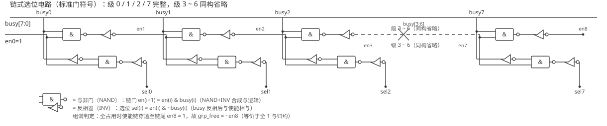

# 位图分配器与空闲链表（Bitmap Allocator vs Free List）

数字IC设计中存在大量"同构资源池"：乱序执行处理器的物理寄存器池、缓存缺失状态寄存器（Miss Status Holding Register, MSHR）条目、DMA 描述符、网络芯片的缓冲区描述符、各类硬件队列（Queue）的槽位（Slot）。这些资源在功能上完全等价，硬件必须在每个周期回答三个问题：**还有空闲条目吗？给我一个空闲条目（分配，Allocate）！把这个条目还回去（释放，Deallocate / Free）！** 回答这三个问题的数据结构直接决定分配器的面积、频率与扩展能力。

管理同构条目池的方案主要有两大类：**位图（Bitmap）** —— 用 $N$ 个比特记录 $N$ 个条目各自的状态，配合专门的查找逻辑定位空位；**空闲链表（Free List）** —— 把空闲条目用指针串成链表，分配/释放退化为链表头部指针的弹出与压入。两种方案各有所长，真实芯片中甚至在同一模块内互补使用——理解二者的硬件结构与权衡，是设计调度器、重命名逻辑、缓冲池管理器的基本功。

## 位图（Bitmap）分配器

### 数据结构与状态语义

位图分配器的核心是一个 $N$ 比特状态向量，第 $i$ 个比特对应第 $i$ 个条目。约定 **1 = 已占用（Busy），0 = 空闲（Free）**（与乱序处理器中"忙碌位图（Busy Bitmap）"的惯例一致）。于是三个管理操作全部落到比特级操作上：

1) **分配**：找到一个值为 0 的比特 $i$，将其置 1，返回 $i$ 作为分配到的条目号；
2) **释放**：收到条目号 $i$，将第 $i$ 位置 0；
3) **状态查询**：对整向量做归约——全部为 1 则池满（无空位），全部为 0 则池空（无占用）。

每个条目的状态只依赖自己那 1 个比特，**不存在跨条目的结构不变量**——这是位图方案全部优点的根源，也是它与链表方案的深层分水岭。

### 硬件结构：查找空位的两级结构

"找空位"是位图方案独有的硬件问题：给定 $N$ 位向量，输出第一个（最低位方向）0 比特的位置。这一操作称为**首个零位查找（Find First Zero, FFZ）**，其电路本质是带无效条件的**优先级编码器（Priority Encoder）**——输入"该位为空"的有效向量，输出有效者中序号最小者的索引。

$N$ 较小时（$N \le 32$）可让综合工具直接展开线性优先级链，逻辑深度约 $O(\log_2 N)$ 门级但输入扇入为 $N$。$N$ 增大到 64/128/256 后，**两级查找**（Two-Level Lookup）是工程标准结构：



从门级看，单个 $K$ 位 FFZ 单元由一串级联的**链与门**与**选位与门**构成——空闲标志 $f_i = \neg busy_i$ 并不参与全并行比较，而是沿使能链传播：第 $i$ 级只有在**所有更低位的条目都已占用**（使能 $en_i = 1$，$en_0$ 恒为 1）时才检查自己。链与门沿链传递"更低位是否全忙"（$en_{i+1} = en_i \wedge busy_i$），选位与门输出本级的选中信号（$sel_i = en_i \wedge \neg busy_i$）。$sel$ 输出构成单热线（至多一位为 1）——恰好指向第一个空闲位，这就是优先级编码器"优先"语义的电路来源：



上图的"链与门/选位与门"是块级抽象。换用**标准逻辑门符号**逐级展开，可以看到该电路映射到标准单元库后的真实形态——CMOS 库中与逻辑并非原生门，与门（AND）惯以**与非门**（NAND）后接**反相器**（INV）实现（反相器抵消与非门的取反），故下图统一用与非门与反相器两种符号绘制，可逐级与综合映射结果对照：



链式结构还免费给出了组满判定：若组内全部占用，使能沿链一路穿透到链尾，$en_{K} = 1$；否则链在某级被截断。因此**组内有无空闲等价于 $\neg en_{K}$**——与"整组全 1"的与归约布尔等价，但省去了一个独立的 $K$ 输入与门树（这也是上图中组有效信号 $g_{valid}$ 的电路实现方式）。$K$ 位链的串行深度为 $O(K)$，组宽 $K$ 取 8 时仅 8 级与门；若组宽加大或追求极限频率，可把串行链改造成树形/超前进位式结构——与加法器进位链的优化同源。

第 0 级把 $N$ 位向量切成 $N/K$ 个组（组宽 $K$ 常取 8 或 16），每组放一个上述的 $K$ 位 FFZ 单元，计算组内第一个 0 的位置 $b_{g}$ 并生成组有效信号 $g_{valid}$——表示该组内还有空位。第 1 级对 $N/K$ 个组有效信号再做一次结构完全同构的 FFZ，得到第一个有空的组号 $g^{*}$。最终条目号：

$$i^{*} = g^{*} \times K + b_{g^{*}}$$

各级宽度固定（$K$ 位、$N/K$ 位），逻辑深度约为两级编码器之和——对 $N = 256, K = 8$，约 4-6 级门的量级，数百周期频率下单周期完成查找毫无压力。**每级内部的 OR 收缩树与编码器都可参数化生成**，这正是 RTL 参数化设计擅长的形态。

### 分配、释放与满空判断电路

- **分配**：FFZ 输出的 $i^{*}$ 与"有空位"标志（组级 FFZ 的 valid 输出）在同拍稳定；下一拍将第 $i^{*}$ 位置 1——置位只需对状态向量做"解码成单热掩码后的或写"，无需读回原值（写 1 与写 0 都是确定值，**天然免疫读-改-写竞争**）。连续分配时 FFZ 组合路径与置位寄存器回写构成流水，每周期吞吐 1 个；
- **释放**：对条目号做 $N$ 选 1 译码（Decoder）得到单热掩码，将对应位清 0。释放不读任何其他比特、不需要先知道该位当前值，因此**释放任意条目号的路径是纯组合译码 + 一次写**，且可以与同拍分配并行（写 1 和写 0 作用在不同比特，互不冲突，只要存储支持对应写端口）；
- **满判断**：$N$ 输入与门树（全部为 1 即满），空判断为或门树（全部为 0 即空）。二者都是单级归约树，比"读链头判空"更直接，且**满度（已占用条目数）可通过可选的位计数（Popcount）树实时得出**，供流控与水位告警使用。

### 参数化可综合 RTL 实现

下面给出两级查找位图分配器的完整可综合 SystemVerilog 实现。模块在复位后清空占用向量，每个周期最多分配一个、释放一个条目；查找逻辑用生成（generate）循环分层展开，避免长优先级链：

```systemverilog
// ============================================================
// bitmap_allocator — 两级查找的位图分配器（可综合）
// 功能：管理 ENTRY_N 个同构条目。alloc 有效且未满时给出一个
//       空闲条目号并占用之；free_id 携带的条目被释放
// 端口：alloc_req/alloc_gnt+alloc_id（应答握手）、free_val/free_id
// ============================================================
module bitmap_allocator #(
    parameter int ENTRY_N = 64,   // 条目总数（须为 GRP_W 的整数倍）
    parameter int GRP_W    = 8    // 第0级组宽：每 8 位一组查 FFZ
) (
    input  logic                clk,      // 时钟（上升沿采样）
    input  logic                rst_n,    // 异步复位（低有效），复位后全部空闲
    input  logic                alloc_req,// 分配请求（1=本拍申请一个条目）
    output logic                alloc_gnt,// 分配应答（1=分配成功，alloc_id 有效）
    output logic [$clog2(ENTRY_N)-1:0] alloc_id, // 分配到的条目号
    input  logic                free_val, // 释放有效（1=本拍归还一个条目）
    input  logic [$clog2(ENTRY_N)-1:0] free_id   // 被释放的条目号
);
    // ===== 第 0 级：组内首个零位（FFZ）查找块 =====
    // 输入 8 位“是否已占用”向量，输出组内第一个空闲位（=0 的最低位）
    // 采用 casez 真值表式描述，综合器直接映射为 8 输入优先级编码器
    function automatic logic [GRP_W-1:0] ffz8(
        input logic [GRP_W-1:0] busy  // 组内占用向量（1=占用）
    );
        logic [GRP_W-1:0] free_oh;    // 单热结果：free_oh[i]=1 表示位 i 空闲且是首个空闲
        casez (busy)                  // casez：? 位不参与匹配，合成“优先”语义
            // 自低位向高位依次测试；先命中的分支优先，等价于找最低位的 0
            8'b???????0: free_oh = 8'b0000_0001; // 最低位为空 → 选它
            8'b??????01: free_oh = 8'b0000_0010; // 位0占用、位1空闲 → 选位1
            8'b?????011: free_oh = 8'b0000_0100; // 位0/1占用、位2空闲 → 选位2
            8'b????0111: free_oh = 8'b0000_1000; // 最低三位占用 → 选位3
            8'b???01111: free_oh = 8'b0001_0000; // 最低四位占用 → 选位4
            8'b??011111: free_oh = 8'b0010_0000; // 最低五位占用 → 选位5
            8'b?0111111: free_oh = 8'b0100_0000; // 最低六位占用 → 选位6
            8'b01111111: free_oh = 8'b1000_0000; // 仅最高位空闲 → 选位7
            default:     free_oh = 8'b0000_0000; // 全占用：本组无空位，输出全 0
        endcase
        return free_oh;               // 单热掩码（非编码值），便于与组内下标拼接
    endfunction

    // ===== 占用状态寄存器组 =====
    // 每 bit 一个触发器的寄存器阵列；复位同步清零（1 拍内全部回到空闲态）
    logic [ENTRY_N-1:0] busy_r;       // busy_r[i]=1 表示条目 i 已被分配

    // ===== 第 0 级：逐组计算“组内有空”与“组内首个空闲的单热掩码” =====
    // 组号 g 的位片为 busy_r[g*GRP_W +: GRP_W]（+: 为位片选择语法）
    logic [ENTRY_N/GRP_W-1:0] grp_has_free;    // 组有效向量：1=该组还有空位
    logic [ENTRY_N-1:0]       ffz_oh;          // 拼接后的组内单热掩码（整体 N 位）
    for (genvar g = 0; g < ENTRY_N / GRP_W; g++) begin : gen_grp
        // 逐位或收缩：组内任一比特为 0（空闲）则本组有可分配位
        assign grp_has_free[g] = |(~busy_r[g*GRP_W +: GRP_W]);
        // 调用 ffz8 得到组内首个空闲位的单热掩码，再按组号拼接到整体向量
        // （只有“组有空”的组其掩码才有意义，最终选取以第 1 级组号为准）
        assign ffz_oh[g*GRP_W +: GRP_W] = ffz8(busy_r[g*GRP_W +: GRP_W]);
    end

    // ===== 第 1 级：在“组有效向量”上再找第一个有效组 =====
    // 复用 ffz8 逐 8 组打包的相同思想，这里用循环写出任意组数的线性 FFZ：
    // 从组 0 起向后找第一个 grp_has_free=1 的组号（逻辑深度 O(组数)，组数≤8 时足够）
    logic [$clog2(ENTRY_N/GRP_W)-1:0] sel_grp; // 第一个有空组的组号
    always_comb begin
        sel_grp = '0;                          // 默认组 0（无空位时取值无意义）
        for (int g = 0; g < ENTRY_N / GRP_W; g++) begin
            // 顺序比较：只有当前候选组无空位才把指针推向下一组——形成优先链
            if (!grp_has_free[sel_grp]) sel_grp = g; // sel_grp 指向第一个有空位的组
        end
    end

    // ===== 合成：条目号 = 组号 * 组宽 + 组内偏移 =====
    // 组内偏移来自第 0 级单热掩码，需把单热译回二进制下标：逐位测试即可
    logic [GRP_W-1:0] in_grp_oh;               // 选中组内的单热掩码（切片）
    logic [$clog2(GRP_W)-1:0] in_grp_idx;      // 组内偏移（二进制）
    assign in_grp_oh = ffz_oh[sel_grp*GRP_W +: GRP_W]; // 依组号选组
    always_comb begin
        in_grp_idx = '0;                       // 默认偏移 0
        for (int b = 0; b < GRP_W; b++) begin
            if (in_grp_oh[b]) in_grp_idx = b[$clog2(GRP_W)-1:0]; // 单热位→下标
        end
    end
    assign alloc_id = sel_grp * GRP_W + in_grp_idx;   // 两级结果拼成条目号

    // ===== 满判断：整向量与归约（全 1 才满） =====
    logic full;                                // 满标志：无任何空闲条目
    assign full = &busy_r;                     // & 为与归约运算符（单目）

    // ===== 状态更新：同拍支持 1 分配 + 1 释放 =====
    always_ff @(posedge clk or negedge rst_n) begin
        if (!rst_n) begin
            busy_r <= '0;                      // 复位：全部条目空闲（仅需清 0，一拍完成）
        end else begin
            if (alloc_req && !full) begin
                busy_r[alloc_id] <= 1'b1;      // 分配：置位对应 bit（写 1 确定值）
            end
            if (free_val) begin
                busy_r[free_id] <= 1'b0;       // 释放：清位对应 bit（写 0 确定值）
            end
            // 同拍分配+释放同一条目时：always_ff 中后写的赋值生效，
            // 若让“释放”写在“分配”之后，则表现为分配优先（条目保持占用）
        end
    end
    assign alloc_gnt = alloc_req && !full;     // 有空位才应答分配请求
endmodule
```

实现要点：释放路径只有"译码 + 清零"，不需要预读状态；分配路径的 FFZ 是纯组合网络，可与释放的译码完全并行；复位只是 $N$ 个比特同步清零，一条 `busy_r <= '0` 即完成——这些都是后续与空闲链表对比时的关键差异。

### 增强：轮询起点与多路分配

基础位图总是从最低号开始分配，长时间运行后**低号条目先被复用、高号条目利用率偏低**，且多请求方轮流获取时可能长期饥饿。常见增强：

1) **旋转起始点（Rotating Base）**：把向量复制一份拼接成 $2N$ 位（`{busy, busy}`），从可配置的起点 $s$ 截取 $N$ 位再做 FFZ。起点 $s$ 每个周期递增（或用请求方优先级产生），得到**轮询式位图分配器**——与[[rtl-design/concepts/仲裁器设计|仲裁器设计]]中两段掩码轮询（Round Robin, RR）的思想同源，只是轮询对象从"请求向量"换成"空闲向量"；
2) **多路分配（Multi-Grant）**：每周期分配 $W$ 个条目时，可做 $W$ 个起点各异的并行 FFZ（第 $k$ 个查找器跳过前 $k-1$ 个结果），或串行迭代 $W$ 次。逻辑面积约与 $W$ 线性增长，优于链表方案每周期出 $W$ 个头的端口压力。

## 空闲链表（Free List）分配器

### 链表结构与指针的两种存放方式

空闲链表把所有空闲条目组织成一条链：链上每个条目存一个"下一个空闲条目号"，外加一个全局头指针 `head`（需要按序分配时再加 `tail`，退化为队列）。分配即**从头部弹出（Pop）**：`head` 指向的条目就是本次分配的条目，同时 `head` 更新为被弹出条目的 next；释放即**向头部压入（Push）**：被释放条目的 next 指向当前 `head`，然后 `head` 指向被释放条目。后进先出（Last In First Out, LIFO）是链表最自然的顺序——最近释放的条目最先被重新分配，对刚写完的存储结构有天然的缓存局部性。

`next` 指针的物理位置有两种工程选择，各付各的代价：

1) **借槽存放（In-Band）**：`next` 字段内嵌在每个条目的存储里，条目空闲时该字段有意义、被占用时该字段被用户数据覆盖。零额外指针存储，但**释放必须对被释放的槽做一次写**——如果释放点离槽所在的存储很远（如跨时钟域/跨模块）、或槽是只读/占用期不可写的，此方案失效；
2) **独立链表存储（Out-of-Band）**：用一块 $N \times \lceil \log_2 N \rceil$ 的链表存储器单独存放所有 next。释放只写链表存储器、不碰数据存储，适用于数据槽位宽窄（甚至 1 比特）、或释放路径与数据写路径物理隔离的场景，代价是额外的一块指针 RAM 面积。

注意释放**必须写**这个事实：链表的正确性依赖"被释放条目里已经写好了正确的 next"这一不变量——这与位图"释放只清 1 个比特"形成根本区别。

### 分配（Pop）与释放（Push）的数据通路

空闲链表的控制状态只有一个 `head` 寄存器（以及可选的 `tail`），外围是 next 的读取与写入。分配路径存在**读后写回环（Read-Modify-Write Loop）**：本拍要分配时，必须先读出 `head` 所指条目的 next（记为 $n_{next}$），下一拍才能把 `head$ \leftarrow n_{next}$。在乱序处理器的寄存器重命名中，该回环通常用**流水化**解决：`head` 的内容提前一拍预取到输出寄存器，链路拆成"预取下一拍 head"与"输出本拍 head"两段，维持每周期 1 个的稳定吞吐；代价是增加一拍固定延迟（Latency），并需要处理连续 Pop 时预取与更新的依赖。

释放路径则是单次写：把 `free_id` 写入（借槽时为数据槽的 next 字段 / 独立存储时为链表 RAM），并更新 `head`。由于 `head` 是**全局共享变量**，同一周期多个 Pop 或多个 Push 必须串行化或复制 `head`——每周期扩展一个分配/释放端口，就要在链表头部加一整套仲裁/多寄存器旁路逻辑，而位图方案的分配与释放写在不同比特上，天然可以并行。

### 复位初始化与顺序策略

位图复位只需清 0 一拍，链表却必须在复位后把 $N$ 个空闲条目**串成一条链**——从条目 0 到条目 $N-1$ 逐条写入 next 并更新 head，需要 $N$ 拍的"初始化清扫（Reset Sweep）"，或用 $N$ 个并联常量复位寄存器（每个指针的复位值各不相同，代价随 $N$ 线性上升）在复位阶段一次性成形。清扫期间分配器不可用，若资源池在复位后立即被大量请求（如重命名表冷启动），清扫 FSM 会成为启动关键路径。

顺序策略上：LIFO 零成本；FIFO（先进先出）需要 `head` + `tail` 双指针并处理"空/满/单条目"边界；而**位图天然支持任意指定的分配顺序**（轮询起点、跳过某些条目、为诊断分配特定号），链表的分配顺序被链本身锁死，想按请求方公平轮询必须另建结构。

## 对比：优缺点逐维展开

| 维度 | 位图（Bitmap） | 空闲链表（Free List） |
|:---|:---|:---|
| 状态存储 | $N$ 比特，恒定 | 头部指针（+ 独立 RAM 时 $N \times \log_2 N$ 比特） |
| 分配数据通路 | 纯组合 FFZ，无读回环 | 读 next → 更新 head 的时序回环，需流水化 |
| 释放数据通路 | 译码 + 单比特清零 | 必须写被释放条目的 next 字段 |
| 同拍分配+释放 | 写不同比特，天然并行 | 共享 head，需仲裁与旁路逻辑 |
| 指定条目/公平轮询 | 支持（旋转起点、指定槽） | 不支持（LIFO/FIFO 锁死） |
| 满/空判断 | $N$ 输入归约树，1 拍 | 计数器或 head 无效位 |
| 复位初始化 | 一拍全清 0 | $N$ 拍清扫或 $N$ 个定制复位常量 |
| 错误模式 | 单比特误写影响 1 个条目 | 指针误写即断链/成环/双释放，扩散至全局 |
| 逻辑规模随 $N$ | 编码器树 $O(N)$ 门，扇入 $N$ | 头指针逻辑常量级；指针 RAM 读写口是瓶颈 |
| 槽位宽要求 | 无（1 比特状态即可） | 借槽方案要求槽内能写指针 |
| 典型适用 | 中大规模、释放点分散、需状态可观测 | 分配/释放集中单口、追求最小头逻辑 |

### 面积与存储

位图是**状态密度下限**：每个条目永远只花 1 个比特，与条目内容位宽无关——条目是 1 比特的标志位时位图仍是 1 比特/条目，链表借槽方案此时无处安放指针，独立存储反而要 $N \times \log_2 N$ 比特，位图全面胜出。条目自身很宽（如 64 位描述符）时，借槽链表可以做到"零额外状态"，但从 $N$ 视角看位图的 $N$ 比特对 $N \times 64$ 比特的数据面而言也可以忽略。真正拉开差距的是**查找逻辑**：位图把"找空"放在组合电路里，面积 $O(N)$（编码器树）且扇入随 $N$ 线性增长，$N$ 上千后单周期 FFZ 变困难；链表把"找空"退化成"读头"，控制逻辑与 $N$ 无关——这一条是 $N$ 巨大时选链表的核心理由。

### 时序与吞吐

位图分配路径是"组合查找 + 一拍置位"，无状态回环，容易做到单周期分配、且查找与置位可再流水；链表的 Pop 含"读 next → 写 head"回环，连续分配吞吐依赖流水化设计，回环半径（RAM 读延迟 + 更新逻辑）通常比位图的纯组合树更难收敛到高频率。释放侧相反：位图释放无负担，链表释放的"写 next"若落在借槽的数据 RAM 上，还会与正常数据写争端口。

### 并发扩展性

位图分配与释放作用于不同比特/不同地址，同拍并行不需要额外协议；链表 Pop 与 Push 竞争同一个 head，必须引入互斥/旁路。每周期 $W$ 路分配：位图做 $W$ 个错开起点的 FFZ，结构规整；链表要么预取 $W$ 个连续的链头（链结构本身就是 $W$ 读出队列），要么复制 head——**链表其实更适合"每周期连出多个"的批量分配**（读一条链上 $W$ 个节点），这是它在每周期需要分配 3-4 个物理寄存器的重命名逻辑中被选中的原因之一。

### 正确性与可观测性

位图的状态是**平面快照**：每个条目独立成立，单比特翻转只影响一个条目，调试时整向量可直接读出比对，甚至可用软件/诊断口扫描整张位图判断池的健康度。链表的正确性依赖跨条目的链不变量——head 或任一 next 写错，轻则丢一个空闲条目，重则链成环（某条目被无限重复分配）、双释放（同一条目入链两次，此后每次 Pop 都可能返回已占用的条目），且故障点不在出错处而在第一个遍历到坏链的 Pop——**错误延迟爆发、定位困难**，通常需要加校验链长计数器与遍历自检来兜底。位图释放已空闲条目是无害的重复清 0（顶多掩盖一次编程错误），链表双释放则直接污染结构。

### 复位与低功耗

位图复位一次清 0，且能借助"全部空闲"的快照状态直接省去启动 FSM；链表要么接受 $N$ 拍清扫的启动延迟，要么付 $N \times \log_2 N$ 个定制复位常量的布线代价。功耗侧，位图的 FFZ 每拍翻转大扇出比较网络，链表只在头部活动——条目状态长期不动时链表更省动态功耗，反之位图的规整结构更利于门控与时钟树。

### 适用边界小结

位图赢在**状态密度、释放路径、并行性、可观测性与随机顺序**，输在**查找逻辑随 $N$ 增长**；链表赢在**头部逻辑与 $N$ 无关、批量弹出自然、LIFO 局部性好**，输在**共享头的并发瓶颈、写释放路径与链式不变量**。当 $N$ 超过千级、分配/释放集中在一个模块的单口上时链表占优；$N$ 在中百级以内、释放点分散、需要诊断与公平控制时位图占优。

## 选型结论与典型场景

### 乱序执行中的互补用法（经典案例）

[[architecture/concepts/乱序执行|乱序执行（Out-of-Order Execution）]]的寄存器重命名阶段是两种结构同台竞技的样本：物理寄存器池的**分配**用空闲链表（每周期按提交宽度批量 Pop 3-4 个新物理寄存器，链头连续读天然适合批量，头部逻辑小、频率好）；而**已分配物理寄存器的存活状态**（是否还被 RAT 引用、能否回收）用忙碌位图维护——提交时按架构寄存器号随机释放旧映射、误预测恢复时需要按快照批量回滚状态，这些"随机、批量、可回滚"的写操作正是位图的强项。两类结构服务于同一个池的不同阶段，各取其长。反过来，位图分配器加旋转起点也常见于非重命名的通用缓冲池，如 SoC 的 DMA 描述符与事件队列管理。

### 一般选型指引

- 条目数 ≤ 数百、状态需常查常诊、释放点不固定 → **位图 + 两级 FFZ**；
- 条目数大（千级以上）、纯单口进出、接受启动清扫 → **空闲链表**；
- 槽位极窄（无内嵌指针空间）或释放点物理上写不到槽 → **位图**（或独立指针存储的链表）；
- 每周期批量分配、且顺序要求低 → **链表**；每周期批量 + 需公平/轮询 → **位图多路 FFZ**；
- 无法接受"双释放成环"类结构性故障、或希望用诊断端口直接审计池状态 → **位图**。

## 关键要点

- **位图的三操作全是比特级写**：分配置 1、释放清 0、满空判断是归约树——不存在跨条目结构不变量，这是它可观测性与鲁棒性的根源
- **找空位 = 带无效处理的优先级编码器**，工程结构是"组内 FFZ + 组级 FFZ"两级查找，逻辑深度约两级编码器之和、面积 $O(N)$
- **位图释放路径是纯译码写**，可与分配并行、可随机指定条目——链表释放必须写被释放条目的 next 字段，借槽方案还依赖数据存储可写
- **链表分配含"读 next → 写 head"时序回环**，连续 Pop 靠流水化维持吞吐；共享 head 使同拍 Pop+Push、多路分配都要仲裁旁路
- **链表复位要 $N$ 拍清扫或 $N$ 个定制常量**，位图一拍清 0；池满后位图的全 1 归约与链表的计数各需一个树/加法器
- **错误模式差异决定工程取舍**：位图单比特翻转局部化；链表坏指针成环、双释放、故障延迟爆发且难定位
- **LIFO 局部性与批量弹出是链表的两张王牌**；公平轮询、指定槽分配、状态快照诊断是位图的专属能力
- **真实处理器两者互补**：重命名分配走空闲链表，存活状态用忙碌位图——按操作特征选结构，而不是二选一

## 与其他概念的关系

- [[architecture/concepts/乱序执行|乱序执行（Out-of-Order Execution）]] — 物理寄存器重命名是位图与空闲链表互补使用的经典现场：Free List 负责批量分配新物理寄存器，忙碌位图负责释放与回滚状态
- [[rtl-design/concepts/FIFO设计|FIFO 设计]] — 硬件队列的空满指针管理与链表/位图的满空判断同属"资源状态跟踪"，FIFO 的格雷码指针是跨时钟域下的特化方案
- [[rtl-design/concepts/仲裁器设计|仲裁器设计]] — 优先级编码器是 FFZ 的电路内核；轮询位图分配器的旋转起点与 RR 仲裁的两段掩码同构
- [[rtl-design/concepts/编码风格|RTL 编码风格]] — 位图查找与状态向量操作体现了"参数化 + 分层生成"的可综合编码方法论
