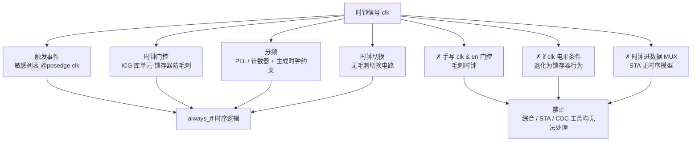

# 时钟信号使用规范

时钟信号使用规范（Clock Usage Rules）回答一个新手最常见、面试最常考的困惑：**为什么时钟不能像普通数据一样参与逻辑运算，只能出现在 always 块的敏感列表中？** 要理解这个问题，必须同时看到三层原因——物理电路的时序本质、综合与 STA 工具的能力边界、仿真器的事件语义——以及"只能出现在敏感列表"这个说法的适用范围与合法例外（时钟门控、分频、时钟切换都有专门的正确做法）。

## 原理

### 为什么时钟不能参与数据路径逻辑

**第一层：物理电路层面——时钟是全局同步基准。** 同步设计范式（Synchronous Design Methodology）要求所有寄存器由同一时钟（或经时钟树平衡的多个时钟）驱动，时序收敛（Timing Closure）的全部数学基础——建立时间/保持时间方程——都建立在"时钟沿是唯一的采样时刻"之上。一旦时钟进入数据路径逻辑，立即产生两类物理后果：(a) **毛刺时钟（Glitched Clock）**——组合逻辑在输入变化瞬间可能产生多个短脉冲，这些毛刺在时钟线上会变成"假时钟沿"，被寄存器误采样为有效边沿，直接导致功能错误，且毛刺波形在物理上无法精确预测；(b) **时钟偏斜与波形恶化**——任何附加的逻辑门都给时钟路径增加延迟（改变时钟到达不同寄存器的时刻差，破坏时序裕量），并劣化时钟的上升/下降时间（Slew），使寄存器采样窗口内的电压摆幅不再满足要求。

**第二层：工具层面——综合、STA、CDC 工具都只认识"纯净时钟树"。** 静态时序分析（Static Timing Analysis, STA）的工作前提是：设计者通过 `create_clock` 等约束声明时钟，工具据此识别时钟网络并只对"发射寄存器 → 组合路径 → 捕获寄存器"的路径做时序检查。如果时钟被当作数据接进 MUX 的 D 端、ALU 的输入端，STA 无法为该路径建立合法的时序模型——它不知道这个"数据"何时跳变，建立/保持时间检查失去数学依据；综合工具同样无法优化这条路径，因为它的时序引擎和库选择都围绕时钟-数据二分模型工作。因此，**时钟用作数据（Clock as Data）是所有 RTL Lint 工具的默认严重错误规则**——`编码风格.md` 的 Lint 规则清单中明确列出"时钟信号进入 MUX/D 输入是严重的设计错误"。此外，跨时钟域（CDC）静态检查工具依赖"哪些信号是时钟"来识别跨域边界，时钟被逻辑篡改后整个 CDC 分类体系都会失效。

**第三层：仿真层面——时钟是"事件"而非"电平"。** 硬件描述语言（HDL）仿真器的调度语义中，时钟沿是事件（Event）：`@(posedge clk)` 声明"每当 clk 从非 1 跳变到 1 时唤醒本过程"。而把 clk 写进组合逻辑表达式（如 `assign y = clk & en`）是把时钟当作电平数据参与布尔运算——仿真器仍会计算，但该表达式的输出在 X/Z 传播、事件排序上遵循组合逻辑语义，与真实硬件的时钟行为脱节；更糟的是，仿真能"通过"的毛刺时钟电路在物理上却可能失败——**仿真通过不等于时序正确**，这正是毛刺时钟电路在门级仿真（Gate-Level Simulation）中频繁出现 X 值不一致的原因。

### "只能出现在敏感列表吗"——准确表述与合法例外

"时钟只能出现在敏感列表"这个说法**过于绝对**。准确表述是：**在可综合 RTL 中，时钟只能以"触发事件"的身份参与设计描述，不能作为数据路径信号参与逻辑运算；工程中一切"对时钟做操作"的需求都有专门的库单元或约束化做法。**

时钟的合法"使用通道"有四种：

1. **事件控制（敏感列表）**——标准用法。`always_ff @(posedge clk or negedge rst_n)` 中时钟以边沿事件出现；异步复位与时钟并列出现在敏感列表，是因为复位在时序逻辑中也是"事件"而非数据（异步复位沿需要立即响应，不等时钟沿）。
2. **时钟门控（Clock Gating）**——低功耗需求。工程铁律是**强制使用工艺库提供的 ICG 专用单元（ICG Cell）**：RTL 只写时钟使能（CE）风格，综合阶段通过 `set_clock_gating_style` + `insert_clock_gating` 强制指定库 ICG 单元；ICG 内部用低电平透明的锁存器锁存使能信号，再与时钟做与运算，保证门控时钟沿完整无毛刺，并集成 DFT 旁路引脚。**禁止手写 `assign gated_clk = clk & en`，也禁止用标准锁存器 + 与门自行搭门控**——普通与门无法阻止使能信号在 clk=1 期间的变化穿透为毛刺，自搭门控无时序模型、无 DFT 旁路、破坏门控时钟树统一性（强制策略的完整讨论见 [[cross-domain/concepts/低功耗设计|低功耗设计]] 的 ICG 章节）。
3. **分频（Division）**——产生低频时钟。优先使用 PLL/MMCM 硬件分频；RTL 计数器分频的输出（如 `cnt[0]`）在工程上可作为低频从时钟使用，但必须在时序约束（SDC）中声明为生成时钟（`create_generated_clock`）并处理好与源时钟的关系，否则 STA 无法分析。
4. **时钟切换（Clock Switching）**——多时钟源切换。必须使用**无毛刺时钟切换电路**（Glitch-Free Clock Switching / Clock MUX with Switching Protection），切换时先关断旧时钟再开启新时钟；普通 MUX 直接选时钟会在切换瞬间产生截断或拼接的毛刺脉冲。

### 反例对照：每条错误写法的正确替代

| 反例（错误） | 错误本质 | 正确做法 |
|:---|:---|:---|
| `assign gated_clk = clk & en;` | 毛刺时钟：en 在 clk=1 期间变化直接成为毛刺 | `always_ff` + 时钟使能（CE），工具自动映射 ICG |
| `always @(clk) if (clk) q <= d;` | 把时钟电平当条件：行为退化为电平敏感 | `always_ff @(posedge clk)` 边沿采样 |
| `assign out = sel ? clk : data;` | 时钟进入数据 MUX：STA 无时序模型 | 无毛刺时钟切换电路（专用宏） |
| `assign y = clk ^ data;` | 时钟参与算术/逻辑运算：时序基准被污染 | 拆分为时钟域内寄存器运算 |
| 计数器输出 `cnt[0]` 直接当全局时钟且无约束 | 分频时钟未声明：STA/CDC 无法分析 | SDC 中 `create_generated_clock` 声明，或改用 PLL |

**代码对照示例**（正反例均逐行注释）：

```verilog
// ❌ 不可综合：手写门控时钟 —— en 在 clk=1 期间的任何跳变都会穿透与门
// 在门控时钟上形成毛刺，毛刺被下游 always 块误认为有效时钟沿
assign gated_clk = clk & en;        // en 是数据，clk 是时钟 —— 二者不能直接与运算
always @(posedge gated_clk) begin   // 毛刺时钟作敏感事件 —— 功能不可预测
    q <= d;                         // 仿真可能通过，物理实现必失败
end
```

```systemverilog
// ✅ 可综合：时钟使能写法 —— 综合工具自动推断为带 CE 引脚的 D-FF
// 或插入 ICG 单元（锁存器 + 与门结构，门控时钟无毛刺）
always_ff @(posedge clk) begin   // clk 仅作为边沿触发事件出现在敏感列表
    if (en) q <= d;              // en=0 时保持原值 → 触发自动时钟门控
    // 不要写成 q <= en ? d : '0 —— 写零风格无法被门控
end
```

```verilog
// ❌ 不可综合：用时钟电平做数据条件 —— 综合后行为退化为锁存器
// 或不可预测的组合反馈，绝不等价于"clk=1 时采样"
always @(clk) begin        // 电平敏感事件（仅锁存器 always_latch 合法）
    if (clk) q <= d;       // "if(clk)" 把时钟当数据条件 —— 错误
end
```

```systemverilog
// ✅ 可综合：计数器分频（工程上用 PLL 更优，此处展示 RTL 计数分频）
// 注意：cnt[0] 作为时钟输出时，必须在 SDC 中用 create_generated_clock 声明
always_ff @(posedge clk or negedge rst_n) begin   // 复位沿与时钟沿并列 —— 事件
    if (!rst_n) cnt <= '0;                         // 异步复位：立即清零
    else        cnt <= cnt + 1'b1;                 // 每周期 +1
end
assign clk_div2 = cnt[0];   // 最低位每 2 周期翻转一次 → clk/2 分频时钟
// ⚠️ 分频输出作为时钟使用是"受约束的例外"，不是通用时钟操作
```

**时钟的合法通道全景**：



## 关键要点

- **三层禁令根源**：物理（毛刺/偏斜/波形恶化）、工具（STA 只认识纯净时钟树，Lint 默认报"时钟用作数据"为严重错误）、仿真（事件语义 vs 电平语义脱节）
- **准确表述**：时钟不能参与数据路径逻辑运算，但"只能出现在敏感列表"不准确——ICG 门控、PLL/计数分频、无毛刺时钟切换都是合法通道
- **敏感列表的三种形态**：边沿事件（`always_ff @(posedge clk)`，时序逻辑）、电平事件（`always_latch`，锁存器专用）、星号自动推断（`always_comb`，组合逻辑）——时钟只应出现在第一种
- **异步复位与时钟并列**：复位沿也是"事件"而非数据，所以 `negedge rst_n` 与 `posedge clk` 同列敏感列表
- **手写门控时钟是头号反例**：`clk & en` 的毛刺问题正是 ICG 用"锁存器 + 与门"结构的原因，低功耗设计必须依赖工具插入 ICG
- **分频/切换是"受约束的例外"**：计数器分频输出作时钟需 `create_generated_clock` 声明；多时钟源切换必须用无毛刺切换电路，普通 MUX 直接选时钟是错误
- **仿真通过 ≠ 时序正确**：毛刺时钟电路仿真可能正常，物理实现却失败——Lint/STA 的静态检查才是兜底

## 与其他概念的关系

- [[rtl-design/concepts/时序逻辑|时序逻辑]] — 时钟使能（CE）编码风格与 ICG 单元结构：`always_ff` + 条件保持原值触发自动门控，是"时钟只做事件"原则的正向应用
- [[cross-domain/concepts/低功耗设计|低功耗设计]] — 时钟门控（Clock Gating）的完整机理：ICG 锁存器+与门结构、为什么 `clk & en` 产生毛刺、门控使能的 setup 时序预算
- [[rtl-design/concepts/编码风格|RTL 编码风格]] — Lint 规则"时钟用作数据检测"（时钟进入 MUX/D 输入为严重错误）是该规范的工具化落地
- [[asic-flow/concepts/静态时序分析|静态时序分析]] — `create_clock`/`create_generated_clock` 声明是 STA 识别时钟的前提，时钟纯净性是全部时序方程成立的基础
- [[rtl-design/concepts/Verilog-HDL|Verilog HDL]] — 事件控制（Event Control）语法、敏感列表完整性与锁存器推断的语法层面知识
- [[cross-domain/concepts/跨时钟域设计|跨时钟域设计]] — 分频时钟与源时钟构成时钟域关系，CDC 分类依赖时钟声明，多域交互需同步器
