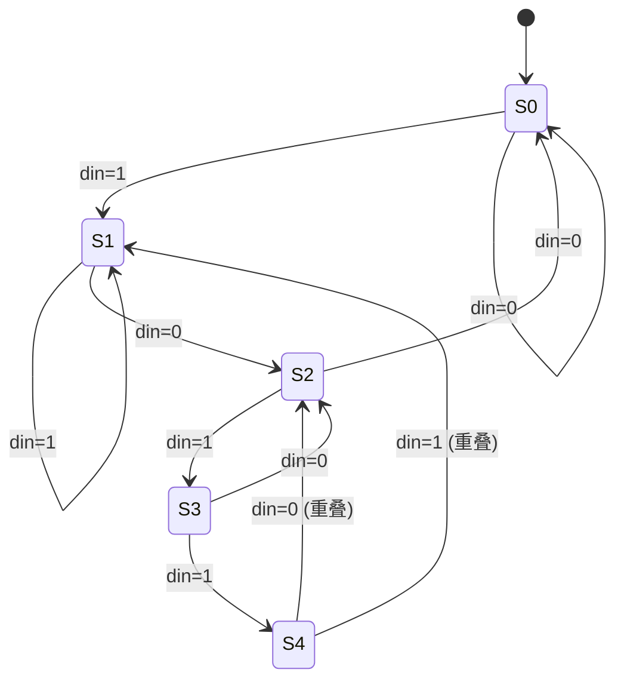
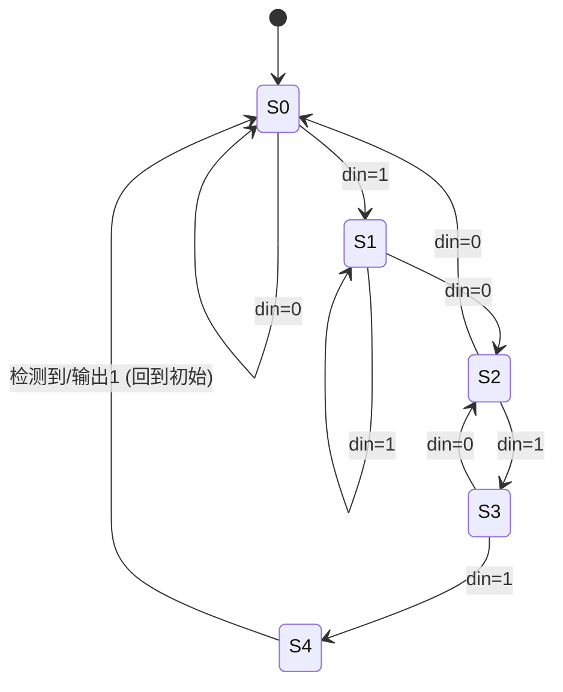

# 有限状态机设计

有限状态机（Finite State Machine, FSM）是数字控制逻辑最核心的建模和实现范式。FSM 将系统的行为抽象为有限个状态（State），每个状态定义特定的输出行为，状态之间的转换（Transition）由输入条件触发。FSM 广泛应用于总线协议控制器（AXI、PCIe 的读写状态序列）、存储器控制器（刷新/激活/读写序列）、中断控制器、流水线控制、网络协议解析和加密引擎等几乎所有数字控制模块。FSM 的设计质量直接影响系统的功能正确性、面积、功耗和时序收敛——一个精心设计的 FSM 时钟频率可以高于 1GHz，而一个粗糙编写的 FSM 可能成为整个芯片的时序瓶颈。

## 原理

### Moore 与 Mealy 两种模型


FSM 依据输出函数与当前状态和输入的关系，分为两种基本模型：

**Moore 状态机**：输出**仅**取决于当前状态，与输入无直接关系。输出在状态转换的时钟沿之后改变——输出与状态同步变化。典型用例包括：定时器（状态对应剩余时间）、仲裁器（状态对应当前授权方）、ALU 控制（状态对应操作类型）。Moore 机的输出相对于输入存在天然的过滤效果——输入毛刺仅影响次态，不直接传播到输出，输出毛刺少、时序收敛简单。代价是可能用更多的状态来编码同一行为。

**Mealy 状态机**：输出取决于当前状态**和**当前输入。输入改变可以立即反映到输出（组合逻辑路径穿透），不等待时钟沿。典型用例包括：串行协议解析器（需要响应输入字符立即产生控制信号）、流水线握手（valid/ready 与数据同步变化）、高速接口（输出需要在同一周期响应输入）。Mealy 机状态数更少，响应更快（输入到输出的组合延迟更短），但输出可能携带输入毛刺，且输出时序路径更复杂。

实际设计中，Moore 和 Mealy 的边界是模糊的——同一个 FSM 可以从 Moore 的角度设计状态，但将某些输出通过组合逻辑提前产生，从而在状态数不增加的前提下实现 Mealy 级响应速度。

### 三进程（Three-Process）编码风格

现代 SystemVerilog FSM 编码推荐使用**三进程模板**，将状态寄存器的更新、次态逻辑和输出逻辑严格分离为三个独立的 always 块，这是 FSM 编码的"黄金模板"。

1. **状态寄存器进程**：`always_ff @(posedge clk or negedge rst_n)`——唯一的时序逻辑块，负责在时钟沿将 next_state 赋给 current_state。除复位赋值外此块中不出现任何其他逻辑。时序块的纯粹性保证 STA 工具可精确抽取状态寄存器的建立/保持时间路径。

2. **次态逻辑进程**：`always_comb`——纯组合逻辑，根据 current_state 和所有输入信号计算 next_state。使用 case 语句枚举所有状态，每个 case 项包含 if-else 或嵌套 case 描述转换条件。**必须包含 default 分支**以避免锁存器推断，且 default 通常指向错误恢复逻辑或安全状态（IDLE）而非保持当前状态。

3. **输出逻辑进程**：`always_comb`——纯组合逻辑，根据 current_state 和输入（Mealy 模式下）计算所有输出信号。Moore 模式的输出仅依赖 current_state；Mealy 模式的输出同时依赖 current_state 和输入。输出逻辑块的 case 结构必须与次态逻辑块一一对应，确保可维护性。

三进程分离的核心优势：a) 状态寄存器和组合逻辑边界清晰，STA 可精确分析每条路径；b) 综合工具对独立组合块优化效果更好；c) 代码审查可独立验证次态逻辑和输出逻辑；d) Lint 工具可在每个块内实施针对性检查。

### 可综合三进程 FSM 的标准模板

以下展示一个完整的 AXI-Lite 写地址通道控制器的三进程 FSM 实现，涵盖 IDLE -> ADDR -> DATA -> RESP 四个状态的完整转换逻辑：

```systemverilog
// ============================================================
// 三进程 FSM 标准模板 —— AXI-Lite 写地址通道控制器
// ============================================================
// 设计模式：Moore 型 FSM（输出仅依赖当前状态，不直接依赖输入）
// 状态序列：IDLE → ADDR → DATA → RESP → IDLE
//
// ===== 状态类型定义 =====
// typedef enum：创建自定义枚举类型（SystemVerilog）
//   - 语法：typedef enum <base_type> {NAME=value, ...} type_name;
//   - logic [1:0] 为基类型（base type）——每个状态编码为 2 比特
//   - 优点：(1) 类型安全——不能将非 state_t 的值赋给状态变量
//          (2) 波形查看器中显示 IDLE/ADDR 等符号名，而非 00/01 数字
//          (3) 综合工具可自由选择最优编码（独热/二进制/Gray）
//   - 显式指定值 2'b00 等是可选的——不指定时从 0 自增
typedef enum logic [1:0] {
    IDLE  = 2'b00,            // 空闲：等待地址握手
    ADDR  = 2'b01,            // 地址阶段：等待写数据握手
    DATA  = 2'b10,            // 数据阶段：等待最后一笔数据（wlast）
    RESP  = 2'b11             // 响应阶段：等待响应握手
} state_t;

// 状态寄存器变量声明
// current_state：当前状态（D-FF 输出），由进程 1 驱动
// next_state：   次态（组合逻辑输出），由进程 2 计算
state_t current_state, next_state;

// ===== 进程 1：状态寄存器（时序逻辑，唯一的 always_ff）=====
//
// 功能：在每个时钟上升沿将 next_state 存入 current_state
//       异步复位时回到 IDLE
// 这是整个 FSM 唯一的时序块——其他两个进程均为组合逻辑
//
// <= ：非阻塞赋值
//   current_state <= IDLE       → 复位后第一个时钟沿 current_state 变为 IDLE
//   current_state <= next_state → 每个时钟沿状态向前更新一拍
always_ff @(posedge clk or negedge rst_n)
    if (!rst_n) current_state <= IDLE;    // 异步复位：回到初始状态
    else        current_state <= next_state; // 正常跳转：次态 → 现态

// ===== 进程 2：次态逻辑（组合逻辑，always_comb）=====
//
// 功能：根据 current_state 和输入信号，计算下一周期的状态（next_state）
//
// = ：阻塞赋值（组合逻辑使用 = ）
//   - 在 always_comb 中必须使用 = ；<= 在此处是错误的
//
// next_state = current_state ：默认赋值——防止锁存器推断
//   - 如果某个 case 分支没有显式指定 next_state，保持当前状态不变
//   - 这是组合逻辑 safety net：即使漏写某个 case 项也不会产生锁存器
//
// unique case ：SystemVerilog 关键字
//   - 向综合工具声明 case 项是互斥的（mutually exclusive）
//   - 综合工具消除优先级编码 → 并行 MUX 树，延迟 O(log N)
//   - 仿真时若多个 case 项同时匹配，报告违规（violation）警告
//   - 对比：普通 case 有隐式优先级（先匹配先生效），unique case 无优先级
//
// default: next_state = IDLE ：非法状态安全恢复
//   - 如果因 SEU（单粒子翻转）进入未定义的编码，下一拍自动跳回 IDLE
//   - 这是安全关键型 FSM 的必备设计——不能假设 default 永远不触发
always_comb begin
    next_state = current_state;               // 默认保持（防锁存器）
    unique case (current_state)
        // |-> 语法含义：条件成立则跳转
        // awvalid && awready：主从双方同时握手 → 地址传输完成
        IDLE: if (awvalid && awready) next_state = ADDR;
        // wvalid && wready：写数据握手完成
        ADDR: if (wvalid  && wready)  next_state = DATA;
        // wlast：AXI 的最后一笔数据标记（突发传输结束标志）
        DATA: if (wlast)              next_state = RESP;
        // bvalid && bready：写响应握手完成
        RESP: if (bvalid && bready)   next_state = IDLE;
        // 非法状态恢复：所有未定义编码 → 回到 IDLE
        default: next_state = IDLE;
    endcase
end

// ===== 进程 3：输出逻辑（组合逻辑，always_comb，Moore 型）=====
//
// 功能：根据 current_state 计算模块输出信号
// Moore 型：输出仅取决于 current_state，不直接依赖输入
//   - 优点：输出与时钟同步变化，无输入毛刺传播
//   - 代价：输出延迟一拍——状态变化后下一个时钟沿才体现在输出上
//
// {awready_o, wready_o, bvalid_o} = '0 ：块起始默认赋值
//   - 拼接运算符 {} ：将多个信号合并为一个向量
//   - '0 ：全 0 赋值（自动匹配拼接后的位宽 = 3 位 → 3'b000）
//   - 这是消除锁存器的关键技巧：先给所有输出默认值，再在 case 中覆盖
//   - 未被显式赋值的输出 = 默认值 0（而非保持上一值 → 锁存器）
always_comb begin
    {awready_o, wready_o, bvalid_o} = '0;    // 默认全 0（防锁存器 + X 优化）
    unique case (current_state)
        IDLE:  awready_o = 1'b1;             // 空闲态：准备好接收地址
        ADDR:  wready_o  = 1'b1;             // 地址态：准备好接收数据
        DATA:  wready_o  = 1'b1;             // 数据态：持续准备好接收数据
        RESP:  bvalid_o  = 1'b1;             // 响应态：驱动写响应有效
        default: /* 安全默认全零 */ ;           // 非法状态：输出全部无效
    endcase
end
```

### 状态编码策略

状态编码的选择对 FSM 的面积、速度和功耗有直接且显著的影响：

- **二进制编码（Binary Encoding）**：N 个状态用 $\lceil \log_2 N \rceil$ 比特表示。状态寄存器最少，但次态逻辑需要译码器，组合逻辑面积随状态数和输入数乘积增长。适用于状态数少的小型 FSM（<16 状态）。

- **格雷码编码（Gray Code Encoding）**：相邻状态的编码仅一位不同。功耗低（状态变化时平均翻转比特少），但多分支 FSM 通常无法保证所有相邻状态都是格雷相邻，效果有限。

- **独热编码（One-Hot Encoding）**：N 个状态用 N 个触发器表示，任意时刻仅一个触发器为 1。次态逻辑极简单——每个状态的次态仅取决于前驱状态的独热信号与转换条件的与门聚合。独热码是 FPGA 和现代 ASIC 中 FSM 的默认选择，在 16-128 状态范围内综合结果往往优于二进制编码。

- **自动编码（Enum Encoding）**：使用 SystemVerilog 的 `enum` 定义状态，由综合工具的编码约束自动选择最优编码——这是推荐的设计实践，编码策略由约束文件控制。

### 未使用状态的安全处理

N 个状态寄存器可表示 $2^N$ 种状态但有效状态通常远少于 $2^N$。未定义的编码构成非法状态（Illegal States）。如果电路因单粒子翻转（Single Event Upset, SEU）、电源干扰或复位不完整进入非法状态，FSM 必须确保安全恢复。处理策略：**安全状态恢复**——在次态逻辑 case 的 default 分支中将 next_state 指向 IDLE 或 SAFE 状态，确保任意非法状态在一个周期后恢复。**综合工具的 safe_fsm 指令**——Synopsys 的 `syn_encoding = "safe"` 指示工具自动插入非法状态检测和恢复逻辑。

### FSM + Datapath 架构分离

在大型数字模块中，推荐将控制逻辑（FSM）与数据通路（Datapath）严格分离。FSM（控制器）负责决策——输出控制信号（MUX 选择、寄存器使能、ALU 操作码、存储器读写使能）。Datapath（数据通路）负责计算——包含功能单元（加法器、乘法器、移位器、MUX）、寄存器和数据总线，根据 FSM 的控制信号选择数据流向。FSM 接收 Datapath 的状态信号（如比较器输出、计数器归零、FIFO 空满）作为输入条件，形成控制反馈闭环。这一分离将复杂时序收敛问题简化为两个子域：FSM 控制信号时序（浅组合逻辑）和 Datapath 数据路径时序（可流水线化）。

### 状态编码对面积和延迟的量化影响

不同状态编码策略对综合结果的定量影响可以通过一个 16 状态的 FSM 来展示。**二进制编码**：4 个状态寄存器，次态逻辑需完全的 4 位译码（4-LUT 深度约 3-4 级），状态转换逻辑随输入分支数增长迅速。**独热编码**：16 个状态寄存器，每个状态的次态逻辑仅需前驱状态的独热位 AND 转换条件——次态逻辑为一级 AND-OR（2 级门延迟），在 FPGA 中仅占 1 个 LUT 深度。对于 16-32 状态范围的 FSM，独热编码的速度优势约为 20%-40%（次态逻辑延迟更短），面积开销约为 2x-3x 触发器数量。对于超小型 FSM（<8 状态），二进制编码的面积优势显著（触发器少 50%），速度差异不显著。对于超大型 FSM（>128 状态），独热编码的触发器开销过大，二进制编码回归为更合理的选择。

当代综合工具（Synopsys DC、Genus、Vivado）的自动编码优化通常为 16-128 状态选择独热，<16 状态选择二进制——通过 `syn_encoding` 属性可显式控制编码策略。对于安全关键型 FSM，综合工具的 `safe_fsm` 选项自动插入非法状态检测逻辑（将无效独热向量或未使用二进制编码映射到复位状态），面积开销约为 5%-10%。

### 一段式、两段式、三段式 FSM 的区别与选择

FSM 的编码风格按照 always 块的数量分为三种，其根本区别在于**状态寄存器、次态逻辑、输出逻辑三者如何组合分配到不同的 always 块中**。

**一段式（One-Always）**：所有逻辑——状态寄存器、次态计算和输出生成——全部写在一个 `always @(posedge clk)` 块中。输出和次态都通过非阻塞赋值（`<=`）在时钟沿更新。一段式的最大问题是：输出被寄存器延迟一拍（因为 `<=` 在时钟沿才生效），无法实现 Mealy 型即时输出；且所有逻辑混在一起，代码超过 100 行后极度难以维护和调试。一段式在早期 Verilog-95 时代常见，现代数字设计已基本淘汰，仅在极简单的 3-5 状态小型 FSM（如简单的脉冲检测器）中偶尔使用。

**两段式（Two-Always）**：将时序逻辑和组合逻辑分离——第一个 always_ff 块做状态寄存器（current_state <= next_state），第二个 always_comb 块同时计算次态逻辑和输出逻辑。两段式相比一段式有本质提升：输出可以是组合逻辑（Mealy 型），次态逻辑与状态寄存器分离使 STA 可以独立分析组合路径。但两段式的核心缺陷是**次态逻辑和输出逻辑仍混在同一 always_comb 块中**——当 FSM 超过 10 个状态、输出超过 20 个信号时，同一组合块既要管状态转换又要管输出赋值，代码中"默认赋值+case 覆盖"的模式容易因疏漏产生锁存器，且输出信号的赋值散落在 case 分支中难以追踪。

**三段式（Three-Always）**：状态寄存器（always_ff）、次态逻辑（always_comb）、输出逻辑（always_comb）严格分离为三个独立块——这是 FSM 编码的现代工业标准。三段式的核心优势：(a) 输出逻辑独立成块，可统一用"块首默认赋值 + case 覆盖"模式彻底消除锁存器；(b) 次态逻辑块专注于状态转换条件，不被输出赋值干扰；(c) STA 可精确抽取三条独立时序弧——current_state→next_state（次态组合延迟）、current_state→output（输出组合延迟）、input→output（Mealy 路径延迟）；(d) 代码审查可按块分工——一人审次态逻辑，另一人审输出逻辑。

### 三段式第三段为什么可以用 next_state

三段式 FSM 的第三段（输出逻辑）使用 `current_state` 而非 `next_state` 来生成输出——这是**刻意为之的核心设计决策**，而非随意选择。

原因在于组合逻辑的因果链：第三段是 `always_comb` 组合块，其输入为 `current_state` 和（Mealy 模式下）输入信号。当 `current_state` 变化时（经过进程 1 的时钟沿），第三段自动重新计算输出——输出在时钟沿后仅经过一段组合延迟（Tco + 输出组合逻辑延迟）就稳定，而非等待下一个时钟沿。如果第三段使用 `next_state` 来生成输出，等价于将次态逻辑的一部分延迟追加到输出路径上——`next_state` 本身是进程 2 的组合输出，第三段再基于 `next_state` 做组合运算，形成**两级组合逻辑级联**（`current_state → next_state → output`），输出延迟 = 次态逻辑延迟 + 输出逻辑延迟，这在高速设计中是不可接受的。

结论：**第三段用 current_state 是为了将输出逻辑延迟与次态逻辑延迟并行化（而非串行叠加）**。次态逻辑和输出逻辑各自独立计算，两者的组合延迟不累加——这是三段式相对于两段式在时序上的关键优势。

### Moore 和 Mealy 分别适合哪种编码风格

**Moore 型 FSM 最适配三段式**。Moore 的输出仅依赖 current_state，第三段的输出逻辑可独立于次态逻辑并行计算——三段式的结构天然契合 Moore 的输出模型。在三段式 Moore 中，输出逻辑块只需要一个 `case(current_state)` 即可完全描述所有输出行为，代码简单且时序可预测。推荐实践：绝大多数控制型 FSM（总线控制器、仲裁器、存储控制器）使用三段式 Moore 模板。

**Mealy 型 FSM 适配两段式或三段式的变体**。Mealy 输出同时依赖 current_state 和输入，在同一个组合块中处理状态转换和输出更为自然——因为输出变化的条件与状态转换条件通常是同一组输入信号的函数。如果强行用三段式写 Mealy，第三段的输出逻辑需要同时感知 current_state 和输入信号，而输入的组合变化会直接穿透第三段到达输出端口——这在某些场景下正是需要的行为（快速响应），但也增加了输出毛刺的风险。推荐实践：Mealy 型 FSM 使用两段式，将次态和输出放在同一个 always_comb 中，并用寄存器将组合输出打一拍消除毛刺后再送出模块边界。

### 常见状态机编码方式及优缺点

状态编码（State Encoding）策略直接决定 FSM 的面积、速度和功耗，是综合优化中最有影响力的单一决策。

| 编码方式 | 触发器数（N 状态） | 次态逻辑复杂度 | 速度 | 功耗 | 适用场景 |
|:---|:---|:---|:---|:---|:---|
| **二进制编码（Binary）** | log2(N) | 高（需完整译码器） | 中 | 中 | N < 16 的小型 FSM |
| **独热编码（One-Hot）** | N | 低（仅 AND-OR 两级） | 最高 | 中（多触发器翻转） | 16 ≤ N ≤ 128，FPGA 和高速 ASIC |
| **格雷编码（Gray）** | log2(N) | 高 | 中 | 最低 | 顺序状态转换为主（计数器型 FSM）、低功耗场景 |
| **约翰逊编码（Johnson）** | N/2 | 中 | 高 | 低 | 环形计数器、分频器 |
| **自动编码（Enum/Synthesis）** | 工具选择 | 工具优化 | 工具优化 | 工具优化 | 推荐默认策略——由约束驱动 |

**二进制编码**面积最小（触发器最少），但次态逻辑需要完整的 log2(N) 位译码器，组合逻辑深度为 O(log N) 级。在状态数 N=16 时，二进制编码仅需 4 个触发器（vs 独热的 16 个），但次态逻辑的延迟可能比独热编码高 2-3 倍。

**独热编码**次态逻辑最简单——每个状态的激活条件仅为前驱状态的独热位 AND 转换条件，组合逻辑深度仅 2 级门（AND-OR），是高速 FSM 的默认编码。代价是触发器数量与状态数线性增长——128 状态的独热编码消耗 128 个 DFF，触发器的时钟树功耗成为主导。独热编码还有一个附加优势：**非法状态检测极为容易**——如果独热向量中出现了 0 个 1 或多个 1，立即可判定为 SEU 错误，无需额外的检测逻辑。

**格雷编码**相邻状态仅 1 位翻转，动态功耗最低（状态变化时平均仅 1 条组合路径翻转）。但格雷码要求状态转换图是顺序的——多分支 FSM（如中断控制器同时响应多个中断源）无法保证所有跳转的相邻状态都是格雷相邻，此时格雷码的功耗优势大打折扣。

**约翰逊编码（Johnson Counter）** N 个状态仅需 N/2 个触发器，且相邻状态也仅 1 位翻转。适用于环形计数器、分频器、简单的轮询调度器等状态转换序列固定的场景。通用 FSM 不适用，因为其状态转换不可预测。

### 安全状态机设计

安全状态机（Safe FSM）设计确保 FSM 在遭遇单粒子翻转（Single Event Upset, SEU）、电源干扰、复位时序违例等异常事件后**能够自动恢复**到已知的有效状态，而非永久卡死在非法状态中。

**多层防御策略**：

1. **RTL 级恢复**：次态逻辑的 `default` 分支将 `next_state` 指向 IDLE 或 SAFE 状态。这是最基础且必须的措施——不写 default 分支（或 default 保持 current_state）意味着非法状态将永久锁存。关键设计点：default 的跳转目标必须是**无条件的**——不依赖任何输入信号，因为进入非法状态时的输入状态本身可能也是不可信的。

2. **综合级加固**：Synopsys DC 的 `syn_encoding = "safe"` 和 Vivado 的 `FSM_SAFE_STATE` 属性指示综合工具自动插入非法状态检测和恢复逻辑。工具在网表中为每个非法编码添加一个 AND-OR 检测树——当状态寄存器值匹配任何非法编码时，异步或同步强制状态回到 IDLE。面积开销约 5%-10%。

3. **物理级加固**：将状态寄存器替换为抗辐射加固触发器（Rad-Hard DFF）或使用三模冗余（Triple Module Redundancy, TMR）——三组状态寄存器独立运行，通过多数表决器（Majority Voter）选择正确值。TMR 的面积开销约 3.2x-3.5x（三份寄存器 + 表决器），用于航天/卫星等极高可靠性场景。

4. **错误指示**：在安全 FSM 中设计一个 `error_flag` 输出，当非法状态被检测到时拉高一个时钟周期——使系统控制器能记录 SEU 事件并采取系统级恢复措施（如复位模块或重配置）。

### 状态机复位注意事项

FSM 的复位设计直接影响芯片的上电行为、测试覆盖率和时序收敛，需要关注以下关键点：

1. **异步复位、同步释放**：FSM 的状态寄存器通常使用异步复位（`always_ff @(posedge clk or negedge rst_n)`）以在上电期间无需时钟即可进入 IDLE。但异步复位的释放（从 `rst_n=0` 到 `rst_n=1`）如果恰好发生在时钟沿附近，可能违反状态寄存器的恢复/移除时间（Recovery/Removal Time），导致 FSM 进入非法状态。解决方案：在芯片顶层的复位树中使用**复位同步器**（Reset Synchronizer）——两级 DFF 串联将异步复位转换为同步释放，确保释放沿与时钟沿有确定的时间关系。

2. **复位值必须是有效编码**：`current_state <= IDLE`（或等价的初始状态）必须是有效状态编码——如果 IDLE 被编码为 4'b0000 但独热编码要求恰好 1 位为 1，则复位后 FSM 不能处于全零状态。对于独热编码的 FSM，IDLE 应编码为 `N'b00...01`（仅最低位为 1）以确保复位值本身是合法的独热向量。

3. **复位后首周期行为**：复位释放后的第一个时钟沿，FSM 进入 IDLE 状态，但此时**所有输入信号的状态未知**——芯片上电过程中，不同模块的复位释放时间可能早于或晚于 FSM 的复位释放。因此 IDLE 状态下的转换条件必须对"所有输入为 X 或不确定"的情况有安全的处理——典型做法是 IDLE 状态下默认不跳转（保持 IDLE），仅当输入满足明确的有效条件时才跳转。

4. **复位期间的输出状态**：异步复位期间（`rst_n=0`），状态寄存器被强制为 IDLE，但组合输出逻辑仍在工作——`always_comb` 块在复位期间根据 `current_state == IDLE` 计算输出。需要确认复位期间的所有输出值对外部模块是安全的（如 valid 信号必须为 0、ready 信号可设为 1 或 0 取决于协议要求）。

5. **复位树中的 FSM 时序**：如果芯片中有大量 FSM（如 100+ 个），所有 FSM 的状态寄存器同时释放复位可能导致巨大的**瞬态电流尖峰**（di/dt）——成百上千个 DFF 在同一时钟沿从复位值翻转到 IDLE 需要大量动态电流。解决方案：在复位树中插入**复位扇出缓冲器链**或故意错开不同模块的复位释放时间（Staggered Reset Release），将瞬态电流分散到多个时钟周期。

## 序列检测器

### 序列检测器设计

序列检测器（Sequence Detector）是FSM的经典应用——检测输入码流中是否出现特定序列（如1011）。分为可重叠（Overlapping）和不可重叠（Non-overlapping）两种检测模式。

可重叠检测：检测到目标序列后，已匹配的序列后缀可作为下一个检测的前缀。例如输入"101011"中检测"1011"——可重叠模式在位置1-4检测到第一个"1011"后，位置3-6的"1011"也可被检测到（因为第一个序列的最后两位"11"中的后一个"1"可作为新序列的开始）；实际上检测到位置1-4和位置3-6两个序列。

不可重叠检测：检测到目标序列后，状态机回到初始状态重新开始匹配，不利用已匹配序列的尾缀。

Moore型序列检测器：输出仅取决于当前状态，输出与状态同步变化。Mealy型序列检测器：输出取决于当前状态和输入，输入变化可立即影响输出。对于序列检测器，Mealy型通常比Moore型少用一个状态（因为Mealy的输出可以在状态转换弧上产生，而Moore必须在状态节点内部产生）。Mealy型序列检测器在检测到序列的同一拍就能输出检测信号，Moore型则延迟一拍。

#### 重叠型1011序列检测器（Mealy型）

```systemverilog
// ===== 重叠型 1011 序列检测器（Mealy 型）=====
// 可重叠：检测到 1011 后，后缀可作为下一个检测的前缀
// 例如 "101011" → 检测到两次（位置 1-4 和位置 3-6）
module seq_detector_1011_overlap (
    input  logic clk,           // 时钟信号
    input  logic rst_n,         // 异步复位（低有效）
    input  logic din,           // 串行输入数据
    output logic detect         // 序列检测到标志（Mealy 型——组合输出）
);
    // ===== 状态编码：5 个状态 =====
    // S0 = 3'b000：初始/无匹配（" "）
    // S1 = 3'b001：匹配 "1"
    // S2 = 3'b010：匹配 "10"
    // S3 = 3'b011：匹配 "101"
    // S4 = 3'b100：匹配 "1011" → 检测到！
    //   （不用独热编码，5 个状态用二进制编码更省触发器）
    typedef enum logic [2:0] {
        S0 = 3'b000, S1 = 3'b001, S2 = 3'b010,
        S3 = 3'b011, S4 = 3'b100
    } state_t;
    state_t current_state, next_state;
    
    // 进程 1：状态寄存器
    always_ff @(posedge clk or negedge rst_n)
        if (!rst_n) current_state <= S0;
        else        current_state <= next_state;
    
    // 进程 2：次态逻辑（可重叠）
    always_comb begin
        next_state = current_state;           // 默认保持（防锁存器）
        case (current_state)
            S0: next_state = din ? S1 : S0;   // 匹配到 '1' → S1，否则停留在 S0
            S1: next_state = din ? S1 : S2;   // din=1 保持 S1（重叠：'1' 仍为前缀），din=0 → S2
            S2: next_state = din ? S3 : S0;   // 匹配到 "101" → S3，否则回 S0
            S3: next_state = din ? S1 : S2;   // din=1 → "1011" 检测到→S4，din=0 回 S2（重叠："10"作为新前缀）
            S4: next_state = din ? S1 : S2;   // 已检测到，din=1→S1，din=0→S2（重叠后续匹配）
            default: next_state = S0;          // 安全恢复
        endcase
    end
    
    // 进程 3：输出逻辑（Mealy 型——依赖当前状态+输入）
    always_comb begin
        detect = 1'b0;                        // 默认不检测（防锁存器）
        case (current_state)
            S3: if (din) detect = 1'b1;       // 在 S3 状态且输入为 1 → 序列 "1011" 完成
            S4: if (din) detect = 1'b1;       // 在 S4 状态且输入为 1 → 又检测到（重叠情况）
            default: detect = 1'b0;
        endcase
    end
endmodule
```

#### 不可重叠型1011序列检测器（Moore型）

```systemverilog
// ===== 不可重叠型 1011 序列检测器（Moore 型）=====
// 不可重叠：检测到 1011 后，回到初始状态重新开始
// 例如 "101011" → 只检测到一次（位置 1-4，之后重新开始）
module seq_detector_1011_nonoverlap (
    input  logic clk,
    input  logic rst_n,
    input  logic din,
    output logic detect              // Moore 型——寄存输出，与时钟同步
);
    typedef enum logic [2:0] {
        S0 = 3'b000, S1 = 3'b001, S2 = 3'b010,
        S3 = 3'b011, S4 = 3'b100   // S4：检测到 "1011" 的状态
    } state_t;
    state_t current_state, next_state;
    
    // 进程 1：状态寄存器
    always_ff @(posedge clk or negedge rst_n)
        if (!rst_n) current_state <= S0;
        else        current_state <= next_state;
    
    // 进程 2：次态逻辑（不可重叠）
    always_comb begin
        next_state = current_state;
        case (current_state)
            S0: next_state = din ? S1 : S0;
            S1: next_state = din ? S1 : S2;
            S2: next_state = din ? S3 : S0;
            S3: next_state = din ? S4 : S2;   // din=1 → 检测到！去 S4
            S4: next_state = din ? S1 : S0;    // 检测后回到初始态重新开始
            default: next_state = S0;
        endcase
    end
    
    // 进程 3：输出逻辑（Moore 型——仅依赖当前状态）
    always_comb begin
        detect = (current_state == S4);       // 仅在 S4 状态输出检测信号
    end
endmodule
```

#### 重叠型状态转换图（Mealy型）



#### 不可重叠型状态转换图（Moore型）



## 关键要点

- **Moore/Mealy 选择取决于响应需求**：Moore FSM 输出仅依赖状态（输出与时钟同步、无毛刺），Mealy FSM 输出依赖状态+输入（响应快、状态少但可能传播输入毛刺）
- **三进程编码为 FSM 黄金模板**：严格分离状态寄存器（always_ff）、次态逻辑（always_comb）和输出逻辑（always_comb），是 FSM 编码的黄金模板
- **独热编码为中等规模最优选择**：在 16-128 状态范围中次态逻辑简单、面积/速度权衡最优，是现代 ASIC 和 FPGA 的默认选择
- **enum 为状态定义推荐方式**：类型安全、符号调试友好，综合工具可据此进行最优编码选择
- **default 分支必须导向 IDLE**：次态逻辑的 default 分支必须将非法状态导向 IDLE（而非保持当前状态），确保单粒子翻转后可恢复
- **FSM + Datapath 架构分离**：是控制器/数据通路经典设计模式的核心，将复杂时序收敛分解为控制路径和数据路径两个子域
- **输出寄存消除毛刺**：将组合输出经过额外 D-FF 拍出，是消除输出毛刺和改善输出端口时序的常用优化手段
- **次态逻辑避免深嵌套 if-else**：三层以上的深嵌套严重增加次态逻辑延迟且难以代码审查
- **输出寄存改善时序接口质量**：将组合输出经过一级 D-FF 打出，消除输出毛刺、隔离状态寄存器与输出端口的长组合路径
- **两进程 FSM 风格增加毛刺风险**：次态逻辑与输出逻辑合并减少了代码行数，但同一信号在不同 case 分支多次赋值时，合并式编码可能导致意外的优先级行为
- **重叠检测利用序列后缀**：可重叠检测的关键在于检测到目标序列后不回到初始态，而是根据当前已匹配的后缀跳转到对应的中间状态，使序列尾缀即下一个检测的前缀
- **Mealy型序列检测器少一个状态**：Mealy输出可在转换弧上产生，序列检测通常比等价的Moore型少用一个状态（因为Moore需要专门的状态输出检测信号）
- **可重叠 vs 不可重叠的核心区别在次态逻辑**：可重叠在检测到序列后跳转到"S0或S1"（取决于输入），不可重叠直接跳回"S0"
- **Mealy型输出带毛刺风险**：Mealy型的输出由组合逻辑产生（当前状态 + 当前输入），可能携带输入毛刺；Moore型输出由状态寄存器驱动，与时钟同步、无毛刺
- **重叠检测对最后一位的处理**：可重叠检测在序列的最后一位匹配后，需要判断其是否也可作为新序列的第一位。对于"1011"，最后一位"1"就是新序列的第一位，所以S4状态下din=1→S1

## 与其他概念的关系

- [[rtl-design/concepts/时序逻辑|时序逻辑]] — FSM 的状态存储在 D 触发器中，always_ff 描述状态寄存器的时钟和复位行为，时序约束决定了 FSM 的最大时钟频率。次态逻辑的延迟（从 current_state 到 next_state 的组合路径）是 FSM 时钟频率的最主要限制因素——独热编码通过减少次态逻辑层数来缓解这一约束
- [[rtl-design/concepts/编码风格|RTL 编码风格]] — 三进程 FSM 模板、enum 命名约定、次态逻辑 case 结构的规范化要求和 lint 规则。FSM 编码风格是编码规范中最严格的一类——非法状态恢复策略（default 分支）和输出完整赋值是综合和 Lint 检查的重点
- [[rtl-design/concepts/流水线设计|流水线设计]] — FSM 控制流水线的 stall/flush 和数据冒险处理，流水线控制器本质是 FSM + Datapath 的典型实例。流水线控制器的 FSM 状态（IDLE、ACTIVE、STALLed、FLUSHing）严格对应流水线寄存器使能和清零的控制信号
- [[rtl-design/concepts/SystemVerilog|SystemVerilog]] — enum 类型的状态定义、always_ff/always_comb 的意图显式编码、unique case 的互斥性声明。SystemVerilog 的 `enum` 在仿真波形中显示状态名称而非比特值，是调试效率和团队沟通的质变
- [[rtl-design/concepts/组合逻辑|组合逻辑（Combinational Logic）]] — 序列检测器的Mealy型输出是组合逻辑驱动的（当前状态+输入），其毛刺特性与组合逻辑的冒险/毛刺机理直接相关
