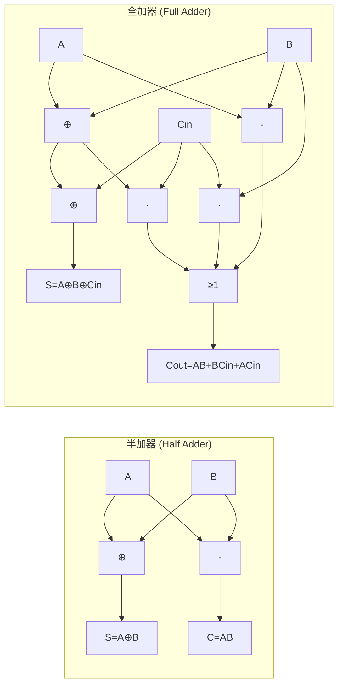

# 算术电路

算术电路是数字系统中执行加、减、乘、除和移位等基本算术运算的专门硬件单元，位于几乎所有芯片数据通路的性能关键路径上。算术电路的硬件实现选择——从简单的行波进位加法器（Ripple Carry Adder, RCA）到复杂的 Booth-Wallace 乘法器——直接决定了运算单元的延迟、面积和功耗，进而影响整个系统的时钟频率和能效比。现代综合工具可以从 RTL 中的 `+`、`*` 运算符自动推断硬件结构，但了解底层算法和实现结构对于性能优化（如设置综合约束指导工具选择乘法器架构）、定制设计（如 DSP 加速器）和性能瓶颈分析是必要的。算术电路设计不存在"最优方案"——选择取决于面积、速度和功耗的具体约束。

## 原理

### 加法器：从半加器到超前进位

加法器的进化谱系体现了面积-速度的经典权衡。

**半加器（Half Adder, HA）**：两个 1 位输入的加法，输出和（Sum, $S = A \oplus B$）与进位（Carry, $C = AB$）。HA 是构建全加器的基本模块，不能处理输入进位。

**全加器（Full Adder, FA）**：三个 1 位输入（A, B, Cin）的加法，输出 Sum 和 Cout。Sum = $A \oplus B \oplus C_{in}$，Cout = $AB + (A \oplus B)C_{in}$（或等价 $AB + AC_{in} + BC_{in}$）。FA 的延迟约 2-3 个门延迟（取决于实现），面积约 6-8 个门等效。

**行波进位加法器（Ripple Carry Adder, RCA）**：N 个 FA 串联——第 i 级 FA 的 Cout 连接第 i+1 级 FA 的 Cin。关键路径从最低位 Cin 经过所有 N 级进位链到最高位 Cout——延迟 $\propto N \times T_{FA\_carry}$。RCA 面积最小但延迟最长（N 位加法约 N * 2 门延迟），适用于 N <= 8 的低位宽场景。

**超前进位加法器（Carry Lookahead Adder, CLA）**：解决 RCA 进位链瓶颈——通过并行计算进位生成（Generate, $G_i = A_i B_i$）和进位传播（Propagate, $P_i = A_i \oplus B_i$）信号，使用进位前瞻逻辑 $C_{i+1} = G_i + P_i C_i$ 以 $\log N$ 级层次化计算所有进位。CLA 延迟 $\propto \log N$，面积比 RCA 大约 50%-100%。实际设计中 CLA 通常分组（4 位一组）——组内使用 CLA 快速进位，组间可采用 RCA（Ripple between Groups）或第二级 CLA，形成层次化 CLA（如 64 位 CLA 为 4 组 x 16 位）。

**进位选择加法器（Carry Select Adder, CSA）**：并行计算两个可能结果——一个假设进位输入 Cin=0，另一个 Cin=1——当实际 Cin 到达时通过 MUX 选择正确的结果。CSA 将进位链等待时间转化为额外的面积（约 2x 加法器面积）和并行的提前计算。适用于宽位宽（64 位+）和高时钟频率场景。

### 乘法器：Booth 编码与 Wallace 树

乘法器的硬件实现包含三个步骤。**部分积生成**：Booth 基数-4（Radix-4 Booth Encoding）将乘数每 3 位（重叠 1 位）为一组映射到 {-2, -1, 0, +1, +2} x 被乘数，将部分积数量从 N（N 位乘数）减少到 N/2。Booth 编码的关键在于：移位实现 x2、取反加一实现负部分积（二的补码），编码表将 3 位组（$y_{2i+1}, y_{2i}, y_{2i-1}$）映射到操作——如 011 -> +2x, 100 -> -2x。

**部分积压缩**：使用进位保留加法器（Carry Save Adder）阵列将多层部分积压缩为两层（Sum 和 Carry 向量）。**Wallace 树**使用 3:2 压缩器（全加器）以分组方式逐层压缩——每层将 3 个输入压缩为 2 个输出（Sum + Carry），逐层减少层数直到只剩两层。Wallace 树的层数 $\propto \log_{3/2}(N_{partial}) \approx \log_{1.5} N$。**Dadda 树**以最少的全加器和半加器数量达到与 Wallace 树相同的压缩级数——Dadda 树在每一级只压缩到下一级所需的最小位数，延迟与 Wallace 相同、面积更小但结构不规则。综合工具通常选择 Wallace 树（规则性更好），定制设计选择 Dadda 树（面积更优）。

**最终加法**：压缩后的 Sum 和 Carry 向量通过快速加法器（CLA/CSA）求和得到最终乘积。最终加法器的位宽为 2N（双倍位宽乘积），是乘法器延迟的最后一段关键路径。

### 除法器

除法在硬件中比乘法复杂得多——不可流水线化（结果逐位求解，无法并行）。主要算法：**恢复余数除法（Restoring Division）**——尝试减去除数，若结果为负则"恢复"（加回除数）。**非恢复余数除法（Non-Restoring Division）**——余数为负时不恢复，在下一步做加法而非减法——将每步操作从 2 次减加减少到 1 次，速度提升约 2 倍。**SRT 除法**（Sweeney-Robertson-Tocher）每步使用查找表确定商的多位值（基数-2 为 1 位，基数-4 为 2 位）——减少除法步数，但查找表和复杂的状态逻辑增加面积。除法在现代高速设计中通常避免出现在关键路径上——替代方案包括使用倒数近似（$a/b = a \times (1/b)$）配合流水线乘法器，或使用 CORDIC 迭代算法。

**Newton-Raphson 除法**是高性能处理器中的常见选择——将除法转化为倒数近似问题：$Q = A / B = A \times (1/B)$。倒数的计算使用 Newton-Raphson 迭代 $x_{n+1} = x_n(2 - B x_n)$ 逐步逼近 $1/B$。每次迭代需要两次乘法（一次计算 $B x_n$，一次计算 $x_n \times (2 - B x_n)$）。收敛速度是二次的（每次迭代有效位数翻倍），32 位精度通常需要 3-4 次迭代。Newton-Raphson 将昂贵且不可流水线的除法替换为可流水线化的乘法序列，是高性能处理器（Intel、AMD、ARM Cortex-A 系列）整数和浮点除法的标准微架构实现。

### 可综合算术电路的 Verilog 描述

综合工具从简单的 `+` / `*` 运算符推断底层硬件，但在需要精确控制延迟或面积时，手动结构化描述是必要的。以下展示参数化进位选择加法器的可综合描述：

```systemverilog
/**
 * carry_select_adder: 参数化进位选择加法器（Carry Select Adder, CSA）
 *
 * 工作原理：
 *   将 N 位加法拆分为多个块（每块 BLOCK_SIZE 位），每块并行计算
 *   两个假设结果——进位输入 Cin=0 和 Cin=1 的两种可能的和。
 *   当实际块进位到达时，通过 2:1 MUX 选择正确结果。
 *
 * 设计权衡：
 *   面积 ≈ 2x 标准加法器（每块双份计算硬件）
 *   速度 ≈ 1x MUX 延迟 + 块内加法延迟（消除了跨块进位链传播）
 *   适用于 64 位以上、高时钟频率（>1GHz）场景
 *
 * @param WIDTH       总位宽（默认 64 位）
 * @param BLOCK_SIZE  每块的位宽（默认 16 位——64 位分 4 块）
 *
 * @note  generate-for 在编译时展开为 BLOCKS 个并行块，并非运行时循环
 * @note  块内标准加法由综合工具自动优化（可选 RCA/CLA/CSA 架构）
 * @note  carry_sel 链为"波纹选择"——块间进位传播仍为 O(BLOCKS) 但
 *        每级仅 1 个 MUX 延迟（而非完整的块内进位链延迟）
 * @see   [[rtl-design/concepts/算术电路|算术电路]]
 */
module carry_select_adder #(
    parameter WIDTH = 64,                      // 加法器总位宽
    parameter BLOCK_SIZE = 16                  // 每块位宽（须能整除 WIDTH）
) (
    input  logic [WIDTH-1:0] a,               // 操作数 A（WIDTH 位，无符号）
    input  logic [WIDTH-1:0] b,               // 操作数 B（WIDTH 位，无符号）
    input  logic             cin,             // 最低位进位输入
    output logic [WIDTH-1:0] sum,             // 和输出（WIDTH 位）
    output logic             cout             // 最高位进位输出
);
    // localparam：局部参数——不可在实例化时覆盖，区别于 parameter
    //   BLOCKS = 64/16 = 4（编译时常量，用于 generate-for 循环次数）
    localparam BLOCKS = WIDTH / BLOCK_SIZE;

    // 二维数组声明：block_cout[0] = Cin=0 假设路径的块进位
    //               block_cout[1] = Cin=1 假设路径的块进位
    //   [BLOCKS-1:0]：BLOCKS=4 → 每个路径有 4 个进位比特
    logic [BLOCKS-1:0] block_cout [2];

    // sum0：假设 Cin=0 时预计算的全位宽和
    // sum1：假设 Cin=1 时预计算的全位宽和
    logic [WIDTH-1:0]  sum0, sum1;

    // carry_sel：块间实际进位选择链
    //   carry_sel[i]=0 → 第 i 块的 Cin 为 0 → 选择 sum0
    //   carry_sel[i]=1 → 第 i 块的 Cin 为 1 → 选择 sum1
    logic [BLOCKS-1:0] carry_sel;

    // 第 0 块的实际进位输入 = 顶层 cin 端口
    assign carry_sel[0] = cin;

    // ===== generate-for：编译时展开为 4 个并行块 =====
    //
    // genvar i ：generate 块专用的循环变量（编译时类型，不可在运行时使用）
    //   generate-for 在综合时展开——4 次迭代 = 4 套独立硬件并行存在
    //   不同于仿真中的 for 循环（顺序执行）
    //
    // begin : blk —— 每个 generate 迭代实例的命名块
    //   内部信号在每次迭代中独立创建：blk[0].HI, blk[1].HI, ...
    //   这避免了同名信号的冲突（作用域隔离）
    genvar i;
    generate
        for (i = 0; i < BLOCKS; i++) begin : blk
            // localparam：编译时常量——在 generate 展开时确定值
            //   i=0 时：HI=15, LO=0（第 0 块：[15:0]）
            //   i=1 时：HI=31, LO=16（第 1 块：[31:16]）
            //   i=2 时：HI=47, LO=32（第 2 块：[47:32]）
            //   i=3 时：HI=63, LO=48（第 3 块：[63:48]）
            localparam HI = (i+1)*BLOCK_SIZE - 1;
            localparam LO = i*BLOCK_SIZE;

            // ----- 路径 0：假设 Cin=0 的加法 -----
            // {} 拼接运算符：{进位, 和} = a[HI:LO] + b[HI:LO]
            //   block_cout[0][i] ← 块内加法的进位输出
            //   sum0[HI:LO]       ← 块内加法的和输出（BLOCK_SIZE 位）
            assign {block_cout[0][i], sum0[HI:LO]} = a[HI:LO] + b[HI:LO];

            // ----- 路径 1：假设 Cin=1 的加法 -----
            // a + b + 1'b1 等价于 (a + b + 进位=1)
            //   1'b1 位宽为 1——Verilog 自动扩展位宽匹配表达式
            assign {block_cout[1][i], sum1[HI:LO]} = a[HI:LO] + b[HI:LO] + 1'b1;

            // ----- 块间进位传播（波纹选择链）-----
            // 除最后一块外，根据 carry_sel[i] 选择对应路径的进位输出
            //   carry_sel[i] = 0 → 路径 0 的进位 → carry_sel[i+1] = block_cout[0][i]
            //   carry_sel[i] = 1 → 路径 1 的进位 → carry_sel[i+1] = block_cout[1][i]
            // 三元运算符 ?: —— 综合为 2:1 MUX（单级 MUX 延迟）
            if (i < BLOCKS-1)
                assign carry_sel[i+1] = carry_sel[i] ? block_cout[1][i] : block_cout[0][i];

            // ----- MUX 选择块内和输出 -----
            // 根据实际进位输入 carry_sel[i] 选择对应路径的预计算和
            assign sum[HI:LO] = carry_sel[i] ? sum1[HI:LO] : sum0[HI:LO];
        end
    endgenerate

    // 最高位进位输出：由最后一块的 carry_sel 选择对应路径的进位
    assign cout = carry_sel[BLOCKS-1] ? block_cout[1][BLOCKS-1] : block_cout[0][BLOCKS-1];
endmodule
```

### 移位器

**对数移位器**（Logarithmic Shifter）使用多级 2:1 MUX 选择实现——N 位移位器需要 $\log_2 N$ 级 MUX（第 0 级移位 1 位，第 1 级移位 2 位，第 i 级移位 $2^i$ 位）。每个 MUX 根据移位量的对应比特（shift_amount[i]）选择直通或移位后的数据。对数移位器面积 $\propto N \log N$，是所有 N 位移位器中延迟最小的（$\log N$ 级 MUX 延迟）。

**桶形移位器**（Barrel Shifter）使用完全的 N x N 交叉开关将任意输入位连接到任意输出位——面积 $\propto N^2$，但延迟恒定（单级传输门或 MUX），适用于最高速度需求、位宽较小（<=32 位）的应用。**漏斗移位器**（Funnel Shifter）是桶形移位器的优化变体——输入双倍位宽（2N），输出 N 位，通过选择双倍位宽窗口实现移位、旋转和掩码操作，常用于高性能处理器执行单元（如 ARM Barrel Shifter）。

### 半加器与全加器的详细电路结构

半加器（Half Adder, HA）和全加器（Full Adder, FA）是构建所有算术电路的最小编码单元。



**全加器（FA）SystemVerilog 实现：**

```systemverilog
// 全加器（Full Adder, FA）——3 输入加法
// 输入：A, B, Cin——两个加数位和进位输入
// 输出：Sum = A ⊕ B ⊕ Cin，Cout = (A & B) | (A & Cin) | (B & Cin)
module full_adder (
    input  logic a,    // 加数 A
    input  logic b,    // 加数 B
    input  logic cin,  // 进位输入
    output logic sum,  // 和输出
    output logic cout  // 进位输出
);
    // Sum：三输入异或——当 A+B+Cin 为奇数时 Sum=1
    assign sum  = a ^ b ^ cin;
    // Cout：多数表决——A,B,Cin 中至少两个为 1 时 Cout=1
    assign cout = (a & b) | (a & cin) | (b & cin);
endmodule
```

### 行波进位加法器与超前进位加法器对比

**进位链（Carry Chain）**：加法器中从最低位进位输入到最高位进位输出的串联逻辑路径。RCA的进位链是串行的——第i位的进位必须等第i-1位计算完成后才能开始；CLA通过进位前瞻逻辑并行计算所有进位，打破进位链的顺序依赖。

**位宽增大对延迟的影响**：RCA延迟与位宽N成线性关系（O(N)），64位RCA延迟约64×2门延迟≈128门延迟。CLA延迟与log(N)成正比（O(log N)），64位CLA延迟约6×2门延迟（4位一组 + 组间CLA）≈12门延迟。

**前缀加法器（Prefix Adder）**：并行前缀加法器（如Brent-Kung、Kogge-Stone、Sklansky）是CLA的广义形式——使用前缀运算（Prefix Operation）树并行计算所有进位。前缀运算定义为 $(g_i, p_i) \circ (g_j, p_j) = (g_i + p_i \cdot g_j, p_i \cdot p_j)$，其中 $\circ$ 满足结合律——可像加法一样构建并行前缀树。Kogge-Stone树的对数深度最小（$\log_2 N$ 级）且扇出恒为2，面积约2x RCA——是高性能64位+加法器的工业标准。关键公式：$C_i = G_{0:i} + P_{0:i} \cdot C_{in}$，其中 $(G_{0:i}, P_{0:i}) = (g_0, p_0) \circ (g_1, p_1) \circ \cdots \circ (g_i, p_i)$。

### 同步计数器与异步计数器

计数器（Counter）是用于累计时钟脉冲次数的时序电路，是数字系统中最基本的时序功能模块之一。按触发方式分为同步计数器（Synchronous Counter）和异步计数器（Asynchronous Counter / Ripple Counter）。

**同步计数器（Synchronous Counter）**：所有触发器由同一时钟源驱动，所有触发器的状态在同一时钟沿同时更新。每个触发器的输入（T或D）由计数器当前状态通过组合逻辑计算——二进制加法器或特定的计数器逻辑（如最低位每拍翻转，高位在前级全1时翻转）。同步计数器的优点：无累积延迟，所有触发器同时翻转，时序路径清晰（STA可精确分析），支持高速计数（>1GHz在先进工艺中可实现）；缺点：高位触发器的输入逻辑随位宽增长（需要宽AND门判断"前级全1"条件），对于超宽计数器（>64位）这一组合逻辑深度成为瓶颈。

**异步计数器（Asynchronous/Ripple Counter）**：最低位触发器的时钟接外部时钟，每级触发器的时钟接前一级触发器的输出（构成波纹链/Ripple Chain）。优点：结构极简，每比特仅需1个触发器（无额外组合逻辑），功耗低。缺点：波纹延迟——第N位触发器的翻转需等待前N-1级传递完毕（延迟=N×t_clk2q），限制了计数最大值时钟频率；中间过渡状态——不同比特位不同时翻转，计数器从全1跳变到全0时出现大量中间编码（如0111→1000时，波纹链先后出现0111→0110→0100→0000→1000），这些中间状态被下游逻辑采样会导致功能错误。异步计数器在现代ASIC中已极少使用——时序约束和DFT扫描链无法处理异步波纹时钟，仅在某些极低功耗和低速应用中保留。

**环形计数器**（Ring Counter）和**约翰逊计数器**（Johnson Counter / Twisted Ring Counter）是同步计数器的两个重要变体。环形计数器：N个触发器循环移位（一个初始"1"循环），N个状态——每个状态独热编码，译码器零成本。约翰逊计数器：末级反相反馈到首级，N个触发器产生2N个状态（双倍于环形计数器），常用于分频器和序列生成器。

**同步计数器 SystemVerilog 实现：**

```systemverilog
// ===== 同步 N 位二进制加法计数器（带使能和同步清零）=====
module sync_counter #(
    parameter WIDTH = 8                     // 计数器位宽（默认 8 位）
) (
    input  logic                clk,        // 时钟
    input  logic                rst_n,      // 异步复位（低有效）
    input  logic                en,         // 计数使能（高有效）
    input  logic                clr,        // 同步清零（高有效）
    output logic [WIDTH-1:0]    count       // 计数值输出
);
    always_ff @(posedge clk or negedge rst_n) begin
        if (!rst_n)
            count <= '0;                    // 异步复位：计数清零
        else if (clr)
            count <= '0;                    // 同步清零：在时钟沿清零
        else if (en)
            count <= count + 1'b1;          // 使能有效：计数 +1
        // else: en=0 且 clr=0 → 保持当前值
    end
endmodule
```

### 移位寄存器及其应用

移位寄存器（Shift Register）是一组级联的触发器，每拍将数据向指定方向移动一位。按移位方向分为：串入串出（SISO——一个输入、一个输出、N拍延迟）、串入并出（SIPO——串行输入、N拍后并行读出）、并入串出（PISO——并行加载、逐位串行移出）、并入并出（PIPO——并行加载、并行读出、可带移位功能）。按移位方向分为左移、右移和双向移位（Bidirectional）。

应用场景：(1) 串行-并行数据转换（SerDes的串化器/解串器）；(2) 延迟线——N级移位寄存器产生N个周期的延迟；(3) 序列生成器（如LFSR线性反馈移位寄存器用于伪随机数生成和CRC校验）；(4) 串行接口（SPI、I2C、UART的移位寄存器）；(5) 流水线寄存器（数据通路中插入的延迟拍）；(6) 桶形移位器实现——多级MUX+移位寄存器的组合。

通用移位寄存器（Universal Shift Register）集成所有四种操作模式：保持（Hold）、左移（Shift Left）、右移（Shift Right）、并行加载（Parallel Load）——由2位模式选择信号控制。

**通用移位寄存器 SystemVerilog 实现：**

```systemverilog
// ===== 通用双向移位寄存器 =====
// 支持：并行加载、左移、右移、保持（4 种模式）
module universal_shift_reg #(
    parameter WIDTH = 8
) (
    input  logic                clk,        // 时钟
    input  logic                rst_n,      // 异步复位（低有效）
    input  logic [1:0]          mode,       // 模式选择：00-保持 01-右移 10-左移 11-加载
    input  logic                s_in_left,  // 左移串行输入（左移时填入最低位）
    input  logic                s_in_right, // 右移串行输入（右移时填入最高位）
    input  logic [WIDTH-1:0]    par_in,     // 并行加载数据
    output logic [WIDTH-1:0]    q           // 移位寄存器输出
);
    always_ff @(posedge clk or negedge rst_n) begin
        if (!rst_n)
            q <= '0;                         // 异步复位：清零
        else case (mode)
            2'b00: q <= q;                   // 保持：不变
            2'b01: q <= {s_in_right, q[WIDTH-1:1]};  // 右移：高位丢弃，串行输入填入最高位
            2'b10: q <= {q[WIDTH-2:0], s_in_left};   // 左移：低位丢弃，串行输入填入最低位
            2'b11: q <= par_in;              // 并行加载
            default: q <= q;
        endcase
    end
endmodule
```

## 关键要点

- **RCA 面积最小 CLA 速度最快**：RCA（行波进位）面积最小但延迟最长（$\propto N$），CLA（超前进位）延迟最短（$\propto \log N$）但面积最大——选择取决于位宽和对时序的压力
- **Booth 基数-4 将部分积减半**：每个 Booth 编码器将 3 位乘数映射到 {-2,-1,0,+1,+2} x 被乘数的操作
- **Wallace 树为商用默认乘法器结构**：使用 3:2 压缩器（全加器）逐层压缩部分积，层数 $\propto \log_{1.5} N$
- **Dadda 树面积优于 Wallace**：在每级只压缩到必要的最小位数，延迟与 Wallace 相同、全加器数量更少，但结构不规则
- **除法为最复杂算术运算**：SRT 除法（基数-4）每步产生 2 位商，但硬件复杂度显著提升
- **Newton-Raphson 除法转化为乘法**：通过倒数逼近 $x_{n+1} = x_n(2 - B x_n)$ 将除法转化为可流水线的乘法序列，二次收敛，是高性能处理器除法的标准微架构实现
- **对数移位器为综合最优结构**：使用 $\log N$ 级 2:1 MUX 选择，是面积-延迟综合最优的移位器结构，综合工具的 `<<` 和 `>>` 运算符产生近似结构
- **DesignWare 自动推断算术结构**：现代 HDL 中用 `+`、`*` 运算符即可由综合工具自动推断和优化，手动实例化仅用于定制性能需求
- **CSA 阵列是乘法器核心**：进位保留加法器阵列将多层部分积压缩为最终 Sum+Carry 两层的中间数据结构
- **进位选择以 2x 面积换速度**：进位选择加法器并行计算两个假设进位结果，实际进位到达时通过 MUX 选择，适用于宽位宽（64 位+）高频设计
- **半加器处理2输入，全加器处理3输入**：半加器（HA）无进位输入（仅A+B→Sum,Carry），全加器（FA）有进位输入（A+B+Cin→Sum,Cout）。N位RCA=N个FA串联
- **同步计数器所有触发器共用一个时钟**：所有触发器的时钟来自同一时钟源，无累积波纹延迟，STA可精确分析，是ASIC设计唯一推荐的计数器类型
- **异步计数器存在波纹延迟和中间过渡状态**：后级触发器的时钟来自前级输出，延迟逐级累积，中间过渡编码可能导致下游逻辑功能错误，DFT扫描链无法处理
- **约翰逊计数器2N个状态仅需N个触发器**：末级反相反馈到首级，每N个触发器产生2N个有效状态，是不需要额外译码逻辑的分频器/序列生成器
- **移位寄存器是串并转换的基础**：SIPO/PISO移位寄存器是所有串行通信协议（SPI/UART/I2C）的硬件核心
- **LFSR用于伪随机数生成**：线性反馈移位寄存器（LFSR）通过特定抽头的异或反馈实现最大长度序列（2^N-1状态），广泛用于测试向量生成、CRC校验、扰码器

## 与其他概念的关系

- [[rtl-design/concepts/流水线设计|流水线设计]] — 高性能算术单元广泛使用流水分割以提升吞吐率——流水线乘法器和加法器是典型应用。Booth 编码 -> Wallace 树压缩 -> 最终加法器的三级流水分割是 16x16/32x32 位乘法器的标准实现模板
- [[rtl-design/concepts/编码风格|RTL 编码风格]] — 算术运算符的综合推断结果受编码风格影响——无符号/有符号声明、位宽指定和括号分组影响综合的优化空间。`$signed()` 的显式使用和位宽扩展规则的正确理解是避免有符号运算 bugs 的关键
- [[rtl-design/concepts/时序逻辑|时序逻辑]] — 算术电路的延迟决定了整个数据通路的时序预算，时序约束驱动加法器和乘法器的架构选择。流水线寄存器的插入位置由算术单元内部的逻辑深度分布决定——CLA 的进位前瞻树和 Wallace 树的不规则延迟是时序收敛的常见瓶颈
- [[architecture/concepts/指令流水线|体系结构流水线]] — 处理器执行单元中的 ALU 设计（加法器/移位器/乘法器架构）是跨体系结构和 RTL 设计的接口决策。体系结构级的指令延迟约束（如单周期整数 ALU、多周期乘法器）直接影响 RTL 算术单元的架构选择和流水线级数
- [[rtl-design/concepts/有限状态机|有限状态机]] — 计数器和移位寄存器是FSM中最常用的数据通路元件——计数器用于定时和序列步骤跟踪，移位寄存器用于序列检测和状态编码（环形计数器、约翰逊计数器本身即状态机）
