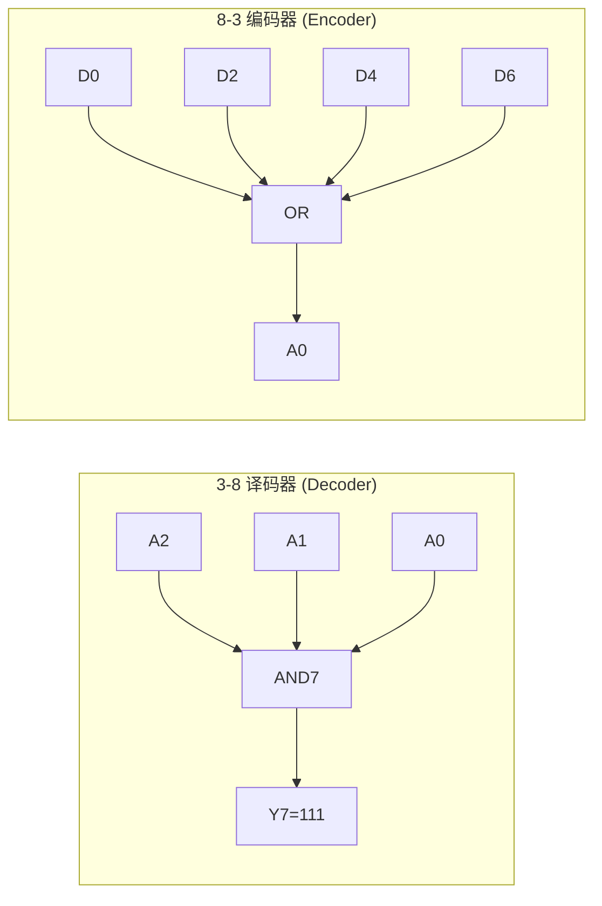

# 组合逻辑

组合逻辑是数字电路的两大基本类型之一（另一类是时序逻辑）。组合逻辑电路的输出仅取决于当前输入值，不依赖任何历史状态——它没有记忆能力，也没有反馈回路。任何数字系统都可以分解为组合逻辑（Cloud of Combinational Logic）和时序元件（Registers）的交替结构，这是同步时序电路设计的核心抽象。从最简单的与门、多路选择器到复杂的 ALU（算术逻辑单元）、译码器和优先级编码器，组合逻辑是数字 IC 设计者每天都必须面对的基本构件。

## 原理

### 从真值表到门级实现

组合逻辑的设计始于真值表（Truth Table）和逻辑函数。任意 n 输入的布尔函数有 2^n 种输入组合，每个组合对应一个确定的输出值，可用真值表唯一描述。从真值表推导组合电路有两条经典路径：**积之和（Sum of Products, SOP）** 形式通过两级与-或（AND-OR）结构实现——首先用与门覆盖真值表中输出为 1 的所有"质蕴含项（Prime Implicants）"，再用或门聚合输出；**和之积（Product of Sums, POS）** 形式通过两级或-与（OR-AND）结构实现。逻辑最小化（Logic Minimization）的目标是在满足时序约束的前提下，用最少的门和最短的关键路径实现目标布尔函数。现代 EDA 综合工具（如 Synopsys Design Compiler、Cadence Genus）使用代数化简和布尔优化算法（如 Espresso 两电平化简器）结合技术映射（Technology Mapping），将 RTL 描述的布尔函数映射到标准单元库中的具体门级电路。

### RTL 编码方式：assign 与 always_comb

在 RTL 中描述组合逻辑有两种主要方式：

**连续赋值（Continuous Assignment）**：使用 `assign` 关键字，右侧表达式的任何输入变化立即反映到左侧输出。适用于单方程描述的简单组合逻辑，如 `assign sum = a ^ b ^ cin;`。assign 语句描述的电路是纯组合逻辑，不存在锁存器推断风险。

**always_comb 块**：使用 SystemVerilog 的 `always_comb` 关键字（Verilog 中为 `always @(*)`），块内可以使用 if-else、case、for 等过程化控制流结构。always_comb 的编译时检查（灵敏度列表完整性、零时刻执行、禁止自身赋值）使其比传统 `always @(*)` 更安全。always_comb 块中**必须使用阻塞赋值（`=`，Blocking Assignment）**——阻塞赋值在仿真时按顺序立即执行，在组合逻辑中语义正确。若误用非阻塞赋值（`<=`），仿真时会在时间步末尾才更新信号，导致组合逻辑输出延迟一拍——这是典型的仿真与综合不匹配（Simulation-Synthesis Mismatch）错误。

### 锁存器推断：RTL 编码的常见陷阱

组合逻辑 RTL 编码中最常见的设计错误是**意外锁存器推断（Unintended Latch Inference）**。当 always_comb（或 always @(*)）块中存在未在所有条件下赋值的变量时，综合工具推断出锁存器（Latch）来"记住"该变量的旧值。典型场景：
- if 语句缺少 else 分支，且 if 分支中赋值的信号在 else 路径上未赋值
- case 语句缺少 default 分支，且并非所有 case 项覆盖了信号的赋值

锁存器对 ASIC 设计是严格的 lint 违规项，原因有三：锁存器是电平敏感的异步元件，STA（静态时序分析）难以准确建模其时序行为；锁存器在 DFT（可测试性设计）扫描链中不可控，降低故障覆盖率；锁存器对工艺偏差敏感，可能产生毛刺（Glitch）。避免锁存器推断的铁律：**组合 always 块中，每个被赋值的信号必须在所有控制路径上都有赋值**——即 if 必须配 else，case 必须配 default。

### 毛刺与竞争

组合逻辑信号经过不同延迟路径到达同一点时，会产生**毛刺（Glitch）**——短暂的错误脉冲输出。毛刺分为三类：
- **静态 0 毛刺（Static-0 Hazard）**：输出应保持 0，但出现了短时的 1→0→1 脉冲
- **静态 1 毛刺（Static-1 Hazard）**：输出应保持 1，但出现了短时的 1→0→1 脉冲
- **动态毛刺（Dynamic Hazard）**：输出应为 0→1（或 1→0）的单次翻转，但出现了多次翻转

毛刺的根源是组合逻辑路径中不同支路的传播延迟（Propagation Delay）不同（竞争条件 Race Condition）。消除毛刺的方法有三种：使用冗余质蕴含项覆盖毛刺产生的相邻输入组合（卡诺图消除法），这是静态毛刺的数学上彻底的解决方案；在组合逻辑输出后加 D 触发器采样的**寄存器输出**（最大毛刺消除与同步设计兼容）；使用格雷码（Gray Code）编码使状态变化只有一个比特翻转，从根本上消除多比特同时变化的竞争源。在同步时序设计中，毛刺通常不是功能性问题——只要在建立时间窗口内信号稳定，触发器的正确采样不受影响——但毛刺会增加动态功耗（无意义的信号跳变），在异步接口（如 CDC 边界）中则可能导致功能错误。

#### 静态冒险与动态冒险

静态冒险（Static Hazard）和动态冒险（Dynamic Hazard）是毛刺的两种分类，其产生条件和消除策略有本质区别。静态冒险：输出预期保持不变（稳态值为 0 或 1），但由于不同路径的延迟差异，输出短暂翻转到错误值后恢复——静态-0 冒险是应当保持 0 但出现短暂的 1 脉冲，静态-1 冒险是应当保持 1 但出现短暂的 0 脉冲。动态冒险：输出预期发生一次翻转（0→1 或 1→0），但实际翻转过程出现多次来回跳变——本质上是组合逻辑路径中存在三个或以上不同传播延迟的通路。静态冒险在两级与-或（SOP）或两级或-与（POS）实现中可通过冗余项完全消除（卡诺图中添加覆盖相邻质蕴含项的冗余项），动态冒险无法在两级逻辑中完全消除——这是现代设计中倾向流水线寄存器隔离组合逻辑深度的原因。

#### 仿真与硅片中的毛刺差异

RTL 仿真中可能看不到毛刺但实际硅片中会出现，原因有三。第一，仿真器使用单元延迟模型（Unit Delay）或简化延迟——所有门延迟相同，不反映实际物理路径的延迟差异。第二，RTL 仿真是离散时间的——每个仿真时间步内信号变化被序列化，多个在真实时间"同时"翻转的信号在仿真中被赋予任意顺序（由事件队列决定），消除了产生毛刺的时间重叠条件。第三，SDF 反标（Standard Delay Format）的门级仿真能部分还原延迟差异，但即使精度最高的 SPICE 级仿真也无法完全复现硅片上的纳米级工艺偏差和互连耦合噪声——这些物理效应是实际电路中毛刺比仿真中更频繁的重要原因。对于 STA，毛刺的影响在于：毛刺脉冲若刚好落在捕获寄存器的建立/保持窗口附近，可能被误采——但 STA 本身只检查极值分析（Corner-Based Analysis），不直接建模毛刺，需要额外的信号完整性（SI）和噪声分析覆盖这一盲区。

### 与非门和或非门实现异或门

异或门（XOR, Exclusive-OR）的布尔表达式为 $Y = A \oplus B = A\bar{B} + \bar{A}B$。虽然标准单元库直接提供 XOR2/XOR3 门，但理解用通用门（NAND/NOR）构造 XOR 是数字逻辑设计的基本功。

**用与非门（NAND）实现异或门**：从积之和表达式出发，使用德摩根定律（De Morgan's Theorem）将 OR 运算转换为 NAND 形式：$A \oplus B = \overline{\overline{A\bar{B}} \cdot \overline{\bar{A}B}}$。具体连接：NAND1 输入为 A' 和 B（先取反 A），输出 $\overline{\bar{A}B}$；NAND2 输入为 A 和 B'（先取反 B），输出 $\overline{A\bar{B}}$；NAND3 输入为 NAND1 和 NAND2 的输出，最终 $Y = \overline{\overline{\overline{\bar{A}B}} \cdot \overline{\overline{A\bar{B}}}} = A\bar{B} + \bar{A}B$。总计 4 个 NAND2 门（含两个作为反相器的 NAND，输入端短接即可）。**用或非门（NOR）实现异或门**：从和之积表达式出发，$A \oplus B = (A+B)(\bar{A}+\bar{B})$，转换为 NOR 形式：$A \oplus B = \overline{\overline{(A+B)} + \overline{(\bar{A}+\bar{B})}}$，总共需要 5 个 NOR2 门。NAND 实现比 NOR 省一个门，且 NAND 的 CMOS 实现（串联 NMOS+并联 PMOS）在面积和速度上均优于 NOR（并联 NMOS+串联 PMOS）。

**NAND 作为"通用门"**：任意布尔函数都可仅用 NAND 门实现——这一性质称为功能完备性（Functional Completeness）。任何积之和表达式可通过两级 NAND-NAND 结构直接实现：第一级 NAND 实现各项（带反相），第二级 NAND 实现 OR 等价。加反相器可用 NAND 短接实现，NAND 构成布尔代数的完备基。NOR 同样是通用门，但 CMOS 工艺中 NAND 的串联 NMOS 下拉结构比 NOR 的串联 PMOS 上拉结构快（电子迁移率 > 空穴迁移率），因此 NAND 在面积和速度上均优于等价的 NOR 实现。

**传输门（Transmission Gate）实现异或**：传输门由 NMOS 和 PMOS 并联构成，栅极控制信号互补时双向导通。用传输门实现 XOR 的结构本质是 2:1 MUX：A 作为选择信号，A=0 时 TG1 导通将 B 传送到 Y，A=1 时 TG2 导通将 B'（经反相器）传送到 Y。传输门 XOR 仅需 6 个晶体管（2 对传输门 + 1 个反相器），远少于标准 CMOS 静态 XOR 的 8-12 个晶体管——这是许多标准单元库中 XOR2 的实际内部实现。

### 竞争冒险

竞争冒险（Race Condition）在数字电路中指多个信号的变化顺序不确定导致输出依赖于这些信号的到达先后顺序，从而产生非确定性错误。竞争冒险与毛刺是密切关联但不同层次的概念：毛刺是组合逻辑中不同路径延迟差异导致的瞬态错误脉冲，竞争冒险更广泛涵盖了时序逻辑和异步电路中因信号到达顺序不确定而产生的非确定性行为。

判断竞争冒险存在的方法：（1）检查同一信号经过不同路径重新汇聚（Reconvergent Fanout）——同一变量经不同组合逻辑路径后在同一门处汇聚，且延迟不同；（2）检查多个寄存器在同一时钟沿更新后经不同长度组合路径到达同一逻辑门——若路径延迟差异超过周期余量；（3）异步电路中任何不经同步器的异步信号采样。消除竞争的手段：组合逻辑——插入流水线寄存器分段深组合路径；多比特信号——使用格雷码（仅一位翻转）根本消除竞争；异步交互——使用握手协议或同步器转换为同步；关键控制路径——卡诺图中添加冗余项消除静态冒险。

### 扇入与扇出

扇入（Fan-In）指一个逻辑门的输入端数量。在 CMOS 中，NAND 门的扇入增加导致下拉路径 NMOS 串联数量增加——串联电阻累加、放电电流降低、开关速度恶化。标准单元扇入上限通常为 4-5——超过则需要多级分解。扇出（Fan-Out）指一个门输出驱动的负载数量。扇出直接影响延迟：每增加一个负载，总负载电容 $C_L = C_{wire} + \sum C_{in,i}$ 线性增加，输出过渡时间增大。在 STA 中，最大扇出是一项设计规则检查（DRV）约束——通常限制在 16-32。超大扇出的解决方案：插入缓冲器树将大扇出分解为多级分布，或使用高驱动强度单元。扇入和扇出的平衡是逻辑努力（Logical Effort）优化的核心：路径总延迟最小化需要各级门的门努力均等分布，大扇入门逻辑努力 $g$ 大意味着对前级负载更大。


标准的 AND-OR 两级实现是教科书中的基本结构，但在实际标准单元库中，**AOI（And-Or-Invert）** 和 **OAI（Or-And-Invert）** 复合门在面积和延迟上都显著优于分立门级联。AOI21 单元（2 输入 AND 后接 NOR）在单级 CMOS 门延迟内实现 (A&B) | C 的取反功能——分立实现则需要 AND2 + NOR2 两级电路（两倍延迟和更大的面积）。综合工具的技术映射（Technology Mapping）步骤将 RTL 的布尔网络通过结构匹配（Structural Matching）和布尔匹配（Boolean Matching）算法映射到标准单元库中的最优门组合，AOI/OAI 复合门的选择是其核心优化。对于深度组合路径，带有反相器的复合门库（AOI、OAI、MUX、XOR2、full adder）比仅含基本门（NAND2、NOR2、INV）的库平均减少 15-25% 的面积和 10-20% 的延迟。

### AOI/OAI 复合门与技术映射

标准的 AND-OR 两级实现是教科书中的基本结构，但在实际标准单元库中，**AOI（And-Or-Invert）** 和 **OAI（Or-And-Invert）** 复合门在面积和延迟上都显著优于分立门级联。AOI21 单元（2 输入 AND 后接 NOR）在单级 CMOS 门延迟内实现 (A&B) | C 的取反功能，分立实现则需要 AND2 + NOR2 两级电路（两倍延迟和更大的面积）。综合工具的技术映射（Technology Mapping）步骤将 RTL 的布尔网络通过结构匹配（Structural Matching）和布尔匹配（Boolean Matching）算法映射到标准单元库中的最优门组合，AOI/OAI 复合门的选择是其核心优化。对于深度组合路径，带有反相器的复合门库（AOI、OAI、MUX、XOR2、full adder）比仅含基本门（NAND2、NOR2、INV）的库平均减少 15-25% 的面积和 10-20% 的延迟。

### 香农分解与 MUX 综合

**香农分解（Shannon Decomposition）** 是布尔函数的一种代数变换：f(x1, x2, ..., xn) = x1 · f(1, x2, ..., xn) + x1' · f(0, x2, ..., xn)。递归应用香农分解可将任意布尔函数表示为 MUX 树的级联结构——根 MUX 由 x1 选择，两个子树分别为 x1=1 和 x1=0 时的余因子函数。理论上，任何 n 变量布尔函数都可仅用 2^n:1 MUX 实现。香农分解的实用价值在于：它是 **MUX-Based FPGA 逻辑单元（LUT）** 实现的数学基础——典型 FPGA 的 4-LUT 本质上是一个 16:1 MUX，可编程位即为香农分解的叶节点值。在 ASIC 综合中，MUX 树在某些场景（大位宽选择器、优先级网络）中面积和布线质量优于 AND-OR 树，综合工具通过香农分解识别这类优化机会。


### 多级组合逻辑的延迟分解与平衡

对于深度组合路径，设计中需要平衡多级组合逻辑的输出延迟分布。一段路径中的组合逻辑可以视为多级门串——不同层级可能使用不同驱动强度和不同尺寸的单元，导致同一路径中不同级的延迟不等。综合工具的**逻辑努力（Logical Effort）** 优化通过选择合适的门尺寸（Gate Sizing）平衡各级的延迟——驱动高扇出的级需要更大的晶体管尺寸（较高驱动强度单元）来减少延迟，而轻负载的级可以使用最小尺寸单元节省面积和功耗。路径努力（Path Effort）的最优解是：使路径中各级的门努力（Gate Effort = 本门输入电容 / 标准反相器输入电容）乘积等于路径的总努力——均分各级努力可最小化路径总延迟。现代综合工具在技术映射和门尺寸优化步骤中自动应用逻辑努力优化，设计者通常不需要手动干预，但理解原理有助于分析"为何综合工具选择某种尺寸的单元"。

### 大位宽 MUX 的电路实现

一个 32 位宽的 8:1 MUX 看似是单个"8 选 1 MUX"（等价于 3 位选择信号和 8 个 32 位输入总线），但其实现有显著不同的电路拓扑选择。**扁平（Flat）8:1 MUX** = 层叠的两级 4:1 MUX + 一级 2:1 MUX，总共需要约 7 个 2:1 MUX 的深度（3 级），每条输入到输出路径经过 3 级 2:1 MUX 的门延迟。**分层 MUX** 或 **译码器 + 三态总线**（Decoder + Tristate Bus）在某些工艺中面积更小（译码器生成的独热选择信号使能每个输入对应的三态驱动门），但三态总线在先进工艺中支持不佳（多驱动 Z 态的设计约束）。综合工具根据位宽、输入数量、目标延迟约束和单元库特征自动选择 MUX 实现方式——对于大位宽大端口数的 MUX（如 64 位 16:1），综合结果可能是译码器 + MUX 树的混合结构。

### 编码器与译码器

编码器（Encoder）和译码器（Decoder）是互逆的组合逻辑电路。编码器将"独热"或"优先级"输入编码为二进制输出——如8-3编码器将8位独热输入编码为3位二进制输出。译码器将二进制输入译码为独热输出——如3-8译码器将3位二进制输入译码为8位独热输出（恰好一位为1）。

**3-8译码器（3-to-8 Decoder）工作原理**：3位二进制输入（A2, A1, A0）经过3位与门阵列产生8个最小项输出（Y0-Y7）。每个输出对应一个唯一的输入组合——Y0 = !A2·!A1·!A0（输入000），Y7 = A2·A1·A0（输入111）。3-8译码器是存储器地址译码（SRAM行/列译码）、指令译码（Opcode→控制信号）和片选信号生成的基础构件。典型3-8译码器通常带有使能输入（Enable），使能无效时所有输出为0——这允许多个译码器级联（如两个3-8译码器+1个1-2译码器构成4-16译码器）。

**优先级编码器（Priority Encoder）**：当多个输入同时有效时，按优先级规则输出最高优先位的编码。常用于中断控制器（多个中断源竞争，最高优先级获得响应）。8-3优先级编码器在输入D7-D0中找到最高位的1，输出其3位索引。优先级编码器的实现：if-else链（低位优先综合为级联MUX，约6级门延迟）或casez（高位优先综合为OR树，约3-4级门延迟）。



**3-8 译码器 SystemVerilog 实现：**

```systemverilog
// ===== 3-8 译码器（带使能） =====
module decoder_3to8 (
    input  logic       en,        // 使能信号（高有效）
    input  logic [2:0] addr,      // 3 位地址输入
    output logic [7:0] y          // 8 位独热输出
);
    always_comb begin
        y = '0;                    // 默认全 0
        if (en)
            y[addr] = 1'b1;        // 直接用 addr 索引赋 1——综合为 AND 阵列
    end
endmodule
```

**编码器/译码器关键要点：**

- **译码器是地址解码的基础**：3-8译码器将3位二进制地址映射为8位独热选择，是SRAM行列译码、指令译码和片选信号的核心构件。N-M译码器的与门总数为M（每个输出一个N输入与门），使能信号级联可实现译码器规模扩展
- **编码器实现"多中选一索引化"**：优先级编码器处理多请求竞争——if-else链（低优先级优先）和casez（高优先级优先）的电路结构不同，延迟特性也不同

### 奇偶校验电路

奇偶校验（Parity Check）是最简单的错误检测码。偶校验（Even Parity）：添加一个校验位使数据中1的总数为偶数；奇校验（Odd Parity）：添加一个校验位使数据中1的总数为奇数。接收端重新计算校验位并与接收到的校验位比较——不一致则检测到单比特错误。

奇偶校验电路的实现基于异或（XOR）树——N位数据的偶校验位 = 所有数据位的异或结果（即XOR树输出）。N位XOR树的深度为⌈log₂ N⌉（二叉树结构），每级将上一级的XOR结果两两配对。8位偶校验电路需要3级XOR（4个XOR2→2个XOR2→1个XOR2），9级门延迟。奇校验可以通过对偶校验结果取反得到。

奇偶校验在数字IC中的应用：内存/缓存数据完整性检测（L1 Cache常用奇偶校验保护）、寄存器文件软错误检测、通信协议帧校验、PCIe链路级校验。奇偶校验的局限性：只能检测奇数个比特翻转，偶数个比特翻转无法检测（如相邻两位同时翻转）；不能纠错（不像ECC可以纠正单比特错误）。实现硬件开销极低（N位数据仅需N-1个XOR2门），适用于对面积极度敏感但对错误检测覆盖率要求不极端的场景。

**参数化偶校验生成电路：**

```systemverilog
// ===== 参数化偶校验生成与检测电路 =====
module parity_gen_check #(
    parameter WIDTH = 8                    // 数据位宽
) (
    input  logic [WIDTH-1:0]  data_in,     // 输入数据
    output logic              parity_out   // 偶校验位：使 data_in + parity_out 中 1 的总数为偶数
);
    // ^ 归约运算符（Reduction XOR）：对向量的所有位进行异或
    //   如果 data_in 中 1 的个数为奇数 → ^data_in = 1 → parity_out = 1
    //   如果 data_in 中 1 的个数为偶数 → ^data_in = 0 → parity_out = 0
    assign parity_out = ^data_in;
endmodule
```

**奇偶校验关键要点：**

- **偶校验位等于所有数据位的异或**：归约异或（^data）直接产生偶校验位，综合为log₂(N)级XOR树
- **奇偶校验仅检测奇数个错误**：无法检测偶数比特翻转（最典型场景：相邻两位同时受SEU影响），也无法纠错——这是它与ECC的本质区别

### 多路选择器实现逻辑功能

多路选择器（Multiplexer, MUX）是最通用的组合逻辑基元之一。任意N变量布尔函数都可以用2^N:1 MUX实现——将N个变量作为MUX的选择信号，MUX的2^N个数据输入端接入函数真值表的对应值（0或1或另一个变量）。这是香农分解定理（Shannon Decomposition）的直接应用。

具体实例：(1) 2:1 MUX实现任意2变量函数——如XOR：A作为选择信号，数据输入0接B、数据输入1接!B；(2) 4:1 MUX实现3变量函数——如3变量多数表决器（A,B,C中≥2个为1则输出1）；(3) 2:1 MUX实现反相器/缓冲器（数据输入分别接0和1，选择信号为输入）；(4) MUX实现与门/或门——2:1 MUX选择信号接A，数据0接0、数据1接B即为AND；数据0接B、数据1接1即为OR。(5) MUX实现锁存器/触发器的D输入端MUX反馈——实现时钟使能（CE）功能。

MUX-Based FPGA（如Xilinx和Altera/Intel的LUT结构）的原理：k输入查找表（k-LUT）本质上是一个2^k:1 MUX，其2^k个数据输入由SRAM配置位提供——因此任意k变量函数都可由一个k-LUT实现。现代FPGA的6-LUT可在一个LUT内实现任意6变量逻辑函数，或拆分为两个5-LUT共享输入。这种MUX-LUT结构是FPGA可编程性的核心。

**MUX 实现逻辑门 SystemVerilog 示例：**

```systemverilog
// ===== 2:1 MUX 实现 XOR（异或） =====
// 原理：A=0 时选 B，A=1 时选 ~B → 输出 = A⊕B
module mux_xor (
    input  logic a,      // 选择信号
    input  logic b,      // 数据输入
    output logic y       // XOR 输出 = a ^ b
);
    assign y = a ? ~b : b;   // a=1 输出 ~b, a=0 输出 b（2:1 MUX）
endmodule

// ===== MUX 实现与门（AND） =====
module mux_and (
    input  logic a,
    input  logic b,
    output logic y
);
    assign y = a ? b : 1'b0;   // a=1 → 输出 b（AND 语义：a=1时y=b，a=0时y=0）
endmodule

// ===== MUX 实现或门（OR） =====
module mux_or (
    input  logic a,
    input  logic b,
    output logic y
);
    assign y = a ? 1'b1 : b;   // a=1 → 输出 1（OR 语义：a=1时y=1，a=0时y=b）
endmodule
```

**MUX 逻辑功能关键要点：**

- **任意N变量布尔函数可用2^N:1 MUX实现**：这是香农分解的工程推论，也是FPGA LUT结构的理论基础——k-LUT本质上是一个受SRAM配置的2^k:1 MUX
- **MUX+反相器构成完备逻辑集**：2:1 MUX配合0和1常量可以实现AND/OR/NOT等所有基本门——MUX是比NAND更通用的"万能门"

## 关键要点

- **组合逻辑无记忆无反馈**：输出仅取决于当前输入，always_comb 块中必须使用阻塞赋值（`=`）
- **锁存器推断为编码中最常见的设计错误**：if 必须配 else，case 必须配 default，所有被赋值的信号在所有路径上都必须有明确赋值
- **assign 连续赋值安全无锁存器**：永远不会产生锁存器推断，是单方程组合逻辑的首选编写方式
- **毛刺由路径竞争产生**：不同延迟路径的竞争导致毛刺，同步时序设计中毛刺通常被寄存器滤除，但异步边界需要格雷码等额外保护
- **AOI/OAI 复合门优于分立门**：两级 S-O-P 实现中，AOI/OAI 复合门可同时减少面积和延迟
- **关键路径延迟决定时钟周期**：组合逻辑的关键路径延迟等于从输入到输出的最长累积门延迟，与时钟周期直接相关
- **MUX 是组合逻辑通用基元**：任何 n 变量布尔函数都可以用 2^n:1 MUX 和反相器实现
- **综合工具自动化简 SOP**：代数化简（Espresso、BDD）会自动处理 SOP 最小化，设计者应关注代码级别而非门级别的面积优化
- **Glitch 功率占动态功耗 20-30%**：在深亚微米工艺中毛刺功率占比显著，使用流水线寄存器隔离可显著降低
- **unique/priority case 声明互斥/优先级**：综合工具据此优化并插入违反断言
- **优先级编码器为 if-else-if 自然实现**：最低位优先级的 if-else 链综合为约 6 级门延迟，高位优先级的 casez 实现约 3-4 级门延迟
- **卡诺图为基本手工化简工具**：4-5 变量的基本手工化简工具，超过 6 变量必须使用 Quine-McCluskey 或 Espresso 算法——这些算法是现代 EDA 综合的内核
- **De Morgan 定理驱动 NAND-NOR 转换**：将 AND-OR 结构转换为 NAND-NAND 或 NOR-NOR 的数学基础，NAND2/NOR2 是面积最小和速度最快的基本门
- **组合环为严格 lint 规则违反**：组合逻辑输出反馈到自身输入，综合工具无法保证环路的稳态，STA 无法分析组合环的时序
- **XOR/XNOR 为奇偶校验和加法器基础**：奇偶树由 XOR2 门级联构成，N 位奇偶树深度为 O(log N)，在 ECC 纠错码（如 Hamming 码、SEC-DED）的编码器和解码器中广泛使用
- **三态缓冲器在 RTL 中不推荐**：片内总线推荐 MUX 而非三态（因多驱动需要特殊工艺支持），三态仅在片外 I/O Pad 中使用
- **译码器是地址解码的基础**：3-8译码器将3位二进制地址映射为8位独热选择，是SRAM行列译码、指令译码和片选信号的核心构件。N-M译码器的与门总数为M（每个输出一个N输入与门），使能信号级联可实现译码器规模扩展
- **编码器实现"多中选一索引化"**：优先级编码器处理多请求竞争——if-else链（低优先级优先）和casez（高优先级优先）的电路结构不同，延迟特性也不同
- **偶校验位等于所有数据位的异或**：归约异或（^data）直接产生偶校验位，综合为log₂(N)级XOR树
- **奇偶校验仅检测奇数个错误**：无法检测偶数比特翻转（最典型场景：相邻两位同时受SEU影响），也无法纠错——这是它与ECC的本质区别
- **任意N变量布尔函数可用2^N:1 MUX实现**：这是香农分解的工程推论，也是FPGA LUT结构的理论基础——k-LUT本质上是一个受SRAM配置的2^k:1 MUX
- **MUX+反相器构成完备逻辑集**：2:1 MUX配合0和1常量可以实现AND/OR/NOT等所有基本门——MUX是比NAND更通用的"万能门"

## 与其他概念的关系

- [[rtl-design/concepts/Verilog-HDL|Verilog HDL]] — Verilog 中 assign 连续赋值和 always @(*) 进程块描述组合逻辑的语法与语义陷阱
- [[rtl-design/concepts/SystemVerilog|SystemVerilog]] — SV 的 always_comb 提供编译时锁存器推断检查和自动灵敏度列表推断
- [[rtl-design/concepts/时序逻辑|时序逻辑]] — 组合逻辑是时序逻辑的核心组成部分（Cloud of Combinational Logic），与触发器交替构成同步电路
- [[rtl-design/concepts/编码风格|RTL 编码风格]] — 组合逻辑编码规范：锁存器推断检查，阻塞赋值/非阻塞赋值的使用规则
- [[architecture/concepts/存储层次|存储层次（Memory Hierarchy）]] — 奇偶校验用于L1缓存的数据完整性检测（单比特错误检测），而L2/L3缓存使用SECDED ECC实现单比特纠错+双比特检错——这是错误检测能力-硬件开销梯度的典型体现
- [[rtl-design/concepts/算术电路|算术电路]] — 译码器和编码器的级联实现加法器进位链和乘法器部分积选择——译码器+MUX结构是算术单元数据选择的核心硬件模式
