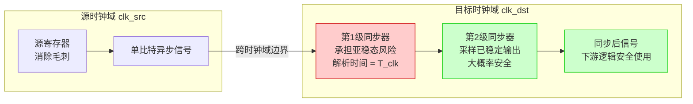
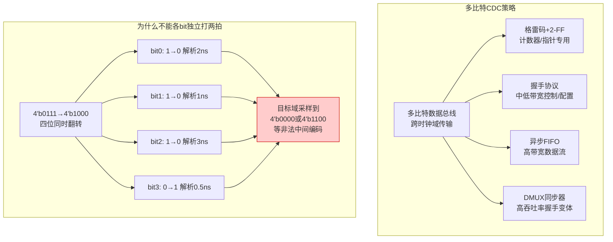
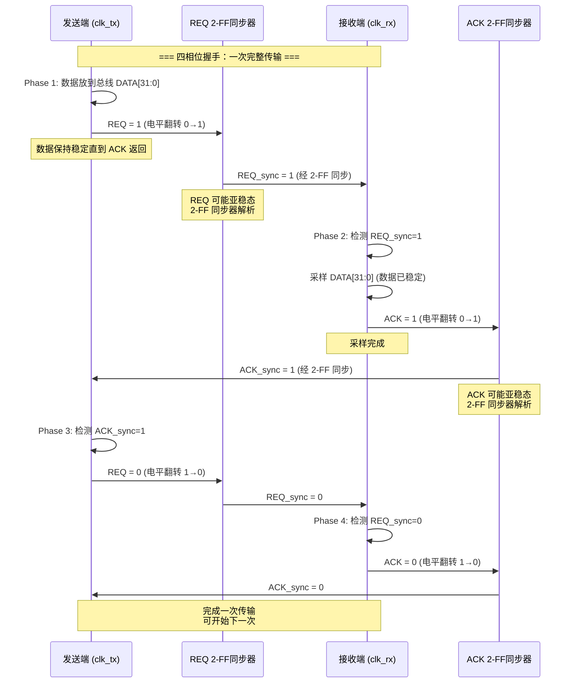
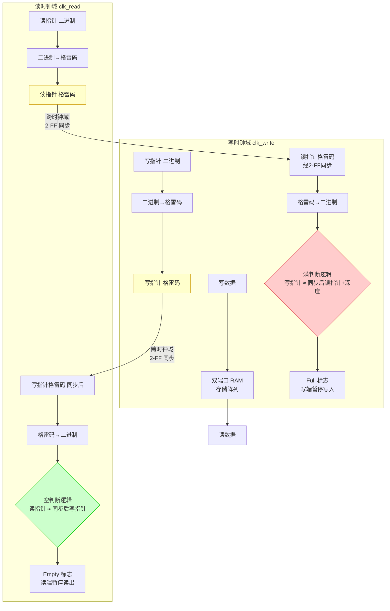

# 跨时钟域设计

跨时钟域（Clock Domain Crossing, CDC）是数字 IC 设计中最具挑战性的问题之一——当信号从一个时钟驱动的同步电路传输到另一个异步时钟驱动的同步电路时，由于两个时钟没有固定的相位和频率关系，目标时钟域的寄存器可能在源信号变化的任意时刻对其进行采样，存在亚稳态（Metastability）风险。

> **本文从 RTL 实现视角**组织：侧重可综合代码、电路结构（2-FF 同步器、异步 FIFO、握手协议）、编码模板（SystemVerilog 实例）、综合属性（ASYNC_REG、DONT_TOUCH）和物理布局约束。对于方法论与 Signoff 视角（验证策略、SDC 约束、形式验证、CDC 工具流程），参见 [[cross-domain/concepts/跨时钟域设计|跨时钟域（方法论视角）]]。

现代 SoC 通常包含数十到数百个独立时钟域——高性能处理器核、低速外设总线、DDR 存储器接口、SerDes 等各自工作在完全不同的频率下——CDC 设计的正确性直接决定了芯片能否可靠工作。CDC 错误在仿真中通常不会复现（仿真器用确定性调度处理时序），但在硅片上以极低但非零的概率出现，是最难调试的功能性缺陷之一。因此 CDC 验证（使用 SpyGlass CDC、Questa CDC 等专用工具）是 ASIC Signoff 的强制检查项。

## 原理



### 亚稳态物理机制

亚稳态是 CDC 问题的物理根源——当 D 触发器的输入在时钟沿的建立-保持窗口内变化时，输出进入介于 0 和 1 之间的不确定电平，需要随机解析时间才能稳定。亚稳态的完整物理机制（双稳态正反馈模型、MTBF 公式的数学推导、再生时间常数 $\tau$ 的工艺依赖性）参见 [[concepts/亚稳态|亚稳态（Metastability）]]。

在 RTL 编码层面，CDC 同步器的核心关注点是：如何通过寄存器级数、物理布局和综合属性将 MTBF 提升到目标水平。同步器级数选择（2-FF vs 3-FF）需根据具体工艺参数和系统可靠性目标由 MTBF 公式计算决定（详见权威文件中的参数化 MTBF 计算示例）。

### 两级触发器同步器

两级触发器同步器（2-FF Synchronizer）是 CDC 最基本和最重要的结构，用于同步单比特控制信号（跨时钟域的控制握手、状态标志、中断信号）。结构包含在目标时钟域中串联的两个 D 触发器——第一个触发器采样异步输入信号（可能进入亚稳态），经过一个完整的时钟周期解析时间后，第二个触发器在下一个时钟沿采样第一个触发器的（大概率已稳定的）输出。

2-FF 同步器的约束条件：a) MTBF 须通过计算验证满足系统可靠性要求（MTBF 公式：$MTBF = \frac{e^{T/\tau}}{f_{clk} \times f_{data} \times T_0}$，其中 $T$ 为解析时间窗口，$f_{clk}$ 为目标时钟频率，$f_{data}$ 为输入信号翻转率，$T_0$ 和 $\tau$ 为工艺相关常数）；b) 两个触发器必须物理上尽可能靠近（减少时钟偏斜差异导致的采样对齐偏差），通常要求在布局中标记为 `SYNC_FLOP` 属性以指导 CTS/P&R 优化；c) 同步器输入端的信号必须是干净的单一净翻转信号（Glitch-Free）——异步组合逻辑输出在同步前可能携带毛刺，应先在源时钟域寄存一拍。

### 格雷码 FIFO

多比特数据总线跨时钟域传输不能使用每比特独立的 2-FF 同步器——因为各比特的亚稳态解析时间独立随机，可能导致目标时钟域在同一周期采样到部分旧值和部分新值的"混叠"数据。Gray 码 FIFO（Asynchronous FIFO with Gray Code Pointers）是解决多比特 CDC 的标准方案。

核心原理：FIFO 的读写指针使用格雷码编码——相邻指针值仅有一位比特翻转（如 3 位格雷码：000->001->011->010->110->111->101->100->000）。将格雷码指针通过 2-FF 同步器跨时钟域传输时，即使同步器输出因亚稳态不确定，也只可能产生两种合法结果——旧指针值或新指针值（因为仅一位翻转，不会出现中间编码），从而保证 FIFO 的空满判断一致性。

空满条件：empty 条件（读指针 == 同步后的写指针，读时钟域判断），full 条件（写指针距离同步后的读指针为 FIFO 深度的一个循环——写指针 == ~读指针[MSB:MSB-1], 读指针[MSB-2:0]）。Full 判断有一个周期的保守偏差（读指针同步延迟）——Full 是提前判断的（保守策略），读指针同步延迟导致写端"提前"认为 FIFO 已满，实际可能仍有少量空间。这意味着 FIFO 实际可用深度比声明的深度少 1，需要预留一个缓冲区以防止溢出。

### 握手同步器

握手同步器（Handshake Synchronizer）用于传输多比特数据或不需要 FIFO 的间歇性跨域通信。协议使用请求-应答（REQ-ACK）四相位握手：a) 发送端在数据稳定后置位 REQ（单比特控制信号）；b) REQ 通过 2-FF 同步器传到接收端；c) 接收端采样数据（在检测 REQ 有效后的下一周期），然后置位 ACK；d) ACK 通过 2-FF 同步器传回发送端；e) 发送端检测 ACK 有效后置低 REQ；f) 接收端检测 REQ 低后置低 ACK，完成一次传输循环。握手同步器的传输延迟为若干目标时钟周期（取决于 REQ/ACK 同步延迟），适用于控制寄存器配置、命令下发等低频多比特跨域场景。

### DMUX 同步器

DMUX（Demultiplexer）同步器是握手同步器的高吞吐率变体——发送端使用并联的多个数据寄存器和一个选择器（MUX），通过 REQ/ACK 握手循环轮转使用不同的数据通道，将多个数据包的传输重叠进行，以此隐藏握手循环的往返延迟。DMUX 同步器将有效吞吐率从握手同步器的 $1/(4 \times sync\_delay)$ 提升到接近 $1/(sync\_delay)$。

### 复位同步器

复位信号跨时钟域的同步不可忽视——异步复位释放（Reset Deassertion）与目标时钟沿可能产生亚稳态在同一时钟域内，更严重的是如果复位信号在不同时钟域间的释放时间差异过大，可能导致跨域功能错误。复位同步器在目标时钟域内使用 2-FF 同步器采样复位释放沿，确保复位信号在目标时钟域内与时钟同步释放（同步复位释放），消除异步复位释放的亚稳态风险。

### CDC 验证方法

CDC 验证工具（SpyGlass CDC、Questa CDC）通过静态分析检测以下类型的 CDC 问题：a) 未同步信号——直接跨域的单比特或多比特信号；b) 同步器结构错误——2-FF 间距过大、缺少 ASYNC_REG 属性标记；c) 多比特 CDC 未使用 Gray 码或握手——可能导致数据混叠；d) 复位域交叉——复位信号在不同域间的传播路径；e) 组合逻辑在同步器输入端——可能引入毛刺。CDC 验证是 Signoff 的强制项——在仿真无法覆盖的异步行为空间中，静态 CDC 分析是目前唯一的系统级保证手段。

### 两级同步器与脉冲展宽的可综合实现

以下展示标准的两级触发器同步器和快时钟到慢时钟的脉冲展宽电路的可综合编码：

```systemverilog
// ============================================================
// 模块 1：两级触发器同步器（2-FF Synchronizer）
// ============================================================
// 功能：将来自异步时钟域的单比特控制信号同步到目标时钟域
// CDC 最基本、最重要的结构——所有同步器的基础
//
// 可靠性保证（MTBF, Mean Time Between Failures）：
//   MTBF = e^(T/τ) / (f_clk × f_data × T₀)
//   两级同步器对于典型商用工艺（28nm 及以下）提供 >10 年 MTBF
//
// @param  无（纯结构模块，无需参数化）
//
// @note  ASYNC_REG 属性标记两个触发器为同步器——
//        综合工具不会优化/克隆/重定时这些触发器
//        布局布线（P&R）工具将其物理上靠近放置
// @note  输入 sig_async 必须来自寄存器的 Q 输出（非组合逻辑）——
//        组合逻辑输出可能携带毛刺（Glitch），导致同步器采样到
//        虚假脉冲，应在源时钟域先寄存一拍再送入同步器
// @see   [[concepts/亚稳态|亚稳态（Metastability）]]
module cdc_2ff_sync (
    input  logic clk_dst,                      // 目标域时钟（上升沿有效）
    input  logic rst_n_dst,                    // 目标域复位（低电平有效）
    input  logic sig_async,                    // 异步输入信号——来自源时钟域的单比特控制信号
                                               //   必须满足：无毛刺、单次翻转（Monotonic Edge）
    output logic sig_sync                      // 同步后信号——目标域内安全使用
                                               //   延迟为 2 个目标域时钟周期（2-FF 流水线延迟）
);
    // ASYNC_REG 属性（Attribute）：
    //   综合工具识别此属性——标记的触发器为 CDC 同步器
    //   - 禁止综合优化（不参与逻辑重构/重定时/克隆）
    //   - 布局布线时将这两个触发器物理靠近（最小化时钟偏斜差异）
    //   - CDC 验证工具以此属性为锚点检查同步器结构
    // 语法：(* attr_name = "value" *) <signal_declaration>
    (* ASYNC_REG = "TRUE" *) logic sync_ff1, sync_ff2;

    // ===== 时序逻辑：两级移位寄存器 =====
    //
    // always_ff @(posedge clk_dst or negedge rst_n_dst)：
    //   异步复位 + 目标时钟上升沿触发
    //   复位与时钟异或关系——rst_n_dst=0 时立即复位，不等时钟沿
    //
    // 同步机制拆解：
    //   第 1 拍：sync_ff1 <= sig_async
    //     - 异步输入信号在 clk_dst 上升沿被采样
    //     - 如果 sig_async 在建立/保持窗口内变化 → sync_ff1 可能进入亚稳态
    //     - 亚稳态电压在完整的一个时钟周期内解析（Resolution Time）
    //
    //   第 2 拍：sync_ff2 <= sync_ff1
    //     - 再等一个完整时钟周期采样 sync_ff1
    //     - 经过 T_clk_dst 解析时间后，sync_ff2 以极高概率已稳定到合法逻辑电平
    //     - 两个连续周期为亚稳态解析提供了充足的时间窗口
    //
    //   第 3 拍（外部）：sig_sync = sync_ff2
    //     - assign 连续赋值——目标域所有下游逻辑使用 sig_sync
    //     - 此时信号已是目标域内干净、稳定的同步信号
    //
    // 为什么不用 3-FF？2-FF 对商用工艺的 MTBF 已超 10 年级别
    //   3-FF 用于汽车/航天等高可靠性场景（MTBF 要求 >10³ 年）
    always_ff @(posedge clk_dst or negedge rst_n_dst) begin
        if (!rst_n_dst) begin
            sync_ff1 <= 1'b0;                  // 复位：第一级清零
            sync_ff2 <= 1'b0;                  // 复位：第二级清零
        end else begin
            sync_ff1 <= sig_async;             // 第一级采样：可能进入亚稳态
            sync_ff2 <= sync_ff1;              // 第二级采样：解析后的稳定值
        end
    end
    // 将第二级触发器输出作为最终同步信号
    assign sig_sync = sync_ff2;
endmodule


// ============================================================
// 模块 2：脉冲展宽器（Pulse Stretcher）
// ============================================================
// 功能：将快时钟域的单周期脉冲展宽为电平信号，确保慢时钟域
//       有足够时间检测到
//
// 使用协议（快域 → 慢域完整握手流程）：
//   1. 快域 pulse_in 脉冲 → stretched_out 拉高（展宽）
//   2. stretched_out 经 2-FF 同步器到慢域
//   3. 慢域检测到高电平 → 完成操作 → 通过另一组同步器返回 ACK
//   4. 快域收到 ACK → stretched_out 拉低（释放展宽）
//
// @note  展宽高电平持续时间 ≥ 慢域 2 个时钟周期（保证至少采样一次）
// @note  本模块在源时钟域（快域）运行，展宽后的信号再跨域传输
// @note  stretch_ff 用于检测 ACK 返回信号（需从慢域经过另一组同步器）
// @see   [[rtl-design/concepts/跨时钟域设计|CDC 设计]]
module pulse_stretcher (
    input  logic clk_src,                      // 源域时钟（快时钟，上升沿有效）
    input  logic rst_n_src,                    // 源域复位（低电平有效）
    input  logic pulse_in,                     // 输入脉冲（快域单周期——仅 1 拍为高）
    output logic stretched_out                 // 展宽后的电平输出（持续多个快域周期）
);
    // stretch_ff：ACK 检测寄存器
    //   当 ACK 信号从慢域经同步器返回后，stretch_ff 被置位
    //   用于判断何时拉低 stretched_out
    logic stretch_ff;

    // ===== 时序逻辑：脉冲展宽控制 =====
    //
    // 状态机本质（以 stretched_out 和 stretch_ff 为状态）：
    //   IDLE      : stretched_out=0, stretch_ff=0
    //   ASSERT    : stretched_out=1, stretch_ff=0 (脉冲到达，展宽输出高)
    //   WAIT_ACK  : stretched_out=1, stretch_ff=1 (等待 ACK 返回后释放)
    //
    // 转换过程：
    //   pulse_in=1 → stretched_out <= 1 (拉高展宽输出)
    //   stretch_ff=1 (ACK 返回) → stretched_out <= 0 (拉低展宽输出)
    //   即：脉冲触发拉高，ACK 确认后拉低
    always_ff @(posedge clk_src or negedge rst_n_src) begin
        if (!rst_n_src) begin
            stretch_ff    <= 1'b0;             // 复位：ACK 检测清零
            stretched_out <= 1'b0;             // 复位：展宽输出清零
        end else begin
            // ----- 脉冲到达：拉高展宽输出 -----
            // pulse_in 是快域的单周期脉冲
            //   检测到 pulse_in=1 → 立即拉高 stretched_out
            //   之后 stretched_out 保持高直到 ACK 返回
            if (pulse_in)
                stretched_out <= 1'b1;         // 脉冲触发：展宽输出拉高

            // ----- ACK 返回后：拉低展宽输出 -----
            // stretch_ff 由外部逻辑（慢域返回的 ACK 信号经同步器后）驱动
            //   else if 表示仅在 pulse_in 无效且 ACK 已返回时拉低
            //   这保证了 stretched_out 的高电平持续至少一个 ACK 往返周期
            else if (stretch_ff)
                stretched_out <= 1'b0;         // ACK 确认：展宽输出释放
        end
    end
endmodule
```

**脉冲展宽的使用协议**：快时钟域的单周期脉冲触发展宽器拉高 `stretched_out`；展宽的高电平信号通过 2-FF 同步器传输到慢时钟域；慢时钟域检测到高电平后完成操作并通过另一组 2-FF 同步器返回 ACK（确认信号）；快时钟域检测 ACK 后拉低展宽输出。展宽器的保持时间需满足——`stretched_out` 的高电平持续时间至少为慢时钟域 2 个时钟周期（保证慢域至少采样一次），通常设计为慢域若干周期的倍数。

## 关键要点

- **2-FF 同步器为 CDC 最基本结构**：MTBF 须计算验证，两个触发器物理上须靠近并标记 ASYNC_REG 属性
- **格雷码 FIFO 为多比特 CDC 标准方案**：Gray 码指针保证跨域同步时只出现旧值或新值的合法编码，空满判断基于同步后的指针比较
- **握手同步器确保数据稳定采样**：REQ-ACK 四相位协议确保多比特数据稳定后再被采样，代价是吞吐率低（$1/6$ 至 $1/10$ 个有效传输每目标时钟周期）
- **复位同步器消除复位亚稳态**：异步复位释放必须经过复位同步器，复位信号在目标时钟域内同步释放，消除跨域和同一域内的复位亚稳态
- **多比特总线禁止独立 2-FF 同步**：绝对不能对多比特数据总线使用每比特独立的 2-FF 同步器，各比特亚稳态解析时间不同导致"混叠"数据（部分旧值+部分新值）
- **同步前先在源域寄存一拍**：组合逻辑的输出在同步前应先在源时钟域寄存一拍，消除毛刺，保证同步器输入为干净的单次翻转
- **CDC 验证为 Signoff 强制项**：CDC 错误在仿真中几乎不可能复现，只有静态 CDC 分析能系统性地检测同步结构缺陷
- **快到慢 CDC 需要展宽电路**：快时钟到慢时钟需要 Pulse Stretcher 展宽电路，展宽信号的持续时间至少为慢时钟域 2 个周期，通过 ACK 握手关闭展宽输出
- **同步器触发器物理布局须靠近**：必须标记 `ASYNC_REG` 属性并约束布局靠近，P&R 工具使用此属性优化时钟偏斜，最大 2x 时钟周期是经验上限
- **异步 FIFO 深度按带宽选择**：深度小（2-4）适用于低带宽控制信号，深度大（16-64）适用于高带宽数据流，水位线用于生成背压信号以避免溢出/读空

## 与其他概念的关系

- [[concepts/亚稳态|亚稳态（Metastability）]] — 亚稳态是 CDC 问题的物理根源，MTBF 量化了同步器可靠性的概率模型。同步器级数（2-FF vs 3-FF）的选择由 MTBF 计算决定——2-FF 对大多数商用工艺足以满足 >10 年 MTBF，高可靠性应用（汽车/航天）需 3-FF
- [[rtl-design/concepts/时序逻辑|时序逻辑]] — 同步器的行为基于 D-FF 的建立/保持时间窗口和亚稳态解析时间，与触发器结构和工艺直接相关。ASIC 标准单元库中的专用同步器触发器具有比普通 D-FF 更高的增益带宽积（$\tau$ 更小），解析时间更短
- [[cross-domain/concepts/跨时钟域设计|跨时钟域（CDC）]] — 跨域概念整合了 CDC 在 SoC 全芯片层面的策略：时钟域划分、同步点选择和验证流程。全芯片 CDC 策略包括 CDC 拓扑图（哪些域与哪些域通信）和 CDC 信号的数量/类型/带宽统计
- [[cross-domain/concepts/复位策略|复位策略]] — 复位同步器是 CDC 中的一个特殊子集，复位释放的跨域同步影响整个芯片的上电序列。复位的 CDC 特殊性在于它是"全局信号"——需要确保所有域同时或按顺序完成复位释放，避免跨域协议在复位期间出现未定义行为

### 单比特信号跨时钟域同步

**两级寄存器打拍的原理**： 单比特信号跨时钟域时，目标时钟域的触发器可能在任何相位关系下采样源域信号。当源信号在目标时钟的建立-保持窗口（亚稳态窗口）内翻转时，第一级触发器进入亚稳态——输出在 $V_{DD}/2$ 附近振荡，无法被下游逻辑正确识别。**第一级触发器"承担"了亚稳态风险**——经过一个完整的时钟周期解析时间后，**第二级触发器在下一个时钟沿采样第一级的（大概率已稳定的）输出**，从而将亚稳态传播到下游逻辑的概率降至极低水平。

**组合逻辑输出的毛刺风险**： 组合逻辑输出可能携带**毛刺（Glitch）**——由于不同路径的传播延迟差异，组合逻辑的输出在稳定到最终值之前可能经历多次翻转。如果同步器采样到毛刺，会将虚假脉冲传播到目标域，导致功能错误。正确的做法是：**在源时钟域先将组合逻辑输出寄存一拍**（消除毛刺），再送入同步器。

**同步器第一级和第二级哪个更容易出问题？** 第一级更容易出问题——因为它直接采样异步输入，是最可能进入亚稳态的一级。第二级采样的是第一级输出，此时第一级已经有整整一个时钟周期的时间进行亚稳态解析，进入亚稳态的概率极低（但非零——这也是为什么极端高频场景需要三级同步器）。

**亚稳态窗口（Metastability Window）的定义**： 亚稳态窗口是输入数据变化的时间区间，使得触发器输出解析时间超过某个给定阈值的输入时间范围。它与建立-保持时间窗口密切相关：$T_w \approx T_{su} + T_{hold}$（数十皮秒量级），但实际窗口因噪声、工艺变异和温度漂移而展宽。**同步器的 $T_0$ 参数就是对亚稳态窗口的积分量度**：$T_0 = \int P(\text{metastability}|\Delta t_{in}) \, d(\Delta t_{in})$。

**同步器触发器的物理布局要求**： 两个触发器物理上紧密放置可以：a) 最小化时钟偏斜（Clock Skew）差异——如果两个触发器的时钟树延迟差异过大，会缩小第一级到第二级的有效解析时间窗口；b) 减小走线延迟——级间组合逻辑延迟直接消耗 $t_{res}$ 预算；c) 降低 PVT 变异导致的局部失配——相邻位置共享相同的工艺角和温度梯度。通常要求在布局中标记 `ASYNC_REG` 属性，将两级触发器约束在同一标准单元行内、间距控制在 50-100 $\mu$m 以内。



**两级够吗？——MTBF 计算**。以典型 28nm 参数为例：$f_{clk}=1\text{ GHz}$, $f_{data}=100\text{ MHz}$, $\tau \approx 10\text{-}20\text{ ps}$, $T_0=50\text{ ps}$。两级同步器提供 $t_{res}\approx 950\text{ ps}\approx 47\text{-}95\tau$，MTBF 远超芯片寿命。但对于 >5 GHz 高频或汽车 ASIL-D（目标 MTBF > $10^9$ 小时）场景，需要 3+ 级同步器。跨域 CCD 方法论中对 40nm 和 7nm 工艺的 $\tau$ 参数有更详细的讨论。**工程实践：先通过 MTBF 公式计算最少级数，再加一级作为安全裕量**。

### 多比特信号跨时钟域处理方式

**多比特独立同步的数据混叠问题**： 多比特数据总线不能对每个比特使用独立的 2-FF 同步器——因为各比特的亚稳态解析时间是**独立随机**的。假设一个 4 位计数器从 `4'b0111` 变化到 `4'b1000`（所有 4 位同时翻转），目标时钟域在不同的解析延迟下可能采集到任意中间值：`4'b1111`、`4'b0000`、`4'b0100`……这些中间编码都是非法的，构成**数据混叠（Data Incoherency）**。因此多比特跨域必须采用特殊的同步策略。

**四种标准处理方式**：

1. **格雷码 + 2-FF（计数器/指针）**：将二进制编码转换为格雷码——相邻值仅一位翻转。格雷码指针通过 2-FF 同步器跨域时，即使同步器因亚稳态不确定，也只可能出现旧值或新值（因为仅一位翻转，不存在中间编码）。这是异步 FIFO 指针传递的核心机制。

2. **握手协议（Handshake）**：发送端先将数据稳定在总线上，然后发送单比特 REQ 信号通过 2-FF 同步器到接收端；接收端检测 REQ 后采样数据（此时数据已稳定），再返回 ACK。将多比特同步降级为单比特指示信号同步——代价是吞吐率低。

3. **异步 FIFO（Asynchronous FIFO）**：双端口 RAM + 格雷码指针同步 + 空满判断逻辑。最高带宽、最大深度——是数据流跨域的首选方案。

4. **DMUX 同步器**：握手同步器的高吞吐率变体——发送端使用并联多路数据寄存器，通过 REQ/ACK 循环轮转，将多笔传输重叠进行，隐藏握手往返延迟。

**异步 FIFO 深度计算**：FIFO 深度取决于写入和读出的速率比以及突发长度（Burst Length）。最坏情况下，写入方连续写入 $B$ 个数据（突发），而读出方在此期间以较慢速率读取。公式：$D_{fifo} \ge B - \lfloor B \times \frac{f_{read}}{f_{write}} \rfloor$。例如，写时钟 200 MHz、读时钟 100 MHz、突发长度 16：$D \ge 16 - \lfloor 16 \times 0.5 \rfloor = 16 - 8 = 8$，即至少需要深度 8 的 FIFO。实际设计还需加 1-2 个额外深度作为安全裕量——因为空满判断有同步延迟。

**稳定采样窗口的定义与约束**： 稳定采样窗口（Stable Sampling Window）是指多比特数据在跨域传输时必须保持稳定的最小时间窗口。对于握手方案，数据必须在 REQ 置位前稳定，且直到 ACK 返回后才允许改变——这确保了接收端采样时数据已完全建立；对于异步 FIFO，写数据在写使能有效时必须稳定满足写端触发器的建立-保持时间。

**格雷码特点**：a) 相邻编码只有 1 位不同（汉明距离 = 1）；b) 循环性——最后一个编码回到第一个编码也只有 1 位变化（仅当编码数为 2 的幂次）；c) 反射性——$n$ 位格雷码通过 $n-1$ 位格雷码正序加前导 0 + 逆序加前导 1 构造（反射格雷码/Relfected Gray Code）。

**二进制转格雷码**：$g = b \oplus (b \gg 1)$。Verilog 实现：`assign gray = bin ^ (bin >> 1);`



### 握手协议（Handshake）

**握手协议（Handshake Protocol）** 是一种通过请求-应答（REQ-ACK）机制在异步时钟域之间可靠传递数据的同步方案。其核心思想是**将多比特数据同步问题降级为单比特控制信号同步问题**：发送端先将多比特数据稳定在总线上，再通过单比特请求信号（REQ）经 2-FF 同步器告知接收端数据已就绪；接收端在确认 REQ 有效后采样已稳定的数据，然后返回单比特应答信号（ACK）经 2-FF 同步器告知发送端传输完成。

**四相位握手**（4-Phase Handshake / Level-Handshake）是最经典的握手协议，每次传输经历四个阶段：**Phase 1**——发送端将数据放到总线上并置位 REQ（电平从 0→1）；**Phase 2**——接收端检测到 REQ=1 后采样数据，然后置位 ACK（电平从 0→1）；**Phase 3**——发送端检测到 ACK=1 后撤销 REQ（电平从 1→0）；**Phase 4**——接收端检测到 REQ=0 后撤销 ACK（电平从 0→1→0）。四个相位各需一次跨域同步延迟，完整传输周期约 $4 \times (2 \times T_{clk})$ 约 8-12 个目标时钟周期。

**两相位握手（2-Phase Handshake / Transition-Triggered / Toggle）** 使用边沿跳变代替电平表示事件：每当发送端准备好新数据，就翻转（Toggle）REQ 的极性；接收端检测到 REQ 跳变后采样数据，然后翻转 ACK。两相位握手将周期减半至约 $2 \times$ 同步延迟，适合高频大块数据传输。代价是每端需要额外 DFF 保存上一周期的 REQ/ACK 值以检测边沿。

**全握手 vs 半握手**：全握手（Full Handshake）如上所述，REQ 和 ACK 均为完整的四相位（或两相位）交互——发送端确认 ACK 后才允许改变数据。半握手（Half Handshake / Pulse-Based）只使用 REQ 信号（脉冲或电平），不返回 ACK——发送端"发后不管"（Fire-and-Forget），适用于数据丢失不敏感的统计型信号（如性能计数器）。半握手延迟最小但无可靠性保证，不能用于关键控制信号。

**背压（Backpressure）处理**：当接收端来不及处理数据时，需要在握手协议中加入流控。Valid-Ready 握手是 Ready-Req-Ack 的变体——发送端置位 Valid（等价 REQ），接收端仅在 Ready=1 时响应并置位 ACK；若 Ready=0，发送端保持 Valid=1 和数据不变，等待接收端就绪。这实际上是一个**二要素握手**：Valid 和 Ready 同时为高时完成一次传输（一拍）。Valid-Ready 是 AXI-Stream 等标准总线协议的基础。

**REQ 和 ACK 本身的亚稳态怎么办？** REQ 和 ACK 作为单比特控制信号，各自通过 2-FF 同步器跨域——这正是将多比特问题降级为单比特同步问题的关键设计思想。接收端的 REQ 同步器承担 REQ 的亚稳态风险，发送端的 ACK 同步器承担 ACK 的亚稳态风险——只要 MTBF 满足要求，两个同步器各自独立保障可靠性。



### 异步 FIFO 设计原理与空满判断

**异步 FIFO（Asynchronous FIFO）** 是跨时钟域传输多比特数据流的标准方案。其核心结构包括三部分：a) **双端口 RAM**——物理存储体，写端口运行在写时钟域，读端口运行在读时钟域，两者完全异步；b) **格雷码指针**——写指针（写地址）和读指针（读地址）各自在本地时钟域递增，以格雷码编码后通过 2-FF 同步器跨域传递；c) **空满判断逻辑**——比较两个指针的关系产生 Empty 和 Full 标志。

**空满判断的时钟域不对称性**： 这是异步 FIFO 设计中的关键不对称性：

- **Empty 在读时钟域判断**：读指针是本地的、实时的；写指针是从写域同步过来的、有 2-3 拍延迟的"旧"值。当读指针 $\ge$ 同步后的写指针时，读端判断 FIFO 为空——不会再去读。由于写指针同步延迟，FIFO 可能实际上已有新数据写入（写指针已前进），但读端要等 2-3 拍后才"看到"——这是"保守空"（读端提前认为空了，暂停读）。
- **Full 在写时钟域判断**：写指针是本地的、实时的；读指针是从读域同步过来的、有 2-3 拍延迟的"旧"值。当写指针 + FIFO 深度 $\le$ 同步后的读指针时，写端判断 FIFO 为满——不会再去写。由于读指针同步延迟，FIFO 可能实际上已被读出几个数据（读指针已前进），但写端要等 2-3 拍后才"看到"——这是"保守满"（写端提前认为满了，暂停写）。

**保守空满判断为什么安全？** "保守"意味着提早置位、延迟撤销——永远不会出现"空了却以为有数据"（下溢）或"满了却以为有空间"（溢出）。代价是 FIFO 的**有效可用深度小于物理深度**——物理深度为 $N$ 时，实际可用约 $N - 2$（因为空满标志各浪费约 1-2 个深度的裕量）。保守策略保证了**功能正确性**——下溢和溢出是不可恢复的功能错误，而"浪费几个深度"只是面积效率的轻微损失。

**亚稳态风险在哪？** 异步 FIFO 的亚稳态风险集中在**指针同步环节**：写指针以格雷码形式跨到读时钟域时，每个比特经过 2-FF 同步器——同步器第一级可能进入亚稳态。但由于格雷码每次仅一位翻转，即使同步器输出不确定，也只有两种可能结果：旧指针值（同步器解析为 0）或新指针值（同步器解析为 1）——**绝对不会出现非法中间编码**。因此空满判断要么基于旧指针值（保守空/满），要么基于新指针值（实时）——两种情况都不会导致溢出/下溢。

**异步 FIFO 深度计算**：$D_{fifo} \ge B - \lfloor B \times \frac{f_{read}}{f_{write}} \rfloor$，其中 $B$ 为最大突发长度。例如写时钟 200 MHz、读时钟 100 MHz、最坏情况连续写入 20 个数据：$D \ge 20 - \lfloor 20 \times 0.5 \rfloor = 20 - 10 = 10$。考虑到空满判断的同步延迟裕量（约 2-4 个深度），实际设计建议取 DB + 4。

**异步 FIFO 的多层次验证方法**： 多层次验证：a) **形式验证**——用 JasperGold 等工具证明空满逻辑在所有可达状态下不会导致溢出/下溢，死锁不存在；b) **CDC 静态检查**——SpyGlass CDC 检查格雷码编码正确性、同步器存在性、指针位宽正确性（深度为 $2^k$ 时指针需 $k+1$ 位，额外最高位区分空满）；c) **定向仿真**——遍历满→写→满、空→读→空、同时读写等极端场景；d) **亚稳态注入门级仿真**——在同步器第一级注入随机延迟，观测空满标志是否始终保守。



> **关于空满判断的两种实现方式**：上述 Mermaid 图展示了 G2B 转换后二进制比较的方式（格雷码同步后转回二进制，再做指针比较）。另一种等效实现是直接在格雷码域进行比较——利用格雷码的特定性质（例如，Full 条件为写指针与同步后读指针在最高两位互反而低位相等）。两种方式在功能上等价，G2B 方式对于非 2 的幂次深度更灵活，格雷码域直接比较可省去 G2B 转换逻辑。实际设计中两种实现均经过工业验证。

### 格雷码在异步 FIFO 中的作用

**格雷码在异步 FIFO 中的核心作用**：保证跨时钟域同步后的指针值**只可能是旧值或新值，绝不可能出现任何非法中间编码**。这是因为格雷码的相邻编码（包括从最后一个编码回到第一个编码）**恰好只有 1 位不同**（汉明距离 = 1）。当这个唯一的翻转位经过 2-FF 同步器时，亚稳态只可能让这一位解析为 0（旧值）或 1（新值）——两个结果分别对应旧指针和新指针，**都是合法有效的指针编码**。

与之对比，二进制编码在指针进位时可能出现多比特同时翻转——例如 4 位计数器从 `0111`(7) 递增到 `1000`(8)，全部 4 位都翻转。如果每比特经独立 2-FF 同步，各比特解析时间不同，目标域可能在同一周期采样到 `0000`(0)、`1111`(15)、`0100`(4) 等任意组合——每一个都是非法的指针值，导致空满判断彻底错误。

**格雷码亚稳态比二进制好多少？** 这不是"好多少"的程度问题，而是**定性差异**——格雷码将多比特同步问题降为单比特同步问题。二进制多比特跨域产生非法编码的概率远高于单比特亚稳态的故障率——前者是**确定性失败**（每次多比特翻转都可能产生非法值），后者是**概率性失败**（MTBF 可计算、可量化）。

**FIFO 深度必须是 2 的幂次吗？** 对于经典格雷码（反射格雷码/Reflected Gray Code），是的——只有深度为 $2^k$ 时，从最大编码（$2^k-1$）回到 0 也只有 1 位翻转（格雷码的循环性）。如果深度不是 2 的幂次（如深度 = 6），从深度-1（5）回到 0 时格雷码变化可能有多位翻转——破坏"相邻仅一位翻转"的核心保证。非 2 幂深度需使用**扩展格雷码方案**：使用 $k$ 位格雷码（$2^k$ 编码空间），但仅在 $0$ 到 $\text{depth}-1$ 的有效区间内循环，并做额外编码转换。

**格雷码的其他应用场景**：a) **状态机跨域**——FSM 状态编码采用格雷码时，跨域同步后的状态值始终为合法状态；b) **跨时钟域计数器/分频器**——计数器值用格雷码跨域读取（如性能监控计数器）；c) **卡诺图（Karnaugh Map）**——卡诺图的行列排列顺序就是格雷码，保证相邻格子仅一位不同；d) **旋转编码器（Rotary Encoder）**——机械旋转位置编码使用格雷码消除边沿抖动导致的读数错误；e) **遗传算法（Genetic Algorithm）**——格雷码编码减少汉明悬崖（Hamming Cliff），提高搜索效率。

**二进制转格雷码公式推导**：
$$g_i = b_i \oplus b_{i+1} \quad (\text{对于位 } i = 0,1,...,n-2)$$
$$g_{n-1} = b_{n-1}$$

等价于：$g = b \oplus (b \gg 1)$。Verilog 实现：
```systemverilog
// 二进制转格雷码：单行实现
// g[i] = b[i] ^ b[i+1], g[MSB] = b[MSB]
assign gray = bin ^ (bin >> 1);

// 格雷码转二进制：逐位异或累加
// b[MSB] = g[MSB]
// b[i] = g[i] ^ b[i+1]
function automatic logic [PTR_W-1:0] gray2bin(
    input logic [PTR_W-1:0] gray
);
    logic [PTR_W-1:0] bin;
    bin[PTR_W-1] = gray[PTR_W-1];
    for (int i = PTR_W-2; i >= 0; i--) begin
        bin[i] = gray[i] ^ bin[i+1];  // 依次异或
    end
    return bin;
endfunction
```

### 二进制指针在异步 FIFO 中的问题

**直接原因：二进制指针在进位时多比特同时翻转，各比特经独立 2-FF 同步后产生非法中间编码。**

以一个 4 位二进制写指针从 `4'b0111`（指向地址 7）递增到 `4'b1000`（指向地址 8）为例：bit[0] 从 1→0，bit[1] 从 1→0，bit[2] 从 1→0，bit[3] 从 0→1——**全部 4 位同时翻转**。当这 4 个比特分别通过 4 个独立的 2-FF 同步器从写时钟域跨到读时钟域时，由于各比特的亚稳态解析时间是独立随机的：
- bit[3] 可能在 0.5 ns 就解析为 1（新值）
- bit[2] 可能在 2.0 ns 才解析为 0（新值）
- bit[1] 可能在 1.5 ns 解析为 0（新值）
- bit[0] 可能因亚稳态在 3.0 ns 后仍为 1（旧值）

读时钟域的上升沿如果恰好落在 bit[3] 和 bit[2] 的解析窗口之间（1.0 ns 处），则采样到的值是 `4'b1001`（9）——这个指针值既不是旧指针 7 也不是新指针 8，而是一个**完全非法的中间编码**。更糟的是，如果读时钟沿落在不同时间点，可能采样到 16 种组合中的任意一个：`0000`(0)、`1111`(15)……

**空满判断的灾难性后果**：假设 FIFO 深度为 8（指针 3 位 + 1 位最高位 = 4 位），同步后得到一个非法指针值，空满比较逻辑将产生完全错误的结果——可能在 FIFO 实际有空间时误判为满（阻止写入，性能损失），或在 FIFO 实际为空时误判为有数据（允许读出脏数据，功能错误）。后者是不可恢复的——读出的数据既不是当前有效数据也不是旧有效数据，而是一个完全不相关的存储单元内容。

**格雷码与二进制指针同步的根本差异**：格雷码每次仅一位翻转——无论同步器是否进入亚稳态，该比特最终解析为 0 或 1 分别精确对应旧指针值或新指针值。而二进制编码缺乏这一性质——多比特翻转的独立性导致解析结果的组合空间随位宽呈指数爆炸（$n$ 位 → $2^n$ 种可能的中间编码）。**格雷码的"单比特翻转"就是为此精确设计的数学性质。**

**SDC 层面的后果**：如果使用二进制指针跨域，CDC 静态检查工具（SpyGlass CDC）会直接报出"多比特 CDC 未使用格雷码或握手"的违规——因为工具通过结构分析识别到多比特信号跨越异步时钟边界且缺乏聚合同步机制。这种违规在 CDC Signoff 中不可 waive（除非提供等效的替代同步方案证明）。

