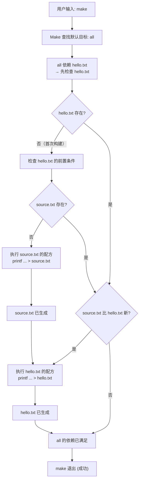

# 01 — Makefile解决的问题与第一个例子

## 学习目标

本篇从零回答三个问题：

1. **Makefile 到底解决什么问题**——为什么不用 Shell 脚本直接编排命令？
2. **第一个可运行的 Makefile 长什么样**——从最简单到逐渐完善的渐进式示例
3. **Make 的内部决策过程是怎样的**——通过 `make -n`、`make --trace` 和 `make -d` 观察 Make 的大脑

读完本篇后，你将能够写出一个包含真实文件目标、伪目标和多级依赖的 Makefile，并能够独立解释 Make 为什么执行或跳过了某条命令。这是理解后续所有 Makefile 知识的起点——后续每一篇都在这个基础上增加一层抽象。

Makefile 的核心价值不是"少敲几行命令"——那只是副作用。真正的价值在于把工程产物之间的**依赖关系写成声明**（declarative specification），然后由 Make 的依赖图引擎自动判断哪些需要重建、哪些可以跳过。Shell 脚本按顺序重跑所有步骤，Make 只重建过期的部分。在数字IC工程中——一次完整仿真可能跑数小时，一次综合可能跑一晚上——增量重跑的价值是直接的工程时间压缩。

**本篇只讲 MAKE 层（Makefile 语法）的最基本要素，不展开 Shell 层（配方内部）的细节。** Shell 层的深入讨论见 [[tools/concepts/03-Makefile规则详解|03 — Makefile 规则详解]]。

## 前置知识

- 会在终端进入一个目录并运行 `make`、`ls`、`cat`、`touch` 等命令
- 知道文件有**修改时间**（modification time, mtime）：新写入的文件比旧文件"更新"
- **不需要**事先理解变量、函数、模式规则等概念——那些是后续篇章的主题

本篇是 Makefile 系列的第一篇，不依赖系列内其他文件。后续衔接：[[tools/concepts/03-Makefile规则详解|03 — Makefile 规则详解]]。

## 最小可运行例子

### 例子 1：一个文件都生成不了的 Makefile

在一个空目录中创建 `Makefile`，内容如下：

```makefile
# 例子 1：最简单的规则——只有一个目标，没有前置条件，没有配方
# 目标名 = hello，但 hello 不是文件——只是一个"标签"
hello:
```

执行：

```shell
make hello        # make: Nothing to be done for 'hello'.
make              # make: Nothing to be done for 'hello'.（默认第一个目标也是 hello）
```

**关键观察：** Make 发现目标 `hello` 没有配方、也没有需要更新的前置条件，且没有名为 `hello` 的文件需要"最新"。所以它什么都不做。规则（Rule）的**最小形式**就是 `target:` 加可能为空的配方。

### 例子 2：第一条可执行的规则

```makefile
# 例子 2：一个真实文件目标——Makefile 描述"如何生成 hello.txt"
# hello.txt: 冒号左边是目标（要生成的文件名）
#           冒号右边什么都没写——这意味着"没有前置条件"
hello.txt:               # 目标：磁盘上的文件 hello.txt
	printf 'hello make\n' > hello.txt
#       配方：由 Shell 执行。注意：这里用了空格缩进——运行会失败！
```

执行：

```shell
make
# 报错：Makefile:2: *** missing separator.  Stop.
```

**关键观察：** 配方行（Recipe）必须以 **TAB 字符**（ASCII 0x09）开头，不能是 8 个空格。这是 Makefile 历史上最著名的设计缺陷——IDE 的"TAB 转空格"功能是 Makefile 的头号杀手。如果你不确定编辑器是否插入了真正的 TAB，用 `cat -A Makefile` 检查：配方行开头应该显示 `^I` 而非空格。

> **版本说明：** GNU Make 4.0+ 支持 `.RECIPEPREFIX` 特殊目标来更换配方前缀字符（如换成 `>`），但绝大多数既有 Makefile 使用 TAB。本书默认使用 TAB，`.RECIPEPREFIX` 的详细讨论见 [[tools/concepts/04-Makefile配方与Shell|04 — Makefile 配方与 Shell]]。

修正后的例子 2：

```makefile
# 例子 2（修正版）：用 TAB 缩进的配方
hello.txt:               # 目标：磁盘文件 hello.txt
	printf 'hello make\n' > hello.txt
#^^^^^^^ 注意：这一行必须以真正的 TAB 开头，不能用 8 个空格替代
```

执行：

```shell
make                    # 执行配方，生成 hello.txt
make                    # 第二次执行：make: 'hello.txt' is up to date.
```

**关键观察：** 第二次 `make` 时，Make 检查到 `hello.txt` 已经存在，而且它没有任何前置条件需要比它更新，所以判断目标"已是最新"（up to date），跳过配方。这就是 Make 的**增量构建**核心机制：时间戳比对。

### 例子 3：有依赖关系的两个文件

```makefile
# 例子 3：两个文件之间的依赖关系
# all 是第一个目标——用户只输入 make 时的默认入口
all: hello.txt               # all 依赖 hello.txt——hello.txt 必须先被构建

# hello.txt 依赖 source.txt——source.txt 更新会导致 hello.txt 重建
hello.txt: source.txt        # 冒号左边=目标，右边=前置条件
	@printf 'build %s from %s\n' hello.txt source.txt > hello.txt
#       ^^                                           ^^^^^^^^^^^^
#       $@ 是 Make 自动变量，展开为"当前目标名"（hello.txt）
#               $< 是 Make 自动变量，展开为"第一个前置条件"（source.txt）

# source.txt 没有前置条件——只有文件不存在时才会执行配方
source.txt:                  # 空前置列表：只要 source.txt 存在就跳过
	@printf 'this is input\n' > source.txt
#       ^
#       @ 前缀：不回显配方行本身——让终端输出更干净

# .PHONY 声明：clean 是动作名，不是要生成的文件名
.PHONY: clean                # 即使目录下碰巧有名为 clean 的文件也强制执行
clean:
	@rm -f hello.txt source.txt  # rm -f：强制删除，文件不存在也不报错
```

执行命令序列（建议按顺序逐条执行以感受 Make 的决策过程）：

```shell
# === 第 1 轮：从空目录开始 ===
make clean                # 清理上一次实验残留
make -n                   # 预演（dry-run）：只打印将要执行的配方，不真正生成文件
make --trace              # 实际执行，同时打印每条规则被触发的理由
# 预期输出（简化）：
# Makefile:15: target 'source.txt' does not exist → 执行配方生成 source.txt
# Makefile:9:  target 'hello.txt' does not exist → 执行配方生成 hello.txt
# 结果：两个文件都被创建

# === 第 2 轮：文件都已存在，什么都不该发生 ===
make --trace
# 预期输出：只有一行 "make: 'all' is up to date." 或类似消息
# 原因：hello.txt 比 source.txt 新，且 all 依赖的 hello.txt 已是最新 → 什么都不做

# === 第 3 轮：修改输入文件，只重建受影响的目标 ===
sleep 1 && touch source.txt   # sleep 确保时间戳有可检测的差异
make --trace
# 预期输出：
# Makefile:9: target 'hello.txt' is older than prerequisite 'source.txt' → 重建 hello.txt
# 注意：source.txt 本身不会被重建——因为它已存在，没有前置条件需要更新

# === 第 4 轮：再次确认一切已最新 ===
make --trace
# 什么都不重建
```

**关键观察总结：**

1. Make 的默认目标是 Makefile 中的**第一个以非 `.PHONY` 声明方式引入的目标**——例子中 `all` 虽然在第 3 行，但它是第一个目标，所以是默认目标
2. 时间戳是增量构建的唯一判断依据——Make 不关心文件内容是否变化，只关心修改时间
3. `touch source.txt` 更新了 source.txt 的时间戳但没有改变内容——Make 仍然会重建 `hello.txt`，因为 Make 只看时间戳
4. `.PHONY` 目标**永远执行**，即使有同名文件存在

**为什么默认目标是 `all` 而非 `hello.txt`？** 因为 `all` 是 Makefile 中的第一个目标。如果顺序反过来：

```makefile
hello.txt: source.txt       # 如果这是第一个目标...
	@printf '...' > hello.txt

all: hello.txt              # ...则 make 不带参数时的默认目标是 hello.txt
```

此时 `make` 只会构建 `hello.txt`，不会尝试满足 `all`（虽然 `all` 的依赖 `hello.txt` 已经满足）。把 `all` 放在第一行的约定确保 `make` 不带参数时构建整个项目。

## 语法拆解

本节用逐层递进的方式拆解例 3 中的每个元素。先建立 Makefile 语法的完整模型，再逐一分析例子中用到的具体元素。

### Makefile 的语法模型：规则 = 目标 + 前置条件 + 配方

一条 Makefile 规则的形式化定义：

```text
target ... : prerequisite ... ; command
<TAB>recipe-line-1
<TAB>recipe-line-2
```

| 元素 | 在例子中的实例 | 定义 | 语义 |
|:---|:---|:---|:---|
| **目标**（Target） | `hello.txt`、`source.txt`、`all`、`clean` | 冒号左边、空白/TAB 之前的词 | "我要生成/更新这个东西" |
| **前置条件**（Prerequisite） | `source.txt`（在 `hello.txt:` 右侧） | 冒号右边的词列表 | "生成目标前，这些东西必须先是最新的" |
| **配方**（Recipe） | `printf '...' > hello.txt` 等 | TAB 开头的行（在目标所在规则之后） | "Shell 命令：如何从前置条件生成目标" |

一条规则中可以只有目标+前置条件而没有配方（如 `all: hello.txt`）——它只声明依赖关系，不定义构建方式。也可以只有目标+配方而没有前置条件（如 `source.txt:` 后面跟配方）——这是一种"仅在文件不存在时执行"的模式。

**规则不是过程，是声明。** 初学者最容易犯的认知错误是把 Makefile 理解为"从上到下依次执行的命令列表"。正确的理解是：Makefile 是一组**声明**——声明了哪个文件取决于哪些文件、以及如何从后者生成前者。Make 引擎会根据依赖图自主决定执行顺序。

### 目标（Target）的两类：真实文件 vs 伪目标

```makefile
hello.txt: source.txt      # 真实文件目标：hello.txt 会作为文件出现在磁盘上
	@printf 'build %s from %s\n' hello.txt source.txt > hello.txt

.PHONY: clean               # 伪目标声明：clean 不是文件名，是动作名
clean:
	@rm -f hello.txt source.txt
```

**真实文件目标**的决策逻辑：

1. 目标文件不存在 → 执行配方
2. 目标文件存在，但有前置条件比它新 → 执行配方
3. 目标文件存在，且比所有前置条件都新 → 跳过（up to date）

**伪目标**的决策逻辑：

- 永远执行——因为 `.PHONY` 声明告诉 Make "不要检查是否有同名文件"

**目标与目录名冲突的经典陷阱：** 如果项目中有 `build/` 目录，而 Makefile 中有一个名为 `build` 的目标（没有 `.PHONY` 声明）：

```makefile
build:                     # 打算用来执行构建流程的目标
	gcc -o prog main.c
```

```shell
mkdir build                # 创建名为 build 的目录
make build                 # make: 'build' is up to date. ——目录已存在，跳过！
```

Make 发现名为 `build` 的文件（目录也是文件）已存在，且没有前置条件需要比它新，于是判断 `build` 已是最新。解决方法：把这个目标加到 `.PHONY` 声明中。

### 自动变量：`$@`、`$<` 和 `$$`

```makefile
hello.txt: source.txt
	@printf 'build %s from %s\n' hello.txt source.txt > hello.txt
#  相当于：
#  @printf 'build %s from %s\n' $@ $< > $@
```

| 自动变量 | 展开为 | 例子中的值 | 助记 |
|:---|:---|:---|:---|
| `$@` | 当前目标名 | `hello.txt` | **@** = **at** = target |
| `$<` | 第一个前置条件 | `source.txt` | **<** = **first**（第一个） |
| `$^` | 所有前置条件（去重） | `source.txt`（本例只有一个） | **^** = **all** |
| `$?` | 所有比目标新的前置条件 | 变化 | **?** = **newer**（更新的那些） |
| `$*` | 模式规则中的茎（stem） | 本例不涉及模式规则 | **\*** = **stem** |

自动变量**只在配方的上下文中有效**——你不能在变量定义中引用 `$@`（它在读阶段时尚未绑定到任何特定目标）。

**`$$` 的双重转义：** Make 的变量展开用 `$` 前缀。如果你想把一个 `$` 字面传给 Shell（如 `$(date ...)` 或 `$$`），就要写成 `$$`。这是因为 Make 在处理配方时先做自己的变量展开（将 `$$` 转为 `$`），然后把结果交给 Shell 执行。例子 3 中用 `printf 'build %s from %s\n'` 而非 `printf "build $@ from $<\n"`，是因为 `'...'` 单引号内 Shell 不做变量展开——更简单也更安全。

```makefile
# 错误的写法——Make 会把 $@ 展开为当前目标名，然后 Shell 看到的是字面文件名
wrong:
	echo "Building target: $@"

# 正确的写法——$$ 转义后 Shell 看到 $@
correct:
	echo "Building target: $$@"     # Make 展开后变成：echo "Building target: $@"
```

### `@` 前缀：抑制配方回显

```makefile
# 默认行为：Make 在执行配方前会先打印该行
loud:
	printf 'hello\n'           # 终端输出：printf 'hello\n'   →    hello

# @ 前缀：只执行，不打印配方行本身
quiet:
	@printf 'hello\n'          # 终端输出：hello
```

`@` 是开发者体验工具——它让输出更干净。但调试时应该去掉 `@`（或使用 `make -n`），否则看不见实际执行的命令。

`@` 可以与 `-` 组合（如 `@-rm -f *.o`），详细讨论见 [[tools/concepts/04-Makefile配方与Shell|04 — Makefile 配方与 Shell]]。

## 执行轨迹

本节展示 Make 的真实内部决策日志——不再用示意图，而是直接呈现命令输出并逐行注解。

### `make --trace` 的实际输出与逐行解读

以下是在 GNU Make 4.3 上从空目录运行 `make --trace` 的完整输出（通过 `make clean && rm -f source.txt hello.txt` 确保空目录状态）：

```text
# === 第 1 行：Make 进入 source.txt 的规则 ===
Makefile:12: target 'source.txt' does not exist
#            ^^                                        12 行 = source.txt 规则所在行
#                ^^^^^^^^^^^^^^^^^^^^^^^^^^^^^^^^
#                决策理由：目标文件在磁盘上不存在 → 必须执行配方

# === 第 2 行：source.txt 的配方回显（因为没加 @ 前缀）===
printf 'this is input\n' > source.txt
#  ^^^^^^^^^^^^^^^^^^^^^^^^^^^^^^^^^  Make 将配方原样打印后交给 /bin/sh 执行

# === 第 3 行：Make 进入 hello.txt 的规则 ===
Makefile:7: target 'hello.txt' does not exist
#            ^^                                        7 行 = hello.txt 规则所在行
#                ^^^^^^^^^^^^^^^^^^^^^^^^^^^^^^^^
#                决策理由：目标文件在磁盘上不存在 → 必须执行配方

# === 第 4 行：Make 检查 hello.txt 的前置条件 ===
Makefile:7: update target 'hello.txt' due to: source.txt
#            ^^^^^^^^^^^^^^^^^^^^^^^^^^^^^^^^^^^^^^^^^^^^
#            如果 hello.txt 已存在但 source.txt 更新，也会触发——但首次构建时
#            hello.txt 不存在，所以是"does not exist"而非"due to: ..."

# === 第 5 行：hello.txt 的配方执行（有 @ 前缀，不回显）===
# （配方被静默执行——hello.txt 被创建）
```

**首次构建流程图（用 Mermaid 展示 Make 的 DAG 遍历顺序）：**



### 增量构建时的决策过程

第二次 `make clean` → `make` → `make` 之后，再执行 `make --trace`：

```text
# Make 首先检查默认目标 all → 依赖 hello.txt
Makefile:7: target 'hello.txt' is up to date.
#            ^^^^^^^^^^^^^^^^^^^^^^^^^^^^^^^^^
#            hello.txt 存在，且比 source.txt 新 → 跳过
# 
# （all 依赖 hello.txt → hello.txt 已最新 → all 的依赖满足 → 退出）
```

**关键洞察：Make 是按目标粒度做增量决策的。** 即使你的项目有 1000 个目标，只要其中 999 个已是最新，Make 就只重建那 1 个过期目标——其他 999 个连配方都不会被展开。这也是 Make 比 Shell 脚本快得多的根本原因。

### 修改输入后的局部重建

```shell
sleep 1 && touch source.txt   # 更新 source.txt 的时间戳
make --trace
```

```text
Makefile:7: update target 'hello.txt' due to: source.txt
#            ^^^^^^^^^^^^^^^^^^^^^^^^^^^^^^^^^^^^^^^^^^^^
#            决策理由：source.txt（前置条件）比 hello.txt（目标）新
#            → 需要执行配方重建 hello.txt
#
# 注意：source.txt 没有被重建！因为 source.txt 没有前置条件，
# 且它已经存在——"没有需要更新它的理由"
```

## 工程化写法

从玩具例子到实际工程的跳跃并不大。把 `source.txt` 替换为源文件列表，把 `hello.txt` 替换为目标产物（对象文件、仿真日志、综合报告），把 Shell 命令替换为编译/仿真工具链，核心结构完全一致。

### 最小工程化版本：C 编译的 Makefile

```makefile
# ===== 工程化版本：从 C 源文件编译可执行文件 =====
# 编译器和编译选项
CC      := gcc                          # 用 := 做一次性求值（详见变量篇）
CFLAGS  := -Wall -Wextra -O2            # -Wall=所有警告 -Wextra=额外 -O2=优化级2

# 默认目标：构建最终可执行文件
all: program                            # all 依赖 program

# 链接目标：program 依赖两个 .o 文件
program: main.o utils.o                 # 两个前置条件必须先各自构建
	$(CC) $(CFLAGS) $^ -o $@           # $^ = main.o utils.o（所有前置条件）
#	       ^^^^^^^^  ^^    ^^          # $@ = program（当前目标）
#	       CFLAGS 是编译选项，链接时通常也用它们

# 编译规则：从 .c 生成 .o（暂时为每个 .c 写一条规则——模式规则在后续篇章讲解）
main.o: main.c                          # main.o 依赖 main.c
	$(CC) $(CFLAGS) -c $< -o $@        # -c = 只编译不链接；$< = main.c

utils.o: utils.c                        # utils.o 依赖 utils.c
	$(CC) $(CFLAGS) -c $< -o $@        # $< = utils.c

# 伪目标：清理构建产物
.PHONY: clean                           # 即使有 clean 文件也强制执行
clean:
	rm -f program main.o utils.o       # 删除可执行文件和所有 .o
```

配套的 `main.c` 和 `utils.c`：

```c
// ===== main.c：主程序入口 =====
// 声明外部函数（在 utils.c 中定义）
int add(int a, int b);

// main 函数：程序的入口点
int main(void) {
    // 调用 utils.c 中的 add 函数
    int result = add(2, 3);
    return result;                     // 返回值 5 作为程序退出码
}
```

```c
// ===== utils.c：工具函数 =====
// 简单的加法函数——真实项目中的工具函数可以非常复杂
int add(int a, int b) {
    return a + b;                      // 返回两数之和
}
```

执行：

```shell
make clean && make --trace
# 观察 Make 先编译 main.o，再编译 utils.o，最后链接 program
# 注意：main.o 和 utils.o 的编译顺序取决于 Make 的依赖图遍历——不一定按文件顺序
```

这个版本的关键局限：每增加一个 `.c` 文件就需要手动增加一条 `xxx.o: xxx.c` 规则。模式规则（`%.o: %.c`）解决这个问题——详见 [[tools/concepts/12-Makefile模式规则|12 — Makefile 模式规则]]。

### 数字IC工程中的对应物

| 软件工程的元素 | 数字IC工程的对应 | 说明 |
|:---|:---|:---|
| `main.c` | RTL 源文件（`*.v`、`*.sv`、`*.vhd`） | 源代码 |
| `main.o` | 编译后的库/数据库（`.db`、`.lib`、编译后的仿真库） | 中间产物 |
| `program` | 仿真日志（`sim.log`）、综合报告（`qor.rpt`）、覆盖率数据库（`cov.ucdb`） | 最终产物 |
| `gcc -c` | `vlog`/`vcom`（Questa）、`vcs`（Synopsys VCS）、`xrun`（Xcelium） | EDA 工具命令 |
| `clean` | 清理临时文件、日志、波形文件等 | 相同的清除需求 |
| `.o` 时间戳比对 | `.log` / `.rpt` 时间戳 vs RTL 文件时间戳 | 增量编译逻辑一致 |

**核心思想不变：** 哪些产物依赖哪些输入 → 写到前置条件中；如何从输入生成产物 → 写到配方中。工具换了，Makefile 的结构和心智模型没变。

## 常见错误

### 错误 1：配方行用空格而非 TAB

**现象：**
```text
Makefile:2: *** missing separator.  Stop.
```

**根因：** 配方行以空格开头而非制表符（TAB）。导致 Make 无法区分"这是配方"还是"这是另一条规则"。

**修复：** 确保配方行以真正的 TAB 开头。用 `cat -A Makefile` 检查——配方行开头应显示 `^I` 而非空格。

**预防：** 配置编辑器对 `Makefile` 文件使用硬 TAB（hard tabs）。在 Vim 中：`set noexpandtab`；在 VS Code 中：为 `Makefile` 文件类型设置 `"editor.insertSpaces": false`。

### 错误 2：目标与目录同名导致跳过

**现象：** `mkdir build && make build` → `make: 'build' is up to date.`

**根因：** 目标 `build` 没有 `.PHONY` 声明，而磁盘上已经存在名为 `build` 的目录。Make 认为"目标文件已存在，没有前置条件需要更新它"→ 跳过。

**修复：** 添加 `.PHONY: build`。

**预防：** 所有"动作"目标（`build`、`clean`、`test`、`install`、`run` 等）都应该声明为 `.PHONY`。

### 错误 3：修改输入文件后不重建——遗漏依赖声明

**现象：** 修改了 `config.h`，但 `make` 说 "up to date"。

**根因：** Makefile 中只有 `main.o: main.c`，没有声明 `main.o` 也依赖 `config.h`。

**修复：** 短期的——手动把 `.h` 文件加到前置条件：`main.o: main.c config.h`。长期的——使用编译器的自动依赖生成（`-MMD` / `-MF`），详见 [[tools/concepts/14-Makefile依赖与自动生成|14 — Makefile 依赖与自动生成]]。

### 错误 4：`make` 默认目标不是你期望的

**现象：** `make` 只构建了 `hello.txt`，没有构建 `all`。

**根因：** Makefile 中 `hello.txt:` 规则写在 `all:` 前面——Make 的默认目标是**第一个非伪目标**。

**修复：** 把 `all` 作为 Makefile 的第一个目标。

**预防：** 约定俗成——`all` 永远写在 Makefile 最前面，紧接 `.PHONY: all` 声明。`.DEFAULT_GOAL := all` 可以显式指定默认目标——详见 [[tools/concepts/16-Makefile特殊目标手册|16 — Makefile 特殊目标手册]]。

### 错误 5：clean 被同名文件阻挡

**现象：** `touch clean && make clean` → `make: 'clean' is up to date.`

**根因：** `clean` 没有 `.PHONY` 声明，而磁盘上存在名为 `clean` 的文件——它没有前置条件、文件已存在、没有理由更新 → 跳过。

**修复：** 添加 `.PHONY: clean`。

**为什么几乎所有项目都包含 `.PHONY: clean`：** 因为 `clean` 是使用频率最高的伪目标，且用户的工作目录中可能出现任何文件。

## 关键要点

1. **Makefile 是声明式的，不是过程式的。** 你声明依赖关系，Make 自主决定执行顺序和跳过策略。
2. **时间戳是 Make 的唯一决策依据。** Make 不关心文件内容——只关心目标文件和前置文件的修改时间。
3. **配方必须以 TAB 开头。** 这是 Makefile 最古老的语法规则，也是初学者踩坑率最高的语法错误。
4. **`.PHONY` 用于声明"动作"目标。** 所有不产生同名文件的目标（`all`、`clean`、`test`、`install`）都应该声明为 `.PHONY`。
5. **`$@` 和 `$<` 是配方中最重要的自动变量。** `$@` = 目标名，`$<` = 第一个前置条件——它们让你不用在配方中硬编码文件名。
6. **`make -n` 预演命令，`make --trace` 解释原因。** 这两个是调试 Makefile 的最基础工具——遇到任何 "make 为什么做了/没做 X" 的问题，先用它们。
7. **Make 的默认目标是 Makefile 中的第一个非伪目标。** 把 `all` 放在第一行是约定俗成的工程实践。

## 与其他概念的关系

- [[tools/concepts/03-Makefile规则详解|03 — Makefile 规则详解]]：展开本篇未深入的目标类型、多目标规则、依赖图遍历算法
- [[tools/concepts/04-Makefile配方与Shell|04 — Makefile 配方与 Shell]]：深入配方执行的 Shell 层面——`@`/`-`/`+` 前缀、`.ONESHELL`、`SHELL` 变量选择
- [[tools/concepts/05-Makefile变量赋值与展开|05 — Makefile 变量赋值与展开]]：把脚本中重复的字符串替换为变量——Makefile 从"玩具"到"工程"的第一步
- [[tools/工具与脚本|工具与脚本 MOC]]：本系列所在的工具领域内容地图

## 小练习

1. **验证时间戳机制：** 运行例 3 后，`touch source.txt`（不修改内容），再 `make --trace`。Make 为什么重建了 `hello.txt`？如果跳过时间戳检查、改用 MD5 检查内容变化，会改变什么？
2. **重现目标与文件冲突：** 创建一个名为 `clean` 的空文件，删除 `.PHONY: clean` 行，运行 `make clean`。观察输出差异。然后再把 `.PHONY: clean` 加回去，确认修复。
3. **修改默认目标：** 把例 3 的 Makefile 中 `all:` 规则移到 `hello.txt:` 之后，运行 `make`（不带参数）。解释为什么只构建了 `hello.txt` 而非 `all`。
4. **扩展工程化版本：** 在"工程化写法"的 C 编译 Makefile 中，新增 `multiply.c`（包含 `int multiply(int a, int b) { return a * b; }`），更新 `main.c` 调用它。需要修改 Makefile 的哪些地方？（提示：不需要改，因为我们还没学模式规则——但思考哪些地方会变得冗长）

> 完成以上练习后，你应当能够独立编写一个包含 3-5 个目标和两级依赖的 Makefile，并能够准确预测 `make --trace` 的输出。
