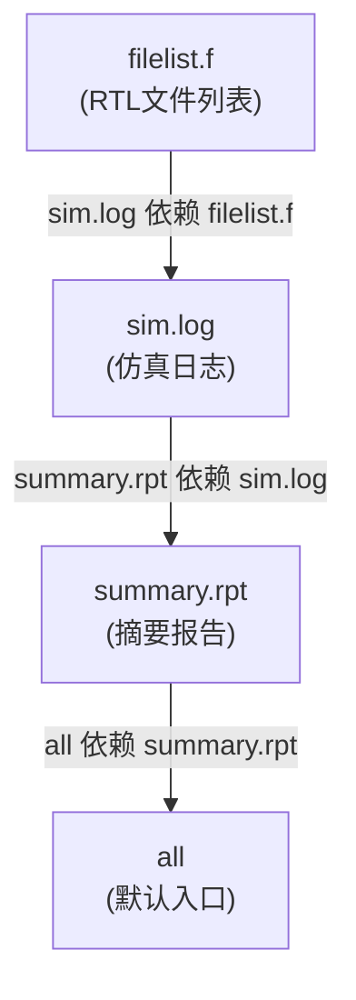
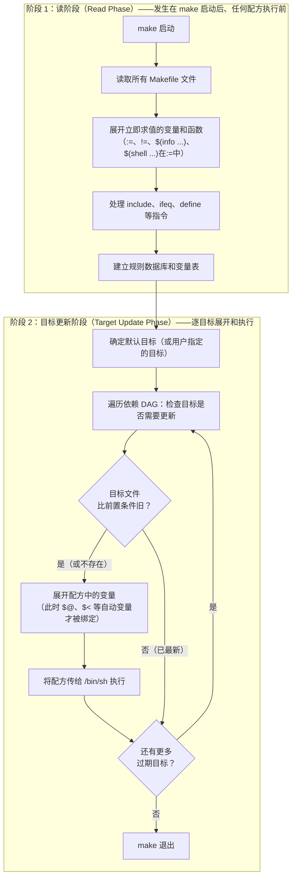
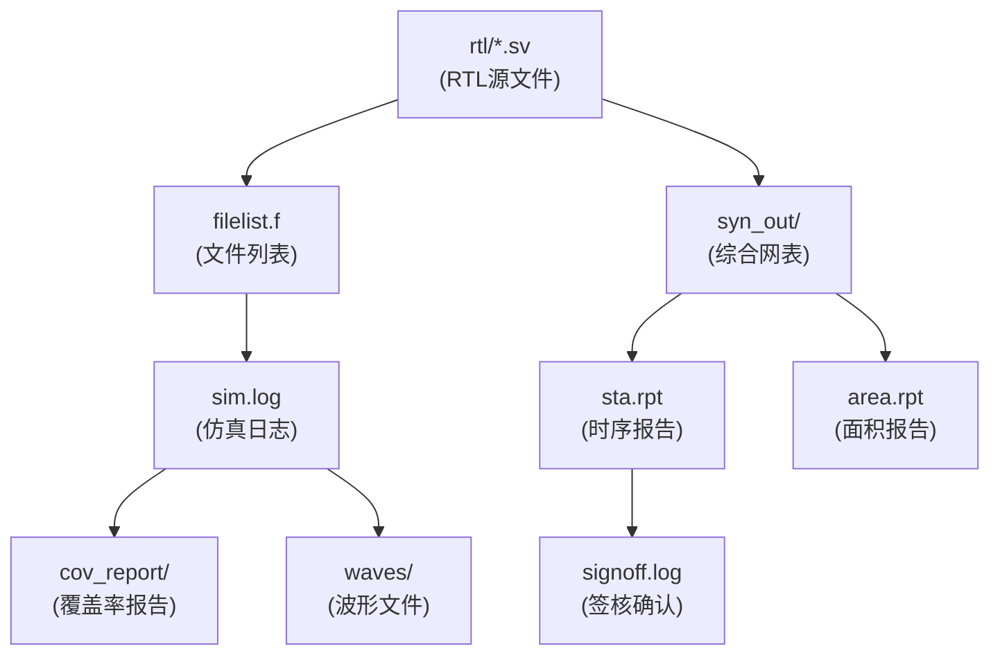

# 02 — Makefile心智模型与历史

## 学习目标

本篇建立两个贯穿本系列所有篇章的底层心智模型：

1. **依赖图模型（DAG）**：Make 把目标和前置条件组织成一棵有向无环图，从用户请求的目标开始递归遍历
2. **二阶段执行模型（Two-Phase Execution）**：Make 先"读"整个 Makefile 建立数据库（读阶段），再"执行"必要的配方（目标更新阶段）

读完本篇后，你将能解释：(1) 为什么 Make 不是"从上到下顺序执行"的脚本 (2) 为什么 `$(info ...)` 即使在 `make -n` 下也会输出 (3) 变量在定义时展开和在引用时展开的根本差异是什么 (4) Make 在历史上为什么被设计成这样、以及在现代工具链中它仍然占据什么位置。

**这两个模型是理解 Makefile 所有"反直觉"行为的元理论。** 后续每篇中的变量展开时机、条件判断行为、`include` 的触发机制、`$(eval ...)` 的执行阶段——最终都可以回溯到本篇的两个模型。

## 前置知识

- 已阅读 [[tools/concepts/01-Makefile解决的问题与第一个例子|Makefile解决的问题与第一个例子]]：理解目标、前置条件、配方的基本语法和时间戳增量构建
- **不需要**事先理解变量展开、函数调用、条件判断——那些是后续篇章用本篇的模型来解释的

后续衔接：[[tools/concepts/03-Makefile规则详解|Makefile规则详解]]、[[tools/concepts/05-Makefile变量赋值与展开|Makefile变量赋值与展开]]。

## 最小可运行例子

### 例子 1：观察二阶段执行——`make -n` 也打印的诊断信息

```makefile
# 例子 1：二阶段执行的直观演示
# $(info ...) 是 Make 函数——它在读阶段（Read Phase）立即展开并输出
$(info === [READ PHASE] Make 正在读取 Makefile ===)
$(info === [READ PHASE] 时间: $(shell date +%H:%M:%S) ===)

# 默认目标：最终构建 summary.rpt
all: summary.rpt

# summary.rpt 依赖 sim.log——这是 DAG 中的一条边
summary.rpt: sim.log
	@printf '=== [TARGET UPDATE] 生成 %s，依赖 %s ===\n' "$@" "$<" > "$@"
#       $@ = summary.rpt（目标名），$< = sim.log（第一个前置条件）

# sim.log 依赖 filelist.f——另一条 DAG 边
sim.log: filelist.f
	@printf '=== [TARGET UPDATE] 仿真工具读取 %s，写入 %s ===\n' "$<" "$@" > "$@"

# filelist.f 没有前置条件——只在文件缺失时创建
filelist.f:
	@printf 'rtl/top.sv\nrtl/alu.sv\nrtl/ctrl.sv\n' > "$@"   # 模拟 RTL 文件列表

.PHONY: clean
clean:
	@rm -f filelist.f sim.log summary.rpt
```

执行（从空目录开始）：

```shell
make clean                          # 确保干净状态
make -n                             # dry-run——但注意：READ PHASE 消息仍然出现！
# 输出：
# === [READ PHASE] Make 正在读取 Makefile ===
# === [READ PHASE] 时间: 14:32:05 ===
# printf 'rtl/top.sv\n...' > "filelist.f"
# printf '=== [TARGET UPDATE] 仿真工具读取 filelist.f ...' > "sim.log"
# printf '=== [TARGET UPDATE] 生成 summary.rpt ...' > "summary.rpt"
#                                        ^^^^^^^^^^^^^^^^^
#                                        配方行被打印但没有执行——make -n 跳过配方执行

make --trace                        # 实际执行，观察触发原因
# 输出含：target 'filelist.f' does not exist（文件不存在而创建）
#         target 'sim.log' does not exist
#         target 'summary.rpt' does not exist
```

**关键洞察：** `make -n` 只跳过配方执行，不跳过 Makefile 读取。`$(info ...)` 和 `$(shell ...)` 在读阶段就执行了，无论你是否加了 `-n`。这是理解 Makefile 行为的最重要基线——**"读 Makefile"和"执行配方"是两个独立阶段。**

### 例子 2：用 `make -p` 窥探 Make 的大脑

不创建任何新文件，直接在当前 Makefile 目录运行：

```shell
# 打印 Make 的完整内部数据库（规则、变量、隐含规则等）
make -p | head -50
```

```text
# 输出的前几行（有删节）：
# GNU Make 4.3
# 为 x86_64-pc-linux-gnu 构建
# ...
# 变量 %SHELL = /bin/sh
# 变量 %MAKECMDGOALS = （空字符串）
# ...
# 这就是 Make 在"读阶段"建立的内部数据库——所有变量在所有规则都在这里
```

`make -p` 是理解"Make 看到了什么"的最直接方式——它打印 Make 读阶段结束后建立的完整内部状态。

## 语法拆解

### 模型 1：依赖图 = 有向无环图（DAG）

Make 在执行时，将 Makefile 中的所有规则转化为一张**有向无环图**（Directed Acyclic Graph, DAG）：



图中的**节点**是目标（Target），**有向边**表示"目标依赖前置条件"。Make 从用户请求的目标（或默认目标）出发，执行**深度优先的后序遍历**（post-order traversal）：先确保所有前置条件是最新的，再判断目标本身是否需要重建。

**为什么必须是"无环"的？** 如果有环（A 依赖 B，B 依赖 A），Make 遍历时会陷入无限递归。Make 会检测并报告循环依赖：

```makefile
# 循环依赖示例——不要在生产代码中这样做
A: B                # A 依赖 B
	@echo "build A"
B: A                # B 又依赖 A——形成环
	@echo "build B"
```

```shell
make A
# make: Circular A <- B dependency dropped.
# make: Circular B <- A dependency dropped.
# Make 检测到环并丢弃了一条边——但结果不可预测，不要依赖此行为
```

**DAG 模型的两个推论：**

1. **执行顺序不由文件中的书写顺序决定**——由依赖图的拓扑排序决定。如果 `main.o` 和 `utils.o` 之间没有依赖边，它们可能以任意顺序构建（在 `-j` 下甚至并行）
2. **不相关的目标被完全忽略**——如果用户只请求 `make sim.log`，Make 不会触及 `summary.rpt` 的配方，即使它在文件中写在 `sim.log` 附近

### 模型 2：二阶段执行（Two-Phase Execution）

Make 的每次运行分为两个严格分离的阶段。



**两个阶段的关键区别：**

| 维度 | 读阶段 | 目标更新阶段 |
|:---|:---|:---|
| **发生时机** | make 一启动就执行 | 读阶段完全结束后才开始 |
| **做什么** | 解析语法，展开立即变量，建立数据库 | 遍历 DAG，展开配方，执行 Shell |
| **Make 函数** | `$(info ...)`、`$(shell ...)`（在 `:=` 中）、`$(eval ...)` | 配方中的 `$(shell ...)`（由 `=` 递归变量触发） |
| **自动变量** | **全部为空**——此时还没有"当前目标" | `$@`、`$<`、`$^` 等绑定到当前目标 |
| **`make -n` 的影响** | 无影响——读阶段照常执行 | 配方不被执行，但展开照常 |

**二阶段模型的经典应用：**

```makefile
# 场景 1：理解为什么 $(shell ...) 的赋值方式影响性能
BAD  = $(shell find / -name "*.c")     # 用 =（递归变量）——每次引用都重新执行 find！
GOOD := $(shell find . -name "*.c")     # 用 :=（简单变量）——读阶段执行一次，结果缓存

# 场景 2：理解为什么条件判断不能基于配方执行结果
all:
	@gcc -c main.c -o main.o
ifeq ($(wildcard main.o),)               # 这在读阶段执行——此时 main.o 还不存在！
$(error main.o was not built)            # 读阶段就触发错误了
endif
# 正确做法：用 Shell 的 if 检查配方执行结果
```

**二阶段模型是 Makefile 中一切"反直觉"行为的根源。** 后续每篇中的变量展开时机、条件判断限制、`include` 和 remake 的交互——都可以追溯到这两个阶段的边界。

### Make 的历史与方言

**贝尔实验室起源（1976）：** Stuart Feldman 在贝尔实验室开发了第一个 Make。核心思想：用文件时间戳驱动增量构建。Make 的名字来源于它的功能——"make（制造）"目标文件。

**GNU Make 的统治地位：** Roland McGrath 和 Richard Stallman 开发的 GNU Make 引入了变量展开风格（`=` vs `:=`）、函数库、模式规则、条件语法等关键扩展，成为 Linux 生态的标准。

**Make 方言对比表：**

| 特性 | GNU Make（本讲义默认） | BSD Make（FreeBSD/macOS） | NMAKE（Microsoft） | POSIX Make |
|:---|:---|:---|:---|:---|
| `:=` 简单展开 | ✅ | ✅（`!=` 语义不同） | ❌ | ❌ |
| `?=` 条件赋值 | ✅ | ✅ | ❌ | ❌ |
| `$(shell ...)` | ✅ | ✅（`!=` 也是） | ❌（用 `!COMMAND`） | ❌ |
| 模式规则 `%.o: %.c` | ✅ | ✅ | ✅ | ✅ |
| `VPATH`/`vpath` | ✅ | ✅ | ❌ | 仅 `VPATH` |
| `.PHONY` | ✅ | ✅ | ✅ | ✅ |
| `.ONESHELL` | ✅（4.0+） | ❌ | ❌ | ❌ |
| Grouped Targets `&:` | ✅（4.3+） | ❌ | ❌ | ❌ |
| `$(eval ...)` | ✅ | ❌ | ❌ | ❌ |

**本书环境约定：** 所有示例默认基于 GNU Make 4.3。GNU Make 4.4+ 专有特性（如 `--shuffle`、`$(let ...)`、`$(intcmp ...)`）会明确标注。BSD/POSIX/NMAKE 差异在进阶篇中标注。

### Make 在现代构建工具生态中的定位

```
声明性（Describe WHAT）                       命令式（Describe HOW）
    │                                                 │
    Bazel ─── Buck2 ─── CMake ─── Meson ─── Make ─── Ninja ─── Shell脚本
    │                    │                           │
  Google内部      Kitware推动        C/C++生态       轻量、通用、零依赖
  分布式构建      跨平台构建        配置+构建分离     "命令行能跑就能编排"
```

**Make 为什么不会消失：**

1. **零依赖门槛**：几乎每个 Unix-like 系统自带 `make`——不需要安装任何包管理器或运行时
2. **Shell 就是配置语言**：如果你会写 Shell 命令，你已经知道怎么写 Makefile 的配方。CMake 的 `CMakeLists.txt` 完全是另一种 DSL
3. **EDA 工具的天然接口**：VCS、Questa、DC 等 EDA 工具本身就是命令行程序——用 Make 包装它们的成本几乎为零
4. **CI/CD 通用语言**：GitHub Actions、GitLab CI、Jenkins——它们的工作流本质就是 DAG 编排，Makefile 是表达这种编排的最轻量方式

## 执行轨迹

以下是 `make --trace` 在例 1 上的完整输出和逐行注解：

```text
# === 读阶段输出（make -n 也会显示的这部分） ===
=== [READ PHASE] Make 正在读取 Makefile ===
=== [READ PHASE] 时间: 14:32:05 ===
# 这两行来自 $(info ...) 函数——读阶段立即展开，与目标无关

# === 目标更新阶段开始 ===
# Make 已建立数据库，现在从默认目标 all 开始遍历 DAG

# 步骤 1：Make 检查 all → 需要先检查 summary.rpt
# 步骤 2：Make 检查 summary.rpt → 需要先检查 sim.log
# 步骤 3：Make 检查 sim.log → 需要先检查 filelist.f
# 步骤 4：Make 检查 filelist.f

Makefile:19: target 'filelist.f' does not exist
#                  ^^^^^^^^^^^^^^^^  文件不存在 → 必须执行配方

Makefile:19: update target 'sim.log' due to: filelist.f
#                  filelist.f（刚生成）比 sim.log（不存在）新 → 执行配方

Makefile:15: update target 'summary.rpt' due to: sim.log
#                  sim.log 比 summary.rpt 新 → 执行配方
```

**遍历顺序：** Make 先检查最深的叶子节点（`filelist.f`），然后逐层返回。这是深度优先的**后序遍历**——"先构建前置条件，再构建目标"。

## 工程化写法

### 将 IC 流程映射到 DAG 模型

数字IC 设计流程本质上是文件到文件的变换链：



DAG 骨架 Makefile：

```makefile
# ===== IC 流程 DAG 的 Makefile 骨架 =====
signoff.log: sta.rpt area.rpt cov_report/total.rpt   # 签核依赖时序/面积/覆盖率
	@printf 'signoff complete at %s\n' "$$(date)" > "$@"

sta.rpt: syn_out/netlist.v syn_out/constraints.sdc   # STA 依赖网表和约束
	@printf 'run STA on %s\n' "$<" > "$@"

area.rpt: syn_out/netlist.v                           # 面积报告只依赖网表
	@printf 'area report for %s\n' "$<" > "$@"

syn_out/netlist.v syn_out/constraints.sdc: rtl/top.sv rtl/alu.sv constraints.syn
	@mkdir -p syn_out
	@printf 'run synthesis with %s\n' "$^" > "$@"

cov_report/total.rpt: sim.log rtl/*.sv                # 覆盖率依赖日志和 RTL
	@mkdir -p cov_report
	@printf 'coverage merge and report\n' > "$@"

sim.log: filelist.f rtl/*.sv                          # 任何 RTL 更新触发重新仿真
	@printf 'run simulation with filelist %s\n' "$<" > "$@"

waves/top.vcd: filelist.f rtl/*.sv                    # 波形可和仿真日志并行（无依赖边）
	@mkdir -p waves
	@printf 'dump vcd for %s\n' "$<" > "$@"

.PHONY: clean
clean:
	rm -rf sim.log waves/ cov_report/ syn_out/ sta.rpt area.rpt signoff.log
```

**核心特性：(1) 增量重跑**——只修改 `rtl/alu.sv` 时，所有依赖链上的节点自动按序重建，不相关的 `waves/top.vcd` 不触发重建。**(2) 并行构建**——`cov_report/total.rpt` 和 `waves/top.vcd` 之间没有依赖边，在 `make -j` 下并行生成。

## 常见错误

### 错误 1：混淆读阶段和配方阶段

**现象：** `$(info ...)` 在 `make -n` 下也输出，而 `@echo` 不输出。

**根因：** `$(info ...)` 是 Make 函数（读阶段执行），`@echo` 是 Shell 命令（目标更新阶段执行）。

**修复：** 如果在目标更新阶段输出诊断，用配方中的 `@echo` 替代 `$(info ...)`。

### 错误 2：在条件判断中依赖配方执行结果

**现象：**
```makefile
all: output.txt
output.txt: input.txt
	@cp input.txt output.txt
ifeq ($(wildcard output.txt),)       # 读阶段检查——output.txt 还不存在！
$(error output.txt was not created)  # 读阶段就报错
endif
```

**修复：** 用 Shell 的 `if` 替代 Make 的 `ifeq`：
```makefile
output.txt: input.txt
	@cp input.txt output.txt || { echo "copy failed"; exit 1; }
```

### 错误 3：DAG 中的隐式循环

**现象：** `make: Circular A <- B dependency dropped.`

**根因：** 两条规则形成环——A 依赖 B，B 依赖 A。在大型项目中，自动依赖生成（`-MMD`）有时会引入意外的循环。

**修复：** 检查 `.d` 文件内容，考虑引入中间目标打破循环。

## 关键要点

1. **Makefile 的依赖关系是 DAG——不是顺序脚本。** Make 按依赖图的拓扑排序执行，不按文件中书写的顺序。
2. **Make 分两个阶段运行：读阶段和目标更新阶段。** 一切"反直觉"行为都可以追溯到这两个阶段的边界。
3. **读阶段函数（`$(info ...)`、`:=` 中的 `$(shell ...)`、条件判断）在 `make -n` 下也执行。**
4. **自动变量（`$@`、`$<` 等）只在目标更新阶段的配方中有效。**
5. **GNU Make 是本系列的默认方言。** BSD Make、NMAKE、POSIX Make 的差异在进阶篇中标注。
6. **IC 流程天然适合 Make 的 DAG 模型。** RTL → 仿真 → 覆盖率 → 签核，每一步都是文件变换，符合声明式依赖描述。
7. **`make -p` 是理解 Make 内部状态的最直接窗口。**

## 与其他概念的关系

- [[tools/concepts/01-Makefile解决的问题与第一个例子|Makefile解决的问题与第一个例子]]：本篇的心智模型是对上一篇直观体验的理论化
- [[tools/concepts/05-Makefile变量赋值与展开|Makefile变量赋值与展开]]：二阶段模型直接解释了 `=` 和 `:=` 的区别
- [[tools/concepts/10-Makefile条件判断|Makefile条件判断]]：条件判断在读阶段求值——不能用它检测配方执行结果
- [[tools/concepts/19-Makefile调试与性能|Makefile调试与性能]]：`--debug` 让你直接"看到"二阶段执行的每一步
- [[tools/工具与脚本|工具与脚本 MOC]]：本系列所在的工具领域内容地图

## 小练习

1. **验证 DAG 遍历顺序：** 在例 1 中新增 `extra.log` 目标，让 `all` 也依赖它。比较构建顺序和书写顺序的差异。
2. **重现读阶段陷阱：** 在例 1 的 Makefile 顶部添加 `$(shell echo "shell ran at read phase" >&2)`，运行 `make -n`。这行输出为什么会出现？
3. **制造并解决循环依赖：** 创建 A→B→A 的循环依赖，观察 Make 的警告，然后通过中间文件打破循环。
4. **用 `make -p` 探索隐含规则：** 空目录创建只含 `all:` 的 Makefile，运行 `make -p | grep -A5 '^%\.o'`。观察 GNU Make 自带的模式规则有多少。

> 完成以上练习后，你应该能够在头脑中同时运行 Makefile 的两个阶段——"先想读阶段建立了什么数据库，再想目标更新阶段会遍历哪些节点"。
