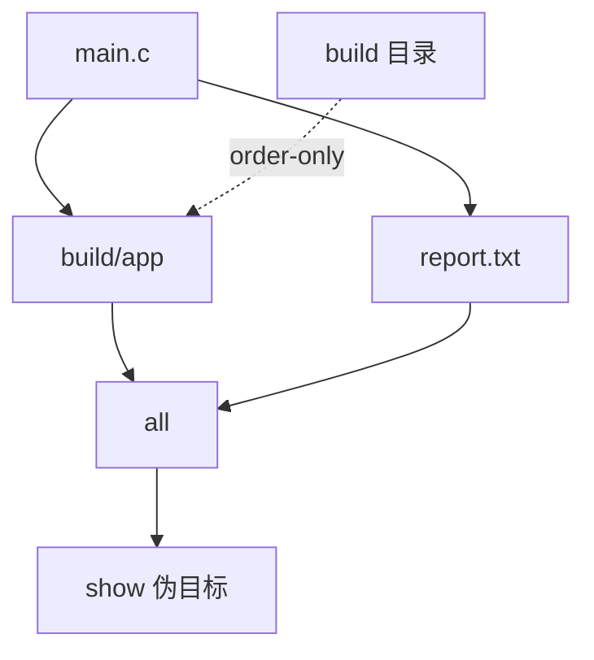

# Makefile规则详解

## 学习目标

本篇系统拆解 Makefile 规则。读完后，读者应该能准确区分目标、前置条件和配方，能解释默认目标如何选择，能识别真实文件目标和伪目标的差异，并能处理目标名与文件名冲突的问题。

规则是 Makefile 的最小工程单元。变量、函数、条件、模式规则和自动依赖最终都服务于规则：让 Make 知道“为了得到某个目标，需要哪些输入，以及输入变化后应该执行什么命令”。

## 前置知识

- 建议先读 [[tools/concepts/Makefile心智模型与历史|Makefile 心智模型与历史]]。
- 已经知道 Make 会根据目标和依赖的时间戳决定是否执行配方。
- 下一篇 [[tools/concepts/Makefile配方与Shell|Makefile 配方与 Shell]] 会专门讲配方执行细节。

## 最小可运行例子

这个例子展示四类规则：默认目标、普通文件目标、多目标规则、伪目标。

```makefile
# 默认目标：第一个普通目标是用户输入 make 时的入口
all: build/app report.txt             # all 依赖两个产物，二者都完成后 all 才满足

# 普通文件目标：build/app 由 main.c 生成
build/app: main.c | build              # 竖线右侧 build 是 order-only 依赖，先记住这个形状
	@printf 'compile %s -> %s\n' "$<" "$@" > "$@" # 用文本模拟编译输出

# 目录目标：目录本身只负责存在，不代表业务输入变化
build:                                # build 目录不存在时执行
	@mkdir -p "$@"                      # 创建目录，$@ 展开为 build

# 普通文件目标：报告依赖同一个源文件
report.txt: main.c                     # main.c 更新后，报告也需要重建
	@printf 'report for %s\n' "$<" > "$@" # 写入报告内容

# 输入文件目标：没有 main.c 时创建一个最小输入
main.c:                                # 真实项目中 main.c 通常由工程师手写
	@printf 'int main(void) { return 0; }\n' > "$@" # 创建示例 C 文件

# 多目标规则：stamp.a 和 stamp.b 由同一条配方生成
stamp.a stamp.b: main.c                # 两个目标共享同一个前置条件
	@printf 'stamp from %s\n' "$<" > stamp.a # 写入第一个 stamp 文件
	@cp stamp.a stamp.b                  # 复制得到第二个 stamp 文件

# 伪目标声明：这些名字表示动作，不表示真实文件
.PHONY: clean show                     # clean 和 show 永远执行配方
show: all                              # show 依赖 all，先确保产物存在
	@printf 'targets are ready\n'         # 打印一个观察信息

# 清理规则：删除所有示例产物
clean:                                 # 清理动作不生成 clean 文件
	@rm -rf build report.txt main.c stamp.a stamp.b # 删除构建产物和输入
```

执行命令：

```shell
# 删除历史产物，保证实验从空目录开始
make clean
# 预演默认目标会触发哪些配方
make -n
# 执行默认目标并显示触发原因
make --trace
# 手动请求 show 伪目标，观察它每次都会执行
make --trace show
# 创建同名 clean 文件，验证 .PHONY 可以避免冲突
printf 'not a target\n' > clean && make --trace clean
```

## 语法拆解

- `all: build/app report.txt` 中，`all` 是目标，`build/app report.txt` 是前置条件列表。
- `build/app: main.c | build` 中，`main.c` 是普通前置条件，`build` 是 order-only 前置条件；本篇先关注规则形状。
- 配方只能属于紧邻的上一条规则；空行不会自动延续上一条规则。
- 多目标规则 `stamp.a stamp.b: main.c` 表示一条规则有多个目标。
- `.PHONY: clean show` 是特殊目标，用来声明后面的名字不是文件产物。
- `show: all` 是伪目标依赖真实构建入口的常见写法。
- 第一个普通目标是默认目标，所以辅助目标通常放在 `all` 后面。

## 执行轨迹



Make 从用户请求的目标开始向下找依赖。只输入 `make` 时，请求的是 `all`；输入 `make show` 时，请求的是 `show`。`show` 是伪目标，所以即使没有文件变化，它的配方也会执行。

目标名和文件名共享同一个命名空间。若没有 `.PHONY`，目录中出现一个名为 `clean` 的文件时，Make 可能认为 `clean` 已经是最新目标，于是跳过清理配方。

## 工程化写法

大型项目通常把入口目标设计成少量稳定命令：`all`、`test`、`clean`、`install`、`package`、`help`。真实文件目标则放在内部，例如对象文件、日志、报告和数据库。这样用户接口稳定，内部依赖仍然精确。

数字IC Makefile 中常见模式是：`sim` 是伪目标，依赖一个真实日志文件 `logs/smoke.log`；`cov` 是伪目标，依赖真实覆盖率报告 `cov/index.html`。这样既有易用入口，也保留增量构建能力。

## 常见错误

| 错误现象 | 根因 | 修复 |
|:---|:---|:---|
| 用户输入 `make` 运行了错误目标 | 文件顶部第一个普通目标不是预期入口 | 把 `all` 或 `help` 放在第一个普通目标位置 |
| `make clean` 被跳过 | `clean` 没有声明为 `.PHONY` 且存在同名文件 | 添加 `.PHONY: clean` |
| 一个配方误以为属于多个规则 | 配方只绑定到最近的上一条规则 | 明确分开规则，避免悬空 TAB 行 |

## 关键要点

- 规则由目标、前置条件、配方三部分构成。
- 默认目标由 Makefile 中第一个普通目标决定。
- 真实文件目标适合表达可缓存产物。
- 伪目标适合表达动作入口。
- 目标名可能与真实文件冲突，`.PHONY` 是常见修复手段。
- 多目标规则要谨慎使用，后续 grouped targets 会进一步区分语义。

## 与其他概念的关系

- [[tools/concepts/Makefile心智模型与历史|Makefile 心智模型与历史]]：解释规则如何组成 DAG。
- [[tools/concepts/Makefile配方与Shell|Makefile 配方与 Shell]]：解释规则下方配方如何执行。
- [[tools/concepts/Makefile高级依赖|Makefile 高级依赖]]：深入讲 order-only 前置条件。

## 小练习

1. 把 `show` 移到文件第一条规则，观察直接运行 `make` 的变化。
2. 删除 `.PHONY: show`，创建一个名为 `show` 的文件，再运行 `make show`。
3. 修改 `main.c` 后运行 `make --trace`，说明 `build/app` 和 `report.txt` 为什么都会重建。
