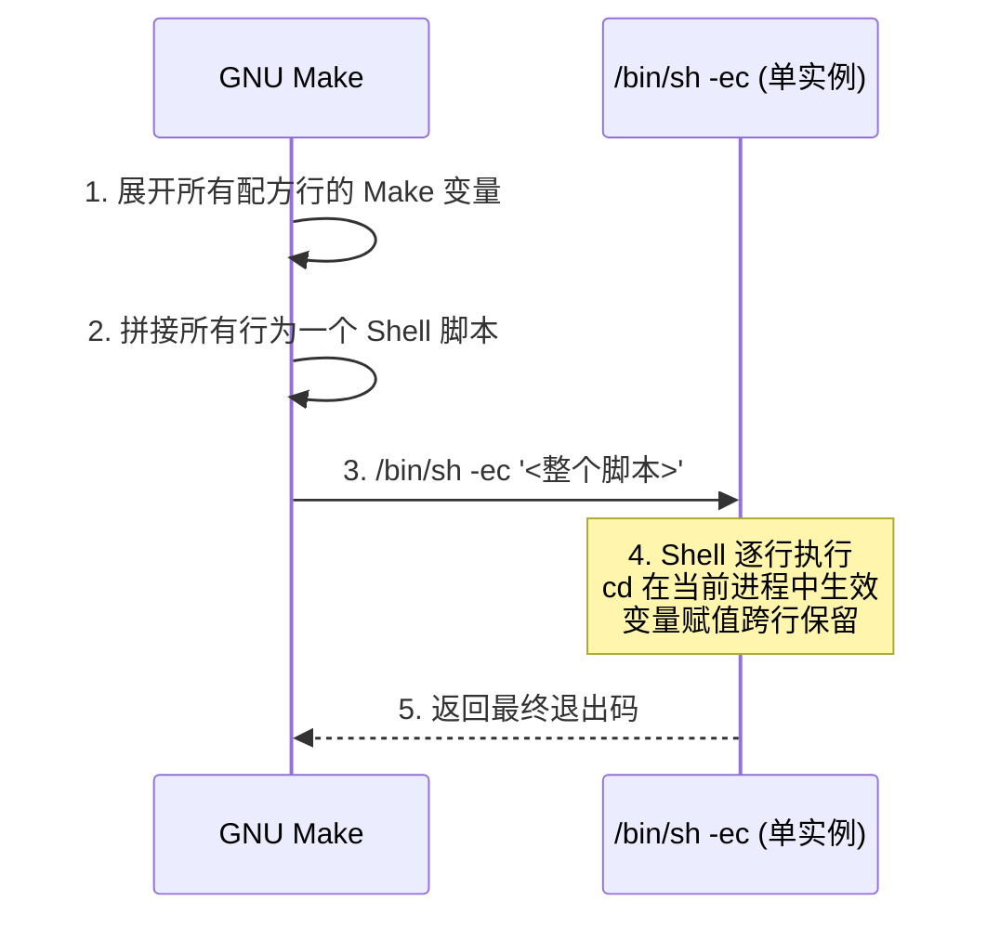

# 04 — Makefile配方与Shell

## 学习目标

本篇讲清 Makefile 中最容易混淆的一层：**配方（Recipe）由 Make 触发，但内容由 Shell 执行。** 读完本篇后，你将能：

1. 掌握 TAB、`.RECIPEPREFIX`、`@`/`-`/`+` 前缀的完整语义和组合规则
2. 理解"每行配方独立 Shell"的默认行为——为什么 `cd dir` 后下一行还在原目录
3. 正确使用 `.ONESHELL`、`SHELL`、`.SHELLFLAGS` 控制配方执行环境
4. 掌握配方中的错误处理策略：`-` 前缀、`.DELETE_ON_ERROR`、`-k` 选项
5. 准确处理 `$$` 转义——Make 变量展开与 Shell 变量展开的分层模型

**核心心智模型：Make 先展开配方行中的 Make 变量和函数（将 `$$` → `$`、`$@` → target name），然后把展开后的字符串交给 `/bin/sh -c` 执行。** Make 和 Shell 是两层，不是一层。

## 前置知识

- [[tools/concepts/03-Makefile规则详解|Makefile规则详解]]：配方必须挂在规则之下
- [[tools/concepts/02-Makefile心智模型与历史|Makefile心智模型与历史]]：配方在目标更新阶段执行，读阶段函数不在此列

后续：[[tools/concepts/05-Makefile变量赋值与展开|Makefile变量赋值与展开]]。

## 最小可运行例子

### 例子 1：配方前缀和 Shell 行为的完整演示

```makefile
# ===== 例子 1：@ / - / $$ 四者行为实验 =====
SHELL := /bin/sh                     # 指定配方使用的 Shell（默认值）
.SHELLFLAGS := -c                    # -c = 执行后面的命令字符串

all: demo.out

demo.out: input.txt
# @ 前缀：不回显配方行本身——只执行，不打印
	@printf '--- demo.out recipe start ---\n'
# 不加 @：Make 会先打印这行再交给 Shell
	printf 'target name = %s\n' "$@" > "$@"
#                             ^^  $@ → Make 展开为 demo.out
# - 前缀：忽略该行的非零退出码，继续执行后续配方行
	-false                            # false 始终返回退出码 1——但 - 前缀让 Make 继续
	@printf 'still running after false\n' >> "$@"
# $$ 转义：$$ → $ → Shell 看到命令替换
	@printf 'shell pid=%s\n' "$$$$" >> "$@"      # $$$$ → Make: $$ → Shell: $$ = PID
	@printf 'pwd=%s\n' "$$(pwd)" >> "$@"         # $$(pwd) → Make: $(pwd) → Shell 执行命令替换

input.txt:
	@printf 'input data\n' > "$@"

# === cd 陷阱演示 ===
.PHONY: bad-cd good-cd
bad-cd:                               # 每行独立 Shell——cd 不跨行生效
	@mkdir -p work
	@cd work                          # 只对这个 Shell 进程生效
	@pwd                               # 新 Shell——已回到原目录！

good-cd:                              # 同一行 = 同一 Shell = cd 生效
	@mkdir -p work
	@cd work && pwd                   # && 确保 cd 成功才执行 pwd

# === 行延续演示 ===
.PHONY: long-line
long-line:
	@printf 'this is a long command' \
		' that spans multiple lines' \
		' but is one shell invocation\n'
#       ^ 续行符 \ 必须是该行的最后一个字符——后面不能有空格！

.PHONY: clean
clean:
	@rm -rf demo.out input.txt work
```

执行：

```shell
make clean && make --trace           # 正常流程
make bad-cd                          # 观察 cd 为什么"不生效"
make good-cd                         # 观察正确写法
```

### 例子 2：`.ONESHELL` 改变配方执行模型

```makefile
.ONESHELL:                            # 本文件中所有规则的配方在同一个 Shell 中执行
.SHELLFLAGS := -ec                    # -e = 任何命令失败立即退出，-c = 执行命令字符串

all: oneshell-demo.out

oneshell-demo.out:
	@cd /tmp                          # 第一行：cd 到 /tmp
	@pwd > "$@"                       # 第二行：pwd 的结果是 /tmp！
# 没有 .ONESHELL：两行在不同 Shell → pwd 输出原目录
# 有 .ONESHELL：两行在同一 Shell → cd 效果保留

.PHONY: clean
clean:
	@rm -f oneshell-demo.out
```

```shell
make clean && make                    # 观察输出：pwd 结果是 /tmp
```

**`.ONESHELL` 的代价：** 中间行失败默认不停止——必须配合 `.SHELLFLAGS := -ec` 使用。

## 语法拆解

### 配方前缀 `@`、`-`、`+` 的完整语义

| 前缀 | 名称 | 作用 | `make -n` 下 | `make -t` 下 | `make -q` 下 |
|:---|:---|:---|:---|:---|:---|
| (无) | 普通 | 打印配方行 + 执行 | 只打印不执行 | 不执行 | 不执行 |
| `@` | 静默 | 执行但不打印配方行 | 不执行不打印 | 不执行 | 不执行 |
| `-` | 忽略错误 | 忽略非零退出码，继续执行 | 不执行 | 不执行 | 不执行 |
| `+` | 强制执行 | **始终执行** | **执行** | **执行** | **执行** |
| `@-` / `-@` | 组合 | 静默 + 忽略错误 | — | — | — |

**前缀必须出现在 TAB 和命令之间：**

```makefile
target:
	@echo "quiet"                     # TAB + @ + 命令
	-rm -f *.tmp                      # TAB + - + 命令
	+$(MAKE) -C subdir                # TAB + + + 命令（递归 Make 必需）
	@-rm -f *.log                     # TAB + @- + 命令（组合）
```

### `$$` 转义的完整规则

```
Makefile 中的文本  →  Make 展开后  →  Shell 看到的
─────────────────     ────────────     ──────────────
$$                   $                 $ (字面美元符)
$$(VAR)              $(VAR)            $(VAR) — Shell 命令替换
$$$$                 $$                $$ — Shell 当前进程 PID
$$@                  $@                $@ — Shell 位置参数（通常为空）
$@                   target_name       字面文件名——已由 Make 展开完毕
```

**黄金法则：想让 Shell 看到 `$X` → 在 Makefile 中写 `$$X`。**

### Shell 环境控制变量

```makefile
SHELL := /bin/bash                    # 使用 bash 替代默认 /bin/sh
.SHELLFLAGS := -c                     # 默认：-c 执行命令字符串
.SHELLFLAGS := -ec                    # -e=errexit（命令失败立即退出）
.SHELLFLAGS := -ex -o pipefail -c     # -x=打印每行, pipefail=管道失败检测
```

### 错误处理四层机制

| 机制 | 作用域 | 行为 | 适用场景 |
|:---|:---|:---|:---|
| `-` 前缀 | 单行配方 | 忽略该行失败，继续执行 | `rm -f`、非关键的清理操作 |
| `.IGNORE` | 特殊目标 | 忽略**所有**配方的所有错误 | 几乎从不使用——太危险 |
| `.DELETE_ON_ERROR` | 特殊目标 | 目标构建失败时自动删除目标文件 | **推荐在所有 Makefile 中使用** |
| `-k` 选项 | 命令行 | 一个目标失败时继续构建其他独立目标 | `make -j8 -k`——发现所有错误 |

## 执行轨迹

### 默认模式：每行独立 Shell

```mermaid
%%{init: {'theme': 'default'}}%%
sequenceDiagram
    participant M as GNU Make
    participant S1 as /bin/sh (line 1)
    participant S2 as /bin/sh (line 2)

    M->>M: 1. 展开 Make 变量：$@→demo.out, $$→$, $$(pwd)→$(pwd)
    M->>S1: 2. /bin/sh -c 'printf "target=demo.out" > demo.out'
    S1-->>M: 3. 返回退出码 0
    M->>M: 4. 展开第二行配方
    M->>S2: 5. /bin/sh -c 'printf "pwd=$(pwd)" >> demo.out'
    S2-->>M: 6. 返回退出码 0
    Note over M,S2: 每行配方是一个新 /bin/sh 进程<br/>cd、export、umask 不跨行保留
```

### `.ONESHELL` 模式：单 Shell 执行



## 工程化写法

### 错误处理实践

```makefile
.DELETE_ON_ERROR:                     # 推荐全局启用——构建失败时自动删除残次产物

# IC 仿真目标：失败时不应留下虚假的"通过"日志
logs/smoke.log: $(RTL) filelist.f
	vcs -f filelist.f -l $@ \
		|| { printf 'SIM FAILED\n'; exit 1; }  # || 捕获失败、报告后退出

# 清理目标：rm 失败通常无害
clean:
	-rm -f *.o *.a *.log              # - 前缀：文件不存在也不报错
	-rmdir build 2>/dev/null          # rmdir 目录非空时失败——忽略
```

### 何时用外部脚本

| 方案 | 何时用 | 示例 |
|:---|:---|:---|
| 内联配方 | 1-5 行简单命令 | `gcc -c $< -o $@` |
| 外部 `.sh` 脚本 | 复杂逻辑、多条命令 | `./scripts/run_sim.sh $< $@` |
| 外部 `.tcl` 脚本 | EDA 工具 TCL 接口 | `dc_shell -f scripts/syn.tcl` |
| 外部 `.py` 脚本 | 数据处理、报告生成 | `python3 scripts/gen_report.py` |

**原则：Makefile 负责编排，脚本负责实现。** 不要把 50 行 Shell 塞进配方。

## 常见错误

### 错误 1：`cd dir` 后下一行在原目录

**现象：** `cd build` + `pwd` 输出的是原目录。

**根因：** 每行配方在新 Shell 进程中执行——`cd` 效果不跨进程。

**修复：**
```makefile
	@cd build && command              # && 确保 cd 成功后才执行后续
	@cd build; command               # 或用 ;（不检查 cd 是否成功——不推荐）
```

### 错误 2：`$$` 转义层数混乱

```makefile
# 错误：想让 Shell 展开 $HOME
wrong:
	echo $HOME                        # Make 先展开 $H → 空，$OME → 空 → echo 输出空行

# 正确：
correct:
	echo $$HOME                       # Make: $$→$ → Shell: 看到 $HOME
```

### 错误 3：`.ONESHELL` 中间命令失败被吞

**现象：** `.ONESHELL` 下 `false` 后的 `echo` 仍然执行。

**修复：**
```makefile
.ONESHELL:
.SHELLFLAGS := -ec                    # -e = errexit：任何命令失败立即退出
```

### 错误 4：`@` 前缀在调试时隐藏问题

**修复：** 调试时用 `make -n` 或设置 `V=1` 变量控制回显——详见 [[tools/concepts/19-Makefile调试与性能|Makefile调试与性能]]。

## 关键要点

1. **配方由 Shell 执行，不是 Make。** Make 先展开 Make 变量，再把字符串交给 Shell。
2. **TAB 不是风格选择，是语法规则。** 空格≠TAB。用 `cat -A` 诊断。
3. **默认每行配方在新 Shell 中执行。** `cd`、`export` 不跨行。
4. **`$$` 是 Makefile 中最重要转义：想让 Shell 看到 `$X` → 写 `$$X`。**
5. **`+` 前缀最特殊：`make -n` 下也执行配方行。** 递归 Make 必须用 `$(MAKE)` + `+`。
6. **`.ONESHELL` 改变配方执行模型——须配合 `-e` 使用。**
7. **`.DELETE_ON_ERROR` 防止残次文件被误判为"已最新"。** 推荐全局启用。
8. **Makefile 负责编排，脚本负责实现。** 长逻辑提取到独立脚本文件。

## 与其他概念的关系

- [[tools/concepts/03-Makefile规则详解|Makefile规则详解]]：配方挂在规则之下
- [[tools/concepts/05-Makefile变量赋值与展开|Makefile变量赋值与展开]]：`$` 展开的二阶段时机
- [[tools/concepts/16-Makefile特殊目标手册|Makefile特殊目标手册]]：`.ONESHELL`、`.DELETE_ON_ERROR` 系统讲解
- [[tools/concepts/19-Makefile调试与性能|Makefile调试与性能]]：配方调试工具

## 小练习

1. **观察独立 Shell：** 写三行配方 `export X=1`、`echo $$X`、`echo $$X`。解释输出差异。
2. **修复 cd 陷阱：** 先写有 bug 的版本（每行独立 cd），再修复（`&&` 或 `.ONESHELL`）。
3. **验证 `.DELETE_ON_ERROR`：** 写一个必定失败的配方，分别在有/无 `.DELETE_ON_ERROR` 时运行，检查目标文件残留。
4. **探索 `-e`：** 在 `.ONESHELL` 下 `false` + `echo`，分别用 `-c` 和 `-ec` 测试。
