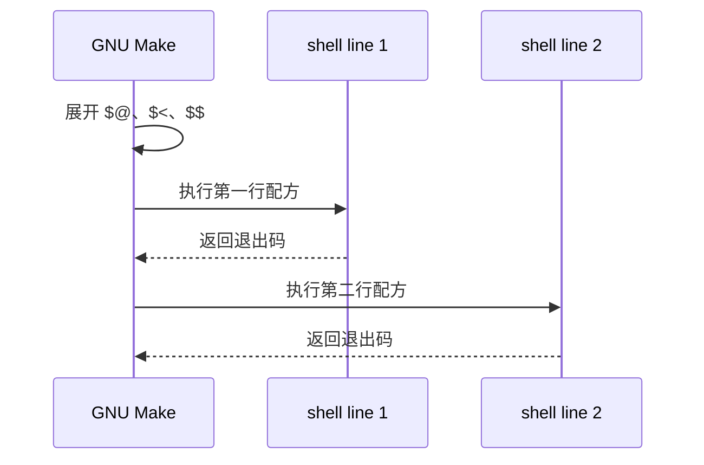

# Makefile配方与Shell

## 学习目标

本篇讲清楚 Makefile 中最容易混淆的一层：配方由 Make 触发，但配方内容由 shell 执行。读完后，读者应该能解释 TAB、`@`、`-`、`+`、`SHELL`、`$(.SHELLFLAGS)`、每行独立 shell、`.ONESHELL` 和错误处理的基本行为。

初学者常把 Makefile 当成 shell 脚本，这会导致 `cd` 不生效、变量转义错误、错误被吞掉或并行构建行为异常。正确心智模型是：Make 先展开配方行中的 Make 变量和函数，再把展开后的命令交给 shell。

## 前置知识

- 建议先读 [[tools/concepts/Makefile规则详解|Makefile 规则详解]]。
- 已经知道配方行必须放在规则下面，并以 TAB 开头。
- 下一篇 [[tools/concepts/Makefile变量赋值与展开|Makefile 变量赋值与展开]] 会解释变量展开时机。

## 最小可运行例子

下面的例子专门观察配方行为。默认目标 `all` 只执行成功路径；错误示例需要手动请求。

```makefile
# 指定配方使用的 shell；GNU Make 在 Unix 上默认通常是 /bin/sh
SHELL := /bin/sh                         # := 表示立即展开赋值，后续章节会详细解释

# 指定传给 shell 的参数；-c 表示执行后面的命令字符串
.SHELLFLAGS := -c                        # 保持默认风格，便于观察基础行为

# 默认目标：只运行安全示例，避免一开始就失败
all: recipe.out                          # all 依赖 recipe.out

# 文件目标：演示 Make 自动变量先展开，shell 再执行命令
recipe.out: input.txt                    # input.txt 更新时重建 recipe.out
	@printf 'make target is %s\n' "$@" > "$@" # @ 让 Make 不回显命令；$@ 由 Make 展开
	@printf 'first prerequisite is %s\n' "$<" >> "$@" # $< 由 Make 展开为 input.txt
	@printf 'shell pid is %s\n' "$$$$" >> "$@" # $$$$ 先变成 $$，再由 shell 展开为进程号

# 输入目标：创建一个最小输入文件
input.txt:                               # 没有前置条件，文件缺失时执行
	@printf 'recipe input\n' > "$@"       # 写入输入内容

# 陷阱示例：每一行配方默认在独立 shell 中执行
bad-cd:                                  # 手动运行 make bad-cd 观察失败
	@mkdir -p work                         # 创建目录
	@cd work                               # 这一行的 cd 只影响当前 shell 进程
	@pwd | grep '/work$$'                  # 新 shell 已回到原目录，所以 grep 通常失败

# 正确写法：把 cd 和后续命令放在同一行 shell 中
.PHONY: good-cd                          # good-cd 是动作目标
good-cd:                                 # 目标行不能以 TAB 开头，否则会被当作配方
	@mkdir -p work                         # 创建目录
	@cd work && pwd | grep '/work$$'       # cd 与 pwd 在同一个 shell 中执行

# 容错示例：- 前缀让 Make 忽略该行错误
ignore-error:                            # 手动运行 make ignore-error
	-false                                 # false 返回非零；- 前缀告诉 Make 忽略错误
	@printf 'still running\n'              # 前一行被忽略后，这一行仍会执行

# 清理目标：删除示例产物
.PHONY: clean bad-cd ignore-error        # 声明动作目标，避免同名文件冲突
clean:                                   # 清理动作
	@rm -rf recipe.out input.txt work      # 删除文件和目录
```

执行命令：

```shell
# 清理示例目录，保证从确定状态开始
make clean
# 预演默认目标，观察 Make 展开后的 shell 命令
make -n
# 执行默认目标，并显示触发原因
make --trace
# 手动运行错误示例，观察 cd 为什么不能跨配方行保留
make bad-cd
# 手动运行修复示例，观察 cd 与 pwd 在同一 shell 中成功
make good-cd
# 手动运行容错示例，观察 - 前缀如何忽略 false 的错误
make ignore-error
```

## 语法拆解

- `SHELL := /bin/sh` 控制配方使用哪个 shell，不控制 Makefile 语法本身。
- `$(.SHELLFLAGS)` 控制 shell 参数；常见默认语义是让 shell 执行一段命令字符串。
- 配方行开头的 TAB 告诉 Make 这一行属于上一条规则。
- `@` 前缀只影响命令回显，不影响命令是否执行。
- `-` 前缀只影响错误处理，让该配方行失败时 Make 继续执行。
- `+` 前缀常用于递归 Make 或 dry-run 场景，表示即使 `make -n` 也可能执行该行。
- 默认情况下，每一行配方由一个新的 shell 执行，所以单独一行 `cd work` 不会影响下一行。
- shell 变量需要写成 `$$VAR`，因为单个 `$` 会先被 Make 消费。

## 执行轨迹



`.ONESHELL` 会改变这个模型：同一条规则下的所有配方行会交给一个 shell 执行。它能让多行脚本更自然，但也会改变错误暴露方式；如果 shell flags 没有设置好，中间行失败可能不容易被 Make 捕获。

## 工程化写法

工程 Makefile 中，短命令可以保留一行一 shell；复杂脚本建议写成独立 `.sh`、`.tcl` 或 `.py` 文件，再由 Makefile 调用。这样调试边界清楚，也不会把 Make 变量展开、shell 引号、EDA 工具命令三层语法混在一起。

数字IC流程尤其要注意错误处理。仿真失败、综合失败、报告解析失败都应该让目标返回非零退出码，避免 CI 误判通过。只有在“允许失败并继续收集信息”的场景，才应使用 `-` 前缀或等价容错写法。

## 常见错误

| 错误现象 | 根因 | 修复 |
|:---|:---|:---|
| `cd dir` 后下一行仍在原目录 | 每行配方默认是独立 shell | 写成 `cd dir && command`，或谨慎使用 `.ONESHELL` |
| shell 变量为空 | 写成 `$VAR` 被 Make 先展开 | 在配方中写 `$$VAR` 交给 shell |
| 构建失败但 make 仍成功 | 误用了 `-` 前缀或命令吞掉退出码 | 保留失败退出码，只在明确容错时忽略错误 |

## 关键要点

- Make 负责决定是否执行配方，shell 负责执行配方内容。
- TAB 是 Make 语法，不是普通缩进风格。
- `@`、`-`、`+` 是 Make 的配方前缀，各自影响回显、错误和强制执行。
- 每行配方默认运行在独立 shell 中。
- shell 变量和 Make 变量都使用 `$`，因此配方中经常需要 `$$` 转义。
- IC 工程中应让失败目标返回非零退出码，便于自动化和 CI 判断。

## 与其他概念的关系

- [[tools/concepts/Makefile规则详解|Makefile 规则详解]]：配方必须挂在具体规则之下。
- [[tools/concepts/Makefile变量赋值与展开|Makefile 变量赋值与展开]]：解释 `$` 在 Make 读阶段和配方展开阶段的行为。
- [[tools/concepts/Makefile特殊目标手册|Makefile 特殊目标手册]]：后续系统讲 `.ONESHELL`、`.IGNORE`、`.DELETE_ON_ERROR`。

## 小练习

1. 把 `$$$$` 改成 `$$`，运行后解释 shell pid 输出为什么变化。
2. 删除 `ignore-error` 中 `false` 前面的 `-`，观察 Make 的退出行为。
3. 把 `good-cd` 改写成 `.ONESHELL` 风格，并说明需要额外注意什么。
