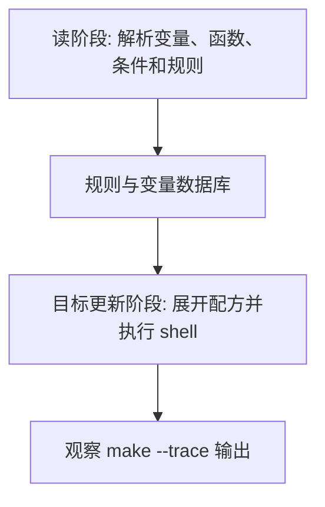

# Makefile变量赋值与展开

## 学习目标

读完后，读者应该能解释 `=`、`:=`、`?=`、`+=`、`!=` 的差异，知道递归展开变量和简单展开变量分别在什么时候求值，并能避免把昂贵的 `$(shell ...)` 放进递归变量导致重复执行。

本篇延续 [[tools/concepts/Makefile心智模型与历史|二阶段执行模型]]：先区分哪些内容在读阶段展开，哪些内容在目标更新阶段展开，再讨论它在工程 Makefile 中的稳定写法。只记语法表很容易忘，能用 `make --trace` 和诊断输出观察行为，才算真正掌握。

## 前置知识

- 建议先读 [[tools/concepts/Makefile配方与Shell|前一篇]]。
- 需要理解 Make 语法和 Shell 语法的边界。
- 后续可继续读 [[tools/concepts/Makefile高级变量|后一篇]]。

## 最小可运行例子

在空目录中创建 `Makefile`，复制下面内容，然后运行后面的命令。示例默认兼容 GNU Make 4.3。

```makefile
# 递归展开变量：右侧文本先保存，引用 NOW_RECURSIVE 时才执行 shell
NOW_RECURSIVE = $(shell date +%s)        # 每次展开变量都可能重新执行 date

# 简单展开变量：读阶段立即执行 shell，并把结果缓存到变量里
NOW_SIMPLE := $(shell date +%s)          # 后续引用只使用读阶段保存的值

# 默认赋值：只有 MODE 尚未定义时才设置默认值
MODE ?= debug                            # 用户可用 make MODE=release 覆盖

# 追加赋值：保留原值，关键差异是追加文本的展开时机
CFLAGS := -Wall                          # 简单展开变量，当前值立即确定
CFLAGS += -DMODE=\"$(MODE)\"             # 追加后的引用仍使用变量当前 flavor 规则

# shell 赋值：!= 在读阶段运行命令，把标准输出赋给变量
HOST != uname -s                         # GNU Make 执行 uname -s 并保存结果

# 默认目标：打印变量，观察展开时机
all:                                     # all 是伪入口，不生成真实文件
	@printf 'recursive=%s\n' '$(NOW_RECURSIVE)' # 配方展开时引用递归变量
	@printf 'simple=%s\n' '$(NOW_SIMPLE)'       # 配方展开时读取已缓存变量
	@printf 'mode=%s\n' '$(MODE)'               # 输出默认或命令行覆盖值
	@printf 'cflags=%s\n' '$(CFLAGS)'           # 输出追加后的编译选项
	@printf 'host=%s\n' '$(HOST)'               # 输出 != 命令保存的结果
```

执行命令：

```shell
# 打开未定义变量警告，尽早发现拼写错误
make --warn-undefined-variables
# 预演将要执行的配方，观察 Make 展开后的命令
make -n
# 显示目标触发原因，并执行默认目标
make --trace
```

## 语法拆解

- `=` 保存未展开文本，变量被引用时才展开。
- `:=` 在读阶段立即展开右侧，适合缓存 `$(shell ...)` 结果。
- `?=` 只在变量未定义时生效，常用于用户可覆盖默认值。
- `+=` 不会丢失原值；真正要观察的是追加文本在什么时机展开。
- `!=` 会运行 shell 命令并保存标准输出，属于 GNU Make 扩展。

## 执行轨迹



观察这类例子时，不要只看最终文件内容。更重要的是比较 `make -n`、`make --trace` 和诊断函数的输出：它们分别暴露“将执行什么”“为什么执行”“读阶段已经展开了什么”。

## 工程化写法

工程 Makefile 中，工具路径、源文件扫描结果和当前平台检测通常应使用 `:=` 缓存，避免每次引用都重新执行 shell。构建模式、工具链前缀和开关适合用 `?=` 提供默认值，让用户通过 `make MODE=release` 或 `make CROSS_COMPILE=aarch64-linux-gnu-` 覆盖。

## 常见错误

| 错误现象 | 根因 | 修复 |
|:---|:---|:---|
| `$(shell find ...)` 执行很多次 | 用 `=` 定义递归变量 | 改成 `:=` 缓存扫描结果 |
| 用户传入 `MODE=release` 无效 | Makefile 用普通赋值覆盖命令行 | 使用 `?=` 或明确解释 `override` |
| 以为 `+=` 会丢原值 | 混淆追加和展开时机 | 用 `$(flavor)` 检查变量类型 |

## 关键要点

- `=` 和 `:=` 的核心差异是展开时机。
- `?=` 适合提供默认配置。
- `+=` 保留原值，差异在变量 flavor。
- `!=` 是 GNU Make 运行 shell 命令的赋值方式。
- 昂贵命令输出应缓存，避免重复扫描工程。

## 与其他概念的关系

- [[tools/concepts/Makefile配方与Shell|前一篇]]：提供本篇需要的前置知识。
- [[tools/concepts/Makefile高级变量|后一篇]]：把本篇能力推进到下一类 Makefile 机制。
- [[tools/concepts/Makefile调试与性能|Makefile 调试与性能]]：提供更系统的诊断方法。

## 小练习

1. 运行 `make MODE=release`，观察 `CFLAGS` 的变化。
2. 把 `NOW_SIMPLE :=` 改成 `NOW_SIMPLE =`，比较两次引用的行为。
3. 添加 `$(info $(flavor CFLAGS))`，观察变量 flavor。
