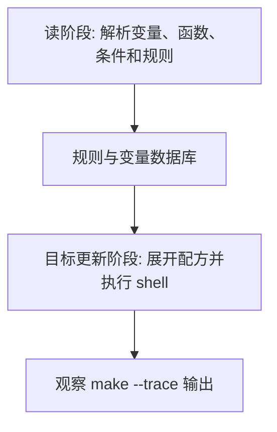

# Makefile高级变量

## 学习目标

读完后，读者应该能使用自动变量简化规则，能用 target-specific 变量给单个目标设置编译选项，并能用 `$(origin)`、`$(flavor)`、`$(value)` 定位变量从哪里来、如何展开。

本篇延续 [[tools/concepts/Makefile心智模型与历史|二阶段执行模型]]：先区分哪些内容在读阶段展开，哪些内容在目标更新阶段展开，再讨论它在工程 Makefile 中的稳定写法。只记语法表很容易忘，能用 `make --trace` 和诊断输出观察行为，才算真正掌握。

## 前置知识

- 建议先读 [[tools/concepts/Makefile变量赋值与展开|前一篇]]。
- 需要理解 Make 语法和 Shell 语法的边界。
- 后续可继续读 [[tools/concepts/Makefile文本变换函数|后一篇]]。

## 最小可运行例子

在空目录中创建 `Makefile`，复制下面内容，然后运行后面的命令。示例默认兼容 GNU Make 4.3。

```makefile
# 普通变量：作为全局默认编译选项
CFLAGS ?= -Wall                          # ?= 允许命令行 CFLAGS=... 覆盖默认值

# 目标专属变量：只影响 app.o 这条目标及其相关构建上下文
app.o: CFLAGS += -DAPP                   # 为 app.o 追加一个局部宏定义

# 默认目标：构建 app.o 并打印变量诊断信息
all: app.o                               # all 依赖 app.o
	@printf 'origin CFLAGS=%s\n' '$(origin CFLAGS)' # 查看 CFLAGS 来源
	@printf 'flavor CFLAGS=%s\n' '$(flavor CFLAGS)' # 查看 CFLAGS 展开类型
	@printf 'raw CFLAGS=%s\n' '$(value CFLAGS)'     # 查看未再次展开的原始值

# 对象目标：使用自动变量写通用配方
app.o: app.c                             # app.o 由 app.c 生成
	@printf 'target=%s\n' '$@' > '$@'      # $@ 是当前目标 app.o
	@printf 'first=%s\n' '$<' >> '$@'      # $< 是第一个前置条件 app.c
	@printf 'all=%s\n' '$^' >> '$@'        # $^ 是去重后的全部前置条件
	@printf 'cflags=%s\n' '$(CFLAGS)' >> '$@' # 输出目标专属后的 CFLAGS

# 输入文件：创建最小源文件
app.c:                                   # 文件缺失时生成示例源文件
	@printf 'int app(void) { return 0; }\n' > '$@' # 写入一个 C 函数
```

执行命令：

```shell
# 打开未定义变量警告，尽早发现拼写错误
make --warn-undefined-variables
# 预演将要执行的配方，观察 Make 展开后的命令
make -n
# 显示目标触发原因，并执行默认目标
make --trace
```

## 语法拆解

- `$@` 表示当前目标，适合输出文件名。
- `$<` 表示第一个前置条件，常用于单源文件编译。
- `$^` 表示去重后的所有前置条件，常用于链接命令。
- `target: VAR += value` 是目标专属变量，不应误认为全局赋值。
- `$(origin)`、`$(flavor)`、`$(value)` 是变量诊断三件套。

## 执行轨迹



观察这类例子时，不要只看最终文件内容。更重要的是比较 `make -n`、`make --trace` 和诊断函数的输出：它们分别暴露“将执行什么”“为什么执行”“读阶段已经展开了什么”。

## 工程化写法

大型 Makefile 中，自动变量让模式规则和静态模式规则更短、更可靠。目标专属变量适合给某个 IP、某个 test 或某个 corner 单独追加选项，避免把局部配置污染到全局。调试变量覆盖问题时，优先打印 `origin` 和 `flavor`，不要只猜命令行是否生效。

## 常见错误

| 错误现象 | 根因 | 修复 |
|:---|:---|:---|
| `$@` 在全局变量中为空 | 自动变量只在规则上下文中有效 | 只在配方或二次展开规则中使用自动变量 |
| 局部选项影响范围不清 | 混用全局变量和目标专属变量 | 用 target-specific 变量限制作用域 |
| 命令行变量为何覆盖不了不清楚 | 不知道变量来源 | 用 `$(origin VAR)` 诊断 |

## 关键要点

- 自动变量依赖具体规则上下文。
- `$<` 常用于编译，`$^` 常用于链接。
- target-specific 变量能控制局部选项。
- `origin/flavor/value` 是调试变量的基本工具。
- 环境变量、命令行变量和 Makefile 变量有优先级差异。

## 与其他概念的关系

- [[tools/concepts/Makefile变量赋值与展开|前一篇]]：提供本篇需要的前置知识。
- [[tools/concepts/Makefile文本变换函数|后一篇]]：把本篇能力推进到下一类 Makefile 机制。
- [[tools/concepts/Makefile调试与性能|Makefile 调试与性能]]：提供更系统的诊断方法。

## 小练习

1. 运行 `make CFLAGS=-O2`，观察 `origin CFLAGS`。
2. 把 `app.o: CFLAGS += -DAPP` 改成全局赋值，比较输出。
3. 添加第二个前置条件，观察 `$^` 如何变化。
