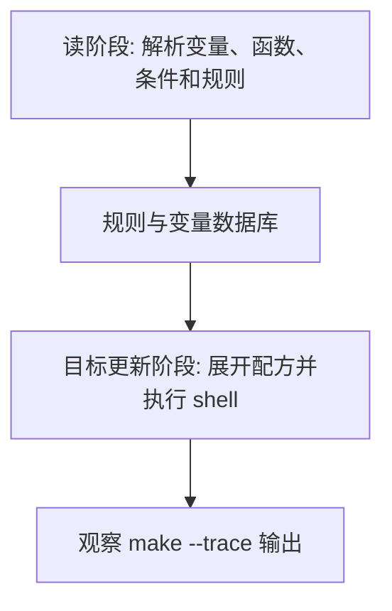

# Makefile文本变换函数

## 学习目标

读完后，读者应该能理解 Make 函数多数处理的是空格分隔词表，并能用 `filter`、`filter-out`、`patsubst` 等函数从源文件列表推导对象文件、测试文件和编译选项。

本篇延续 [[tools/concepts/Makefile心智模型与历史|二阶段执行模型]]：先区分哪些内容在读阶段展开，哪些内容在目标更新阶段展开，再讨论它在工程 Makefile 中的稳定写法。只记语法表很容易忘，能用 `make --trace` 和诊断输出观察行为，才算真正掌握。

## 前置知识

- 建议先读 [[tools/concepts/Makefile高级变量|前一篇]]。
- 需要理解 Make 语法和 Shell 语法的边界。
- 后续可继续读 [[tools/concepts/Makefile路径与文件函数|后一篇]]。

## 最小可运行例子

在空目录中创建 `Makefile`，复制下面内容，然后运行后面的命令。示例默认兼容 GNU Make 4.3。

```makefile
# 源文件词表：Make 把空格分隔的文本当作 word list 处理
SRCS := src/main.c src/alu.c test/alu_tb.c doc/readme.txt # 混合放入多类路径

# 过滤 C 源文件：多个模式用空格分隔
C_SRCS := $(filter %.c,$(SRCS))           # 只保留 .c 文件

# 排除测试文件：filter-out 删除匹配 test/% 的路径
PROD_SRCS := $(filter-out test/%,$(C_SRCS)) # 得到生产代码源文件

# 模式替换：把 src/xxx.c 转成 build/xxx.o
OBJS := $(patsubst src/%.c,build/%.o,$(PROD_SRCS)) # 生成对象文件词表

# 排序去重：sort 会排序并去掉重复词
UNIQUE_DIRS := $(sort $(dir $(SRCS)))     # 提取目录并去重

# 默认目标：打印每个中间词表
all:                                     # all 是观察入口
	@printf 'all sources: %s\n' '$(SRCS)'       # 输出原始词表
	@printf 'c sources: %s\n' '$(C_SRCS)'       # 输出 .c 文件
	@printf 'prod sources: %s\n' '$(PROD_SRCS)' # 输出排除 test 后的源文件
	@printf 'objects: %s\n' '$(OBJS)'           # 输出对象文件列表
	@printf 'dirs: %s\n' '$(UNIQUE_DIRS)'       # 输出去重目录列表
```

执行命令：

```shell
# 打开未定义变量警告，尽早发现拼写错误
make --warn-undefined-variables
# 预演将要执行的配方，观察 Make 展开后的命令
make -n
# 显示目标触发原因，并执行默认目标
make --trace
```

## 语法拆解

- `$(filter %.c,$(SRCS))` 保留匹配模式的词。
- `$(filter-out test/%,$(C_SRCS))` 删除匹配模式的词。
- `$(patsubst src/%.c,build/%.o,...)` 对每个匹配词做模式替换。
- `$(sort ...)` 不只是排序，也会去重。
- Make 函数参数用逗号分隔，但词表内部用空格分隔。

## 执行轨迹



观察这类例子时，不要只看最终文件内容。更重要的是比较 `make -n`、`make --trace` 和诊断函数的输出：它们分别暴露“将执行什么”“为什么执行”“读阶段已经展开了什么”。

## 工程化写法

工程 Makefile 中，源文件列表往往来自手写变量、`wildcard` 或 include 文件。文本函数负责把这些列表变成对象列表、测试列表、排除列表和工具选项列表。数字IC项目中的 filelist、testlist、IP 列表也常用同样的词表模型处理。

## 常见错误

| 错误现象 | 根因 | 修复 |
|:---|:---|:---|
| `filter` 没匹配到文件 | 模式写成 shell glob 思维 | 使用 Make 的 `%` 模式而不是随意混用 `*` |
| 文件顺序意外改变 | 使用 `sort` 去重时也排序 | 只有需要去重时才用 `sort` |
| 路径含空格后被拆开 | Make 词表以空格分隔 | 工程路径避免空格，或改用外部脚本处理 |

## 关键要点

- Make 文本函数主要处理空格分隔词表。
- `filter` 和 `filter-out` 支持多个模式。
- `patsubst` 是源文件到目标文件转换的常用函数。
- `sort` 会排序并去重。
- 路径含空格会破坏 Make 词表模型。

## 与其他概念的关系

- [[tools/concepts/Makefile高级变量|前一篇]]：提供本篇需要的前置知识。
- [[tools/concepts/Makefile路径与文件函数|后一篇]]：把本篇能力推进到下一类 Makefile 机制。
- [[tools/concepts/Makefile调试与性能|Makefile 调试与性能]]：提供更系统的诊断方法。

## 小练习

1. 给 `SRCS` 添加重复文件，观察 `UNIQUE_DIRS`。
2. 把 `test/%` 改成 `%_tb.c`，观察过滤结果。
3. 添加 `$(words $(SRCS))` 打印词数。
