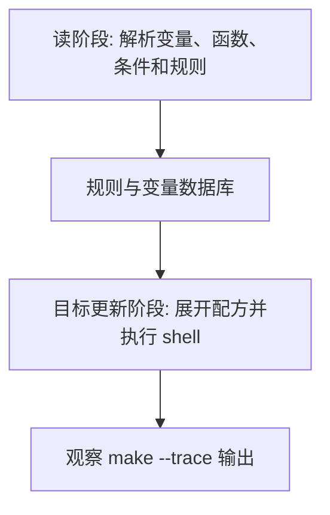

# Makefile路径与文件函数

## 学习目标

读完后，读者应该能使用 `dir`、`notdir`、`basename`、`suffix`、`addprefix`、`addsuffix`、`wildcard` 和 `file` 管理路径列表，并能区分 Make 级通配和 shell 级通配。

本篇延续 [[tools/concepts/Makefile心智模型与历史|二阶段执行模型]]：先区分哪些内容在读阶段展开，哪些内容在目标更新阶段展开，再讨论它在工程 Makefile 中的稳定写法。只记语法表很容易忘，能用 `make --trace` 和诊断输出观察行为，才算真正掌握。

## 前置知识

- 建议先读 [[tools/concepts/Makefile文本变换函数|前一篇]]。
- 需要理解 Make 语法和 Shell 语法的边界。
- 后续可继续读 [[tools/concepts/Makefile控制函数与诊断函数|后一篇]]。

## 最小可运行例子

在空目录中创建 `Makefile`，复制下面内容，然后运行后面的命令。示例默认兼容 GNU Make 4.3。

```makefile
# Make 级通配：读阶段展开当前目录下的 .c 文件
SRCS := $(wildcard *.c)                  # 没有匹配时结果为空，而不是字面量 *.c

# 添加默认文件名：没有 .c 文件时使用 main.c 作为示例
SRCS := $(or $(SRCS),main.c)             # $(or ...) 返回第一个非空参数

# 路径函数：拆分文件名、后缀和主名
DIRS := $(dir $(SRCS))                   # 提取目录部分
NAMES := $(notdir $(SRCS))               # 提取文件名部分
BASES := $(basename $(NAMES))            # 去掉后缀
SUFFIXES := $(suffix $(NAMES))           # 提取后缀
OBJS := $(addprefix build/,$(addsuffix .o,$(BASES))) # 组合对象文件路径

# 默认目标：写入一个由 Make 生成的配置片段
all:                                     # all 是观察入口
	@printf 'int main(void) { return 0; }\n' > main.c # 创建一个示例源文件
	@printf 'sources=%s\n' '$(SRCS)'              # 打印 Make 通配结果
	@printf 'objects=%s\n' '$(OBJS)'              # 打印路径重组结果
	@$(file >generated.mk,SRCS := $(SRCS))         # Make 在配方展开时写文件
	@$(file >>generated.mk,OBJS := $(OBJS))        # 追加一行到 generated.mk
	@printf 'generated.mk written\n'               # shell 打印确认信息
```

执行命令：

```shell
# 打开未定义变量警告，尽早发现拼写错误
make --warn-undefined-variables
# 预演将要执行的配方，观察 Make 展开后的命令
make -n
# 显示目标触发原因，并执行默认目标
make --trace
```

## 语法拆解

- `$(wildcard *.c)` 由 Make 展开，不由 shell 展开。
- `$(dir ...)` 和 `$(notdir ...)` 把路径拆成目录和文件名。
- `$(basename ...)` 与 `$(suffix ...)` 处理后缀。
- `$(addprefix ...)` 和 `$(addsuffix ...)` 常用于拼对象目录和文件后缀。
- `$(file >path,text)` 是 GNU Make 文件函数，不是 shell 重定向。

## 执行轨迹



观察这类例子时，不要只看最终文件内容。更重要的是比较 `make -n`、`make --trace` 和诊断函数的输出：它们分别暴露“将执行什么”“为什么执行”“读阶段已经展开了什么”。

## 工程化写法

路径函数适合处理小到中等规模的文件列表。若项目需要复杂递归扫描、排除规则或路径含空格，建议把扫描逻辑放到 Python/TCL 脚本里生成 `.mk` 文件，再由 Make `include`。IC 工程中，filelist 和 IP 列表经常采用这种生成后 include 的模式。

## 常见错误

| 错误现象 | 根因 | 修复 |
|:---|:---|:---|
| `$(wildcard)` 没找到新创建文件 | 它在读阶段展开，早于配方创建文件 | 把生成文件写入独立步骤，下一次 make 再 include |
| 把 shell `*` 当 Make 通配 | 两者展开时机不同 | 明确使用 `$(wildcard ...)` 或让 shell 在配方中展开 |
| `$(file ...)` 没有显示命令 | 它是 Make 函数，不是 shell 命令 | 用 `$(info ...)` 或检查生成文件诊断 |

## 关键要点

- Make 级通配发生在 Make 展开时。
- 路径函数按词表逐项处理。
- `$(file ...)` 可以读写文件，但要注意展开时机。
- `realpath` 要求路径存在，`abspath` 只做路径规范化。
- 复杂文件发现逻辑不宜全部塞进 Make 函数。

## 与其他概念的关系

- [[tools/concepts/Makefile文本变换函数|前一篇]]：提供本篇需要的前置知识。
- [[tools/concepts/Makefile控制函数与诊断函数|后一篇]]：把本篇能力推进到下一类 Makefile 机制。
- [[tools/concepts/Makefile调试与性能|Makefile 调试与性能]]：提供更系统的诊断方法。

## 小练习

1. 先创建 `extra.c` 再运行 `make`，观察 `SRCS`。
2. 把 `build/` 改成 `out/obj/`，观察 `OBJS`。
3. 查看生成的 `generated.mk` 内容。
