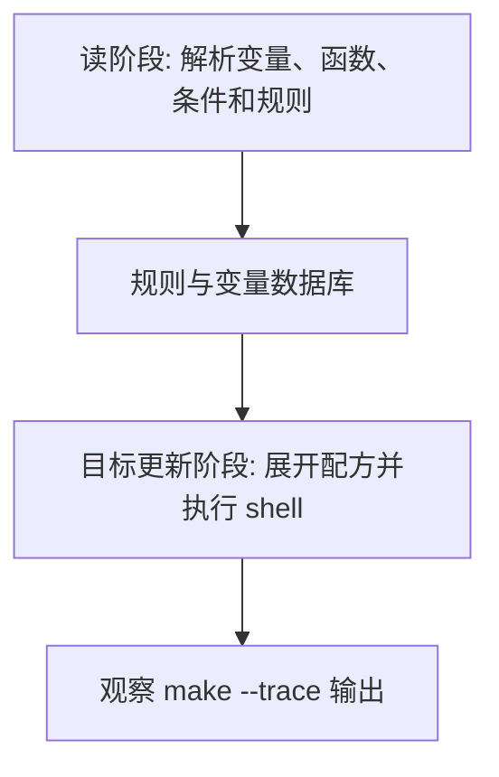

# Makefile控制函数与诊断函数

## 学习目标

读完后，读者应该能使用 `$(if)`、`$(or)`、`$(and)`、`$(foreach)`、`$(shell)`、`$(info)`、`$(warning)` 和 `$(error)` 写出可诊断的 Makefile 逻辑，并知道 `$(shell)` 的性能边界。

本篇延续 [[tools/concepts/Makefile心智模型与历史|二阶段执行模型]]：先区分哪些内容在读阶段展开，哪些内容在目标更新阶段展开，再讨论它在工程 Makefile 中的稳定写法。只记语法表很容易忘，能用 `make --trace` 和诊断输出观察行为，才算真正掌握。

## 前置知识

- 建议先读 [[tools/concepts/Makefile路径与文件函数|前一篇]]。
- 需要理解 Make 语法和 Shell 语法的边界。
- 后续可继续读 [[tools/concepts/Makefile条件判断|后一篇]]。

## 最小可运行例子

在空目录中创建 `Makefile`，复制下面内容，然后运行后面的命令。示例默认兼容 GNU Make 4.3。

```makefile
# 用户可覆盖变量：MODE 为空时使用 debug
MODE ?= debug                            # 命令行可用 make MODE=release 覆盖

# 条件函数：根据 MODE 选择编译选项
OPT := $(if $(filter release,$(MODE)),-O2,-O0) # release 用 -O2，否则用 -O0

# or 函数：选择第一个非空工具名
CC := $(or $(CC),gcc)                    # 如果 CC 已有值就保留，否则用 gcc

# foreach 函数：为每个 test 名生成日志路径
TESTS := smoke alu fifo                  # 测试名词表
LOGS := $(foreach t,$(TESTS),logs/$(t).log) # 把每个测试名映射成日志文件

# shell 函数：读阶段执行命令，适合少量平台检测
HOST := $(shell uname -s)                # 执行 uname -s 并保存输出

# 诊断函数：读阶段打印信息
$(info MODE=$(MODE), OPT=$(OPT), HOST=$(HOST)) # 打印当前配置
$(warning logs will be: $(LOGS))         # 打印警告但不中止 Make

# 默认目标：打印最终列表
all:                                     # all 是观察入口
	@printf 'cc=%s\n' '$(CC)'              # 输出工具名
	@printf 'opt=%s\n' '$(OPT)'            # 输出条件函数结果
	@printf 'logs=%s\n' '$(LOGS)'          # 输出 foreach 生成结果
```

执行命令：

```shell
# 打开未定义变量警告，尽早发现拼写错误
make --warn-undefined-variables
# 预演将要执行的配方，观察 Make 展开后的命令
make -n
# 显示目标触发原因，并执行默认目标
make --trace
```

## 语法拆解

- `$(if condition,then,else)` 根据非空条件选择分支。
- `$(or a,b,c)` 返回第一个非空参数，适合默认值链。
- `$(foreach var,list,text)` 会对词表每个词展开一次 text。
- `$(shell ...)` 在 Make 展开时运行 shell，不是在配方执行时才运行。
- `$(info)`、`$(warning)` 和 `$(error)` 是 Make 诊断函数。

## 执行轨迹



观察这类例子时，不要只看最终文件内容。更重要的是比较 `make -n`、`make --trace` 和诊断函数的输出：它们分别暴露“将执行什么”“为什么执行”“读阶段已经展开了什么”。

## 工程化写法

控制函数适合生成小规模列表和配置分支。若逻辑开始包含复杂嵌套、字符串解析或大量 shell 调用，就应该考虑生成 `.mk` 文件或把逻辑移到脚本中。IC 回归系统可以用 `foreach` 从 testlist 生成日志目标，但失败分类和报告统计通常更适合 Python。

## 常见错误

| 错误现象 | 根因 | 修复 |
|:---|:---|:---|
| `$(shell ...)` 很慢 | 每次展开都启动 shell | 用 `:=` 缓存，或改为生成文件 |
| `foreach` 输出粘在一起 | text 里没有分隔空格 | 在模板文本中显式保留空格 |
| 警告信息每次都出现 | 诊断函数在读阶段执行 | 只在调试开关打开时调用 |

## 关键要点

- 控制函数在 Make 展开阶段工作。
- `foreach` 是词表循环，不是 shell 循环。
- `$(shell)` 有进程启动成本。
- `$(warning)` 不会中止，`$(error)` 会中止。
- GNU Make 4.4+ 的 `let/intcmp` 不属于本讲义默认可运行路径。

## 与其他概念的关系

- [[tools/concepts/Makefile路径与文件函数|前一篇]]：提供本篇需要的前置知识。
- [[tools/concepts/Makefile条件判断|后一篇]]：把本篇能力推进到下一类 Makefile 机制。
- [[tools/concepts/Makefile调试与性能|Makefile 调试与性能]]：提供更系统的诊断方法。

## 小练习

1. 运行 `make MODE=release`，观察 `OPT`。
2. 给 `TESTS` 添加 `cache`，观察 `LOGS`。
3. 把 `$(warning ...)` 改成 `$(info ...)`，比较输出格式。
