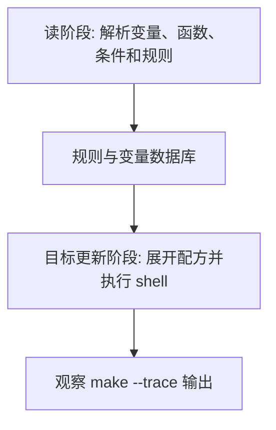

# Makefile条件判断

## 学习目标

读完后，读者应该能写 `ifeq`、`ifneq`、`ifdef`、`ifndef`、`else`、`endif`，并能清楚区分 Make 条件在读阶段决定是否纳入规则，shell `if` 在配方执行阶段决定命令分支。

本篇延续 [[tools/concepts/Makefile心智模型与历史|二阶段执行模型]]：先区分哪些内容在读阶段展开，哪些内容在目标更新阶段展开，再讨论它在工程 Makefile 中的稳定写法。只记语法表很容易忘，能用 `make --trace` 和诊断输出观察行为，才算真正掌握。

## 前置知识

- 建议先读 [[tools/concepts/Makefile控制函数与诊断函数|前一篇]]。
- 需要理解 Make 语法和 Shell 语法的边界。
- 后续可继续读 [[tools/concepts/Makefile宏与元编程|后一篇]]。

## 最小可运行例子

在空目录中创建 `Makefile`，复制下面内容，然后运行后面的命令。示例默认兼容 GNU Make 4.3。

```makefile
# 用户可覆盖模式：默认 debug
MODE ?= debug                            # make MODE=release 可切换模式

# Make 条件：读阶段判断 MODE，并决定 CFLAGS 的值
ifeq ($(MODE),release)                   # 如果 MODE 文本等于 release
CFLAGS := -O2 -DNDEBUG                   # release 模式使用优化和关闭调试宏
else                                     # 否则进入 debug 分支
CFLAGS := -O0 -g                         # debug 模式保留调试信息
endif                                    # Make 条件必须显式结束

# ifdef 判断变量是否非空
ifdef EXTRA                              # 如果 EXTRA 已定义且非空
CFLAGS += $(EXTRA)                       # 追加用户额外选项
endif                                    # 结束 ifdef

# 默认目标：同时演示 Make 条件结果和 shell 条件
all:                                     # all 是观察入口
	@printf 'mode=%s\n' '$(MODE)'          # MODE 已在 Make 阶段确定
	@printf 'cflags=%s\n' '$(CFLAGS)'      # CFLAGS 是 Make 条件选择结果
	@if [ '$(MODE)' = 'release' ]; then printf 'shell branch: release\n'; else printf 'shell branch: debug\n'; fi # shell if 在配方执行时运行
```

执行命令：

```shell
# 打开未定义变量警告，尽早发现拼写错误
make --warn-undefined-variables
# 预演将要执行的配方，观察 Make 展开后的命令
make -n
# 显示目标触发原因，并执行默认目标
make --trace
```

## 语法拆解

- `ifeq`、`ifneq`、`ifdef`、`ifndef` 是 Make 条件指令，不是 shell 命令。
- Make 条件在读阶段决定哪些 Makefile 文本生效。
- 条件指令不要放在 TAB 配方缩进下，否则会被当成 shell 文本。
- shell `if` 必须写在配方中，由 shell 在目标更新阶段执行。
- 多行 shell `if` 需要反斜杠续行，且续行反斜杠后不能再跟空格或注释；复杂逻辑也可以使用 `.ONESHELL` 或脚本文件。

## 执行轨迹



观察这类例子时，不要只看最终文件内容。更重要的是比较 `make -n`、`make --trace` 和诊断函数的输出：它们分别暴露“将执行什么”“为什么执行”“读阶段已经展开了什么”。

## 工程化写法

工程 Makefile 常用 Make 条件选择工具链、平台、构建模式和特性开关；常用 shell 条件检查运行时文件是否存在、工具是否可执行或命令是否成功。不要用 shell 条件决定是否定义规则，也不要用 Make 条件检查配方执行后才会出现的文件。

## 常见错误

| 错误现象 | 根因 | 修复 |
|:---|:---|:---|
| `ifeq` 被 shell 报错 | 条件指令前有 TAB | Make 条件必须顶格或仅普通空白缩进，不属于配方 |
| 条件没有看到配方生成的文件 | Make 条件在读阶段执行 | 用 shell `if` 检查运行时文件 |
| 多行 shell if 语法错误 | 忘记续行反斜杠，或反斜杠后还有注释/空格 | 保持反斜杠为行尾最后字符，或写成单行/脚本文件 |

## 关键要点

- Make 条件控制 Makefile 文本是否生效。
- shell 条件控制配方运行时命令分支。
- `ifdef` 判断变量是否非空，不判断变量值真假。
- 条件指令缩进错误是高频问题。
- 平台和模式开关优先使用 Make 条件。

## 与其他概念的关系

- [[tools/concepts/Makefile控制函数与诊断函数|前一篇]]：提供本篇需要的前置知识。
- [[tools/concepts/Makefile宏与元编程|后一篇]]：把本篇能力推进到下一类 Makefile 机制。
- [[tools/concepts/Makefile调试与性能|Makefile 调试与性能]]：提供更系统的诊断方法。

## 小练习

1. 运行 `make MODE=release`，观察两个分支输出。
2. 运行 `make EXTRA=-DTRACE`，观察 `CFLAGS`。
3. 给 `ifeq` 行前加 TAB，观察错误。
