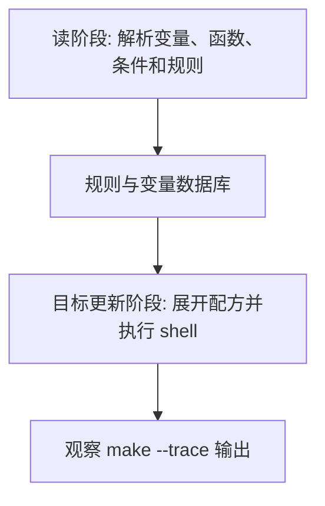

# Makefile宏与元编程

## 学习目标

读完后，读者应该能用 `define` 定义多行模板，用 `$(call)` 传参复用文本，并理解 `$(eval)` 会把展开结果重新作为 Makefile 语法解析。重点是知道何时该用，何时应该退回简单模式规则。

本篇延续 [[tools/concepts/Makefile心智模型与历史|二阶段执行模型]]：先区分哪些内容在读阶段展开，哪些内容在目标更新阶段展开，再讨论它在工程 Makefile 中的稳定写法。只记语法表很容易忘，能用 `make --trace` 和诊断输出观察行为，才算真正掌握。

## 前置知识

- 建议先读 [[tools/concepts/Makefile条件判断|前一篇]]。
- 需要理解 Make 语法和 Shell 语法的边界。
- 后续可继续读 [[tools/concepts/Makefile模式规则|后一篇]]。

## 最小可运行例子

在空目录中创建 `Makefile`，复制下面内容，然后运行后面的命令。示例默认兼容 GNU Make 4.3。

```makefile
# 测试名词表：后续用模板为每个测试生成日志目标
TESTS := smoke alu                       # 两个测试名，空格分隔

# define 定义多行变量：模板不会立即成为规则
# $(1) 是 call 的第一个参数，代表测试名
define TEST_template
logs/$(1).log:                           # 生成一个真实日志目标
	@mkdir -p logs                         # 创建日志目录
	@printf 'run test $(1)\n' > $$@        # $$@ 延迟到生成规则的配方执行时再展开
endef                                    # 结束多行变量定义

# eval 元编程：foreach 展开模板，eval 把结果解析成真实规则
$(foreach t,$(TESTS),$(eval $(call TEST_template,$(t)))) # 为每个测试生成 logs/<test>.log

# 默认目标：依赖所有测试日志
all: $(foreach t,$(TESTS),logs/$(t).log) # 展开为 logs/smoke.log logs/alu.log
	@printf 'generated logs: %s\n' '$^'    # $^ 是全部日志前置条件

# 诊断目标：打印模板展开后的文本，调试 eval 前先看它
.PHONY: print-template                   # print-template 是动作目标
print-template:                          # 手动运行 make print-template
	@printf '%s\n' '$(call TEST_template,debug)' # 只打印模板，不 eval
```

执行命令：

```shell
# 打开未定义变量警告，尽早发现拼写错误
make --warn-undefined-variables
# 预演将要执行的配方，观察 Make 展开后的命令
make -n
# 显示目标触发原因，并执行默认目标
make --trace
```

## 语法拆解

- `define/endef` 定义多行变量，常用于规则模板。
- `$(call NAME,arg)` 会把 `$(1)`、`$(2)` 等替换成参数。
- `$(eval text)` 会把 text 的展开结果重新交给 Make 解析。
- `$$@` 是双重展开关键：第一层 eval 后保留 `$@` 给真实配方。
- 调试元编程时，先打印 `$(call ...)` 结果，再加 `eval`。

## 执行轨迹



观察这类例子时，不要只看最终文件内容。更重要的是比较 `make -n`、`make --trace` 和诊断函数的输出：它们分别暴露“将执行什么”“为什么执行”“读阶段已经展开了什么”。

## 工程化写法

元编程适合“同一种规则要为很多 IP、test、corner 自动生成”的场景。例如根据 `TESTS` 生成回归日志目标，根据 `CORNERS` 生成综合报告目标。但如果一个普通模式规则 `%` 就能解决问题，不要过早使用 `eval`，否则调试成本会明显上升。

## 常见错误

| 错误现象 | 根因 | 修复 |
|:---|:---|:---|
| 生成的配方里 `$@` 为空 | 少写一层 `$` | 在 eval 模板中写 `$$@` |
| `eval` 报语法错误 | 模板展开后不是合法 Makefile 语法 | 先用 `$(info ...)` 或 print 目标查看展开文本 |
| 简单规则被写成复杂模板 | 过早抽象 | 优先使用模式规则和静态模式规则 |

## 关键要点

- `define` 只是定义文本，不自动生成规则。
- `call` 负责传参展开模板。
- `eval` 负责把文本解析成 Makefile 语法。
- 双重展开时 `$` 层数必须精确。
- 元编程应服务真实重复结构，而不是炫技。

## 与其他概念的关系

- [[tools/concepts/Makefile条件判断|前一篇]]：提供本篇需要的前置知识。
- [[tools/concepts/Makefile模式规则|后一篇]]：把本篇能力推进到下一类 Makefile 机制。
- [[tools/concepts/Makefile调试与性能|Makefile 调试与性能]]：提供更系统的诊断方法。

## 小练习

1. 给 `TESTS` 添加 `fifo`，观察新增日志目标。
2. 把 `$$@` 改成 `$@`，观察生成文件名问题。
3. 运行 `make print-template`，手工检查模板展开文本。
