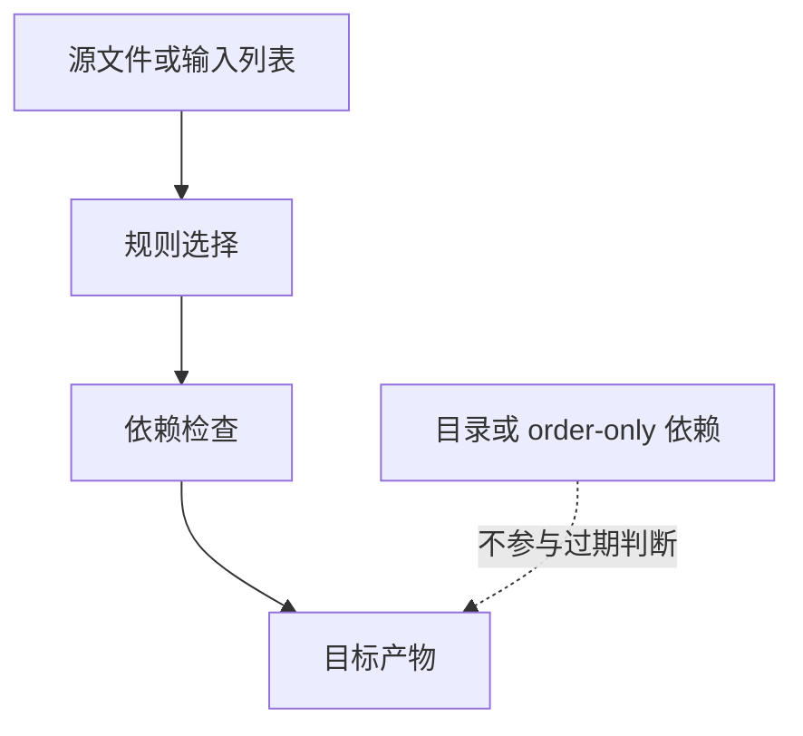

# Makefile模式规则

## 学习目标

读完后，读者应该能解释 `%` 和 stem 的含义，能用模式规则把源文件列表转换成对象文件列表，并知道显式规则、模式规则和静态模式规则的适用边界。

这一组内容把 Makefile 从“手写单条规则”推进到“可扩展规则系统”。只要项目文件数量超过几个，模式规则、隐含规则和自动依赖就会成为可维护性的分水岭。

## 前置知识

- 建议先读 [[tools/concepts/Makefile宏与元编程|前一篇]]。
- 需要熟悉变量、函数、自动变量和基本规则。
- 后续可继续读 [[tools/concepts/Makefile隐含规则|后一篇]]。

## 最小可运行例子

```makefile
# 源文件列表：真实项目中通常来自 wildcard 或手写 filelist
SRCS := src/main.c src/alu.c             # 两个源文件，空格分隔

# 对象文件列表：把 src/xxx.c 转成 build/xxx.o
OBJS := $(patsubst src/%.c,build/%.o,$(SRCS)) # % 匹配同一个 stem

# 默认目标：依赖所有对象文件
all: $(OBJS)                             # all 触发两个对象目标
	@printf 'objects: %s\n' '$^'           # $^ 是全部对象文件

# 模式规则：一条规则匹配 build/main.o 和 build/alu.o
build/%.o: src/%.c | build               # % 的 stem 分别是 main 和 alu
	@printf 'compile %s -> %s\n' '$<' '$@' > '$@' # 用文本模拟编译

# 目录目标：只保证目录存在，不参与对象文件过期判断
build:                                   # build 不存在时创建
	@mkdir -p '$@'                         # 创建 build 目录

# 输入源文件：用规则生成示例文件
src/%.c: | src                            # src/main.c 和 src/alu.c 共用模式规则
	@printf 'int %s(void) { return 0; }\n' '$*' > '$@' # $* 是 stem

# 源目录目标：创建 src 目录
src:                                     # src 不存在时创建
	@mkdir -p '$@'                         # 创建源目录
```

执行命令：

```shell
# 预演默认目标，确认模式或依赖展开后的命令
make -n
# 执行默认目标，并显示每个目标触发原因
make --trace
# 打开未定义变量警告，检查变量拼写问题
make --warn-undefined-variables
```

## 语法拆解

- `%` 在目标和前置条件中匹配同一个 stem。
- `build/%.o: src/%.c` 中，`main`、`alu` 都是 stem。
- `$*` 是 stem，常用于模式规则。
- `| build` 是 order-only 前置条件，保证目录存在但不因目录时间戳触发重建。
- 静态模式规则适合对一个已知目标集合应用模式。

## 执行轨迹



`make --trace` 是观察规则选择的第一工具；`make -p` 适合查看隐含规则数据库；自动依赖问题则要同时检查 `.d` 文件内容和 Make 重启次数。

## 工程化写法

模式规则是 C/C++、SystemVerilog filelist 生成、日志目标生成的基础。IC 项目中可把 `logs/%.log: tests/%.cfg` 写成测试日志规则，也可以把 `reports/%/qor.rpt: scripts/syn.tcl` 写成 corner 报告规则。

## 常见错误

| 错误现象 | 根因 | 修复 |
|:---|:---|:---|
| `%` 匹配范围过宽 | 模式太泛，匹配了不该匹配的目标 | 给目标路径加目录前缀，如 `build/%.o` |
| 目录更新时间导致对象重建 | 把目录写成普通前置条件 | 使用 order-only 前置条件 `| build` |
| `$*` 为空 | 在非模式规则中使用 stem | 只在模式或静态模式规则中依赖 `$*` |

## 关键要点

- 模式规则用 `%` 表示 stem。
- 显式规则优先于模式规则。
- 目录创建通常应使用 order-only 依赖。
- 静态模式规则适合已知目标集合。
- Grouped targets `&:` 是 GNU Make 4.3+ 特性，适合一个配方同时更新多个目标。

## 与其他概念的关系

- [[tools/concepts/Makefile宏与元编程|前一篇]]：提供变量、函数或模板基础。
- [[tools/concepts/Makefile隐含规则|后一篇]]：继续推进依赖和工程化能力。
- [[tools/concepts/Makefile调试与性能|Makefile 调试与性能]]：用于观察隐含规则和依赖重建行为。

## 小练习

1. 添加 `src/fifo.c` 到 `SRCS`，观察 `OBJS`。
2. 把 `| build` 改成普通依赖，touch build 后观察重建。
3. 为 `build/main.o` 写显式规则，观察优先级。
