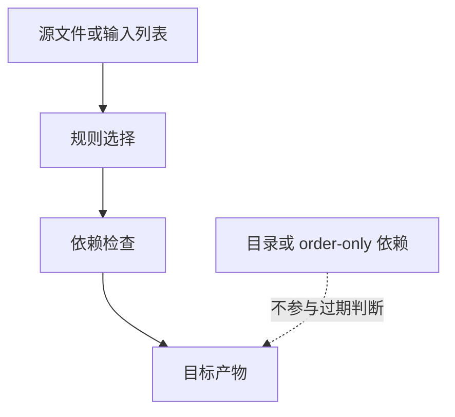

# Makefile隐含规则

## 学习目标

读完后，读者应该能解释 GNU Make 为什么在没有显式配方时仍可能调用编译器，能用 `make -p` 查看内置规则，并知道何时使用 `-r`、`-R` 或 `.SUFFIXES:` 禁用隐含行为。

这一组内容把 Makefile 从“手写单条规则”推进到“可扩展规则系统”。只要项目文件数量超过几个，模式规则、隐含规则和自动依赖就会成为可维护性的分水岭。

## 前置知识

- 建议先读 [[tools/concepts/Makefile模式规则|前一篇]]。
- 需要熟悉变量、函数、自动变量和基本规则。
- 后续可继续读 [[tools/concepts/Makefile依赖与自动生成|后一篇]]。

## 最小可运行例子

```makefile
# 显式设置隐含变量：即使不用真实编译，也能观察变量如何传递
CC := printf                             # 用 printf 模拟编译器，避免依赖真实工具链
CFLAGS := 'implicit compile %s\n'        # 传给模拟编译器的格式字符串

# 默认目标：依赖一个由显式规则生成的观察文件
all: implicit.out                        # all 依赖 implicit.out

# 显式规则：本例不触发真实内置编译，只打印隐含变量
implicit.out: main.c                     # main.c 是输入
	@$(CC) $(CFLAGS) '$<' > '$@'           # 使用 CC/CFLAGS 变量模拟隐含规则风格

# 输入文件：创建一个 C 源文件
main.c:                                  # main.c 不存在时创建
	@printf 'int main(void) { return 0; }\n' > '$@' # 写入示例 C 代码

# 查看提示：help 是伪目标
.PHONY: help                             # help 是动作目标
help:                                    # 打印观察建议
	@printf 'run: make -p | grep -n "COMPILE.c"\n' # 提示查看内置规则
```

执行命令：

```shell
# 预演默认目标，确认模式或依赖展开后的命令
make -n
# 执行默认目标，并显示每个目标触发原因
make --trace
# 打开未定义变量警告，检查变量拼写问题
make --warn-undefined-variables
```

## 语法拆解

- GNU Make 自带大量隐含规则和隐含变量。
- `CC`、`CFLAGS`、`CPPFLAGS`、`LDFLAGS` 等变量会影响内置规则。
- `make -p` 可以打印规则数据库，包括内置规则。
- `make -r` 禁用内置规则，`make -R` 禁用内置变量。
- `.SUFFIXES:` 可以清空历史后缀规则。

## 执行轨迹



`make --trace` 是观察规则选择的第一工具；`make -p` 适合查看隐含规则数据库；自动依赖问题则要同时检查 `.d` 文件内容和 Make 重启次数。

## 工程化写法

生产 Makefile 中，如果希望行为完全可控，可以在顶部使用 `MAKEFLAGS += -rR` 或 `.SUFFIXES:` 减少隐含行为。若项目很小，借用内置 C 编译规则也可以；但 IC 流程通常包装 EDA 工具，显式规则和模板更容易维护。

## 常见错误

| 错误现象 | 根因 | 修复 |
|:---|:---|:---|
| Make 调用了意料之外的编译器 | 隐含规则匹配了目标 | 用 `make --trace` 和 `make -p` 定位，必要时 `-r` |
| 改了 `CFLAGS` 影响范围不清 | 隐含变量被内置规则读取 | 显式写规则或局部化变量 |
| 后缀规则干扰模式规则 | 历史 `.SUFFIXES` 仍启用 | 用 `.SUFFIXES:` 清理 |

## 关键要点

- 隐含规则是 Make 的内置推导能力。
- 隐含变量会影响内置规则行为。
- `make -p` 是理解隐含数据库的入口。
- 可用 `-r/-R` 减少内置行为。
- 大型 IC Makefile 通常偏向显式规则。

## 与其他概念的关系

- [[tools/concepts/Makefile模式规则|前一篇]]：提供变量、函数或模板基础。
- [[tools/concepts/Makefile依赖与自动生成|后一篇]]：继续推进依赖和工程化能力。
- [[tools/concepts/Makefile调试与性能|Makefile 调试与性能]]：用于观察隐含规则和依赖重建行为。

## 小练习

1. 运行 `make -p | grep -n COMPILE.c` 查看内置编译规则。
2. 运行 `make -r --trace`，比较行为。
3. 把 `CC := printf` 改成 `CC := echo`，观察输出。
