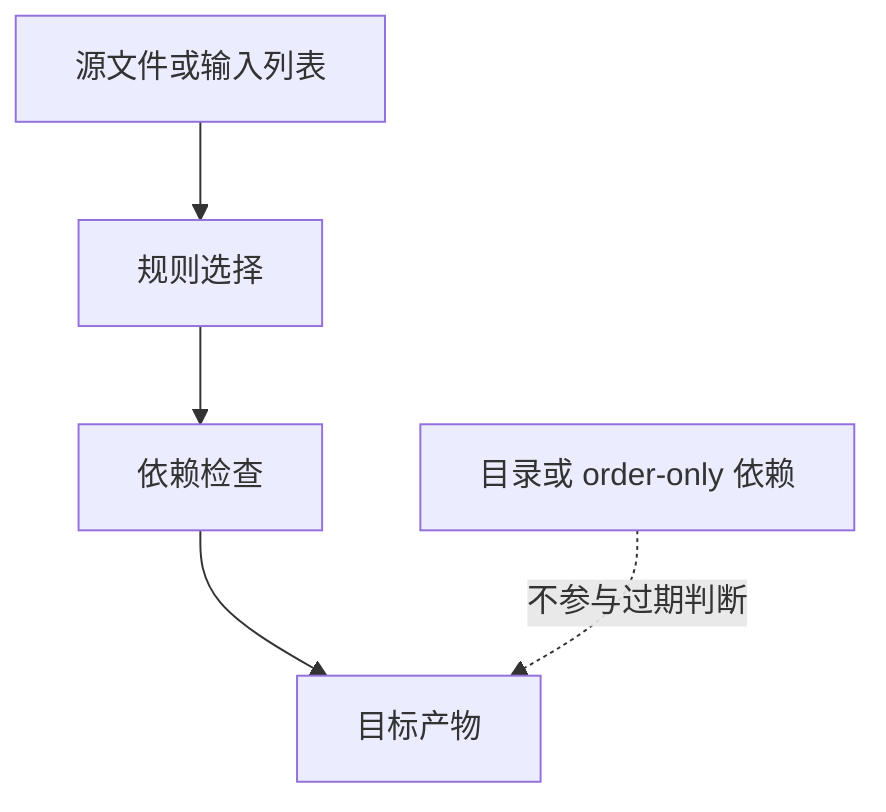

# Makefile依赖与自动生成

## 学习目标

读完后，读者应该能使用 `include`/`-include` 管理拆分 Makefile，理解 `.d` 文件自动依赖的基本写法，并知道 `-MMD`、`-MP`、`-MF`、`-MT` 等编译器选项解决什么问题。

这一组内容把 Makefile 从“手写单条规则”推进到“可扩展规则系统”。只要项目文件数量超过几个，模式规则、隐含规则和自动依赖就会成为可维护性的分水岭。

## 前置知识

- 建议先读 [[tools/concepts/Makefile隐含规则|前一篇]]。
- 需要熟悉变量、函数、自动变量和基本规则。
- 后续可继续读 [[tools/concepts/Makefile高级依赖|后一篇]]。

## 最小可运行例子

```makefile
# 编译器变量：默认使用 cc，用户可以命令行覆盖
CC ?= cc                                 # C 编译器，默认 cc
CFLAGS ?= -Wall -Wextra                  # 基础警告选项
CPPFLAGS ?= -Iinclude                    # 头文件搜索路径

# 文件列表：一个源文件、一个对象文件、一个依赖文件
SRC := src/main.c                        # 源文件路径
OBJ := build/main.o                      # 对象文件路径
DEP := build/main.d                      # 自动依赖文件路径

# 默认目标：生成对象文件
all: $(OBJ)                              # all 依赖对象文件

# 自动依赖文件：首次不存在时不要报错
-include $(DEP)                          # 读阶段尝试包含 .d 文件，缺失则忽略

# 编译规则：同时生成 .o 和 .d
$(OBJ): $(SRC) include/main.h | build src include # 普通依赖加目录依赖
	@$(CC) $(CPPFLAGS) $(CFLAGS) -MMD -MP -MF $(DEP) -MT '$@' -c '$<' -o '$@' # 编译并生成依赖

# 目录目标：保证目录存在
build src include:                       # 三个目录共用一条规则
	@mkdir -p '$@'                         # 创建当前目录目标

# 源文件：创建最小 C 文件
src/main.c: | src include                # 源文件依赖目录存在
	@printf '#include "main.h"\nint main(void) { return VALUE; }\n' > '$@' # 写入 C 源码

# 头文件：创建最小头文件
include/main.h: | include                # 头文件依赖 include 目录
	@printf '#define VALUE 0\n' > '$@'     # 写入宏定义
```

执行命令：

```shell
# 预演默认目标，确认模式或依赖展开后的命令
make -n
# 执行默认目标，并显示每个目标触发原因
make --trace
# 打开未定义变量警告，检查变量拼写问题
make --warn-undefined-variables
```

## 语法拆解

- `-include $(DEP)` 在读阶段包含依赖文件；文件缺失不报错。
- `.d` 文件通常由编译器生成，记录 `.o` 对 `.c/.h` 的依赖。
- `-MMD` 生成用户头文件依赖，通常不包含系统头。
- `-MP` 为头文件生成伪目标，减少删除头文件后的报错。
- `-MF` 指定依赖文件路径，`-MT` 指定依赖文件里的目标名。

## 执行轨迹



`make --trace` 是观察规则选择的第一工具；`make -p` 适合查看隐含规则数据库；自动依赖问题则要同时检查 `.d` 文件内容和 Make 重启次数。

## 工程化写法

C/C++ 工程可直接使用编译器自动依赖。数字IC工程中，类似思想也适用于 filelist、testlist、IP manifest：先生成可 include 的依赖片段，再让 Make 根据片段决定重跑范围。依赖文件是构建系统和文件扫描脚本之间的稳定接口。

## 常见错误

| 错误现象 | 根因 | 修复 |
|:---|:---|:---|
| 修改头文件不重编译 | `.d` 文件没有 include 或生成不正确 | 使用 `-include $(DEPS)` 并检查 `.d` 内容 |
| 首次构建找不到 `.d` | 用了 `include` 而不是 `-include` | 首次自动依赖用 `-include` |
| 删除头文件后 make 报错 | `.d` 仍引用旧头文件 | 加 `-MP` 或清理依赖文件 |

## 关键要点

- `include` 在读阶段嵌入其他 Makefile 文本。
- `-include` 适合首次不存在的自动依赖文件。
- `.d` 文件让头文件变化能触发正确重建。
- 依赖文件可能触发 Makefile remake 和重启动。
- `$(MAKE_RESTARTS)` 可用于观察重启动次数。

## 与其他概念的关系

- [[tools/concepts/Makefile隐含规则|前一篇]]：提供变量、函数或模板基础。
- [[tools/concepts/Makefile高级依赖|后一篇]]：继续推进依赖和工程化能力。
- [[tools/concepts/Makefile调试与性能|Makefile 调试与性能]]：用于观察隐含规则和依赖重建行为。

## 小练习

1. 构建后查看 `build/main.d` 内容。
2. 修改 `include/main.h` 后运行 `make --trace`。
3. 把 `-MP` 去掉，删除头文件后观察报错差异。
