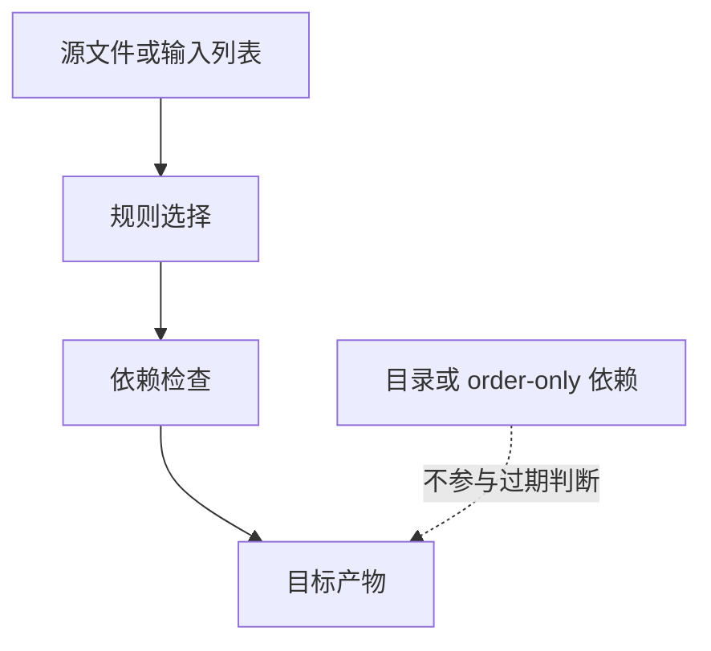

# Makefile高级依赖

## 学习目标

读完后，读者应该能解释 order-only 前置条件、双冒号规则和二次展开的用途，能正确处理目录创建、锁文件、延迟依赖和同一目标多个独立动作。

这一组内容把 Makefile 从“手写单条规则”推进到“可扩展规则系统”。只要项目文件数量超过几个，模式规则、隐含规则和自动依赖就会成为可维护性的分水岭。

## 前置知识

- 建议先读 [[tools/concepts/Makefile依赖与自动生成|前一篇]]。
- 需要熟悉变量、函数、自动变量和基本规则。
- 后续可继续读 [[tools/concepts/Makefile特殊目标手册|后一篇]]。

## 最小可运行例子

```makefile
# 开启二次展开：依赖列表中的 $$ 会在目标更新阶段再次展开
.SECONDEXPANSION:                        # 允许后续规则使用二次展开

# 目标列表：用目录加 stamp 模拟构建产物
TARGETS := build/a.stamp build/b.stamp   # 两个目标文件

# 默认目标：依赖全部 stamp
all: $(TARGETS)                          # all 触发两个 stamp 文件

# 每个目标的局部变量：根据目标名定义输入文件
build/a.stamp: INPUT := inputs/a.txt     # a.stamp 的专属输入
build/b.stamp: INPUT := inputs/b.txt     # b.stamp 的专属输入

# 二次展开规则：$$(INPUT) 延迟到目标上下文确定后再展开
$(TARGETS): $$(INPUT) | build inputs     # INPUT 在二次展开时变成目标专属变量
	@printf 'target=%s input=%s\n' '$@' '$<' > '$@' # 写入目标和输入

# 输入文件模式规则：创建 inputs/a.txt 或 inputs/b.txt
inputs/%.txt: | inputs                   # 输入文件依赖 inputs 目录存在
	@printf 'input %s\n' '$*' > '$@'       # $* 是 a 或 b

# 目录规则：order-only 依赖只保证目录存在
build inputs:                            # 目录缺失时创建
	@mkdir -p '$@'                         # 创建目录

# 双冒号示例：同一目标可以有多个独立规则
.PHONY: audit                            # audit 是动作目标
audit::                                  # 第一条 audit 动作
	@printf 'check logs\n'                 # 打印日志检查
audit::                                  # 第二条 audit 动作
	@printf 'check reports\n'              # 打印报告检查
```

执行命令：

```shell
# 预演默认目标，确认模式或依赖展开后的命令
make -n
# 执行默认目标，并显示每个目标触发原因
make --trace
# 打开未定义变量警告，检查变量拼写问题
make --warn-undefined-variables
```

## 语法拆解

- `| build inputs` 是 order-only 前置条件，不参与目标过期判断。
- `.SECONDEXPANSION` 允许依赖列表里的 `$$` 延迟展开。
- `$$(INPUT)` 第一阶段保留为 `$(INPUT)`，第二阶段按目标专属变量展开。
- 双冒号规则 `audit::` 允许同一目标有多个独立规则。
- 二次展开强大但难读，应只在普通变量和模式规则不够时使用。

## 执行轨迹



`make --trace` 是观察规则选择的第一工具；`make -p` 适合查看隐含规则数据库；自动依赖问题则要同时检查 `.d` 文件内容和 Make 重启次数。

## 工程化写法

高级依赖常用于大型项目目录、自动生成输入和目标专属依赖。IC 项目中，不同 test/corner/IP 可能有自己的 config 和 manifest；二次展开可以把目标专属变量转成依赖，但如果团队不熟悉，生成 `.mk` 文件通常更直观。

## 常见错误

| 错误现象 | 根因 | 修复 |
|:---|:---|:---|
| 目录时间戳触发重建 | 目录作为普通依赖 | 把目录放到 `|` 右侧 |
| `$$(VAR)` 没展开 | 忘记 `.SECONDEXPANSION` | 在相关规则前启用特殊目标 |
| 同一目标多条规则互相覆盖 | 普通单冒号重复规则 | 需要独立动作时使用双冒号并解释原因 |

## 关键要点

- Order-only 依赖适合目录和环境准备。
- 二次展开能在依赖列表中延迟使用变量。
- 目标专属变量可配合二次展开表达局部依赖。
- 双冒号规则是少用但有明确语义的工具。
- 高级依赖应优先服务可读性，而不是增加抽象。

## 与其他概念的关系

- [[tools/concepts/Makefile依赖与自动生成|前一篇]]：提供变量、函数或模板基础。
- [[tools/concepts/Makefile特殊目标手册|后一篇]]：继续推进依赖和工程化能力。
- [[tools/concepts/Makefile调试与性能|Makefile 调试与性能]]：用于观察隐含规则和依赖重建行为。

## 小练习

1. 运行 `touch build && make --trace`，观察 stamp 是否重建。
2. 把 `$$(INPUT)` 改成 `$(INPUT)`，解释为什么依赖为空。
3. 运行 `make audit`，观察双冒号两条规则都执行。
