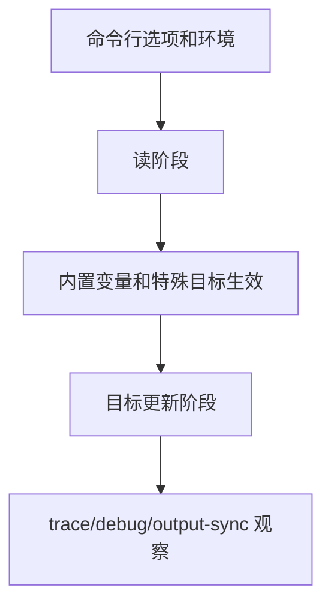

# Makefile特殊目标手册

## 学习目标

读完后，读者应该能说出常见特殊目标的触发条件、适用场景和误用风险，尤其是 `.PHONY`、`.DELETE_ON_ERROR`、`.PRECIOUS`、`.SECONDARY`、`.ONESHELL`、`.NOTPARALLEL` 和 `.SUFFIXES`。

本篇进入工程化 Makefile 的操作层：如何控制 Make 的特殊行为、命令行行为、递归行为和诊断行为。默认环境是 GNU Make 4.3；更新版本能力会明确标注。

## 前置知识

- 建议先读 [[tools/concepts/Makefile高级依赖|前一篇]]。
- 需要理解规则、变量、自动依赖和配方执行。
- 后续可继续读 [[tools/concepts/Makefile内置变量与命令行|后一篇]]。

## 最小可运行例子

```makefile
# 伪目标声明：动作目标不按同名文件判断
.PHONY: all clean fail-demo              # all/clean/fail-demo 都是动作目标

# 出错删除：目标配方失败时删除残留目标文件
.DELETE_ON_ERROR:                        # 避免留下半成品文件

# 保留中间文件：防止 Make 自动删除指定中间产物
.SECONDARY: intermediate.txt             # intermediate.txt 构建后保留

# 默认目标：生成最终文件
all: final.txt                           # all 依赖最终产物

# 最终目标：由中间文件派生
final.txt: intermediate.txt              # 中间文件更新时重建 final.txt
	@printf 'final from %s\n' '$<' > '$@'  # 写入最终文件

# 中间目标：模拟生成过程
intermediate.txt:                        # 文件缺失时创建
	@printf 'intermediate\n' > '$@'        # 写入中间内容

# 失败示例：手动运行 make fail-demo 观察 DELETE_ON_ERROR
fail-demo:                               # 动作目标，用来演示失败
	@printf 'partial\n' > broken.txt       # 先写半成品文件
	@false                                # 返回失败，让 Make 停止当前目标

# 清理目标：删除示例产物
clean:                                   # 清理动作
	@rm -f final.txt intermediate.txt broken.txt # 删除产物
```

执行命令：

```shell
# 预演默认目标，确认将要执行的配方
make -n
# 执行并打印目标触发原因
make --trace
# 打印 Make 版本，确认默认验证基线
make --version | sed -n '1p'
```

## 语法拆解

- `.PHONY` 声明动作目标，避免同名文件冲突。
- `.DELETE_ON_ERROR` 会在目标配方失败时删除目标文件，减少半成品污染。
- `.SECONDARY` 可保留中间文件，便于调试链式构建。
- `.ONESHELL` 改变配方 shell 模型，应配合错误处理使用。
- `.NOTPARALLEL` 限制并行，适合少量不可并行的共享资源。

| 特殊目标 | 常见用途 | 误用风险 |
|:---|:---|:---|
| `.SILENT` | 全局静默 | 隐藏关键调试信息 |
| `.IGNORE` | 忽略错误 | 让 CI 误判成功 |
| `.PRECIOUS` | 保留失败/中断产物 | 留下过期文件 |
| `.SUFFIXES:` | 清空后缀规则 | 影响依赖旧后缀规则的 Makefile |

## 执行轨迹



对工程 Makefile 来说，语法正确只是最低要求。更重要的是：用户如何调用、子 Make 如何继承参数、失败是否能被 CI 捕获、并行输出是否可读、调试信息是否足以定位问题。

## 工程化写法

特殊目标应该少量、明确、靠近相关规则。IC 回归中可以对共享 license 检查目标使用 `.NOTPARALLEL`，对中间日志使用 `.SECONDARY` 保留调试现场，对失败产物使用 `.DELETE_ON_ERROR` 防止后续步骤读到半成品。

## 常见错误

| 错误现象 | 根因 | 修复 |
|:---|:---|:---|
| 全局 `.IGNORE` 后失败仍通过 | 忽略了所有错误 | 只对明确允许失败的命令局部处理 |
| `.NOTPARALLEL` 让构建很慢 | 过度关闭并行 | 只限制共享资源目标 |
| `.ONESHELL` 中间失败未暴露 | shell flags 未设置严格模式 | 使用 `set -e` 或拆成脚本 |

## 关键要点

- 特殊目标改变 Make 的全局或局部行为。
- `.PHONY` 是动作目标的基本声明。
- `.DELETE_ON_ERROR` 能减少半成品污染。
- `.SECONDARY` 和 `.PRECIOUS` 都与中间产物保留有关，但语义不同。
- 特殊目标应有明确理由，避免全局滥用。

## 与其他概念的关系

- [[tools/concepts/Makefile高级依赖|前一篇]]：提供依赖和规则基础。
- [[tools/concepts/Makefile内置变量与命令行|后一篇]]：继续推进大型项目或实战应用。
- [[tools/工具与脚本|工具与脚本]]：本系列所在的工具领域内容地图。

## 小练习

1. 运行 `make fail-demo`，观察失败后文件状态。
2. 删除 `.SECONDARY`，观察中间文件是否保留。
3. 把 `clean` 的 `.PHONY` 去掉并创建同名文件，观察行为。
