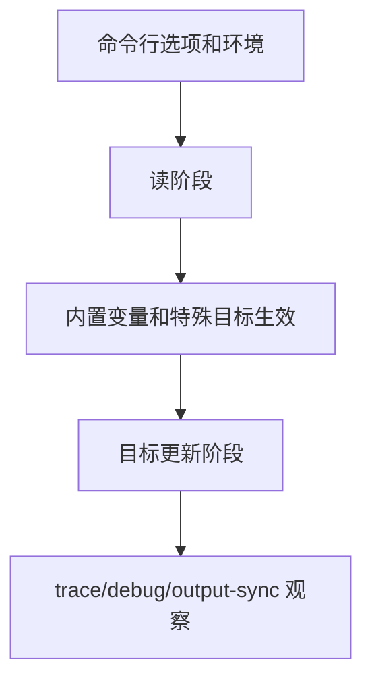

# Makefile内置变量与命令行

## 学习目标

读完后，读者应该能使用 `$(MAKE)`、`$(MAKECMDGOALS)`、`$(MAKEFLAGS)`、`$(MAKELEVEL)`、`$(MAKEFILE_LIST)`、`$(CURDIR)`、`$(.FEATURES)` 等内置变量，并能正确区分常用命令行选项。

本篇进入工程化 Makefile 的操作层：如何控制 Make 的特殊行为、命令行行为、递归行为和诊断行为。默认环境是 GNU Make 4.3；更新版本能力会明确标注。

## 前置知识

- 建议先读 [[tools/concepts/Makefile特殊目标手册|前一篇]]。
- 需要理解规则、变量、自动依赖和配方执行。
- 后续可继续读 [[tools/concepts/Makefile递归与大型项目|后一篇]]。

## 最小可运行例子

```makefile
# 默认目标：打印常用内置变量
all:                                     # all 是观察入口
	@printf 'MAKE=%s\n' '$(MAKE)'          # 递归 Make 应使用 $(MAKE)
	@printf 'MAKECMDGOALS=%s\n' '$(MAKECMDGOALS)' # 用户请求的目标列表
	@printf 'MAKEFLAGS=%s\n' '$(MAKEFLAGS)'       # 传递给子 Make 的标志
	@printf 'MAKELEVEL=%s\n' '$(MAKELEVEL)'       # 递归 Make 层级
	@printf 'MAKEFILE_LIST=%s\n' '$(MAKEFILE_LIST)' # 已读取 Makefile 列表
	@printf 'CURDIR=%s\n' '$(CURDIR)'      # Make 记录的当前目录
	@printf 'FEATURES=%s\n' '$(.FEATURES)' # GNU Make 编译特性列表

# 根据命令行目标做条件判断
ifneq ($(filter clean,$(MAKECMDGOALS)),) # 如果用户请求 clean
$(info clean was requested)              # 读阶段打印提示
endif                                    # 结束 Make 条件

# 递归示例：调用子 Make 时必须使用 $(MAKE)
.PHONY: sub                              # sub 是动作目标
sub:                                     # 递归调用当前 Makefile
	@$(MAKE) --no-print-directory show-level # $(MAKE) 会正确传递 jobserver 等状态

# 子目标：显示递归层级
.PHONY: show-level                       # show-level 是动作目标
show-level:                              # 被 sub 调用
	@printf 'sub MAKELEVEL=%s\n' '$(MAKELEVEL)' # 子 Make 层级会加一

# 清理目标：这里仅打印，不删除文件
.PHONY: clean                            # clean 是动作目标
clean:                                   # 演示 MAKECMDGOALS
	@printf 'clean target\n'               # 打印清理提示
```

执行命令：

```shell
# 预演默认目标，确认将要执行的配方
make -n
# 执行并打印目标触发原因
make --trace
# 打印 Make 版本，确认默认验证基线
make --version | sed -n '1p'
```

## 语法拆解

- `$(MAKE)` 比硬编码 `make` 更可靠，递归调用时能传递关键状态。
- `$(MAKECMDGOALS)` 保存用户请求的目标名。
- `$(MAKEFLAGS)` 保存并传递命令行标志。
- `$(MAKELEVEL)` 表示递归深度。
- `$(MAKEFILE_LIST)` 可用于定位当前 Makefile。
- `-e`/`--environment-overrides` 表示环境变量覆盖 Makefile 变量。
- `-E STRING` 是 `--eval=STRING`，不是环境覆盖。

## 执行轨迹



对工程 Makefile 来说，语法正确只是最低要求。更重要的是：用户如何调用、子 Make 如何继承参数、失败是否能被 CI 捕获、并行输出是否可读、调试信息是否足以定位问题。

## 工程化写法

大型工程应把用户接口集中到少量目标和变量上，例如 `make sim TEST=smoke`、`make syn CORNER=typ`、`make regress -j8`。递归 Make 必须用 `$(MAKE)`，否则并行 jobserver、`MAKEFLAGS` 和特殊递归行为可能丢失。

## 常见错误

| 错误现象 | 根因 | 修复 |
|:---|:---|:---|
| 子 Make 没继承 `-j` | 配方里硬编码 `make` | 使用 `$(MAKE)` |
| 把 `-E` 当环境覆盖 | 混淆短选项 | 环境覆盖是 `-e`，`-E STRING` 是 eval |
| 多目标场景判断错误 | 只比较完整 `MAKECMDGOALS` | 用 `$(filter target,$(MAKECMDGOALS))` |

## 关键要点

- `$(MAKE)` 是递归 Make 的标准入口。
- `MAKEFLAGS` 会把许多命令行标志传给子 Make。
- `MAKELEVEL` 能检测递归深度。
- `MAKEFILE_LIST` 可定位当前 Makefile 路径。
- `-e` 和 `-E STRING` 语义完全不同。

## 与其他概念的关系

- [[tools/concepts/Makefile特殊目标手册|前一篇]]：提供依赖和规则基础。
- [[tools/concepts/Makefile递归与大型项目|后一篇]]：继续推进大型项目或实战应用。
- [[tools/工具与脚本|工具与脚本]]：本系列所在的工具领域内容地图。

## 小练习

1. 运行 `make sub`，观察 `MAKELEVEL`。
2. 运行 `make clean`，观察读阶段提示。
3. 运行 `make --eval="X:=1"`，思考它和 `-e` 的差异。
