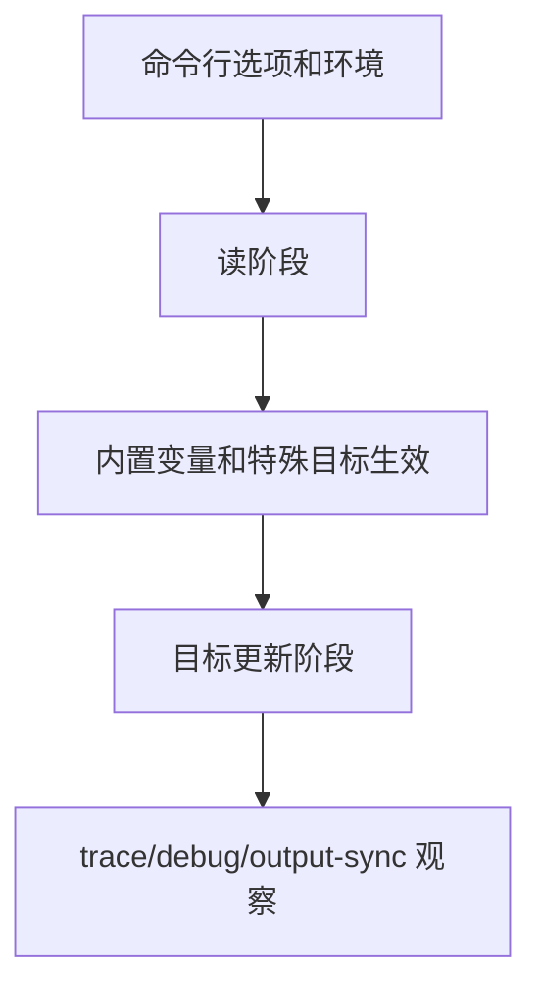

# Makefile递归与大型项目

## 学习目标

读完后，读者应该能设计 `$(MAKE) -C` 子目录调用，理解变量 export/unexport、`MAKEFLAGS`、`MAKELEVEL`、out-of-source build，以及递归式和 include 式架构的取舍。

本篇进入工程化 Makefile 的操作层：如何控制 Make 的特殊行为、命令行行为、递归行为和诊断行为。默认环境是 GNU Make 4.3；更新版本能力会明确标注。

## 前置知识

- 建议先读 [[tools/concepts/Makefile内置变量与命令行|前一篇]]。
- 需要理解规则、变量、自动依赖和配方执行。
- 后续可继续读 [[tools/concepts/Makefile调试与性能|后一篇]]。

## 最小可运行例子

```makefile
# 子目录列表：真实项目中可对应 ip/sim/syn 等目录
SUBDIRS := ip sim                         # 两个子模块目录

# 默认目标：只打印计划，避免 make -n 直接触发递归 Make
all:                                      # all 是安全观察入口
	@printf 'run make subdirs to enter: %s\n' '$(SUBDIRS)' # 提示显式递归目标

# 导出变量：传给子 Make 使用
export PROJECT_ROOT := $(CURDIR)          # 子 Make 可读取项目根目录

# 显式递归入口：需要进入子目录时手动请求
.PHONY: subdirs                           # subdirs 是动作目标
subdirs: $(SUBDIRS)                       # subdirs 依赖两个子目录动作目标

# 子目录目标：用 $(MAKE) -C 调用子 Make
$(SUBDIRS):                               # ip 和 sim 都匹配这条规则
	@mkdir -p '$@'                          # 确保子目录存在
	@printf 'all:\n\t@printf "subdir=%%s root=%%s level=%%s\\n" "$$(CURDIR)" "$$(PROJECT_ROOT)" "$$(MAKELEVEL)"\n' > '$@/Makefile' # 生成子 Makefile
	@$(MAKE) --no-print-directory -C '$@' all # 进入子目录执行 all

# include 式示例：大型项目也可 include 子模块片段
-include local.config.mk                  # 缺失时忽略，存在时读取本地配置

# 清理目标：递归清理子目录
.PHONY: clean $(SUBDIRS)                  # 子目录名作为动作目标
clean:                                    # 清理动作
	@rm -rf $(SUBDIRS)                      # 删除示例子目录
```

执行命令：

```shell
# 预演默认目标，确认将要执行的配方
make -n
# 执行并打印目标触发原因
make --trace
# 打印 Make 版本，确认默认验证基线
make --version | sed -n '1p'
```

## 语法拆解

- `$(MAKE) -C dir target` 是递归 Make 的标准写法；含 `$(MAKE)` 的配方行在 `make -n` 下也可能执行。用 shell `printf` 生成 Makefile 片段时，内层格式串的 `%` 需要写成 `%%`，避免被外层 `printf` 消耗。
- `export VAR := value` 会把变量传给子 Make 环境。
- `MAKELEVEL` 在子 Make 中自动递增。
- `MAKEFLAGS` 会传递许多命令行参数，包括并行相关状态。
- include 式架构把多个 `.mk` 片段合并到同一个 Make 进程中。

## 执行轨迹



对工程 Makefile 来说，语法正确只是最低要求。更重要的是：用户如何调用、子 Make 如何继承参数、失败是否能被 CI 捕获、并行输出是否可读、调试信息是否足以定位问题。

## 工程化写法

递归式 Make 边界清楚，适合团队或 IP 独立维护；缺点是跨目录依赖不透明，容易串行化。include 式 Make 能看到全局依赖图，更利于并行和最小重建；缺点是全局文件变大，需要更强规范。IC 项目常混用：顶层递归进入 IP，IP 内部用 include 组织规则。

## 常见错误

| 错误现象 | 根因 | 修复 |
|:---|:---|:---|
| `make -n` 仍进入子 Make | `$(MAKE)` 递归行具有特殊执行语义 | 把递归入口放到显式目标，或确保 dry-run 前置步骤也安全 |
| 子目录并行失效 | 子 Make 没用 `$(MAKE)` | 使用 `$(MAKE) -C` |
| 子目录找不到根路径 | 没有导出项目变量 | `export PROJECT_ROOT := $(CURDIR)` |
| 递归层级无限增长 | 目标递归调用自身 | 用 `MAKELEVEL` 防护或修正目标依赖 |

## 关键要点

- 递归 Make 是工程边界工具，不是默认最佳答案。
- `$(MAKE)` 会启用递归 Make 的特殊处理。
- `export/unexport` 控制变量传播。
- out-of-source build 能隔离源文件和产物。
- include 式架构更容易表达全局依赖。

## 与其他概念的关系

- [[tools/concepts/Makefile内置变量与命令行|前一篇]]：提供依赖和规则基础。
- [[tools/concepts/Makefile调试与性能|后一篇]]：继续推进大型项目或实战应用。
- [[tools/工具与脚本|工具与脚本]]：本系列所在的工具领域内容地图。

## 小练习

1. 运行 `make -j2 subdirs`，观察两个子目录是否可并行。
2. 删除 `export` 行，观察子 Make 输出。
3. 把 `SUBDIRS` 增加 `syn`，观察新增子目录行为。
