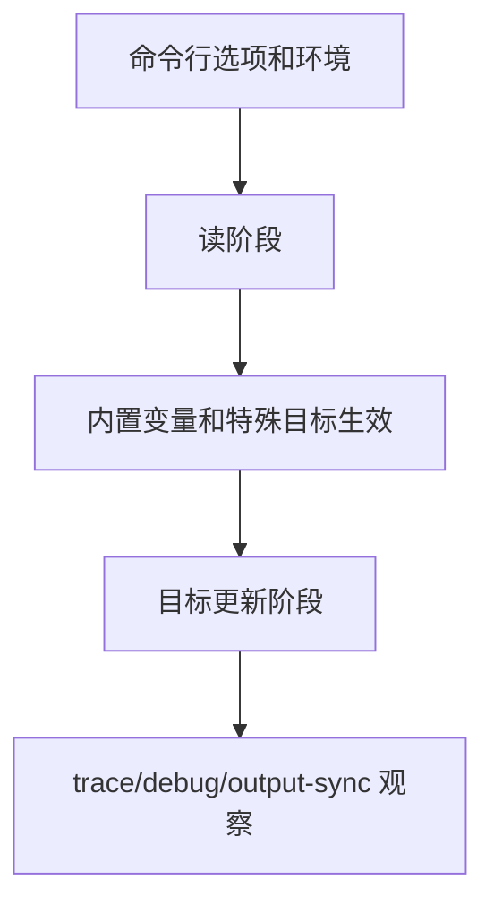

# Makefile调试与性能

## 学习目标

读完后，读者应该能使用 `--trace`、`--debug`、`--warn-undefined-variables`、`$(info)`、`$(warning)`、`--output-sync` 和变量缓存策略定位 Makefile 问题，并能识别常见性能反模式。

本篇进入工程化 Makefile 的操作层：如何控制 Make 的特殊行为、命令行行为、递归行为和诊断行为。默认环境是 GNU Make 4.3；更新版本能力会明确标注。

## 前置知识

- 建议先读 [[tools/concepts/Makefile递归与大型项目|前一篇]]。
- 需要理解规则、变量、自动依赖和配方执行。
- 后续可继续读 [[tools/concepts/Makefile小型工程实战|后一篇]]。

## 最小可运行例子

```makefile
# 缓存 shell 结果：读阶段执行一次
HOST := $(shell uname -s)                 # 用 := 缓存 shell 输出

# 调试开关：用户可运行 make DEBUG=1
DEBUG ?= 0                                # 默认关闭调试信息

# 条件诊断：只在 DEBUG=1 时打印
ifeq ($(DEBUG),1)                         # Make 条件在读阶段判断
$(info debug: HOST=$(HOST))               # info 打印普通诊断信息
$(warning debug mode is enabled)          # warning 打印警告但不中止
endif                                     # 结束条件

# 默认目标：生成一个可观察目标
all: debug.out                            # all 依赖 debug.out

# 文件目标：写入平台信息
debug.out:                                # 没有前置条件，文件缺失时生成
	@printf 'host=%s\n' '$(HOST)' > '$@'    # 写入缓存后的平台名
	@printf 'makeflags=%s\n' '$(MAKEFLAGS)' >> '$@' # 记录命令行标志

# 并行输出示例：两个目标都打印文本
.PHONY: noisy                             # noisy 是动作目标
noisy: a.out b.out                        # 可配合 -j 和 --output-sync 观察输出

# 第一个输出目标
a.out:                                    # 生成 a.out
	@printf 'A line 1\nA line 2\n' > '$@'   # 写入两行文本

# 第二个输出目标
b.out:                                    # 生成 b.out
	@printf 'B line 1\nB line 2\n' > '$@'   # 写入两行文本
```

执行命令：

```shell
# 预演默认目标，确认将要执行的配方
make -n
# 执行并打印目标触发原因
make --trace
# 打印 Make 版本，确认默认验证基线
make --version | sed -n '1p'
```

## 语法拆解

- `--trace` 显示目标为什么重建，适合日常调试。
- `--debug[=FLAGS]` 输出更详细，`i` 可观察隐含规则，`j` 可观察 job。
- `--warn-undefined-variables` 能发现拼写错误。
- `$(info)` 和 `$(warning)` 在读阶段输出诊断。
- `$(shell ...)` 有进程启动成本，应常用 `:=` 缓存。
- `--output-sync` 是 GNU Make 4.3 可用的并行输出同步选项。
- `--shuffle` 是 GNU Make 4.4+ 特性，不属于本机 4.3 默认验证路径。

## 执行轨迹



对工程 Makefile 来说，语法正确只是最低要求。更重要的是：用户如何调用、子 Make 如何继承参数、失败是否能被 CI 捕获、并行输出是否可读、调试信息是否足以定位问题。

## 工程化写法

调试 Makefile 时先用低噪声工具：`make -n` 看命令，`make --trace` 看触发原因，`make --warn-undefined-variables` 看拼写。只有规则选择复杂时再用 `make --debug=i` 或 `make -p`。性能优化优先减少重复 `$(shell)`、递归 Make 层级和不必要的全目录扫描。

## 常见错误

| 错误现象 | 根因 | 修复 |
|:---|:---|:---|
| 每次 make 都很慢 | 读阶段大量 `$(shell find ...)` | 用 `:=` 缓存或生成 `.mk` 文件 |
| 并行输出混乱 | 多目标同时写 stdout | 使用 `--output-sync` 或写日志文件 |
| 变量拼写错但无报错 | 未定义变量默认展开为空 | 加 `--warn-undefined-variables` |

## 关键要点

- `make -n`、`--trace`、`--debug` 适合不同深度的观察。
- 诊断函数在读阶段运行。
- `$(shell)` 应避免重复展开。
- 并行构建要关注输出同步和共享文件竞争。
- GNU Make 4.4+ 的 `--shuffle` 可用于竞态检测，但 GNU Make 4.3 不支持。

## 与其他概念的关系

- [[tools/concepts/Makefile递归与大型项目|前一篇]]：提供依赖和规则基础。
- [[tools/concepts/Makefile小型工程实战|后一篇]]：继续推进大型项目或实战应用。
- [[tools/工具与脚本|工具与脚本]]：本系列所在的工具领域内容地图。

## 小练习

1. 运行 `make DEBUG=1`，观察读阶段输出。
2. 运行 `make -j2 --output-sync=target noisy`，观察输出同步。
3. 把 `HOST :=` 改成 `HOST =`，思考重复展开成本。
