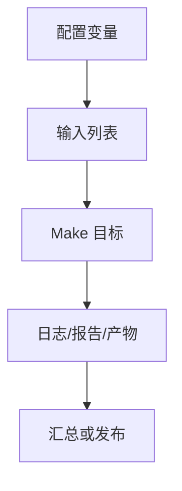

# Makefile小型工程实战

## 学习目标

读完后，读者应该能把小型 C/golden model 工程拆成源文件、对象文件、库、可执行文件、测试、安装、打包和覆盖率入口，并理解哪些目标应该是真实文件、哪些应该是伪目标。

实战篇的重点不是展示复杂业务代码，而是把前面学过的规则、变量、函数、自动依赖、递归和调试方法组合成可迁移的工程框架。默认示例全部使用 mock 命令，读者没有商业 EDA 工具也能运行。

## 前置知识

- 建议先读 [[tools/concepts/Makefile调试与性能|前一篇]]。
- 需要理解模式规则、自动依赖、伪目标和命令行变量覆盖。
- 后续可继续读 [[tools/concepts/Makefile仿真回归实战|后一篇]]。

## 最小可运行例子

```makefile
# 目录配置：集中管理产物路径
BUILD_DIR := build
SRC_DIR := src
TEST_DIR := tests

# 模式配置：用户可用 make MODE=release 切换
MODE ?= debug
CFLAGS_debug := -O0 -g
CFLAGS_release := -O2 -DNDEBUG
CFLAGS := $(CFLAGS_$(MODE))

# 工程产物：用文本文件模拟对象、库和可执行文件
OBJS := $(BUILD_DIR)/main.o $(BUILD_DIR)/model.o
LIB := $(BUILD_DIR)/libgolden.a
APP := $(BUILD_DIR)/golden_app

# 默认目标：构建应用
all: $(APP)

# 链接目标：由库和 main 对象生成
$(APP): $(LIB) $(BUILD_DIR)/main.o | $(BUILD_DIR)
	@printf 'link %s mode=%s\n' '$^' '$(MODE)' > '$@'

# 静态库目标：由对象文件生成
$(LIB): $(OBJS) | $(BUILD_DIR)
	@printf 'archive %s\n' '$^' > '$@'

# 对象模式规则：由源文件生成对象
$(BUILD_DIR)/%.o: $(SRC_DIR)/%.c | $(BUILD_DIR)
	@printf 'compile %s -> %s %s\n' '$<' '$@' '$(CFLAGS)' > '$@'

# 构建目录目标：只负责创建 build
$(BUILD_DIR):
	@mkdir -p '$@'

# 源码目录目标：只负责创建 src
$(SRC_DIR):
	@mkdir -p '$@'

# 测试目录目标：目录名不用 test，避免和 test 伪目标冲突
$(TEST_DIR):
	@mkdir -p '$@'

# main 源文件：生成示例 C 入口
$(SRC_DIR)/main.c: | $(SRC_DIR)
	@printf 'int main(void) { return 0; }\n' > '$@'

# model 源文件：生成示例 golden model
$(SRC_DIR)/model.c: | $(SRC_DIR)
	@printf 'int model(void) { return 0; }\n' > '$@'

# 动作目标声明：这些目标不代表同名文件
.PHONY: test dry-run package install uninstall clean

# 测试目标：依赖应用，生成测试日志
test: $(APP) | $(TEST_DIR)
	@printf 'run tests for %s\n' '$(APP)' > '$(TEST_DIR)/result.log'

# dry-run：打印真实项目中可替换的命令
dry-run:
	@printf 'cc $(CFLAGS) -c src/main.c -o build/main.o\n'
	@printf 'ar rcs $(LIB) $(OBJS)\n'

# 打包目标：依赖应用并生成包描述
package: $(APP) | $(BUILD_DIR)
	@printf 'package $(APP)\n' > '$(BUILD_DIR)/package.txt'

# 安装、卸载、清理：示例中只打印，不破坏系统路径
install uninstall clean:
	@printf '%s target is project-specific\n' '$@'
```

执行命令：

```shell
# 预演命令，确认不会调用真实商业工具
make -n
# 执行默认 mock 流程并显示触发原因
make --trace
# 显式运行 dry-run 入口，查看真实项目中应替换的命令
make dry-run
```

## 语法拆解

- `MODE ?= debug` 给用户提供可覆盖默认值。
- `CFLAGS_$(MODE)` 是配置矩阵的常见写法。
- 对象、库、应用都是真实文件目标，便于增量构建。
- `test`、`dry-run`、`package`、`install` 是动作目标，应声明 `.PHONY`。
- 目录目标放到 order-only 依赖，避免目录时间戳触发重建。

## 执行轨迹



实战 Makefile 应该让读者看出三层边界：用户入口目标、内部真实文件目标、外部工具命令。入口目标要稳定，真实文件目标要可缓存，外部工具命令要能被变量替换。

## 工程化写法

真实 C 工程可把 mock `printf` 替换为 `$(CC) -MMD -MP ...`、`ar rcs`、测试框架命令和覆盖率命令。数字IC项目中的 C golden model 也可用同样结构：库表示模型，应用表示对比工具，测试目标表示样例向量回归。

## 常见错误

| 错误现象 | 根因 | 修复 |
|:---|:---|:---|
| Debug/Release 互相污染 | 产物目录没有按模式隔离 | 把 `BUILD_DIR` 扩展为 `build/$(MODE)` |
| test 每次都重跑且无日志 | 只写伪目标不写真实日志 | 让 test 依赖真实 `tests/result.log` |
| 打包包含旧文件 | clean/package 边界不清 | 明确产物目录和依赖列表 |

## 关键要点

- 小型工程也应区分入口目标和真实文件目标。
- 构建模式适合用变量矩阵表达。
- 对象、库、应用目标可形成清晰 DAG。
- dry-run 目标能帮助迁移到真实工具链。
- 目录应作为 order-only 依赖。

## 与其他概念的关系

- [[tools/concepts/Makefile调试与性能|前一篇]]：提供调试、架构或规则基础。
- [[tools/concepts/Makefile仿真回归实战|后一篇]]：继续推进下一类实战或附录总结。
- [[tools/concepts/Makefile快速参考与版本兼容|Makefile 快速参考与版本兼容]]：提供命令和变量速查。

## 小练习

1. 把 `MODE=release` 传给 make，观察链接产物内容。
2. 把 `BUILD_DIR` 改成 `build/$(MODE)`，避免模式产物混用。
3. 把 mock 编译替换成真实 `$(CC)` 命令。
