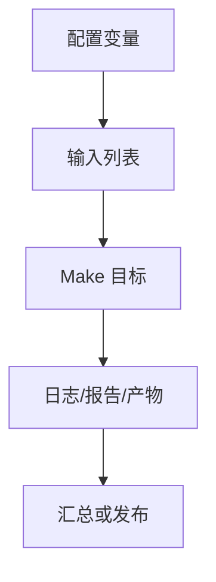

# Makefile仿真回归实战

## 学习目标

读完后，读者应该能设计一个仿真回归入口，组织 simulator 变量、testlist、seed、日志目录、覆盖率合并和失败重跑，并能在没有 EDA 工具时用 mock dry-run 验证调度逻辑。

实战篇的重点不是展示复杂业务代码，而是把前面学过的规则、变量、函数、自动依赖、递归和调试方法组合成可迁移的工程框架。默认示例全部使用 mock 命令，读者没有商业 EDA 工具也能运行。

## 前置知识

- 建议先读 [[tools/concepts/Makefile小型工程实战|前一篇]]。
- 需要理解模式规则、自动依赖、伪目标和命令行变量覆盖。
- 后续可继续读 [[tools/concepts/Makefile综合流程实战|后一篇]]。

## 最小可运行例子

```makefile
# 仿真器选择：真实项目可传 SIM=vcs 或 SIM=xcelium
SIM ?= questa
SEED ?= 1
TESTS := smoke alu fifo
LOG_DIR := logs
COV_DIR := coverage
LOGS := $(foreach t,$(TESTS),$(LOG_DIR)/$(t).log)

# 默认目标：完成全部日志
all: regress

# 动作目标声明：这些目标不代表同名文件
.PHONY: regress dry-run cov rerun clean

# 回归入口：依赖所有日志
regress: $(LOGS)
	@printf 'regression done: %s\n' '$^'

# 单个测试日志规则：用 mock 命令模拟仿真
$(LOG_DIR)/%.log: | $(LOG_DIR)
	@printf 'SIM=%s TEST=%s SEED=%s\n' '$(SIM)' '$*' '$(SEED)' > '$@'
	@printf 'PASS\n' >> '$@'

# 日志目录目标
$(LOG_DIR):
	@mkdir -p '$@'

# 覆盖率目录目标
$(COV_DIR):
	@mkdir -p '$@'

# 覆盖率合并：依赖回归日志
cov: regress | $(COV_DIR)
	@printf 'merge coverage from %s\n' '$(LOGS)' > '$(COV_DIR)/merged.txt'

# 失败重跑：示例中只打印会重跑哪些测试
rerun:
	@printf 'rerun failed tests with SEED=%s\n' '$(SEED)'

# dry-run：展示真实工具命令形状
dry-run:
	@printf '$(SIM) -do run.do +UVM_TESTNAME=<test> +ntb_random_seed=$(SEED)\n'

# clean：示例中打印清理意图
clean:
	@printf 'clean $(LOG_DIR) $(COV_DIR)\n'
```

执行命令：

```shell
# 预演命令，确认不会调用真实商业工具
make -n
# 执行默认 mock 流程并显示触发原因
make --trace
# 显式运行 dry-run 入口，查看真实项目中应替换的命令
make dry-run
```

## 语法拆解

- `SIM ?= questa` 让用户可切换工具封装。
- `TESTS` 是 testlist 的 Make 词表版本。
- `$(foreach ...)` 把测试名映射成日志目标。
- `logs/%.log` 是每个测试的真实文件目标。
- `cov` 依赖 `regress`，保证覆盖率合并基于完整日志。

## 执行轨迹



实战 Makefile 应该让读者看出三层边界：用户入口目标、内部真实文件目标、外部工具命令。入口目标要稳定，真实文件目标要可缓存，外部工具命令要能被变量替换。

## 工程化写法

真实环境中，`SIM` 不应直接散落在每条配方里，而应封装成变量或脚本，例如 `RUN_SIM = $(SIM_BIN) $(SIM_FLAGS) ...`。日志和覆盖率目录要稳定，失败分类最好由脚本解析日志后输出失败列表，再由 Make 的 rerun 目标读取。

## 常见错误

| 错误现象 | 根因 | 修复 |
|:---|:---|:---|
| `make -j` 下日志互相覆盖 | 多个测试写同一个文件 | 每个测试使用独立日志目标 |
| 没有 EDA 工具无法学习 | 示例直接调用 Questa/VCS | 提供 mock dry-run 路径 |
| seed 不可复现 | 随机种子没有记录到日志 | 把 TEST/SEED/SIM 写入日志头 |

## 关键要点

- testlist 可以映射为日志目标列表。
- 每个测试一个日志文件便于并行和失败定位。
- seed 必须可配置且可记录。
- 覆盖率合并应依赖回归结果。
- 真实 EDA 命令应被变量或脚本封装。

## 与其他概念的关系

- [[tools/concepts/Makefile小型工程实战|前一篇]]：提供调试、架构或规则基础。
- [[tools/concepts/Makefile综合流程实战|后一篇]]：继续推进下一类实战或附录总结。
- [[tools/concepts/Makefile快速参考与版本兼容|Makefile 快速参考与版本兼容]]：提供命令和变量速查。

## 小练习

1. 运行 `make SEED=42 regress`，查看日志内容。
2. 给 `TESTS` 添加 `cache`，观察新增日志目标。
3. 把 `SIM=vcs` 传入 dry-run，观察命令变化。
