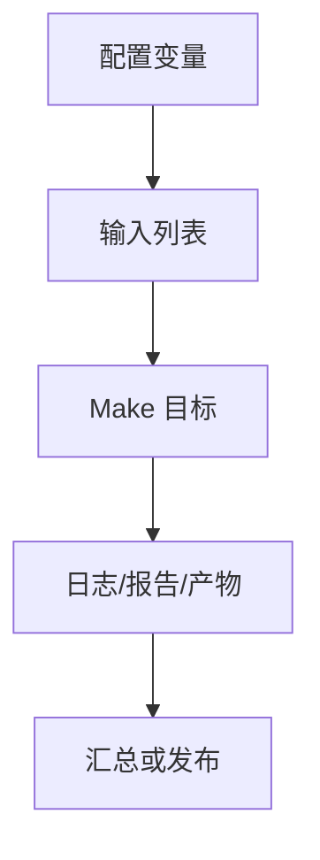

# Makefile综合流程实战

## 学习目标

读完后，读者应该能用 Makefile 封装综合 corner、工具选择、脚本入口、报告目录、QoR 汇总和 checkpoint 管理，并能通过 mock 目标验证流程拓扑。

实战篇的重点不是展示复杂业务代码，而是把前面学过的规则、变量、函数、自动依赖、递归和调试方法组合成可迁移的工程框架。默认示例全部使用 mock 命令，读者没有商业 EDA 工具也能运行。

## 前置知识

- 建议先读 [[tools/concepts/Makefile仿真回归实战|前一篇]]。
- 需要理解模式规则、自动依赖、伪目标和命令行变量覆盖。
- 后续可继续读 [[tools/concepts/MakefileIC项目构建实战|后一篇]]。

## 最小可运行例子

```makefile
# 综合工具和 corner 配置
SYN_TOOL ?= dc
CORNERS := typ slow fast
REPORT_DIR := reports
WORK_DIR := work
QOR_REPORTS := $(foreach c,$(CORNERS),reports/$(c)/qor.rpt)

# 默认目标：生成全部 QoR 报告
all: syn

# 动作目标声明：这些目标不代表同名文件
.PHONY: syn dry-run summary clean

# 综合入口：依赖所有 corner 报告
syn: $(QOR_REPORTS)
	@printf 'synthesis reports: %s\n' '$^'

# 单个 corner 报告：由脚本和目录生成
reports/%/qor.rpt: scripts/syn.tcl | reports/% work/%
	@printf 'tool=%s corner=%s script=%s\n' '$(SYN_TOOL)' '$*' '$<' > '$@'
	@printf 'WNS 0.00\nAREA 1000\n' >> '$@'
	@printf 'checkpoint %s\n' '$*' > 'work/$*/syn.ddc'

# 报告目录模式规则
reports/%:
	@mkdir -p '$@'

# checkpoint 目录模式规则
work/%:
	@mkdir -p '$@'

# 脚本目标：生成最小 Tcl 脚本
scripts/syn.tcl: | scripts
	@printf 'puts "mock synthesis"\n' > '$@'

# scripts 目录目标
scripts:
	@mkdir -p '$@'

# 汇总目标：合并 QoR 报告摘要
summary: syn | reports
	@printf 'summary from %s\n' '$(QOR_REPORTS)' > 'reports/summary.txt'

# reports 根目录目标
reports:
	@mkdir -p '$@'

# dry-run：展示真实工具调用形状
dry-run:
	@printf '$(SYN_TOOL) -f scripts/syn.tcl -x "set CORNER <corner>"\n'

# clean：示例中只打印清理意图
clean:
	@printf 'clean $(REPORT_DIR) $(WORK_DIR)\n'
```

执行命令：

```shell
# 预演命令，确认不会调用真实商业工具
make -n
# 执行默认 mock 流程并显示触发原因
make --trace
# 显式运行 dry-run 入口，查看真实项目中应替换的命令
make dry-run
```

## 语法拆解

- `CORNERS` 是综合矩阵的核心维度。
- `$(foreach ...)` 把 corner 列表映射成报告目标。
- `reports/%/qor.rpt` 使用 stem `$*` 表示 corner。
- report 和 work 目录是 order-only 依赖。
- `dry-run` 显示真实工具替换点，但默认不调用商业工具。

## 执行轨迹



实战 Makefile 应该让读者看出三层边界：用户入口目标、内部真实文件目标、外部工具命令。入口目标要稳定，真实文件目标要可缓存，外部工具命令要能被变量替换。

## 工程化写法

真实综合 Makefile 应把 Tcl 脚本、约束文件、RTL filelist、library set、corner set 明确写成依赖。报告目标应落到稳定目录，checkpoint 要按 corner 和版本隔离。ECO 流程可把上一次 checkpoint 作为输入目标，生成增量报告。

## 常见错误

| 错误现象 | 根因 | 修复 |
|:---|:---|:---|
| 多 corner 报告互相覆盖 | 没有按 corner 分目录 | 使用 `reports/<corner>/qor.rpt` |
| 无工具环境无法验证 | 默认目标直接调用 DC/Genus | 提供 mock 和 dry-run 目标 |
| summary 读到旧报告 | summary 没依赖全部 QoR | 让 summary 依赖 `$(QOR_REPORTS)` 或 `syn` |

## 关键要点

- corner 是综合 Makefile 的自然维度。
- 报告和 checkpoint 应按 corner 隔离。
- dry-run 是真实 EDA 命令接入前的安全验证层。
- Tcl 脚本和约束文件也应进入依赖图。
- ECO 可以建模为 checkpoint 到新报告的增量目标。

## 与其他概念的关系

- [[tools/concepts/Makefile仿真回归实战|前一篇]]：提供调试、架构或规则基础。
- [[tools/concepts/MakefileIC项目构建实战|后一篇]]：继续推进下一类实战或附录总结。
- [[tools/concepts/Makefile快速参考与版本兼容|Makefile 快速参考与版本兼容]]：提供命令和变量速查。

## 小练习

1. 添加 `CORNERS += ss_0p72v`，观察新增报告。
2. 运行 `make SYN_TOOL=genus dry-run`。
3. 把 summary 改成直接依赖 `$(QOR_REPORTS)`，比较语义。
