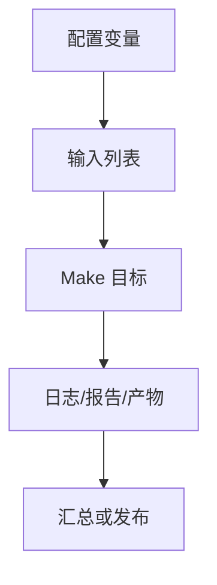

# MakefileIC项目构建实战

## 学习目标

读完后，读者应该能设计一个层次化 IC 项目 Makefile 框架，用统一入口串联 IP 准备、仿真、综合、STA、DFT、发布和 CI 退出码。

实战篇的重点不是展示复杂业务代码，而是把前面学过的规则、变量、函数、自动依赖、递归和调试方法组合成可迁移的工程框架。默认示例全部使用 mock 命令，读者没有商业 EDA 工具也能运行。

## 前置知识

- 建议先读 [[tools/concepts/Makefile综合流程实战|前一篇]]。
- 需要理解模式规则、自动依赖、伪目标和命令行变量覆盖。
- 后续可继续读 [[tools/concepts/Makefile常见错误50例|后一篇]]。

## 最小可运行例子

```makefile
# 项目配置：真实项目可放入 .config.mk
PROJECT ?= demo_soc
IPS := cpu bus mem
OUT_DIR := out

# 允许本地配置覆盖默认值
-include .config.mk

# 每个 IP 的准备 stamp
IP_STAMPS := $(foreach ip,$(IPS),out/ip/$(ip).ready)

# 默认目标：完成项目基本构建
all: sim syn sta dft

# 动作目标声明：这些目标不代表同名文件
.PHONY: sim syn sta dft release dry-run clean ci

# IP 准备：每个 IP 一个 ready stamp
out/ip/%.ready: | out/ip
	@printf 'prepare ip %s\n' '$*' > '$@'

# 目录目标：创建统一产物目录
out/ip out/sim out/syn out/sta out/dft out/release:
	@mkdir -p '$@'

# 顶层流程入口：动作目标依赖真实 stamp
sim: out/sim/pass.stamp
syn: out/syn/pass.stamp
sta: out/sta/pass.stamp
dft: out/dft/pass.stamp

# 仿真 stamp：依赖 IP 准备
out/sim/pass.stamp: $(IP_STAMPS) | out/sim
	@printf 'sim project $(PROJECT) ips=%s\n' '$(IPS)' > '$@'

# 综合 stamp：依赖 IP 准备
out/syn/pass.stamp: $(IP_STAMPS) | out/syn
	@printf 'syn project $(PROJECT)\n' > '$@'

# STA stamp：依赖综合完成
out/sta/pass.stamp: out/syn/pass.stamp | out/sta
	@printf 'sta from syn\n' > '$@'

# DFT stamp：依赖综合完成
out/dft/pass.stamp: out/syn/pass.stamp | out/dft
	@printf 'dft from syn\n' > '$@'

# 发布目标：依赖所有签核入口
release: sim syn sta dft | out/release
	@printf 'release $(PROJECT)\n' > 'out/release/release.txt'

# CI 入口：依赖 release，失败会传递非零退出码
ci: release
	@printf 'ci pass\n'

# dry-run：展示真实工具替换点
dry-run:
	@printf 'make sim TEST=<name>; make syn CORNER=<corner>; make sta; make dft\n'

# clean：示例中只打印清理意图
clean:
	@printf 'clean $(OUT_DIR)\n'
```

执行命令：

```shell
# 预演命令，确认不会调用真实商业工具
make -n
# 执行默认 mock 流程并显示触发原因
make --trace
# 显式运行 dry-run 入口，查看真实项目中应替换的命令
make dry-run
```

## 语法拆解

- `.config.mk` 适合保存本地覆盖配置，不应强制提交私人路径。
- IP ready stamp 把 IP 准备变成真实文件目标。
- `sim/syn/sta/dft` 是用户入口，内部依赖真实 stamp。
- `sta` 和 `dft` 依赖综合 stamp，表达流程顺序。
- `ci` 入口依赖 release，失败退出码可直接传给流水线。

## 执行轨迹



实战 Makefile 应该让读者看出三层边界：用户入口目标、内部真实文件目标、外部工具命令。入口目标要稳定，真实文件目标要可缓存，外部工具命令要能被变量替换。

## 工程化写法

项目级 Makefile 的关键是统一入口和清晰产物目录。每个流程可以在子目录维护自己的 `.mk` 片段，但顶层要提供稳定目标：`sim`、`regress`、`syn`、`sta`、`dft`、`release`、`clean`、`help`。版本发布应记录输入配置、工具版本和产物路径。

## 常见错误

| 错误现象 | 根因 | 修复 |
|:---|:---|:---|
| 顶层目标只串命令无文件产物 | 无法增量和定位失败 | 用 pass.stamp/log/report 表示真实完成状态 |
| 私人路径被提交 | `.config.mk` 没有隔离 | 本地配置用 `-include .config.mk` 并加入忽略策略 |
| CI 误判通过 | 配方吞掉错误码 | 让失败命令返回非零，避免全局 `.IGNORE` |

## 关键要点

- 项目级 Makefile 应提供稳定统一入口。
- 内部流程完成状态应落成真实 stamp 或报告文件。
- IP 依赖要显式进入 DAG。
- 本地配置和仓库默认配置要分离。
- CI 目标应继承真实流程的失败退出码。

## 与其他概念的关系

- [[tools/concepts/Makefile综合流程实战|前一篇]]：提供调试、架构或规则基础。
- [[tools/concepts/Makefile常见错误50例|后一篇]]：继续推进下一类实战或附录总结。
- [[tools/concepts/Makefile快速参考与版本兼容|Makefile 快速参考与版本兼容]]：提供命令和变量速查。

## 小练习

1. 运行 `make IPS="cpu bus mem dma"`，观察新增 IP ready 文件。
2. 创建 `.config.mk` 覆盖 `PROJECT`，观察 release 内容。
3. 把 `sta` 对综合的依赖去掉，解释风险。
