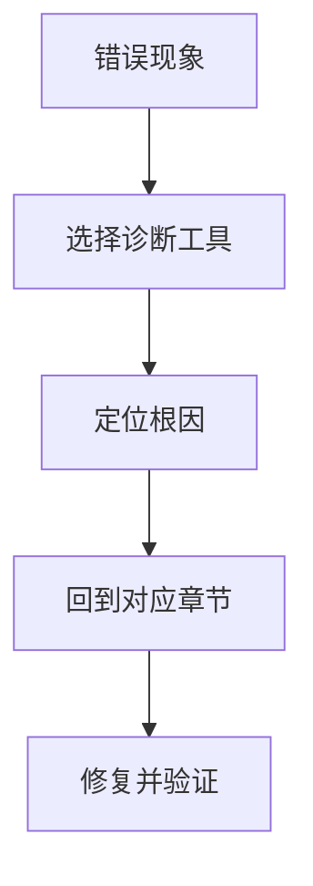

# Makefile常见错误50例

## 学习目标

本篇把 Makefile 高频错误整理成可检索表格。读者遇到报错、错误重建、变量异常、并行竞态或跨平台问题时，可以先按现象定位类别，再回到对应章节复习原理。

错误排查不要从猜测开始。优先使用 `make -n` 看命令，`make --trace` 看触发原因，`make --warn-undefined-variables` 看变量拼写，必要时用 `make -p` 和 `--debug` 查看规则数据库。

## 前置知识

- 建议先读 [[tools/concepts/MakefileIC项目构建实战|Makefile IC项目构建实战]]。
- 需要理解规则、变量、依赖、配方、并行和命令行选项。
- 后续可继续读 [[tools/concepts/Makefile快速参考与版本兼容|Makefile 快速参考与版本兼容]]。

## 最小可运行例子

```makefile
# 默认目标：演示变量诊断和未定义变量警告
all:
	@printf 'origin=%s\n' '$(origin CFLAGS)'
	@printf 'flavor=%s\n' '$(flavor CFLAGS)'
	@printf 'missing=%s\n' '$(MISSPELLED)'

# 伪目标：错误排查时常用的 dry-run 入口
.PHONY: debug
debug:
	@printf 'try: make -n; make --trace; make --warn-undefined-variables\n'
```

执行命令：

```shell
# 打开未定义变量警告，观察 MISSPELLED 的提示
make --warn-undefined-variables
# 预演命令，确认配方展开结果
make -n
# 显示目标触发原因
make --trace
```

## 语法拆解

- `$(origin CFLAGS)` 用于检查变量来源，例如 file、command line、environment。
- `$(flavor CFLAGS)` 用于检查变量是 recursive 还是 simple。
- `$(MISSPELLED)` 故意拼错，用来展示未定义变量警告。
- `debug` 是伪目标，提供排查命令提示。

## 执行轨迹



## 工程化写法

团队项目可以把本篇作为 code review checklist。新增 Makefile 规则时至少检查：目标是否真实文件、伪目标是否声明、目录是否 order-only、变量是否允许用户覆盖、并行下是否写共享文件、失败是否返回非零退出码。

## 常见错误

| # | 分类 | 错误现象 | 修复方向 |
|:---|:---|:---|:---|
| 1 | 语法/格式 | 配方用空格而非 TAB | 用 trace/诊断函数定位后，回到对应章节按规则修复 |
| 2 | 语法/格式 | 编辑器把 TAB 转空格 | 用 trace/诊断函数定位后，回到对应章节按规则修复 |
| 3 | 语法/格式 | 条件指令放进 TAB 配方 | 用 trace/诊断函数定位后，回到对应章节按规则修复 |
| 4 | 语法/格式 | 续行反斜杠后有空格或注释 | 用 trace/诊断函数定位后，回到对应章节按规则修复 |
| 5 | 语法/格式 | 变量引用漏括号导致歧义 | 用 trace/诊断函数定位后，回到对应章节按规则修复 |
| 6 | 语法/格式 | 变量名混入空格 | 用 trace/诊断函数定位后，回到对应章节按规则修复 |
| 7 | 语法/格式 | define 块缩进混乱 | 用 trace/诊断函数定位后，回到对应章节按规则修复 |
| 8 | 语法/格式 | 配方空行含空格导致误判 | 用 trace/诊断函数定位后，回到对应章节按规则修复 |
| 9 | 语法/格式 | 文件末尾缺换行 | 用 trace/诊断函数定位后，回到对应章节按规则修复 |
| 10 | 语法/格式 | 配方中 # 被 shell 当注释而非 Make 注释 | 用 trace/诊断函数定位后，回到对应章节按规则修复 |
| 11 | 变量展开 | 递归变量重复执行 shell | 用 trace/诊断函数定位后，回到对应章节按规则修复 |
| 12 | 变量展开 | 简单变量误以为会动态更新 | 用 trace/诊断函数定位后，回到对应章节按规则修复 |
| 13 | 变量展开 | += 被误解为丢原值 | `+=` 保留原值；检查变量 flavor 和追加文本展开时机 |
| 14 | 变量展开 | 自动变量在全局上下文为空 | 用 trace/诊断函数定位后，回到对应章节按规则修复 |
| 15 | 变量展开 | 变量拼写错误静默为空 | 用 trace/诊断函数定位后，回到对应章节按规则修复 |
| 16 | 变量展开 | export 传递过多变量 | 用 trace/诊断函数定位后，回到对应章节按规则修复 |
| 17 | 变量展开 | 命令行覆盖和 override 混淆 | 用 trace/诊断函数定位后，回到对应章节按规则修复 |
| 18 | 变量展开 | 条件读取尚未定义变量 | 用 trace/诊断函数定位后，回到对应章节按规则修复 |
| 19 | 变量展开 | origin 返回值理解错误 | 用 trace/诊断函数定位后，回到对应章节按规则修复 |
| 20 | 变量展开 | eval 中 $ 转义层数错误 | 先打印 `$(call ...)` 展开文本；在 eval 模板中用 `$$` 保留自动变量 |
| 21 | 变量展开 | target-specific 作用域不清 | 用 trace/诊断函数定位后，回到对应章节按规则修复 |
| 22 | 变量展开 | 环境变量 -e 覆盖 Makefile | 用 trace/诊断函数定位后，回到对应章节按规则修复 |
| 23 | 依赖/目标 | 目标与目录同名 | 用 trace/诊断函数定位后，回到对应章节按规则修复 |
| 24 | 依赖/目标 | 忘记 .PHONY | 用 trace/诊断函数定位后，回到对应章节按规则修复 |
| 25 | 依赖/目标 | 目录作为普通依赖触发重建 | 把目录放到 order-only 依赖 `|` 右侧 |
| 26 | 依赖/目标 | 模式规则匹配过宽 | 用 trace/诊断函数定位后，回到对应章节按规则修复 |
| 27 | 依赖/目标 | 隐含规则意外接管目标 | 用 trace/诊断函数定位后，回到对应章节按规则修复 |
| 28 | 依赖/目标 | VPATH 找到错误同名文件 | 用 trace/诊断函数定位后，回到对应章节按规则修复 |
| 29 | 依赖/目标 | 循环依赖 | 用 trace/诊断函数定位后，回到对应章节按规则修复 |
| 30 | 依赖/目标 | 依赖列出不存在头文件 | 用 trace/诊断函数定位后，回到对应章节按规则修复 |
| 31 | 依赖/目标 | 自动依赖首次 include 报错 | 首次生成的 `.d` 文件使用 `-include` |
| 32 | 依赖/目标 | 删除头文件后 .d 报错 | 用 trace/诊断函数定位后，回到对应章节按规则修复 |
| 33 | 依赖/目标 | Makefile remake 循环 | 用 trace/诊断函数定位后，回到对应章节按规则修复 |
| 34 | 依赖/目标 | 多目标规则语义误判 | 用 trace/诊断函数定位后，回到对应章节按规则修复 |
| 35 | 并行构建 | 两个目标写同一临时文件 | 用 trace/诊断函数定位后，回到对应章节按规则修复 |
| 36 | 并行构建 | clean 与构建并行竞争 | 用 trace/诊断函数定位后，回到对应章节按规则修复 |
| 37 | 并行构建 | 日志输出交错 | 用 trace/诊断函数定位后，回到对应章节按规则修复 |
| 38 | 并行构建 | 子 Make 没用 $(MAKE) | 用 trace/诊断函数定位后，回到对应章节按规则修复 |
| 39 | 并行构建 | 共享 license 检查并行冲突 | 用 trace/诊断函数定位后，回到对应章节按规则修复 |
| 40 | 并行构建 | 静态库并行写入冲突 | 用 trace/诊断函数定位后，回到对应章节按规则修复 |
| 41 | 并行构建 | 目录创建竞态 | 用 trace/诊断函数定位后，回到对应章节按规则修复 |
| 42 | 并行构建 | 过度使用 .NOTPARALLEL | 用 trace/诊断函数定位后，回到对应章节按规则修复 |
| 43 | 跨平台/性能 | sed -i 在 macOS/Linux 不同 | 用 trace/诊断函数定位后，回到对应章节按规则修复 |
| 44 | 跨平台/性能 | echo -e 行为不同 | 用 trace/诊断函数定位后，回到对应章节按规则修复 |
| 45 | 跨平台/性能 | /bin/sh 指向 dash 而非 bash | 用 trace/诊断函数定位后，回到对应章节按规则修复 |
| 46 | 跨平台/性能 | 路径大小写敏感性不同 | 用 trace/诊断函数定位后，回到对应章节按规则修复 |
| 47 | 跨平台/性能 | 路径分隔符 Windows 差异 | 用 trace/诊断函数定位后，回到对应章节按规则修复 |
| 48 | 跨平台/性能 | 每次 make 都 find 全库 | 用 trace/诊断函数定位后，回到对应章节按规则修复 |
| 49 | 跨平台/性能 | 递归 Make 层级过深 | 用 trace/诊断函数定位后，回到对应章节按规则修复 |
| 50 | 跨平台/性能 | -j 过大导致 I/O 抖动 | 用 trace/诊断函数定位后，回到对应章节按规则修复 |

## 关键要点

- `+=` 不会丢失原有值；真正要分析的是原变量 flavor 和追加文本展开时机。
- `$(eval ...)` 出现在配方中时，会在配方展开阶段触发 Make 语法解析，风险是时机混乱和难调试。
- 大多数“没重建/总重建”问题都能回到目标、依赖和时间戳解释。
- 大多数变量问题都能用 `origin/flavor/value` 先缩小范围。
- 并行问题要优先查共享输出文件、递归 Make 和清理目标竞争。
- 跨平台问题要避免依赖 shell 命令的非标准行为。

## 与其他概念的关系

- [[tools/concepts/Makefile调试与性能|Makefile 调试与性能]]：提供系统诊断工具。
- [[tools/concepts/Makefile快速参考与版本兼容|Makefile 快速参考与版本兼容]]：提供语法和版本速查。
- [[tools/concepts/Makefile依赖与自动生成|Makefile 依赖与自动生成]]：解释自动依赖相关错误。

## 小练习

1. 运行示例并解释 `MISSPELLED` 警告。
2. 从 50 个错误中选 5 个，写出对应的诊断命令。
3. 检查自己的 Makefile 是否有目录普通依赖和未声明伪目标。
