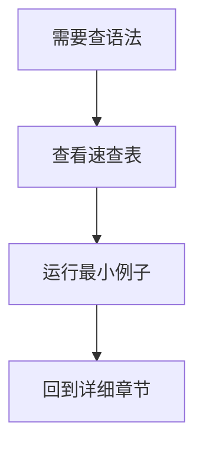

# Makefile快速参考与版本兼容

## 学习目标

本篇提供 Makefile 系列的速查入口。读者不需要从头翻每篇文章，可以在这里快速查变量赋值、自动变量、函数、特殊目标、命令行选项和版本兼容性。

速查表不是学习替代品。遇到不理解的行为时，应回到对应章节看最小例子和执行轨迹；本篇用于复习和 code review。

## 前置知识

- 建议先读 [[tools/concepts/Makefile常见错误50例|Makefile 常见错误50例]]。
- 需要理解 GNU Make 4.3 是本讲义默认验证环境。
- 可回看 [[tools/concepts/Makefile解决的问题与第一个例子|Makefile 解决的问题与第一个例子]]。

## 最小可运行例子

```makefile
# 默认目标：打印版本、特性和常用自动变量示例
all: ref.out                              # all 依赖 ref.out

# 文件目标：生成一个速查观察文件
ref.out: input.txt                        # ref.out 依赖 input.txt
	@printf 'MAKE_VERSION=%s\n' '$(MAKE_VERSION)' > '$@' # GNU Make 版本
	@printf 'FEATURES=%s\n' '$(.FEATURES)' >> '$@'       # GNU Make 特性
	@printf 'target=%s first=%s all=%s\n' '$@' '$<' '$^' >> '$@' # 自动变量

# 输入文件：创建示例输入
input.txt:                                # 输入文件缺失时生成
	@printf 'input\n' > '$@'                # 写入一行文本
```

执行命令：

```shell
# 打印将要执行的命令
make -n
# 执行并显示触发原因
make --trace
# 查看 GNU Make 版本
make --version | sed -n '1p'
```

## 语法拆解

- `$(MAKE_VERSION)` 是 GNU Make 版本变量。
- `$(.FEATURES)` 可以检测 GNU Make 编译能力和语法特性。
- `$@`、`$<`、`$^` 是最常用自动变量。
- 本篇示例默认只使用 GNU Make 4.3 可验证能力。

## 执行轨迹



## 工程化写法

项目可以把本篇的表格转化为团队 Makefile 规范：默认目标命名、变量命名、目录约定、命令行覆盖方式、GNU Make 版本下限和禁止使用的方言特性。IC 项目若需要跨 Linux 发行版或 EDA 环境，建议在 `help` 目标中打印 `$(MAKE_VERSION)` 和关键工具版本。

## 常见错误

| 错误现象 | 根因 | 修复 |
|:---|:---|:---|
| 使用了 GNU Make 4.4+ 特性但环境是 4.3 | 没有版本基线 | 用 `$(MAKE_VERSION)` 或文档约束检查 |
| 把 BSD Make 语法复制到 GNU Make | 方言混用 | 标注工具方言并隔离示例 |
| 命令行覆盖无效 | 变量赋值方式不匹配 | 使用 `?=` 暴露默认值，必要时解释 `override` |

## 关键要点

- 本讲义默认验证基线是 GNU Make 4.3。
- GNU Make 4.4+ 特性必须显式标注，不进入默认路径。
- POSIX Make 是较小公共子集，不包含大量 GNU 扩展。
- BSD Make 和 NMAKE 不是 GNU Make 的轻微变体，而是不同方言。
- 速查表用于回忆语法，行为不明时仍要运行最小例子。

## 变量赋值速查

| 写法 | 名称 | 展开时机 | 常见用途 |
|:---|:---|:---|:---|
| `VAR = x` | 递归展开 | 引用时 | 延迟组合变量 |
| `VAR := x` | 简单展开 | 读阶段 | 缓存 shell 结果 |
| `VAR ?= x` | 默认赋值 | 未定义时 | 用户可覆盖默认值 |
| `VAR += x` | 追加赋值 | 取决于原 flavor | 追加编译选项 |
| `VAR != cmd` | shell 赋值 | 读阶段 | 保存命令输出 |

## 自动变量速查

| 变量 | 含义 | 典型场景 |
|:---|:---|:---|
| `$@` | 当前目标 | 输出文件 |
| `$<` | 第一个前置条件 | 单源编译 |
| `$^` | 去重后的全部前置条件 | 链接 |
| `$+` | 保留重复的全部前置条件 | 链接顺序敏感场景 |
| `$?` | 比目标新的前置条件 | 增量归档 |
| `$*` | stem | 模式规则 |
| `$|` | order-only 前置条件 | 目录诊断 |

## 函数速查

| 分类 | 函数 | 用途 |
|:---|:---|:---|
| 文本 | `subst`、`patsubst`、`filter`、`filter-out`、`sort` | 词表转换 |
| 词表 | `word`、`wordlist`、`words`、`firstword`、`lastword` | 取词和计数 |
| 路径 | `dir`、`notdir`、`suffix`、`basename` | 路径拆分 |
| 组合 | `addprefix`、`addsuffix`、`join` | 路径和选项组合 |
| 控制 | `if`、`or`、`and`、`foreach`、`call`、`eval` | 条件、循环、模板 |
| 诊断 | `info`、`warning`、`error`、`origin`、`flavor`、`value` | 调试 |
| 外部 | `shell`、`file`、`wildcard` | 命令、文件、通配 |

## 特殊目标速查

| 特殊目标 | 用途 | 注意 |
|:---|:---|:---|
| `.PHONY` | 声明动作目标 | 避免同名文件冲突 |
| `.DELETE_ON_ERROR` | 失败删除目标 | 避免半成品 |
| `.SECONDARY` | 保留中间文件 | 便于调试 |
| `.PRECIOUS` | 中断/失败时保留目标 | 防止误删昂贵产物 |
| `.ONESHELL` | 一个规则一个 shell | 注意错误传播 |
| `.NOTPARALLEL` | 限制并行 | 不要全局滥用 |
| `.SUFFIXES:` | 清空后缀规则 | 减少隐含行为 |

## 命令行选项速查

| 选项 | 用途 |
|:---|:---|
| `-n` / `--dry-run` | 预演配方 |
| `--trace` | 显示目标触发原因 |
| `--warn-undefined-variables` | 未定义变量警告 |
| `-p` | 打印数据库 |
| `-r` / `-R` | 禁用内置规则/变量 |
| `-j N` | 并行构建 |
| `--output-sync[=TYPE]` | 并行输出同步 |
| `-e` | 环境变量覆盖 Makefile 变量 |
| `-E STRING` | `--eval=STRING`，不是环境覆盖 |

## 版本兼容表

| 能力 | GNU Make 4.3 | GNU Make 4.4+ | POSIX Make | BSD Make | NMAKE |
|:---|:---|:---|:---|:---|:---|
| 基本规则 | 支持 | 支持 | 支持 | 支持 | 语法不同 |
| `:=` | 支持 | 支持 | 部分实现 | 支持 | 语法不同 |
| `$(file ...)` | 支持 | 支持 | 不支持 | 不支持 | 不支持 |
| `.SECONDEXPANSION` | 支持 | 支持 | 不支持 | 不支持 | 不支持 |
| grouped targets `&:` | 支持 | 支持 | 不支持 | 不支持 | 不支持 |
| `--trace` | 支持 | 支持 | 不支持 | 不支持 | 不支持 |
| `--shuffle` | 不支持 | 支持 | 不支持 | 不支持 | 不支持 |
| `$(let)` / `$(intcmp)` | 不支持 | 支持 | 不支持 | 不支持 | 不支持 |

## 与其他概念的关系

- [[tools/concepts/Makefile常见错误50例|Makefile 常见错误50例]]：从错误现象回到速查表。
- [[tools/concepts/Makefile内置变量与命令行|Makefile 内置变量与命令行]]：详细解释命令行选项。
- [[tools/concepts/Makefile特殊目标手册|Makefile 特殊目标手册]]：详细解释特殊目标。

## 小练习

1. 运行示例并查看 `ref.out` 中的 `MAKE_VERSION`。
2. 从函数速查表中任选 3 个函数，回到对应章节找最小例子。
3. 检查自己的环境是否支持 `--shuffle`，并解释为什么本讲义不把它放入默认路径。
