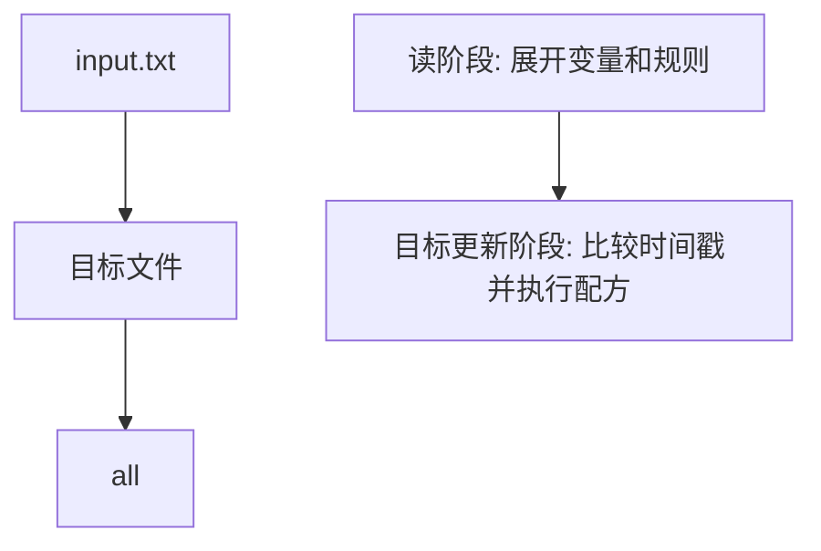

# Makefile宏与元编程

## 学习目标

本篇属于 Part 4，目标是：用 define、call、eval 写可复用模板，同时控制抽象复杂度。 读完后，读者应该能把一个最小例子复制到临时目录中运行，观察 GNU Make 4.3 如何解析规则、比较时间戳并执行配方。

这个主题不是孤立语法点。它会反复回到三个问题：Make 在读阶段做了什么、目标更新阶段做了什么、这些行为如何迁移到数字IC工程中的仿真、综合、回归和报告生成流程。

## 前置知识

- 需要知道命令行中 `make` 会读取当前目录的 `Makefile`。
- 需要知道文件修改时间会影响增量构建判断。
- 如果正在顺序学习，建议先读 [[tools/concepts/Makefile条件判断|前一篇]]，再读 [[tools/concepts/Makefile模式规则|后一篇]]。

## 最小可运行例子

在空目录中创建 `Makefile`，复制下面的内容，然后运行 `make --trace`。示例目标是 `macro.out`，它足够小，便于观察每一步行为。

```makefile
# 默认目标：用户只输入 make 时，Make 会选择第一个普通目标
all: macro.out          # all 是目标；冒号右边的文件是前置条件

# 真实文件目标：当 macro.out 不存在或依赖更新时执行配方
macro.out: input.txt    # input.txt 比目标新时，目标需要重建
	@mkdir -p $(dir $@)  # $@ 是目标名；$(dir ...) 取目标所在目录
	@printf 'built from %s\n' "$<" > $@  # $< 是第一个前置条件
	@printf 'target: %s\n' "$@" >> $@    # 追加目标名，便于观察结果

# 准备输入文件：用普通文件保存构建输入
input.txt:             # 无前置条件；文件不存在时执行
	@printf 'source\n' > $@  # 创建 input.txt，$@ 展开为目标名

# 伪目标：clean 不代表同名文件，只代表一个动作
.PHONY: clean          # 声明 clean 永远按动作处理，避免同名文件冲突
clean:                 # 清理构建产物
	@rm -rf macro.out input.txt  # 删除示例产物，方便重新实验
```

执行命令：

```shell
# 删除上一次实验留下的文件，保证从干净状态开始
make clean
# 只打印将要执行的命令，不真正执行配方
make -n
# 打印规则触发原因，并真正执行构建
make --trace
# 第二次运行，用来观察目标已经最新时的行为
make --trace
```

预期现象：第一次 `make --trace` 会创建输入和目标文件；第二次 `make --trace` 不应重复构建已经最新的目标。这个差异就是 Makefile 比普通脚本更适合工程构建的核心原因。

## 语法拆解

- `all: macro.out` 表示 `all` 依赖 `macro.out`；`all` 放在最前面，因此成为默认目标。
- `macro.out: input.txt` 表示真实文件目标依赖输入文件；当输入比目标新时，目标需要重建。
- 配方行前面的 TAB 是 Make 语法要求，不是排版习惯；用空格替代会导致解析错误。
- `$@` 是自动变量，代表当前目标名；在这个例子中会展开为 `macro.out`。
- `$<` 是自动变量，代表第一个前置条件；在这个例子中会展开为 `input.txt`。
- `$(dir $@)` 是 Make 函数调用，先由 Make 展开，再交给 Shell 执行。
- `@` 前缀让 Make 不回显该配方行本身，只显示命令产生的输出。
- `.PHONY: clean` 告诉 Make `clean` 是动作，不是同名文件。

## 执行轨迹



`make -n` 适合确认将要执行什么；`make --trace` 适合确认为什么执行；`make -p` 适合查看 Make 内部数据库。初学者调试 Makefile 时，优先使用 `make --trace`，因为它能把目标、依赖和触发原因连起来。

当输出与预期不同，先检查三个层次：Make 是否读到了正确文件，目标和依赖是否形成了正确图，配方中的 Shell 命令是否能独立运行。

## 工程化写法

工程项目中，不建议把所有命令写在一个巨大目标里。更稳妥的方式是把“生成输入”“编译对象”“链接产物”“运行测试”“清理产物”拆成多个目标，让 Make 用依赖图决定最小重建范围。

数字IC项目中也一样：仿真日志、覆盖率数据库、综合报告、QoR 摘要都可以建模为目标文件。Makefile 的价值不是把命令塞进快捷方式，而是让产物关系、失败边界和重跑范围变得明确。

## 常见错误

| 错误现象 | 根因 | 修复 |
|:---|:---|:---|
| `missing separator` | 配方行用了空格而不是 TAB | 把配方行缩进改成真实 TAB，或显式使用 `.RECIPEPREFIX` |
| 修改 `input.txt` 后没有重建 | 目标没有把 `input.txt` 写进前置条件 | 把真实输入文件列入目标右侧依赖 |
| `make clean` 没有效果 | 存在同名文件或目标没有声明伪目标 | 添加 `.PHONY: clean` |

## 关键要点

- Makefile 描述的是目标和依赖，不是简单的命令清单。
- 第一个普通目标是默认目标，文件顺序会影响用户直接输入 `make` 的行为。
- 真实文件目标由时间戳决定是否重建。
- 自动变量只在规则上下文中有意义，不能脱离目标随意使用。
- `make -n` 和 `make --trace` 是初学者最重要的两个观察工具。
- 数字IC流程中的日志、报告、数据库和 checkpoint 都可以被建模为目标。

## 与其他概念的关系

- [[tools/concepts/Makefile条件判断|前一篇]]：提供本篇需要的前置背景或相邻概念。
- [[tools/concepts/Makefile模式规则|后一篇]]：把本篇概念推进到下一层工程用法。
- [[tools/工具与脚本|工具与脚本]]：本系列所在的工具领域内容地图。

## 小练习

1. 把 `macro.out` 改成另一个文件名，观察 `$@` 的输出如何变化。
2. 运行 `touch input.txt && make --trace`，解释为什么目标会重建。
3. 删除 `.PHONY: clean`，再创建一个名为 `clean` 的文件，观察 `make clean` 的行为。
