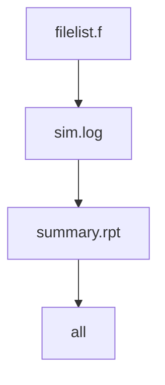
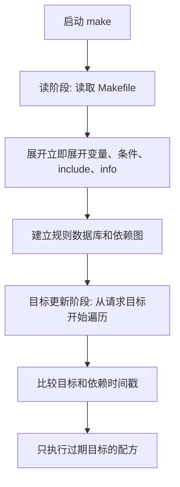

# Makefile心智模型与历史

## 学习目标

本篇建立 Makefile 的两个底层心智模型：有向无环图（Directed Acyclic Graph, DAG）和二阶段执行模型。读完后，读者应该能解释为什么 Make 不是从上到下执行所有命令，也能解释变量、条件和配方为什么经常出现“看起来和 shell 不一样”的行为。

Make 最早诞生于 Unix 软件构建场景，后来 GNU Make 成为 Linux 工程中最常见的实现之一。数字IC项目继续大量使用 Make，不是因为它最新，而是因为它轻量、可组合、容易包装外部工具，并且天然适合描述“输入文件变化导致哪些产物需要重建”。

## 前置知识

- 建议先读 [[tools/concepts/Makefile解决的问题与第一个例子|Makefile 解决的问题与第一个例子]]。
- 需要知道目标、前置条件、配方的基本含义。
- 后续可继续阅读 [[tools/concepts/Makefile规则详解|Makefile 规则详解]]。

## 最小可运行例子

下面的例子模拟一个极小的 IC 流程：RTL 列表生成仿真日志，仿真日志生成摘要报告。所有文件都用 `printf` 模拟，不依赖真实 EDA 工具。

```makefile
# 读阶段输出：$(info ...) 在 Make 读取 Makefile 时立即展开
$(info [read phase] loading Makefile)      # 这行不属于配方，运行 make -n 也会打印

# 默认目标：最终希望得到 summary.rpt
all: summary.rpt                           # all 依赖最终报告

# 报告目标：报告依赖仿真日志
summary.rpt: sim.log                       # sim.log 更新后，summary.rpt 需要重建
	@printf 'summary from %s\n' "$<" > "$@" # $< 是 sim.log；$@ 是 summary.rpt

# 仿真日志目标：这里用 echo 模拟仿真工具输出
sim.log: filelist.f                        # filelist.f 更新后，sim.log 需要重建
	@printf 'run simulator with %s\n' "$<" > "$@" # 写入模拟仿真日志

# 文件列表目标：真实项目中通常由脚本维护或手写
filelist.f:                                # 文件不存在时创建最小 filelist
	@printf 'rtl/top.sv\n' > "$@"          # 写入一个示例 RTL 路径

# 伪目标：清理所有示例产物
.PHONY: clean                              # clean 是动作目标，不参与时间戳判断
clean:                                     # 删除示例文件
	@rm -f summary.rpt sim.log filelist.f    # 清理报告、日志和文件列表
```

执行命令：

```shell
# 清理示例文件，保证依赖图从空状态开始
make clean
# 预演命令；注意读阶段的 $(info ...) 仍会打印
make -n
# 显示每个目标被重建的原因
make --trace
# 查看 Make 内部数据库的 all 目标附近内容
make -p | sed -n '/^all:/,/^# Files/p'
```

## 语法拆解

- `$(info ...)` 是 Make 函数，在读阶段展开；它不是 shell 命令。
- `all: summary.rpt` 建立从默认入口到最终报告的依赖边。
- `summary.rpt: sim.log` 表示报告由日志派生。
- `sim.log: filelist.f` 表示仿真日志由文件列表派生。
- `filelist.f:` 没有前置条件，因此只在文件缺失时创建。
- 配方中的 `$<` 和 `$@` 要等到目标更新阶段、具体规则被执行时才有值。
- `make -n` 不执行配方，但仍会读取 Makefile，所以读阶段函数仍可能输出信息。

## 执行轨迹





二阶段模型是理解 Makefile 的基石。很多初学者以为 Make 会“读到哪行就执行哪行”，但实际不是：规则和变量先被读入数据库，之后 Make 才从目标开始决定哪些配方需要执行。

## 工程化写法

在数字IC工程中，DAG 可以对应真实流程：`rtl/*.sv` 影响 `filelist.f`，`filelist.f` 影响 `sim.log`，`sim.log` 影响 `summary.rpt`，覆盖率数据库再影响覆盖率报告。把这种链条写成 Make 依赖后，工具流就具备了最小重跑能力。

历史上 Make 主要服务 C 程序编译；现代工程中，CMake、Ninja、Bazel 各自解决更复杂的配置、速度和分布式构建问题。但 Make 仍常见于 IC 项目，因为 EDA 工具多数本身就是命令行程序，Make 可以低成本地把它们组合成统一入口。

## 常见错误

| 错误现象 | 根因 | 修复 |
|:---|:---|:---|
| 以为 `make -n` 不会有任何输出 | `$(info ...)` 在读阶段执行，不属于配方 | 区分 Make 函数输出和配方执行 |
| 改了最终报告却不重跑仿真 | Make 只关心目标和依赖时间戳，不倒推业务语义 | 把真实输入依赖写完整 |
| 依赖关系形成环 | A 依赖 B，B 又依赖 A | 重新拆分中间目标，保持 DAG 无环 |

## 关键要点

- Makefile 的依赖关系可以理解为 DAG。
- Make 先读文件并建立数据库，再更新目标。
- 读阶段函数和目标更新阶段配方不是同一个执行时机。
- `make -n` 只跳过配方执行，不跳过 Makefile 读取。
- GNU Make 是本讲义默认方言；BSD Make、NMAKE、POSIX Make 需要单独标注差异。
- IC 流程天然适合被建模为文件产物 DAG。

## 与其他概念的关系

- [[tools/concepts/Makefile解决的问题与第一个例子|Makefile 解决的问题与第一个例子]]：提供第一个可运行实验。
- [[tools/concepts/Makefile规则详解|Makefile 规则详解]]：继续拆解 DAG 中每条边和节点的语法。
- [[tools/concepts/Makefile调试与性能|Makefile 调试与性能]]：后续系统使用 `--trace` 和 `--debug` 观察内部行为。

## 小练习

1. 修改 `filelist.f` 后运行 `make --trace`，观察哪些目标重建。
2. 把 `summary.rpt: sim.log` 改成 `summary.rpt:`，解释为什么依赖断开。
3. 在文件顶部添加第二个 `$(info ...)`，观察 `make -n` 和 `make` 是否都会打印。
